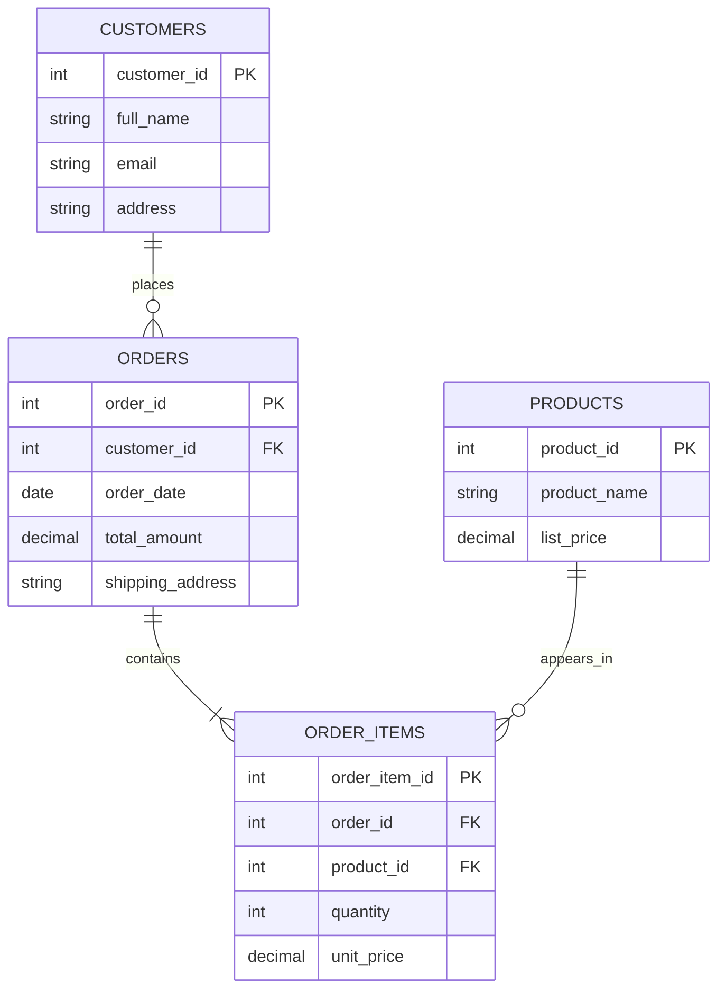
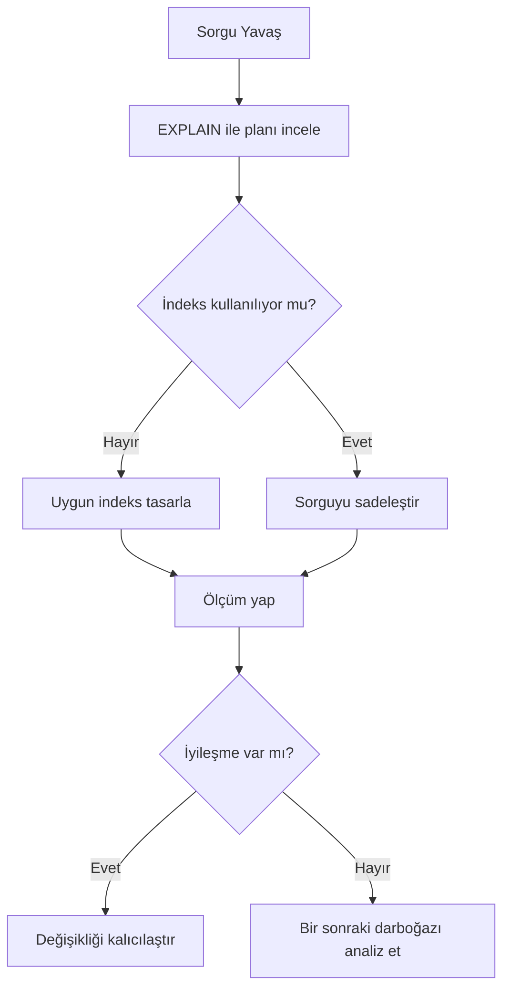

# Veritabanı Yönetimi: Performans Ayarlama

Veritabanı uygulamalarında performans sorunu çoğunlukla tek bir nedenden değil, birikimli tasarım ve kullanım tercihlerinden doğar. Veri hacmi büyüdükçe, ilk aşamada fark edilmeyen sorgu ve modelleme problemleri gecikme, kaynak tüketimi ve ölçeklenme sorunlarına dönüşür.

Performans ayarlama; sistemi rastgele hızlandırma çabası değil, ölçüm temelli iyileştirme disiplinidir. Bu disiplinin temelinde üç soru vardır: sistem nerede yavaşlıyor, neden yavaşlıyor ve en düşük maliyetle nasıl iyileştirilebilir?

## 1. Veritabanı performansını etkileyen temel faktörler

Performans sorunlarını doğru çözebilmek için önce sorunun kaynağına bakmak gerekir. Bu bölümdeki örneklerde aşağıdaki e-ticaret veritabanı yapısı kullanılacaktır:


*Şekil 1: Örneklerde kullanılan e-ticaret veritabanında `customers`, `orders`, `order_items` ve `products` tabloları arasındaki temel ilişkiler gösterilir.*

Bu yapı üzerinden performansı etkileyen sık etkenler şunlardır:

- Zayıf şema tasarımı (gereksiz tekrar, hatalı veri tipleri, uygunsuz ilişki yapısı)
  - Örnek: `orders` tablosunda müşteri adresi her siparişte tekrar tutulduğu için tablo hızla büyür; rapor sorguları gereksiz veri okuduğu için gecikir.
- Yanlış veya eksik indeksleme
  - İndeks, belirli kolonlardaki değerleri hızlı bulmak için tutulan yardımcı veri yapısıdır; uygun indeks yoksa veritabanı ilgili kaydı bulmak için çoğu satırı tek tek kontrol eder.
  - Örnek: `WHERE email = 'x@site.com'` sorgusu sık çalışır, ancak `email` alanında indeks olmadığı için her seferinde milyonlarca satır taranır.
  - Örnek indeks:
    ```sql
    CREATE INDEX idx_customers_email ON customers(email);
    ```
  - Bu indeksle veritabanı `email` değerini doğrudan indeks üzerinden bulur ve tam tablo tarama ihtiyacı büyük ölçüde azalır.
- Gereğinden fazla veri çeken sorgular (`SELECT *` gibi)
  - Örnek: Listeleme ekranı yalnızca 4 kolona ihtiyaç duymasına rağmen tüm kolonlar çekilir; ağ trafiği ve yanıt süresi belirgin şekilde artar.
- Filtre ve sıralama alanlarında indeks uyumsuzluğu
  - Örnek: Sorgu `WHERE customer_id = ? ORDER BY order_date DESC` kullanır, ancak indeks yalnızca `order_date` üzerindedir; veritabanı ek sıralama maliyeti üretir.
- Uygulama tarafında aynı sorgunun gereksiz tekrar çalıştırılması
  - Örnek: Sipariş listesi açılırken her satır için ayrı müşteri sorgusu çalıştırılır (N+1 problemi); toplam sorgu sayısı katlanarak artar.
- Donanım ve konfigürasyon kısıtları (disk I/O, bellek, connection pool ayarları)
  - Örnek: Connection pool limiti düşük kaldığı için yoğun saatte istekler kuyrukta bekler; sorgular doğru olsa bile uygulama yavaş hissedilir.

Bu noktada kritik ilke şudur: önce sorgu ve veri modeli iyileştirilir, sonra altyapı ölçeklendirme adımı değerlendirilir.

## 2. Performans iyileştirme araçları

Performans darboğazı tanımlandıktan sonra, iyileştirme adımları sistemli biçimde uygulanır. İndeksleme, tablodaki erişimi hızlandırmak için uygun kolonlara indeks tanımlama sürecidir; amaç tam tablo taramalarını azaltıp sorgu maliyetini düşürmektir. Bu bölümde önce indeksleme, ardından sorgu yazımı ve plan analizi üzerinden pratik performans iyileştirme yaklaşımı ele alınır.

### 2.1. İndeksin faydaları

- `WHERE`, `JOIN`, `ORDER BY` ve bazı `GROUP BY` işlemlerinde okuma performansını belirgin şekilde artırır
- Büyük tablolarda tam tablo tarama (`full table scan`) ihtiyacını azaltır
- Sorgu planının daha öngörülebilir olmasına katkı sağlar

### 2.2. İndeksin maliyetleri

- Her `INSERT`, `UPDATE`, `DELETE` işleminde indekslerin de güncellenmesi gerekir
- Ek disk alanı tüketir
- Yanlış seçilen veya gereksiz fazla indeks, toplam performansı düşürebilir

Bu nedenle indeks yaklaşımı "ne kadar çok, o kadar iyi" değildir; "iş yüküne uygun ve ölçülmüş" olmalıdır.

### 2.3. Tek alanlı ve çok alanlı indeksler

### 2.4. Tek alanlı indeks (single-column index)

Tek bir kolonda sık filtreleme yapılıyorsa temel ve etkili bir başlangıçtır.

```sql
CREATE INDEX idx_orders_customer_id ON orders(customer_id);
```

Bu örnekte `customer_id` üzerinden yapılan sorgular hızlanır.

Bu fark MySQL Workbench üzerinde kısa bir ölçümle doğrudan görülebilir:

1. `orders` tablosunda yeterli veri olduğundan emin olunur (farkın görünmesi için binlerce satır önerilir).
2. İndeks yokken aşağıdaki sorgu çalıştırılır ve çalışma süresi not edilir:

```sql
SELECT order_id, order_date, total_amount
FROM orders
WHERE customer_id = 42;
```

3. Aynı sorgu için Workbench'te `EXPLAIN` çalıştırılır ve planda `type=ALL` benzeri tam tarama sinyalleri kontrol edilir.
4. İndeks oluşturulur:

```sql
CREATE INDEX idx_orders_customer_id ON orders(customer_id);
```

5. Aynı sorgu tekrar çalıştırılır; süre yeniden ölçülür ve `EXPLAIN` çıktısında indeks kullanımı (`key=idx_orders_customer_id`) doğrulanır.

Bu karşılaştırma, indeksin yalnızca teorik bir kavram olmadığını; ölçülebilir bir performans kazanımı ürettiğini net biçimde gösterir.

### 2.5. Çok alanlı indeks (composite index)

Birden fazla kolona birlikte filtre/sıralama uygulanıyorsa tercih edilir.

```sql
CREATE INDEX idx_orders_customer_date ON orders(customer_id, order_date);
```

Buradaki kritik nokta kolon sırasıdır. İndeks soldan sağa mantıkla çalışır; yani bu indeks `customer_id` ile başlayan koşullarda daha etkilidir.

Örnek:

- Etkili: `WHERE customer_id = 42`
- Etkili: `WHERE customer_id = 42 AND order_date >= '2026-01-01'`
- Genellikle etkisiz: `WHERE order_date >= '2026-01-01'` (ilk kolon kullanılmadığı için)

### 2.6. Sorgu iyileştirmede temel teknikler

Performans kazancı çoğu zaman karmaşık optimizasyonlardan değil, temel hataların düzeltilmesinden gelir.

### 2.7. Gereksiz sütunları çekmemek

```sql
-- Daha maliyetli
SELECT *
FROM orders
WHERE customer_id = 42;

-- Daha kontrollü
SELECT order_id, order_date, total_amount
FROM orders
WHERE customer_id = 42;
```

Daha az sütun, daha az I/O ve daha düşük ağ maliyeti üretir.

### 2.8. Filtre koşullarını indekslenebilir tutmak

```sql
-- İndeks kullanımını zorlaştırabilir
SELECT order_id
FROM orders
WHERE YEAR(order_date) = 2026;

-- Genellikle indeks dostu yaklaşım
SELECT order_id
FROM orders
WHERE order_date >= '2026-01-01'
  AND order_date < '2027-01-01';
```

Kolon üzerinde fonksiyon çalıştırmak, birçok durumda indeks kullanımını engeller veya zayıflatır.

### 2.9. Büyük veri setlerinde sınırlandırma yapmak

```sql
SELECT order_id, order_date, total_amount
FROM orders
ORDER BY order_date DESC
LIMIT 50;
```

Özellikle listeleme ekranlarında sınırsız sonuç döndürmek yerine sayfalama yaklaşımı uygulanmalıdır.

### 2.10. EXPLAIN ile sorgu planını okuma

`EXPLAIN`, veritabanının bir sorguyu nasıl çalıştıracağını gösterir. Böylece tahmine dayalı değil, plan verisine dayalı iyileştirme yapılır.

Örnek:

```sql
EXPLAIN
SELECT order_id, order_date, total_amount
FROM orders
WHERE customer_id = 42
ORDER BY order_date DESC
LIMIT 20;
```

Çıktıda dikkat edilmesi gereken ana sinyaller:

- Tam tablo tarama yapılıyor mu?
- Hangi indeks kullanılıyor?
- Tahmini satır sayısı yüksek mi?
- Sıralama için ek maliyetli adımlar oluşuyor mu?

Bu okumayla birlikte indeks ekleme, sorgu yeniden yazma veya veri modeli iyileştirme kararları daha güvenli verilebilir.


*Şekil 1: Sorgu performansı iyileştirme döngüsü, plan analizi ve ölçüm adımlarıyla sistematik karar akışını gösterir.*

### 2.11. Kısa bir uygulama senaryosu

E-ticaret benzeri bir sistemde aşağıdaki sorgunun yavaş çalıştığı düşünülsün:

```sql
SELECT order_id, customer_id, order_date, total_amount
FROM orders
WHERE customer_id = 42
ORDER BY order_date DESC;
```

İyileştirme adımı:

1. `EXPLAIN` ile mevcut plan incelenir.
2. Uygun değilse `customer_id, order_date` alanları için composite index eklenir.
3. Tekrar `EXPLAIN` alınır ve tahmini satır/maliyet değişimi karşılaştırılır.
4. Üretim benzeri veri üzerinde sorgu süresi ölçülür.

Bu yaklaşım, "indeks ekledim, hızlandı sanıyorum" varsayımı yerine ölçülebilir performans iyileştirmesi sağlar.

### 2.12. Sık yapılan hatalar

- Her kolona indeks eklemek
- `SELECT *` kullanımını varsayılan hale getirmek
- Yavaş sorguları plan analizi yapmadan optimize etmeye çalışmak
- Uygulama tarafındaki N+1 benzeri tekrar sorgu problemlerini gözden kaçırmak
- İyileştirmeleri gerçekçi veri boyutlarında test etmemek

## 3. Sonuç

Veritabanı performans ayarlama, tek seferlik bir işlem değil, sürekli izleme ve iyileştirme döngüsüdür. İndeksleme, sorgu sadeleştirme ve `EXPLAIN` temelli analiz birlikte kullanıldığında, sistem daha düşük maliyetle daha öngörülebilir hale gelir.

Pratikte en güçlü yaklaşım şudur: önce ölç, sonra değiştir, ardından tekrar ölç.
