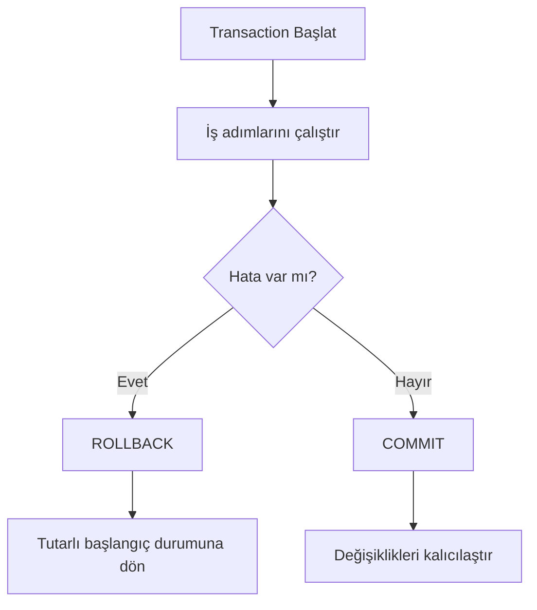

# İleri Veritabanı Kavramları: İşlemler (Transactions) ve Eşzamanlılık Kontrolü

Veritabanında en tehlikeli sorunlardan biri, çok adımlı bir işin yarım kalmasıdır.
Diğer kritik sorun ise aynı veri üzerinde aynı anda birden fazla işlemin çakışmasıdır.

Özellikle şu senaryolarda bu risk çok yüksektir:

- Para transferi
- Stok düşme
- Koltuk/oda rezervasyonu
- Bakiye güncelleme

Bu makalede konu adım adım anlatılır ve MySQL Workbench üzerinde çalıştırılabilir örneklerle desteklenir.

> Not: Örnekler MySQL 8+ içindir.

## 1. Transaction nedir?

`Transaction`, birbiriyle ilişkili birden fazla veritabanı adımını tek bir iş paketi gibi yöneten mekanizmadır.
Bu mekanizmada adımlar bağımsız düşünülmez; tek bir bütün kabul edilir.
Yani işlem sırasında "ilk adım yazıldı, ikinci adım yarım kaldı" gibi ara durumların kalıcı olması engellenir.

Örnek:
Bir para transferinde üç adım vardır: gönderen hesaptan düşme, alıcı hesaba ekleme, transfer kaydı oluşturma.
Bu üç adımın biri bile başarısız olursa, transaction tüm adımları geri alır ve veritabanını işlem öncesi güvenli duruma döndürür.

Temel kural:

- Ya bütün adımlar başarılı olur (`COMMIT`)
- Ya da hiçbir adım kalıcı olmaz (`ROLLBACK`)

Buradaki `COMMIT`, GitHub veya Git'teki commit değildir.
Veritabanı bağlamında `COMMIT`, transaction içinde yapılan değişiklikleri kesin olarak veritabanına yazıp kalıcılaştırma komutudur.
`ROLLBACK` ise transaction boyunca yapılan değişiklikleri geri alıp işlem öncesi duruma dönme komutudur.

Kısacası: "yarısı oldu, yarısı olmadı" durumu kabul edilmez.

### 1.1 Neden gerekli?

- Kısmi başarı nedeniyle veri bozulmasını engeller.
- Hata durumunda güvenli geri dönüş sağlar.
- Çok kullanıcılı sistemlerde tutarlılığı artırır.




*Şekil 1: Transaction akışı — hata durumunda geri alma, başarı durumunda kalıcılaştırma kararını gösterir.*

## 2. ACID nedir?

`ACID`, transaction davranışının güvenilir olmasını sağlayan dört temel ilkenin kısaltmasıdır:
`Atomicity`, `Consistency`, `Isolation`, `Durability`.

Bu dört ilke birlikte şu problemi çözer:
İşlem sırasında hata olsa bile veritabanı bozulmamalı, eşzamanlı işlemler birbirini kirletmemeli ve başarılı işlemler kalıcı olmalıdır.

Kısa bakış:

- `Atomicity`: Ya hep ya hiç
- `Consistency`: Kurallar her zaman korunur
- `Isolation`: Aynı anda çalışan işlemler birbirini bozmaz
- `Durability`: Commit sonrası veri kalıcıdır

## 2.1 Atomicity (Bölünmezlik)

İşlem ya tamamen olur ya da hiç olmaz.

Örnek:

- Hesap A'dan para düştü, hesap B'ye eklenemedi.
- Bu durumda işlem `ROLLBACK` ile tamamen geri alınmalıdır.

## 2.2 Consistency (Tutarlılık)

İşlemden önce de sonra da kurallar korunur.

Örnek:

- Bakiye negatif olamaz kuralı varsa işlem sonunda da negatif olmamalıdır.
- Olmayan `customer_id` ile sipariş oluşturulamamalıdır.

## 2.3 Isolation (Yalıtım)

Aynı anda çalışan transaction'lar birbirinin ara durumunu görmemelidir.
Bu sayede bir işlemin geçici/yarım verisi diğer işlemi bozmaz.

## 2.4 Durability (Kalıcılık)

`COMMIT` sonrası değişiklikler kalıcı olur.
Sunucu yeniden başlasa bile veri kaybolmamalıdır.

## 3. Workbench laboratuvar kurulumu

Önce örnek veritabanını hazırlayalım.

```sql
-- Eski lab varsa temizle
DROP DATABASE IF EXISTS tx_lab;

-- Yeni lab veritabanı oluştur
CREATE DATABASE tx_lab;
USE tx_lab;

-- Hesap tablosu (para transferi için)
CREATE TABLE accounts (
    account_id INT PRIMARY KEY,
    owner_name VARCHAR(100) NOT NULL,
    balance DECIMAL(10,2) NOT NULL CHECK (balance >= 0)
);

-- Transfer kayıt tablosu
CREATE TABLE transfer_log (
    transfer_id INT PRIMARY KEY AUTO_INCREMENT,
    from_account INT NOT NULL,
    to_account INT NOT NULL,
    amount DECIMAL(10,2) NOT NULL CHECK (amount > 0),
    created_at TIMESTAMP DEFAULT CURRENT_TIMESTAMP
);

-- Başlangıç verisi
INSERT INTO accounts (account_id, owner_name, balance) VALUES
(101, 'Ali', 2000.00),
(202, 'Ayse', 1000.00);

SELECT * FROM accounts;
```

### 3.1 Workbench'te dikkat: "Stop on Error" davranışı

MySQL Workbench, bir SQL script'i çalıştırırken herhangi bir satırda hata alırsa **varsayılan olarak o noktada durur** ve geri kalan satırları çalıştırmaz. Transaction içeren script'lerde bu davranış ciddi sorun yaratır:

1. `START TRANSACTION` ile başlayan bir script'te ara adımlardan biri hata verirse Workbench durur.
2. Script sonundaki `ROLLBACK` veya `COMMIT` satırına ulaşılmaz.
3. Başarılı olan adımlar transaction içinde askıda kalır; oturum kapandığında örtük commit gerçekleşebilir.

Sonuç olarak "ya hep ya hiç" davranışı sağlanamaz, kısmi güncelleme riski doğar.

Örneğin aşağıdaki script'te ikinci `UPDATE` constraint hatası verirse Workbench durur. `ROLLBACK` satırına hiç ulaşılmaz ve ilk `UPDATE` askıda kalır:

```sql
START TRANSACTION;

UPDATE accounts SET balance = balance - 500 WHERE account_id = 101;  -- başarılı
UPDATE accounts SET balance = balance - 9999 WHERE account_id = 202; -- CHECK hatası → Workbench durur
-- ↓ bu satırlara hiç ulaşılmaz
ROLLBACK;
```

Bu nedenle transaction mantığı doğrudan SQL script olarak değil, **stored procedure** içinde çalıştırılmalıdır.

### 3.2 Stored procedure nedir?

`Stored procedure`, veritabanı sunucusunda saklanan ve istendiğinde `CALL` komutuyla çağrılan SQL programcığıdır. Birden fazla SQL adımını tek bir isim altında paketler; parametre alabilir, koşul ve döngü içerebilir, hata yönetimi barındırabilir.

Neden önemlidir?

- SQL adımları her seferinde tek tek yazılmaz; bir kez tanımlanır, tekrar tekrar çağrılır.
- Hata yönetimi (`DECLARE ... HANDLER`) procedure içine gömülebildiği için Workbench'in script davranışından bağımsız çalışır.
- İş mantığı veritabanı tarafında kalır; uygulama katmanına taşınması gerekmez.

Basit bir örnek — iki sayıyı toplayan procedure:

```sql
DELIMITER //

CREATE PROCEDURE add_numbers(IN a INT, IN b INT)
BEGIN
    SELECT a + b AS total;
END //

DELIMITER ;
```

Çağrılması:

```sql
CALL add_numbers(3, 7);
-- Sonuç: total = 10
```

`DELIMITER //` kullanılmasının nedeni: procedure gövdesi içinde noktalı virgül (`;`) bulunur. MySQL bu noktalı virgülleri komut sonu sanmasın diye ayırıcı geçici olarak `//` yapılır, procedure tanımı bittikten sonra `DELIMITER ;` ile eski haline döndürülür.

Bir procedure parametre almak zorunda değildir. Parametreli yapı, aynı mantığı farklı değerlerle çalıştırmak için kullanılır:

- `IN`: Procedure'e dışarıdan değer gönderir (giriş parametresi).
- `OUT`: Procedure'den dışarıya değer döndürür (çıkış parametresi).
- `INOUT`: Hem giriş hem çıkış olarak kullanılır.

## 4. Stored procedure ile güvenli para transferi

Aşağıdaki stored procedure, para transferi adımlarını tek bir transaction içinde çalıştırır. Herhangi bir adımda SQL hatası oluşursa `EXIT HANDLER` devreye girer, `ROLLBACK` çağrılır ve procedure sonlanır. Hata olmazsa `COMMIT` ile değişiklikler kalıcılaşır.

```sql
USE tx_lab;

DELIMITER //

CREATE PROCEDURE safe_transfer(
    IN p_from INT,
    IN p_to INT,
    IN p_amount DECIMAL(10,2)
)
BEGIN
    DECLARE EXIT HANDLER FOR SQLEXCEPTION
    BEGIN
        ROLLBACK;
    END;

    START TRANSACTION;

    UPDATE accounts SET balance = balance - p_amount WHERE account_id = p_from;
    UPDATE accounts SET balance = balance + p_amount WHERE account_id = p_to;

    INSERT INTO transfer_log (from_account, to_account, amount)
    VALUES (p_from, p_to, p_amount);

    COMMIT;
END //

DELIMITER ;
```

`DECLARE EXIT HANDLER FOR SQLEXCEPTION`: procedure içinde herhangi bir SQL hatası oluştuğunda çalışacak bloğu tanımlar. Bu blok `ROLLBACK` çağırır ve procedure sonlanır. Böylece hata yönetimi Workbench'e bırakılmaz, veritabanı motoru tarafında gerçekleşir.

## 5. Transfer senaryoları

### 5.1 Başarılı transfer (COMMIT)

```sql
CALL safe_transfer(101, 202, 500);

SELECT * FROM accounts;
SELECT * FROM transfer_log;
```

Beklenen sonuç:

- 101 hesabının bakiyesi 1500 TL'ye düşer.
- 202 hesabının bakiyesi 1500 TL'ye çıkar.
- `transfer_log` tablosuna yeni kayıt eklenir.

Tüm adımlar başarılı olduğu için `COMMIT` çalışır ve değişiklikler kalıcılaşır.

### 5.2 Hatalı transfer (otomatik ROLLBACK)

```sql
CALL safe_transfer(202, 101, 5000);

SELECT * FROM accounts;
SELECT * FROM transfer_log;
```

Bu çağrıda 202 hesabındaki bakiye 5000 TL'yi karşılamaz. `CHECK (balance >= 0)` constraint'i ihlal edildiğinde SQL hatası oluşur, `EXIT HANDLER` devreye girer ve `ROLLBACK` otomatik çalışır.

Beklenen sonuç:

- Her iki hesabın bakiyesi çağrı öncesiyle aynı kalır.
- `transfer_log` tablosuna kayıt eklenmez.
- Kısmi güncelleme riski ortadan kalkar.

## 6. Eşzamanlılık problemleri (concurrency)

`Concurrency`, birden fazla işlemin aynı anda çalışmasıdır.
Doğru yönetilmezse veri tutarsızlığı oluşur.

### 6.1 Dirty Read (Kirli okuma)

Bir işlem, başka bir işlemin henüz `COMMIT` edilmemiş verisini okur.
Eğer diğer işlem `ROLLBACK` yaparsa ilk işlem hatalı karara göre ilerlemiş olur.

Senaryo: Ali'nin bakiyesi 2000 TL.


| Sıra | Oturum A                                                    | Oturum B                                                                                 |
| ---- | ----------------------------------------------------------- | ---------------------------------------------------------------------------------------- |
| 1    | `START TRANSACTION;`                                        |                                                                                          |
| 2    | `UPDATE accounts SET balance = 500 WHERE account_id = 101;` |                                                                                          |
| 3    |                                                             | `START TRANSACTION;`                                                                     |
| 4    |                                                             | `SELECT balance FROM accounts WHERE account_id = 101;` → **500** (henüz commit edilmedi) |
| 5    | `ROLLBACK;` — Ali tekrar 2000 TL                            |                                                                                          |
| 6    |                                                             | Oturum B, 500 TL'ye göre karar verdi ama bu değer artık geçersiz                         |


Oturum B hiç var olmamış bir veriyi okudu. Bu kirli okumadır.

### 6.2 Lost Update (Kayıp güncelleme)

İki işlem aynı satırı okuyup günceller.
Son yazan işlem öncekinin değişikliğini ezer.

Senaryo: Ali'nin bakiyesi 2000 TL. İki işlem aynı anda 100'er TL düşmek istiyor. Beklenen sonuç: 1800 TL.


| Sıra | Oturum A                                                          | Oturum B                                                          |
| ---- | ----------------------------------------------------------------- | ----------------------------------------------------------------- |
| 1    | `SELECT balance FROM accounts WHERE account_id = 101;` → **2000** |                                                                   |
| 2    |                                                                   | `SELECT balance FROM accounts WHERE account_id = 101;` → **2000** |
| 3    | `UPDATE accounts SET balance = 1900 WHERE account_id = 101;`      |                                                                   |
| 4    |                                                                   | `UPDATE accounts SET balance = 1900 WHERE account_id = 101;`      |


Her iki oturum da 2000'den 100 düşüp 1900 yazdı. A'nın güncellemesi kayboldu; sonuç 1800 yerine 1900 TL.

### 6.3 Non-repeatable Read (Tekrarlanamayan okuma)

Aynı transaction içinde aynı sorgu iki kez çalışır ama farklı sonuç döner.
Sebep: arada başka transaction veriyi değiştirmiştir.

Senaryo: Oturum A, Ali'nin bakiyesini iki kez okuyor.


| Sıra | Oturum A                                                          | Oturum B                                                     |
| ---- | ----------------------------------------------------------------- | ------------------------------------------------------------ |
| 1    | `START TRANSACTION;`                                              |                                                              |
| 2    | `SELECT balance FROM accounts WHERE account_id = 101;` → **2000** |                                                              |
| 3    |                                                                   | `UPDATE accounts SET balance = 1500 WHERE account_id = 101;` |
| 4    |                                                                   | `COMMIT;`                                                    |
| 5    | `SELECT balance FROM accounts WHERE account_id = 101;` → **1500** |                                                              |


Aynı transaction içinde aynı sorgu farklı sonuç döndü. Oturum A'nın okuması tutarsız hale geldi.

### 6.4 Deadlock (Kilitleşme)

İki işlem birbirinin kilidini bekler ve ilerleyemez.
Veritabanı bu döngüyü kırmak için işlemlerden birini sonlandırır.

Senaryo: Oturum A önce Ali'yi, sonra Ayşe'yi güncellemek istiyor. Oturum B ise tam ters sırada.


| Sıra | Oturum A                                                                          | Oturum B                                                                         |
| ---- | --------------------------------------------------------------------------------- | -------------------------------------------------------------------------------- |
| 1    | `START TRANSACTION;`                                                              | `START TRANSACTION;`                                                             |
| 2    | `UPDATE accounts SET balance = 1900 WHERE account_id = 101;` — Ali kilitlendi     |                                                                                  |
| 3    |                                                                                   | `UPDATE accounts SET balance = 900 WHERE account_id = 202;` — Ayşe kilitlendi    |
| 4    | `UPDATE accounts SET balance = 1100 WHERE account_id = 202;` — Ayşe'yi bekliyor ⏳ |                                                                                  |
| 5    |                                                                                   | `UPDATE accounts SET balance = 2100 WHERE account_id = 101;` — Ali'yi bekliyor ⏳ |
| 6    | **Deadlock!** A, B'yi bekliyor; B, A'yı bekliyor. Veritabanı birini sonlandırır.  |                                                                                  |


Bu döngüyü kırmak için MySQL işlemlerden birini otomatik olarak `ROLLBACK` yapar ve `Deadlock found` hatası döner.

## 7. Sonuç

Transaction, veritabanı tarafında güvenilirliğin omurgasıdır.
Doğru yaklaşım şudur:

- İlişkili adımları tek transaction içinde çalıştır
- `COMMIT` ve `ROLLBACK` kararını net tasarla
- Eşzamanlılık risklerini yalıtım seviyesi ve kilitlemeyle yönet

Kısa kural:  
Yarım kalan işlem bırakma, tutarlı veri bırak.

