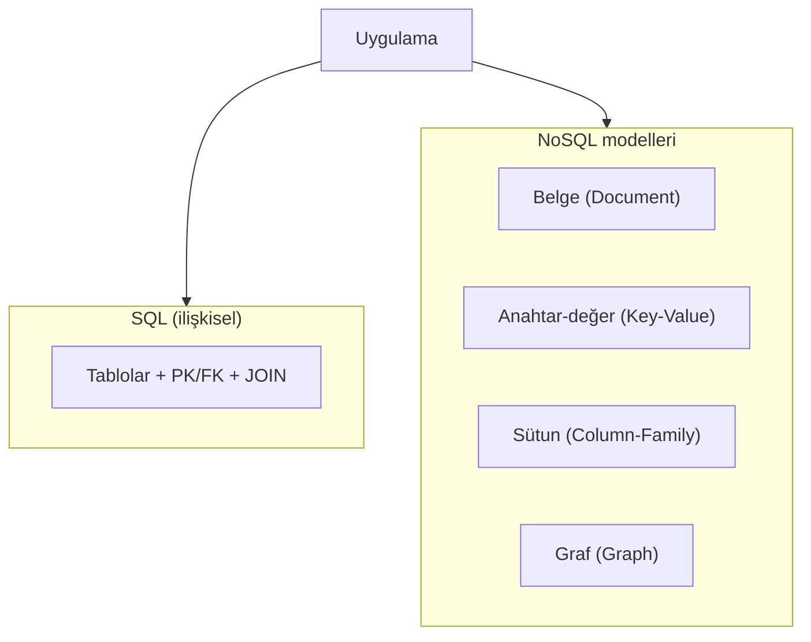

# Veritabanı Türleri ve Kullanım Dinamikleri

Bir uygulama geliştirilirken sık duyulan soru şudur: “Hangi veritabanını kullanalım?” Bu sorunun cevabı yalnızca bir ürün adı değildir. Önce verinin yapısı, erişim biçimi, tutarlılık beklentisi ve sistemin büyüme yönü netleştirilmelidir.

Bu makalede veritabanı türleri, **VTYS** (Veritabanı Yönetim Sistemi) kavramı ve günümüzde en çok karşılaşılan iki ana yaklaşım olan **SQL (ilişkisel)** ile **NoSQL** modelleri, hiç bilmeyen bir okuyucunun takip edebileceği düzeyde açıklanır. Ayrıca sık karıştırılan **GraphQL** konusunun veritabanı türü olmadığı, hangi katmanda durduğu da netleştirilir.

---

## VTYS nedir, veritabanı türüyle ilişkisi ne?

**Veritabanı**, yapılandırılmış verinin saklandığı mantıksal yapıdır. Bu yapıyı oluşturan, sorgulayan, güncelleyen ve koruyan yazılıma ise **VTYS** (İngilizce: **DBMS**, Database Management System) denir.

Örnek VTYS ürünleri:

| Tür | Örnek ürünler |
|------|----------------|
| İlişkisel (SQL) | `PostgreSQL`, `MySQL`, `SQL Server`, `Oracle` |
| Belge (NoSQL) | `MongoDB` |
| Anahtar-değer (NoSQL) | `Redis`, `DynamoDB` |
| Sütun (NoSQL) | `Cassandra`, `HBase` |
| Graf (NoSQL) | `Neo4j` |

Aynı projede farklı ihtiyaçlar için birden fazla VTYS birlikte kullanılabilir. Örneğin sipariş verisi ilişkisel veritabanında, oturum bilgisi ise anahtar-değer deposunda tutulabilir. Bu nedenle “tek doğru veritabanı” yerine “senaryoya uygun model” ifadesi daha doğrudur.

---

## SQL ve ilişkisel veritabanları

### SQL ne demektir?

**SQL** (Structured Query Language), ilişkisel veritabanlarıyla konuşmak için kullanılan standart sorgu dilidir. `SELECT`, `INSERT`, `UPDATE`, `DELETE` gibi komutlar SQL ile yazılır. SQL bir programlama dili değil; veriyi tanımlama, sorgulama ve yönetme dilidir.

### İlişkisel model nasıl çalışır?

**İlişkisel veritabanı** (RDBMS, Relational Database Management System), veriyi **tablo**lara böler. Her tabloda **satır** (kayıt) ve **sütun** (alan) vardır. Tablolar arası bağ, genelde **birincil anahtar** (PK, Primary Key) ve **yabancı anahtar** (FK, Foreign Key) ile kurulur.

Basit bir e-ticaret örneği:

```text
customers          orders
---------          -------
id (PK)            id (PK)
name               customer_id (FK -> customers.id)
email              total_amount
                   created_at
```

Burada her sipariş, müşteri tablosundaki gerçek bir kayda bağlanır. Bu bağ sayesinde “hangi müşteri hangi siparişi verdi?” sorusu net ve tutarlı biçimde yanıtlanır.

### İlişkisel veritabanının temel özellikleri

- **Sabit şema:** Tablo oluşturulurken sütun adları ve veri tipleri tanımlanır. Yapı önceden bellidir.
- **ACID:** İşlemler atomik, tutarlı, izole ve kalıcı olacak şekilde yönetilebilir. Banka transferi, stok düşümü gibi kritik işlemlerde bu özellik önemlidir.
- **JOIN:** Birden fazla tablo bir sorguda birleştirilebilir; raporlama ve karmaşık ilişkiler için güçlüdür.
- **Standart dil:** Farklı ürünler arasında SQL benzerliği yüksektir; öğrenilen mantık başka sisteme taşınabilir.

### Ne zaman ilişkisel (SQL) tercih edilir?

- İş kuralları net ve değişimi kontrollüdür.
- Veri bütünlüğü kritiktir (finans, sipariş, fatura, envanter).
- Tablolar arası ilişki yoğundur ve raporlama önemlidir.
- Veri modeli uzun süre stabil kalacaktır.

Yaygın ürünler: `PostgreSQL`, `MySQL`, `MariaDB`, `SQL Server`, `Oracle`.

---

## NoSQL nedir?

**NoSQL** (“Not Only SQL”), ilişkisel tablo modelinin dışında veya ona alternatif olarak tasarlanmış veritabanı türlerinin genel adıdır. NoSQL, “SQL kullanılmaz” anlamına gelmez; bazı NoSQL ürünleri SQL benzeri sorgu dilleri de sunar. Asıl fark, verinin **tablo + satır + FK** yerine farklı yapılarda tutulmasıdır.

NoSQL genelde şu ihtiyaçlardan doğmuştur:

- Çok büyük veri hacmi ve yüksek trafik
- Hızlı ürün geliştirme ve değişken veri şekli
- Yatay ölçekleme (birden fazla sunucuya veriyi yayma)
- Belirli erişim desenlerinde milisaniye düzeyinde performans

NoSQL tek bir teknoloji değildir; altında birkaç model vardır.



*Şekil 1: Uygulamaların SQL (ilişkisel) veya NoSQL alt modellerinden birine veya birkaçına bağlanabileceği genel görünüm.*

---

## NoSQL alt türleri

### 1) Belge tabanlı (Document)

Veri, JSON veya BSON benzeri **belge** olarak saklanır. Bir belge içinde iç içe alanlar olabilir; her kayıt farklı alanlara sahip olabilir.

Örnek (`MongoDB` tarzı):

```json
{
  "_id": "prod_101",
  "name": "Kablosuz Kulaklık",
  "price": 1299,
  "specs": { "battery_hours": 30, "bluetooth": "5.3" },
  "tags": ["audio", "wireless"]
}
```

- **Güçlü yön:** Esnek şema; ürün katalogları, içerik yönetimi, hızlı prototipleme.
- **Dikkat:** İlişkisel bütünlük çoğu zaman uygulama kodunda yönetilir.
- **Örnek ürün:** `MongoDB`, `CouchDB`.

### 2) Anahtar-değer (Key-Value)

Her veri bir **anahtar** ile okunur; değer metin, sayı veya serileştirilmiş obje olabilir.

```text
session:abc123  ->  { "userId": 42, "role": "admin", "expires": "..." }
cart:user_42    ->  { "items": [...], "total": 350 }
```

- **Güçlü yön:** Çok hızlı okuma/yazma; oturum, önbellek (cache), sayaç, kuyruk benzeri kullanımlar.
- **Dikkat:** Karmaşık sorgu ve çok tablolu ilişki zayıftır.
- **Örnek ürün:** `Redis`, `DynamoDB` (key-value kullanım senaryosunda).

### 3) Sütun tabanlı (Column-Family)

Veri satır bazında değil, **sütun grupları** (column-family) ve dağıtık düğümler üzerinde tutulur. Büyük hacimli yazma ve coğrafi dağılım için uygundur.

- **Güçlü yön:** Yatay ölçekleme; yüksek yazma trafiği; çok büyük veri setleri.
- **Dikkat:** Tasarım genelde “hangi sorgular çalışacak?” sorusuna göre yapılır; sonradan model değiştirmek maliyetlidir.
- **Örnek ürün:** `Cassandra`, `HBase`.

### 4) Graf tabanlı (Graph)

Veri **düğüm** (node) ve **kenar** (edge) olarak modellenir. İlişki, verinin merkezindedir.

Örnek düşünce: “A, B’yi tanıyor; B, C’yi tanıyor; C, D’yi tanıyor — A ile D arasında kaç adım var?”

- **Güçlü yön:** Sosyal ağ, öneri motoru, dolandırıcılık tespiti, ağ topolojisi.
- **Dikkat:** Genel amaçlı işlem verisi için her zaman ilk tercih değildir; çoğu projede tamamlayıcıdır.
- **Örnek ürün:** `Neo4j`.

---

## SQL ile NoSQL karşılaştırması

| Konu | SQL (ilişkisel) | NoSQL |
|------|-----------------|-------|
| Veri yapısı | Tablolar, satırlar, sütunlar | Belge, anahtar-değer, sütun, graf vb. |
| Şema | Genelde sabit ve önceden tanımlı | Çoğu modelde esnek veya kısmen esnek |
| İlişkiler | PK/FK ve JOIN ile güçlü | Model ve ürüne göre değişir; çoğu zaman uygulama katmanında |
| Tutarlılık | ACID vurgusu güçlü | Ürüne göre; bazı sistemlerde eventual consistency |
| Ölçekleme | Dikey ölçekleme yaygın; yatay için ek tasarım gerekir | Yatay ölçekleme için doğrudan tasarlanmış modeller var |
| Tipik kullanım | Sipariş, ödeme, muhasebe, CRM | Katalog, log, oturum, büyük analitik yazma, ilişki ağı |

**Yanlış algı:** “NoSQL her zaman SQL’den hızlıdır.” Hız, veri modeli, sorgu deseni ve altyapıya bağlıdır. Yanlış modelde NoSQL de yavaşlar; doğru modelde SQL de yüksek performans verir.

**Doğru yaklaşım:** Önce veri ve erişim ihtiyacı tanımlanır; sonra uygun tür veya model seçilir.

---

## Hibrit kullanım: aynı projede SQL ve NoSQL

Gerçek sistemlerde tek bir VTYS ile her şeyi çözmek zorunlu değildir.

Örnek: çevrim içi mağaza

| Veri | Önerilen model | Gerekçe |
|------|----------------|---------|
| `orders`, `payments`, `invoices` | SQL (ilişkisel) | İşlem tutarlılığı ve bütünlük kritik |
| Ürün kataloğu (değişken özellikler) | Belge (NoSQL) | Marka, teknik özellik, kampanya alanları esnek |
| Oturum ve cache | Anahtar-değer | Milisaniye düzeyinde hızlı erişim |

Bu yapı “polyglot persistence” (çok dilli kalıcılık) olarak da anılır: her veri parçası için uygun depolama teknolojisi seçilir.

---

## GraphQL veritabanı türü mü?

**Hayır.** GraphQL bir veritabanı veya VTYS değildir; istemci ile sunucu arasında veri isteme biçimini tanımlayan bir **sorgu/API katmanıdır**.

Kısa karşılaştırma:

| | SQL | NoSQL (ör. MongoDB) | GraphQL |
|---|-----|---------------------|---------|
| Ne? | Veritabanı sorgu dili | Veritabanı türü / VTYS | API sorgu dili ve şeması |
| Nerede çalışır? | VTYS içinde | VTYS içinde | Uygulama sunucusunda (genelde REST’in alternatifi) |
| Tipik kullanım | Tablolardan veri çekme/güncelleme | Belge veya başka modelde saklama | İstemcinin ihtiyaç duyduğu alanları tek istekte alması |

Örnek GraphQL isteği (kavramsal):

```graphql
query {
  product(id: "prod_101") {
    name
    price
    reviews(limit: 3) {
      rating
      comment
    }
  }
}
```

Sunucu bu isteği alır; arkada `PostgreSQL`, `MongoDB` veya başka bir VTYS’ten veriyi toplayıp tek yanıt olarak dönebilir. Yani GraphQL, verinin **nasıl saklandığını** değil, **nasıl sunulduğunu** tanımlar.

GraphQL öğrenilirken sık yapılan hata: “GraphQL kullanıyoruz, o yüzden NoSQL yeterli” demek. Depolama kararı ile API katmanı kararı birbirinden bağımsızdır.

---

## OLTP ve OLAP: işlem tipi de seçimi etkiler

Veritabanı “türü” seçilirken verinin **nasıl kullanıldığı** da belirleyicidir:

- **OLTP** (Online Transaction Processing): Sık, küçük, eşzamanlı işlemler — sipariş oluşturma, ödeme, kayıt güncelleme. Genelde operasyonel SQL veritabanları bu yüke göre ayarlanır.
- **OLAP** (Online Analytical Processing): Büyük hacimli analitik sorgular — rapor, trend, karar destek. Çoğu zaman ayrı bir veri ambarı veya analitik motor kullanılır.

Tek bir sistem her iki yükte de her zaman ideal olmayabilir. Operasyonel veri SQL ile tutulurken, analitik katman ayrı tasarlanması yaygındır.

---

## Dağıtık veritabanları: replication ve sharding

Veri tek sunucuda kalmak zorunda değildir. Büyüyen sistemlerde iki kavram sık geçer:

- **Replication (çoğaltma):** Aynı verinin birden fazla kopyası tutulur; arıza anında hizmet sürekliliği artar.
- **Sharding (parçalama):** Veri kurallara göre bölünür (`user_id` mod 4, bölge kodu vb.) ve farklı sunuculara dağıtılır; yük dengelenir.

**Problem → çözüm örneği:** Kullanıcı sayısı arttıkça tek sunucuda sorgu gecikmesi yükseliyor. Kullanıcı verisi bölgesel sharding ile (`TR`, `EU`, `US`) dağıtılırsa her düğüm daha küçük bir veri kümesi yönetir; gecikme düşebilir.

Hem SQL hem NoSQL ürünleri dağıtık modda çalışabilir; fark, ürünün varsayılan tutarlılık ve ölçekleme modelindedir.

---

## Bulut veritabanları

**Bulut veritabanı**, VTYS’nin yönetilen servis olarak sunulmasıdır. Yedekleme, izleme, güncelleme ve ölçekleme işlerinin önemli kısmı sağlayıcı tarafından yürütülür.

Örnekler:

- İlişkisel: `Amazon RDS`, `Google Cloud SQL`, `Azure SQL Database`
- NoSQL: `MongoDB Atlas`, `Amazon DynamoDB`, `Azure Cosmos DB`

Kampanya döneminde trafiği birkaç kat artan bir uygulama, bulutta geçici kaynak artırıp dönem sonunda düşürerek maliyet-performans dengesini koruyabilir. Bulut, veri modelini değiştirmez; yalnızca işletim yükünü azaltır.

---

## Karar verirken pratik çerçeve

Aşağıdaki tablo kesin kural değil; ilk filtre olarak kullanılabilir.

| İhtiyaç | Uygun yaklaşım |
|---------|----------------|
| Güçlü tutarlılık, net iş kuralları, ilişkisel rapor | SQL (ilişkisel) |
| Değişken kayıt yapısı, hızlı ürün iterasyonu | NoSQL — belge |
| Oturum, cache, sayaç; anahtar ile hızlı erişim | NoSQL — anahtar-değer |
| Çok büyük yazma hacmi, coğrafi dağılım | NoSQL — sütun |
| Derin ilişki ve çok adımlı bağ sorguları | NoSQL — graf |
| İstemciye esnek, tek istekte özelleştirilmiş API | GraphQL (depolama değil, API katmanı) |

Üç soru birlikte yanıtlanmalıdır:

1. Veri yapısı ne kadar sabit?
2. Okuma/yazma ve sorgu deseni nasıl?
3. Tutarlılık ve ölçek beklentisi nedir?

---

## Sonuç

Veritabanı dünyasında “en iyi” teknoloji yoktur; **senaryoya en uygun** model vardır. **SQL (ilişkisel)** sistemler tablo, ilişki ve ACID ile güçlü bir temel sunar. **NoSQL** tarafı ise belge, anahtar-değer, sütun ve graf gibi modellerle farklı ölçek ve esneklik ihtiyaçlarına yanıt verir. **GraphQL** ise depolama değil, verinin istemciye sunulma biçimidir.

VTYS seçimi ürün ismine göre değil, veri yapısı ve iş yüküne göre yapıldığında mimari kararlar daha uzun ömürlü olur; teknoloji tartışması da “hangi marka?” yerine “hangi model?” sorusuna dönüşür.
