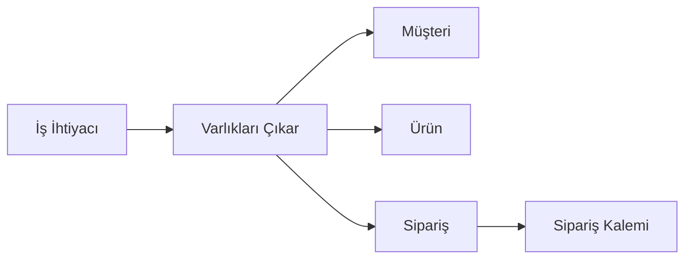
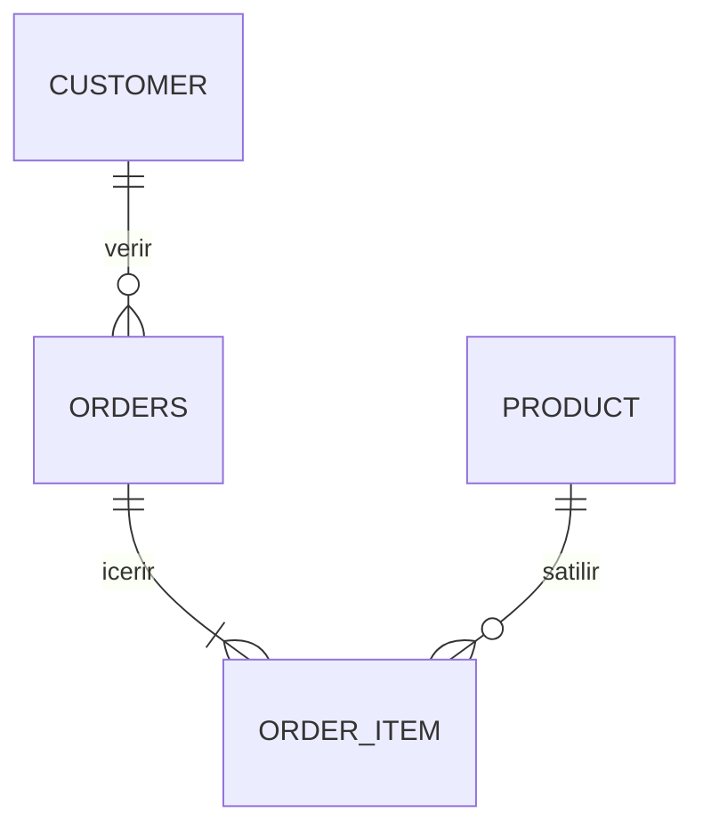
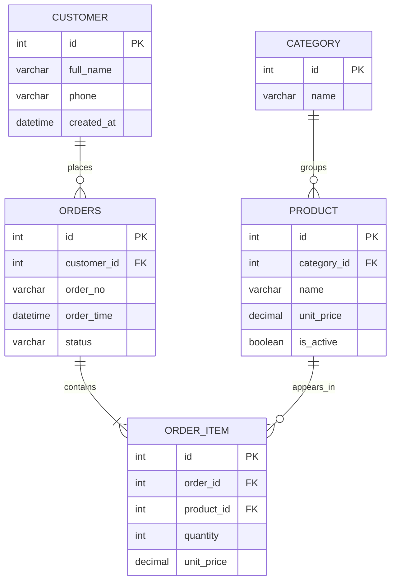

# Veritabanı Tasarımına Giriş

Veritabanı tasarımı, doğru veri modeli kurmanın temelidir.
Sağlam bir tablo yapısı; verinin tutarlılığını, sorguların okunabilirliğini ve sistemin sürdürülebilirliğini doğrudan etkiler.

İyi tasarlanmış bir veritabanı:

- sorguları sade hâle getirir
- veri hatalarını azaltır
- büyüdüğünde sistemi daha az yorar

Bu yazıda veritabanı tasarımının temel prensiplerini, gerçek bir senaryo üzerinden adım adım kuracağız.

## Veritabanı tasarımı nedir?

Veritabanı tasarımı, şu sorulara net cevap verme işidir:

- Hangi bilgileri tutacağım?
- Bu bilgiler hangi tablolarda duracak?
- Tablolar birbirine hangi anahtarlarla bağlanacak?

Buradaki hedef sadece "çalışan bir sistem" değil, uzun vadede bozulmayan bir şema kurmaktır.

## İlk adım: varlıkları ayırmak

İlk kez tasarlarken yapılan en yaygın hata, her şeyi tek tabloya koymaktır.
Bunun yerine önce varlıkları ayırmak gerekir.

E-ticaret mini senaryosunda temel varlıklar:

- Müşteri
- Ürün
- Sipariş
- Sipariş Kalemi

Aşağıdaki akışta bu düşünceyi görebilirsin:



Bu adımdan sonra "hangi bilgi nereye ait?" sorusu daha kolay cevaplanır.

## PK ve FK mantığı (en kritik iki kavram)

### Primary Key (PK)

PK, bir tablodaki her satırı tekil olarak tanımlayan alandır.
Kimlik numarası gibi düşünebilirsin: aynısından iki tane olmaz.

Örnek:

- `CUSTOMER.id` -> her müşteri için tek değer
- `PRODUCT.id` -> her ürün için tek değer

### Foreign Key (FK)

FK, bir tablonun başka tabloya bağlandığı alandır.

Örnek:

- `ORDERS.customer_id` -> `CUSTOMER.id`'ye bağlanır
- `ORDER_ITEM.order_id` -> `ORDERS.id`'ye bağlanır

Kısa mantık:
"Bu sipariş gerçekten var olan bir müşterinin mi?" sorusunu FK ile garanti altına alırız.

## İlişki türleri: 1-1, 1-N, N-N

Veritabanı şeması kurarken ilişki tipini doğru seçmek çok önemlidir.



Bu diyagramın anlamı:

- Bir müşteri birden fazla sipariş verebilir (`1-N`).
- Bir sipariş birden fazla kalem içerir (`1-N`).
- Bir ürün birden fazla siparişte geçebilir (`1-N`, kalem tablosu üzerinden).

Buradan dolaylı olarak `N-N` ilişkiyi de görürüz:
`ORDERS` ile `PRODUCT` arasındaki çoktan çoğa ilişki, `ORDER_ITEM` ara tablosu ile çözülür.

## Neden ara tablo kullanırız?

"Siparişte birden fazla ürün var" durumu ilk bakışta tek kolonda liste gibi tutulmak istenebilir.
Ama bu hatalı yaklaşımdır.

Doğru model:

- `ORDERS` tablosu siparişin üst bilgisini tutar
- `ORDER_ITEM` tablosu ürün bazlı satırları tutar

Bu sayede:

- aynı siparişe birden fazla ürün eklenir
- her ürün için adet/fiyat ayrıca tutulur
- toplamlar doğru hesaplanır

## Kötü şema vs iyi şema

### Kötü şema (tek tabloya yığmak)

```text
SALES(
  order_no,
  customer_name,
  customer_phone,
  products,
  prices,
  quantities
)
```

Problemler:

- Liste kolonları sıraya bağımlıdır. Örneğin:

```text
order_no: ORD-001
products: Latte,Cheesecake
prices: 95,120
quantities: 1,2
```

Bu yapıda ürün, fiyat ve adet aynı sırada gitmek zorundadır. Sadece `products` alanındaki sıra değişirse eşleşme bozulur ve veri yanlış okunur.

- Tek bir ürünün bilgisini güncellemek zordur.  
  Örneğin sadece `Latte` fiyatını değiştirmek istediğinde tüm metni parçalaman, doğru elemanı bulman ve tekrar birleştirmen gerekir.

- Raporlama sorguları karmaşıklaşır.  
  Toplam tutar veya ürün bazlı satış raporu için sayısal hesap yerine metin parçalama gerekir; bu da performansı ve doğruluğu olumsuz etkiler.

### İyi şema (sorumluluğu ayırmak)

```text
CUSTOMER(id, full_name, phone)
PRODUCT(id, name, unit_price)
ORDERS(id, order_no, customer_id, order_date)
ORDER_ITEM(id, order_id, product_id, quantity, unit_price)
```

Bu yapı, hem SQL yazmayı kolaylaştırır hem de veri modelini uzun vadede daha yönetilebilir hale getirir.


## Uygulama: Mahalle kafe senaryosu

Teoride anlatılanları somutlaştırmak için küçük ama gerçekçi bir senaryo kuralım:

- Bir kafenin müşterileri var
- Menüde kategorilere ayrılmış ürünler var
- Müşteri sipariş veriyor
- Sipariş, birden fazla üründen oluşabiliyor

Bu senaryoda 5 tablo kullanacağız:

- `customer`
- `category`
- `product`
- `orders`
- `order_item`

### Şema diyagramı (tablo + sütun + bağlantı)



Bu diyagramda:

- Kutular tabloları, kutu içindeki satırlar sütunları gösterir.
- `PK` ifadesi birincil anahtarı, `FK` ifadesi yabancı anahtarı belirtir.
- Bağlantı çizgileri tablolar arası ilişkiyi gösterir (ör. bir siparişin birden fazla sipariş kalemi olabilir).

### 1) Veritabanını oluştur

```sql
CREATE DATABASE cafe_ops;
USE cafe_ops;
```

### 2) Tabloları oluştur

```sql
CREATE TABLE customer (
  id INT PRIMARY KEY AUTO_INCREMENT,
  full_name VARCHAR(120) NOT NULL,
  phone VARCHAR(20) UNIQUE,
  created_at DATETIME DEFAULT CURRENT_TIMESTAMP
);

CREATE TABLE category (
  id INT PRIMARY KEY AUTO_INCREMENT,
  name VARCHAR(80) NOT NULL UNIQUE
);

CREATE TABLE product (
  id INT PRIMARY KEY AUTO_INCREMENT,
  category_id INT NOT NULL,
  name VARCHAR(120) NOT NULL,
  unit_price DECIMAL(10,2) NOT NULL,
  is_active BOOLEAN DEFAULT TRUE,
  FOREIGN KEY (category_id) REFERENCES category(id)
);

CREATE TABLE orders (
  id INT PRIMARY KEY AUTO_INCREMENT,
  customer_id INT NOT NULL,
  order_no VARCHAR(30) NOT NULL UNIQUE,
  order_time DATETIME DEFAULT CURRENT_TIMESTAMP,
  status VARCHAR(20) DEFAULT 'new',
  FOREIGN KEY (customer_id) REFERENCES customer(id)
);

CREATE TABLE order_item (
  id INT PRIMARY KEY AUTO_INCREMENT,
  order_id INT NOT NULL,
  product_id INT NOT NULL,
  quantity INT NOT NULL,
  unit_price DECIMAL(10,2) NOT NULL,
  FOREIGN KEY (order_id) REFERENCES orders(id),
  FOREIGN KEY (product_id) REFERENCES product(id)
);
```

### 3) Örnek veri ekle

```sql
INSERT INTO customer (full_name, phone) VALUES
('Ayse Kaya', '05000000001'),
('Mehmet Demir', '05000000002');

INSERT INTO category (name) VALUES
('Icecek'),
('Tatli');

INSERT INTO product (category_id, name, unit_price) VALUES
(1, 'Latte', 95.00),
(1, 'Filtre Kahve', 80.00),
(2, 'Cheesecake', 120.00);

INSERT INTO orders (customer_id, order_no, status) VALUES
(1, 'ORD-2026-0001', 'new'),
(2, 'ORD-2026-0002', 'new');

INSERT INTO order_item (order_id, product_id, quantity, unit_price) VALUES
(1, 1, 1, 95.00),
(1, 3, 1, 120.00),
(2, 2, 2, 80.00);
```

### 4) Kontrol sorguları

Siparişleri müşteri adıyla görmek:

```sql
SELECT o.order_no, c.full_name, o.status, o.order_time
FROM orders o
JOIN customer c ON c.id = o.customer_id
ORDER BY o.id;
```

Sipariş kalemlerini ürün adıyla görmek:

```sql
SELECT o.order_no, p.name AS product_name, oi.quantity, oi.unit_price
FROM order_item oi
JOIN orders o ON o.id = oi.order_id
JOIN product p ON p.id = oi.product_id
ORDER BY o.id, oi.id;
```

Sipariş toplamını hesaplamak:

```sql
SELECT o.order_no,
       ROUND(SUM(oi.quantity * oi.unit_price), 2) AS order_total
FROM orders o
JOIN order_item oi ON oi.order_id = o.id
GROUP BY o.id, o.order_no
ORDER BY o.id;
```

Bu uygulama, iki kritik noktayı net gösterir:

- PK/FK ilişkileri doğru kurulursa veri güvenli şekilde bağlanır
- Ara tablo (`order_item`) olmadan çoktan çoğa sipariş yapısı sağlıklı yönetilemez

## Sonuç

Veritabanı tasarımı; önce doğru varlıkları ayırmak, sonra bu varlıkları PK/FK ile tutarlı bağlama işidir.
Bu temel oturduğunda SQL komutları daha anlamlı çalışır ve sistem büyüdükçe tasarımı yönetmek daha kolay olur.
