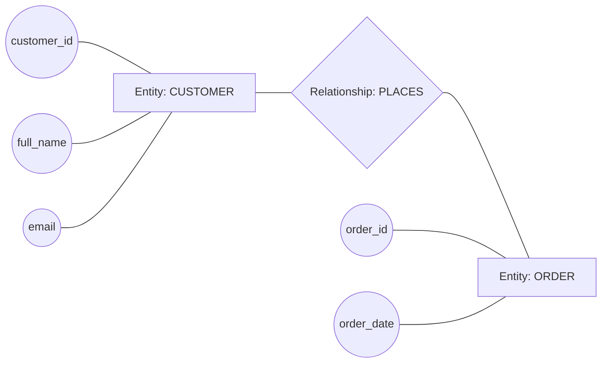
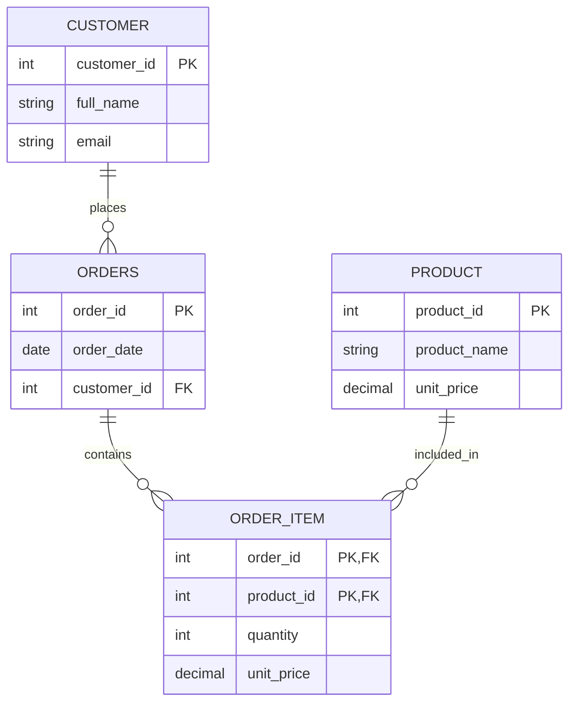
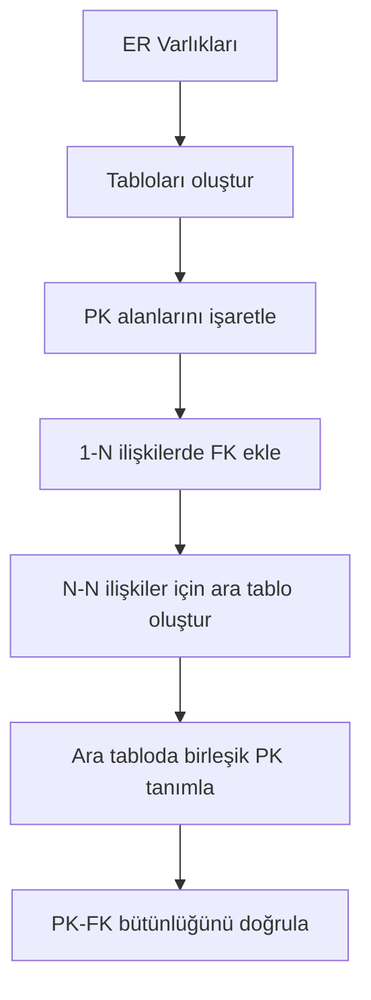

# Veritabanı Tasarımı: Varlık-İlişki (ER) Modellemesi

Veritabanı tasarımında en kritik adımlardan biri, kod yazmadan önce iş alanını doğru modellemektir.  
Varlık-İlişki modeli (Entity-Relationship, ER), bu modellemeyi görsel ve sistematik hale getirir.

Bu makalede üç hedefe odaklanılır:

- **Varlık (Entity), özellik (Attribute), ilişki (Relationship)** kavramlarını netleştirmek
- ER diyagramı sembollerini doğru kullanmak
- Bir senaryo için ER diyagramı oluşturup ilişkisel şemaya dönüştürmek

## ER modeli nedir, neden kullanılır?

ER modeli, gerçek dünyadaki nesneleri (ör. müşteri, sipariş, ürün), bunların özelliklerini ve aralarındaki ilişkileri tabloya geçmeden önce bir şema üzerinde gösteren tasarım yaklaşımıdır.

ER modeli kullanılmadığında tablo tasarımı çoğu zaman doğrudan kodlama aşamasında şekillenir. Bu da:

- eksik alanlar
- yanlış ilişki türleri
- gereksiz veri tekrarı
- ileride zor refactor ihtiyacı

gibi sorunlar üretir.

ER modeli, tasarım kararlarını erken aşamada görünür hale getirerek bu riskleri azaltır.

## Temel kavramlar

### Varlık (Entity)

Sistemde bağımsız olarak takip edilen nesnedir.  
Örnek: `Customer`, `Order`, `Product`.

### Özellik (Attribute)

Varlığı tanımlayan alandır.  
Örnek: `Customer` için `customer_id`, `full_name`, `email`.

### Anahtar özellik (Key Attribute)

Varlık örneklerini benzersiz ayıran özelliktir.  
Örnek: `customer_id`.

### İlişki (Relationship)

Varlıklar arasındaki bağdır.  
Örnek: Bir müşteri birden fazla sipariş verebilir.

## İlişki türleri

### 1-1 (One-to-One)

Bir varlığın bir kaydı, diğer varlığın en fazla bir kaydıyla ilişkilidir.  
Örnek: `User` - `UserProfile`.

### 1-N (One-to-Many)

Bir varlığın bir kaydı, diğer varlığın birden fazla kaydıyla ilişkilidir.  
Örnek: `Customer` - `Order`.

### N-N (Many-to-Many)

Her iki tarafta da birden fazla kayıt birbirine bağlanabilir.  
Örnek: `Order` - `Product`.

Bu ilişki türü doğrudan ilişkisel tabloda tutulmaz; ara tabloya dönüştürülür.

## ER diyagramı sembolleri

Temel ER gösteriminde sık kullanılan semboller:

- **Dikdörtgen:** Varlık
- **Elips:** Özellik
- **Baklava:** İlişki
- **Altı çizili özellik:** Anahtar özellik (PK)
- **Bağlantı çizgileri:** Varlık-özellik ve varlık-ilişki bağlantısı

Farklı araçlarda görsel stil değişebilir; ancak sembollerin anlamsal karşılığı aynıdır.

### İlişki adlarını nasıl seçmeli?

ER diyagramında ilişki adı tamamen rastgele verilmez; tek bir zorunlu standart da yoktur.
Pratikte ilişki adı, ekip naming convention'ı ve domain diliyle belirlenir.
Yaygın yaklaşım, ilişkiyi fiil/fiil öbeğiyle adlandırmaktır.

Kısa örnekler:

- `CUSTOMER` -> `ORDERS`: `places` (müşteri sipariş verir)
- `ORDERS` -> `ORDER_ITEM`: `contains` (sipariş kalem içerir)
- `ORDER_ITEM` -> `PRODUCT`: `references` (sipariş kalemi ürünü referanslar)
- `EMPLOYEE` -> `DEPARTMENT`: `manages` (çalışan departmanı yönetir)

Uygulamada takip edilen temel kurallar:

- İlişki adı, iş kuralını cümleye dönüştürdüğünde doğal okunmalı.
- Aynı diyagram içinde tek dil ve tek stil kullanılmalı (tamamı İngilizce gibi).
- Belirsiz adlardan kaçınılmalı (`has`, `is_related`) ve anlamı güçlü fiiller seçilmeli (`places`, `contains`, `manages`).

### Sembol yerleşim diyagramı (Chen notasyonu mantığı)

Bu çizimde:

- `CUSTOMER` ve `ORDER` düğümleri varlıkları temsil eder.
- Elips biçimindeki düğümler özellikleri gösterir.
- Baklava biçimindeki `PLACES`, ilişki adıdır; burada anlamı "müşteri sipariş verir"dir.
- İlişki adları senaryoya göre değişir: `places`, `contains`, `belongs_to`, `manages` gibi.
- Çizgiler, düğümler arasındaki bağı gösterir: `CID --- CUST` bir özelliğin varlığa ait olduğunu; `CUST --- PLACES --- ORD` iki varlığın ilişkiyle bağlı olduğunu anlatır.

## Senaryo üzerinden ER tasarımı

E-ticaret senaryosu ele alındığında temel varlıklar şu şekilde düşünülebilir:

- `Customer(customer_id, full_name, email)`
- `Order(order_id, order_date, customer_id)`
- `Product(product_id, product_name, unit_price)`

İlişkiler:

- Bir `Customer`, birçok `Order` verebilir (`1-N`).
- Bir `Order`, birçok `Product` içerebilir.
- Bir `Product`, birçok `Order` içinde yer alabilir (`N-N`).

Bu noktada `Order` - `Product` ilişkisi için ara varlık gerekir:

- `OrderItem(order_id, product_id, quantity, unit_price)`

Böylece hem `N-N` ilişkisi çözülür hem de sipariş kalemi seviyesinde veri tutulur.

### E-ticaret için ER diyagramı (Cardinality dahil)

Diyagram okuma özeti:

- `CUSTOMER ||--o{ ORDERS`: Bir müşteri sıfır veya çok sipariş verebilir; her sipariş bir müşteriye bağlıdır.
- `ORDERS ||--o{ ORDER_ITEM`: Bir sipariş birden fazla kalem içerir.
- `PRODUCT ||--o{ ORDER_ITEM`: Bir ürün birçok sipariş kaleminde yer alabilir.
- `ORDER_ITEM` ara varlık olduğundan hem `order_id` hem `product_id` içerir.

## ER diyagramından ilişkisel şemaya geçiş

Kavramsal modelden tabloya geçerken temel dönüşüm kuralları:

1. Her varlık bir tabloya dönüşür.
2. 1-N ilişkide, `N` tarafına dış anahtar (FK) eklenir.
3. N-N ilişkide ara tablo oluşturulur.
4. Her tabloda birincil anahtar (PK) açıkça tanımlanır.

E-ticaret örneğinde şema sonucu:

- `CUSTOMER(customer_id PK, full_name, email)`
- `ORDERS(order_id PK, order_date, customer_id FK)`
- `PRODUCT(product_id PK, product_name, unit_price)`
- `ORDER_ITEM(order_id FK, product_id FK, quantity, unit_price, PK(order_id, product_id))`

### Dönüşüm adımları: diyagramdan tabloya

Bu akış, şema üretiminde en sık yapılan iki hatayı azaltır:

- N-N ilişkiyi doğrudan iki tabloya yazmaya çalışmak
- FK kolonunu doğru tarafa koymamak

## Modelleme araçları ve uygulama yaklaşımı

ER tasarımı kağıt üzerinde de yapılabilir, bir modelleme aracıyla da hazırlanabilir.
Araç seçimi kritik değildir; kritik olan ilişkiyi doğru kurmaktır.

Pratik ilerleme sırası:

1. Senaryodaki varlıkları listele.
2. Her varlık için anahtar özelliği belirle.
3. İlişki türlerini (1-1, 1-N, N-N) işaretle.
4. N-N ilişkiler için ara tabloyu tanımla.
5. Son şemada PK/FK tutarlılığını kontrol et.

## Tasarımsal kontrol noktaları

Bir ER çalışmasının kaliteli kabul edilmesi için şu kontroller kritik olur:

- Varlık isimleri tekil ve net olmalı (`Customer`, `OrderItem`).
- Her varlıkta bir PK zorunlu olmalı.
- 1-N ilişkide FK sadece N tarafında bulunmalı.
- N-N ilişki daima ara tablo ile çözülmeli.
- Hesaplanabilir alanlar gereksizse kalıcı sütun olarak eklenmemeli.
- İsimlendirme standardı tüm şemada tutarlı olmalı (`snake_case` veya `camelCase` tek tercih).

## Sonuç

ER modelleme, veritabanı tasarımında "önce düşün, sonra uygula" disiplinini sağlar.
Doğru kurulmuş bir ER diyagramı, tablo yapısının daha az hatayla ve daha az revizyonla oluşmasına yardımcı olur.

Bir sonraki adımda bu diyagram SQL tarafına taşınarak tablo oluşturma (`CREATE TABLE`) komutlarıyla somutlaştırılabilir.