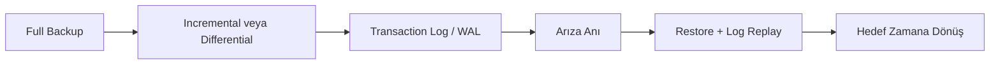

# Veritabanı Yönetimi: Yedekleme ve Kurtarma

Veritabanı sistemlerinde en kritik risklerden biri, verinin beklenmedik bir anda erişilemez veya kullanılamaz hale gelmesidir. Donanım arızası, yanlışlıkla silme, hatalı güncelleme, fidye yazılımı saldırıları veya operasyonel hatalar bu riski doğrudan üretir.

Bu nedenle yedekleme, yalnızca "kopya alma" işlemi değildir. Yedekleme; iş sürekliliğini koruma, veri kaybını sınırlama ve sistemi kontrollü biçimde geri döndürme disiplinidir.

## Yedekleme ve kurtarma neden kritiktir?

Bir veritabanının çalışıyor olması tek başına yeterli değildir. Asıl soru şudur: "Bir sorun olduğunda sistem ne kadar sürede ve ne kadar az veri kaybıyla geri dönebilir?"

Bu noktada iki temel metrik kullanılır:

- `RPO` (Recovery Point Objective): Kabul edilebilir veri kaybı penceresi
- `RTO` (Recovery Time Objective): Sistemin ayağa kalkması için kabul edilebilir süre

Örnek:

- `RPO = 15 dakika` ise, en fazla son 15 dakikalık verinin kaybı kabul edilir.
- `RTO = 1 saat` ise, kesinti sonrası sistemin en geç 1 saatte tekrar çalışması beklenir.

## Temel yedekleme türleri

### Full backup

Veritabanının tamamının tek seferde yedeklenmesidir. Geri yükleme süreci daha basittir; ancak yedek alma süresi ve depolama maliyeti daha yüksektir.

### Incremental backup

Bir önceki **herhangi bir yedeğe** göre değişen verilerin alınmasıdır. Yani zincir mantığıyla ilerler: pazartesi incremental'i, pazar incremental'ine; salı incremental'i, pazartesi incremental'ine bağlıdır. Depolama ve yedek alma süresi açısından en verimli türdür; ancak restore sırasında full + tüm incremental zinciri gerektiği için operasyon karmaşıklaşır.

### Differential backup

Her zaman **son full backup'a** göre değişen verilerin alınmasıdır. Bu nedenle zincir birikmez: örneğin perşembe differential yedeği, pazartesiden perşembeye kadar tüm farkları tek pakette taşır. Incremental'e göre daha fazla alan kullanır; ancak restore sırasında genellikle yalnızca full + son differential yeterli olduğu için geri dönüş daha sade olur.

## Kısa kıyas tablosu


| Yedek türü   | Yedekleme süresi | Depolama maliyeti | Geri yükleme kolaylığı |
| ------------ | ---------------- | ----------------- | ---------------------- |
| Full         | Yüksek           | Yüksek            | Yüksek                 |
| Incremental  | Düşük            | Düşük             | Orta-Düşük             |
| Differential | Orta             | Orta              | Orta-Yüksek            |


## Yedekleme stratejisi nasıl kurulur?

Tek bir doğru strateji yoktur; ancak sağlam bir plan şu sorulara net cevap verir:

1. Hangi veriler kritik?
2. Ne sıklıkla yedek alınacak?
3. Yedekler nerede saklanacak?
4. Ne kadar süre tutulacak?
5. Yedekler düzenli olarak geri yükleme testinden geçirilecek mi?

Bu soruları soyut bırakmamak için kısa bir e-ticaret örneği üzerinden netleştirilebilir:

- **Hangi veriler kritik?**  
Örnek: `orders`, `payments`, `customers` tabloları kritik; geçici rapor tabloları kritik değildir.
- **Ne sıklıkla yedek alınacak?**  
Örnek: Her pazar gece full backup, gün içinde her saat incremental backup.
- **Yedekler nerede saklanacak?**  
Örnek: Bir kopya aynı veri merkezinde hızlı geri dönüş için, ikinci kopya farklı bölgede (offsite) felaket senaryosu için.
- **Ne kadar süre tutulacak?**  
Örnek: Saatlik yedekler 7 gün, günlük yedekler 30 gün, aylık full backup 12 ay saklanır.
- **Geri yükleme testi yapılacak mı?**  
Örnek: Her ay rastgele bir yedek seçilip test ortamına restore edilir ve uygulamanın açıldığı doğrulanır.

Pratik bir başlangıç şablonu:

- Haftalık full backup
- Günlük differential veya saatlik incremental
- Üretim ortamından ayrı bir lokasyonda saklama
- En az bir kopyayı offline/immutable ortamda tutma

## MySQL için temel komut örnekleri

### MySQL: yedek alma

```bash
mysqldump -u root -p academy_db > academy_db_full.sql
```

Bu komut, `academy_db` veritabanının SQL dökümünü alır.

### MySQL: geri yükleme

```bash
mysql -u root -p academy_db_restored < academy_db_full.sql
```

Bu işlem, döküm dosyasını `academy_db_restored` veritabanına geri yükler.

## Log tabanlı kurtarma yaklaşımı

Full backup tek başına yeterli değildir, çünkü full yedekler arasında sistemde yeni işlemler oluşur. Arıza bu aralıkta olursa, son full yedekten sonraki değişiklikler kaybolabilir.

Bu riski azaltmak için işlem kayıtları da tutulur. MySQL tarafında bu kayıtlar genelde **binary log (binlog)** olarak, diğer sistemlerde **transaction log** veya **WAL (Write-Ahead Log)** olarak geçer.

Önce terimleri sadeleştirelim:

- **Transaction (işlem):** Veritabanında yapılan iş birimi.  
Örnek: sipariş oluşturma, stok düşme, ödeme kaydı ekleme.
- **Log / WAL:** Bu, işlemlerin zaman sırasına göre kaydedildiği günlük dosyaları.  
Basit düşünceyle: "Sistemde hangi değişiklik, hangi sırayla oldu?" kaydıdır.
- **Log replay:** Kurtarma sırasında bu log kayıtlarını yeniden oynatarak değişiklikleri geri uygulama işlemidir.
- **Point-in-time recovery (PITR):** Veritabanını belirli bir ana kadar geri döndürme yaklaşımıdır.  
Örnek: "Sistemi 14:37:20 anındaki hâline getir."

### Neden gerekli?

Örnek senaryo:

- Gece 02:00'de full backup alındı.
- Gün içinde binlerce yeni sipariş işlendi.
- 16:45'te sunucu arızalandı.

Sadece full backup varsa sistem en fazla 02:00 durumuna döner ve gün içindeki veriler kaybolur.  
Full backup + log yaklaşımında ise 02:00 sonrası işlemler loglardan okunarak sisteme tekrar uygulanır ve veri kaybı ciddi biçimde azaltılır.

### Kurtarma sırasında ne olur?

1. Önce full backup geri yüklenir.
2. Varsa incremental/differential yedekler uygulanır.
3. Son adımda log kayıtları sırayla oynatılır (log replay).
4. Hedeflenen zamana gelince işlem durdurulur.

Bu yaklaşımın temel hedefi, sistemi arıza öncesi en yakın tutarlı noktaya getirmektir.




*Şekil 1: Full yedek, artımlı/diferansiyel yedek ve log kayıtları birlikte kullanılarak arıza sonrası hedef zamana yakın geri dönüş akışı gösterilir.*

Şeklin okunması:

- `A -> B`: Temel veri tabanı kopyası (full) ve ara dönem farkları hazırlanır.
- `B -> C`: Sistem çalışırken gerçekleşen her kritik değişiklik log dosyalarına yazılır.
- `C -> D`: Arıza anında sistem dursa bile log kayıtları, son değişikliklerin izini taşır.
- `D -> E`: Kurtarma sırasında önce yedekler açılır, sonra loglar sırayla uygulanır.
- `E -> F`: Veritabanı hedeflenen zamana mümkün olduğunca yakın şekilde geri döner.

## Sık yapılan hatalar ve karşılığı

- **Hata: Yedek alınıyor sanılıp geri yükleme testinin hiç yapılmaması**  
Senaryo: Bir eğitim platformu her gece otomatik yedek alıyor sanılır. Sunucu disk arızası sonrası restore denendiğinde son 3 haftadır yedek dosyalarının bozuk olduğu fark edilir.  
Sonuç: Sistem saatlerce kapalı kalır, güncel verinin önemli kısmı geri getirilemez.  
Doğru yaklaşım: Aylık zorunlu restore testi ve test sonucu raporu.  
Restore testi, "aldığımız yedek gerçekten geri yüklenebiliyor mu?" kontrolüdür. Bunun için üretim ortamına dokunmadan bir test sunucusu açılır, yedek bu ortama geri yüklenir ve kritik kontroller yapılır: veritabanı açılıyor mu, tablolar görünüyor mu, son tarihli kayıtlar beklenen şekilde geliyor mu. Bu kontroller geçmiyorsa yedek var görünse bile güvenilir değildir.
- **Hata: Tüm yedeklerin aynı fiziksel sunucuda tutulması**  
Senaryo: E-ticaret sistemi hem canlı veritabanını hem de yedekleri aynı sunucuda saklar. Sunucuya ransomware (fidye yazılımı) bulaştığında canlı verilerle birlikte yedek klasörü de şifrelenir.  
Sonuç: Teknik olarak "yedek vardı", pratikte geri dönecek temiz kopya kalmaz.  
Doğru yaklaşım: En az bir offsite kopya ve mümkünse immutable (değiştirilemez) saklama.
- **Hata: Şifreleme ve erişim yetkilerinin ihmal edilmesi**  
Senaryo: Yedek dosyaları düz metin halde paylaşımlı bir depoda tutulur. Yetkisi olmayan bir kullanıcı müşteri kimlik ve ödeme bilgilerine erişir.  
Sonuç: Veri ihlali, hukuki yaptırım, itibar kaybı.  
Doğru yaklaşım: Yedekleri şifreli tutmak, erişimi rol tabanlı sınırlandırmak ve erişim loglarını izlemek.
- **Hata: Saklama politikasının tanımlanmaması nedeniyle disk dolması**  
Senaryo: Bir kurum 18 ay boyunca her gün full backup alır, eski yedekleri otomatik temizlemez. Bir gece disk tamamen dolar ve yeni yedek işi başarısız olur.  
Sonuç: Arıza anında en güncel kurtarma noktası yoktur.  
Doğru yaklaşım: Net bir retention policy (yedeklerin ne kadar süre saklanacağını belirleyen kural) tanımlanmalıdır (ör. günlük yedekler 30 gün, aylık yedekler 12 ay tutulur). Ayrıca disk dolmadan önce uyarı almak için kapasite alarmı kurulmalıdır.
- **Hata: Üretim yükü yüksek saatlerde plansız full backup çalıştırılması**  
Senaryo: Ödeme trafiğinin en yoğun olduğu saat 20:30'da manuel full backup başlatılır. Disk I/O ve CPU yükselir, sipariş işlemleri yavaşlar ve timeout hataları artar.  
Sonuç: Hem kullanıcı deneyimi bozulur hem gelir kaybı oluşur.  
Doğru yaklaşım: Backup işleri düşük trafik saatlerine planlanmalı, mümkünse replica üzerinden alınmalıdır.

Bu hataların ortak sonucu, kriz anında yedeğin işe yaramamasıdır.

## Sonuç

Yedekleme ve kurtarma, veritabanı yönetiminin operasyonel güvenlik katmanıdır. Doğru bir plan; uygun yedek türü seçimi, net saklama politikası ve düzenli restore testi ile tamamlanır.

Teknik olarak en kritik prensip şudur: Yedeğin varlığı değil, geri yüklenebilirliği güvence sağlar.