# Retail Ops Veritabanı Rehberi

Bu doküman, `retail_ops_sample.sql` ile kurulan e-ticaret operasyon veritabanını uçtan uca açıklar.
Amaç, şemanın sadece tablo isimlerini değil, iş akışını da anlaşılır hale getirmektir.

---

## 0) Hızlı Akış Diyagramları

Önce büyük resmi hızlıca görmek için küçük akışları kullan:

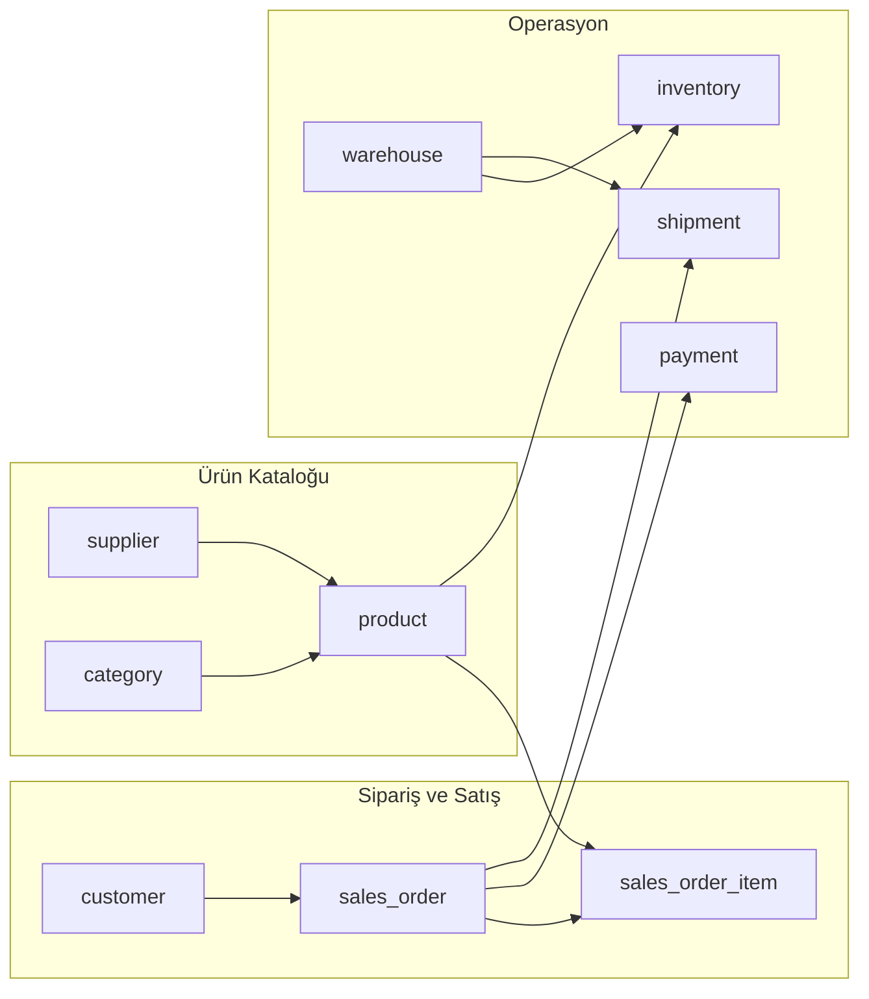

---

## 1) Kapsam ve amaç

Bu veritabanı aşağıdaki süreçleri kapsar:

- müşteri ve tedarikçi yönetimi
- ürün/kategori yönetimi
- depo ve stok takibi
- sipariş oluşturma ve sipariş kalemleri
- ödeme takibi
- sevkiyat/kargo takibi

Tek cümleyle:
`retail_ops`, siparişten teslimata kadar tüm operasyon zincirini ilişkisel modelde toplar.

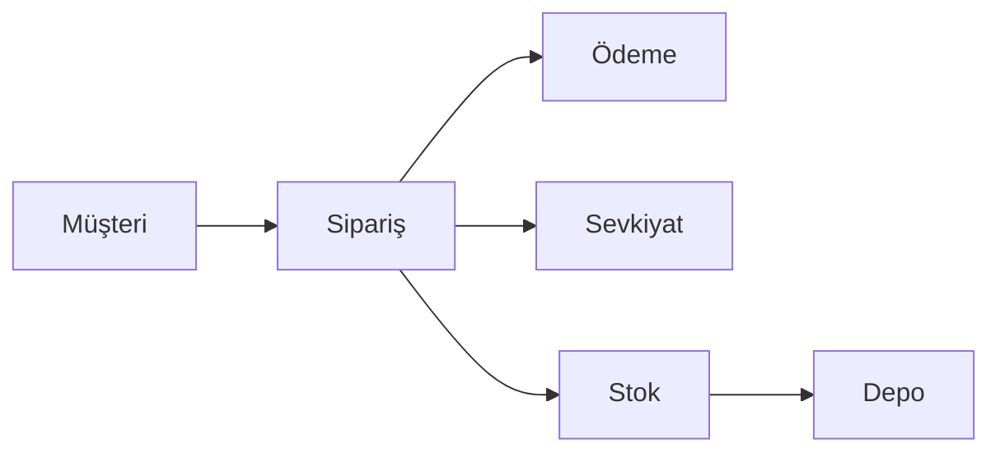

---

## 2) Hızlı kurulum

```sql
SOURCE /path/to/retail_ops_sample.sql;
USE retail_ops;
SHOW TABLES;
```

Beklenen tablolar:

- `customer`
- `supplier`
- `category`
- `product`
- `warehouse`
- `inventory`
- `sales_order`
- `sales_order_item`
- `payment`
- `shipment`

---

## 3) Genel mimari

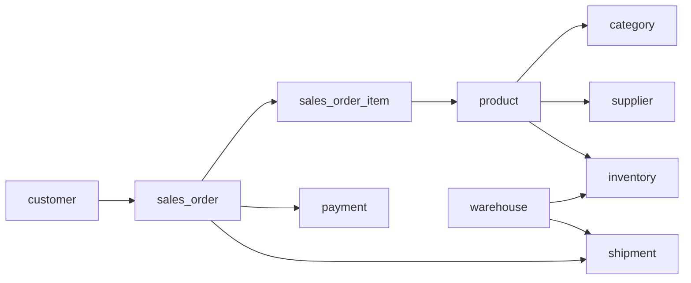

Bu akışın mantığı:

1. müşteri sipariş verir (`sales_order`)
2. sipariş satırlarında ürünler tutulur (`sales_order_item`)
3. ürün stokları depoya göre yönetilir (`inventory`)
4. siparişin ödeme ve sevkiyat kayıtları ayrı izlenir (`payment`, `shipment`)

Kısa karar akışı:

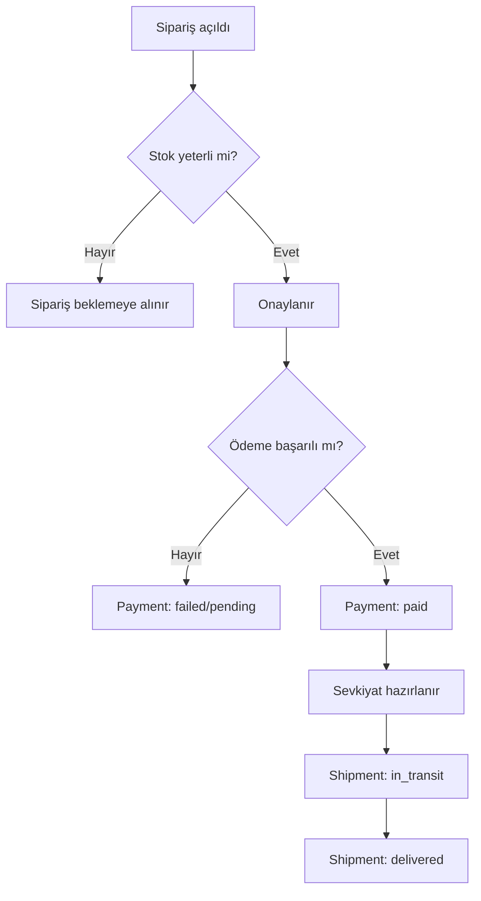

---

## 4) ER diyagramı (tablo ilişkileri)

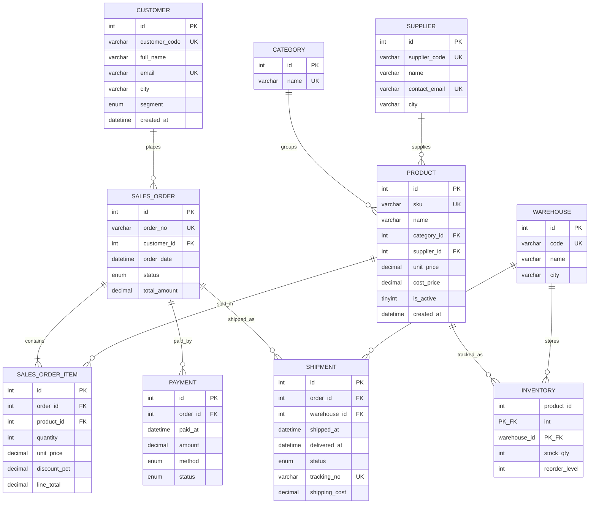

> Not: Bu bölümdeki ER şeması, operasyonun ilişkisel omurgasını gösterir.

---

## 4.1) Sade EER (öğrenme amaçlı)

Detay kolonları azaltılmış, yalnızca ilişkiyi gösteren sade sürüm:

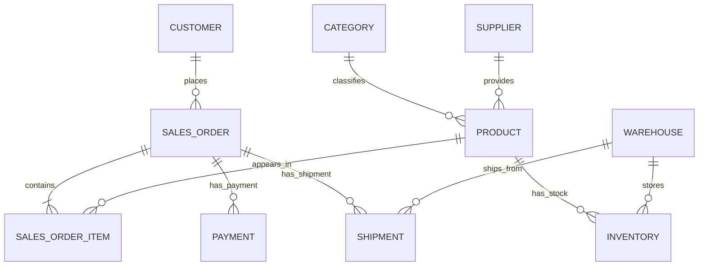

Bu sürüm, özellikle ilk okuma için idealdir.

---

## 4.2) Modüler EER - Satış alanı

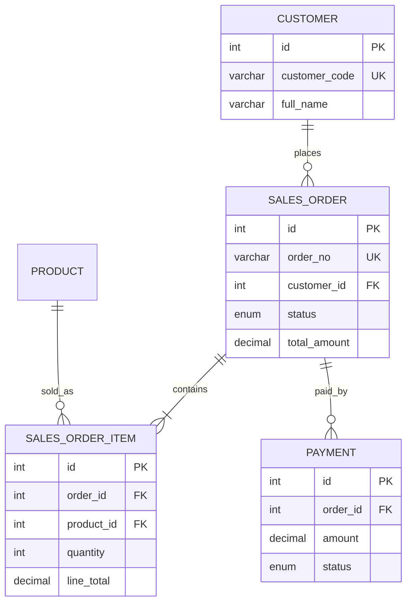

---

## 4.3) Modüler EER - Stok alanı

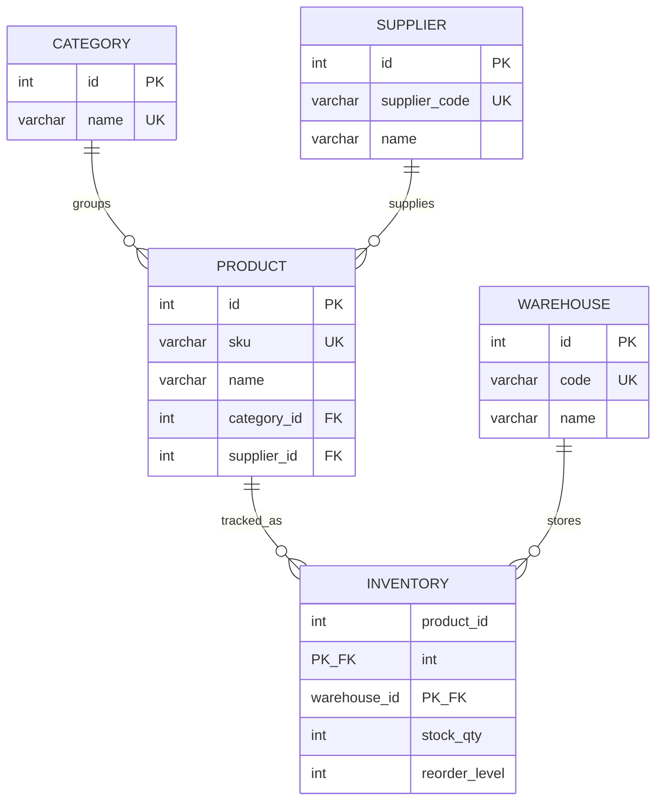

---

## 4.4) Modüler EER - Lojistik alanı

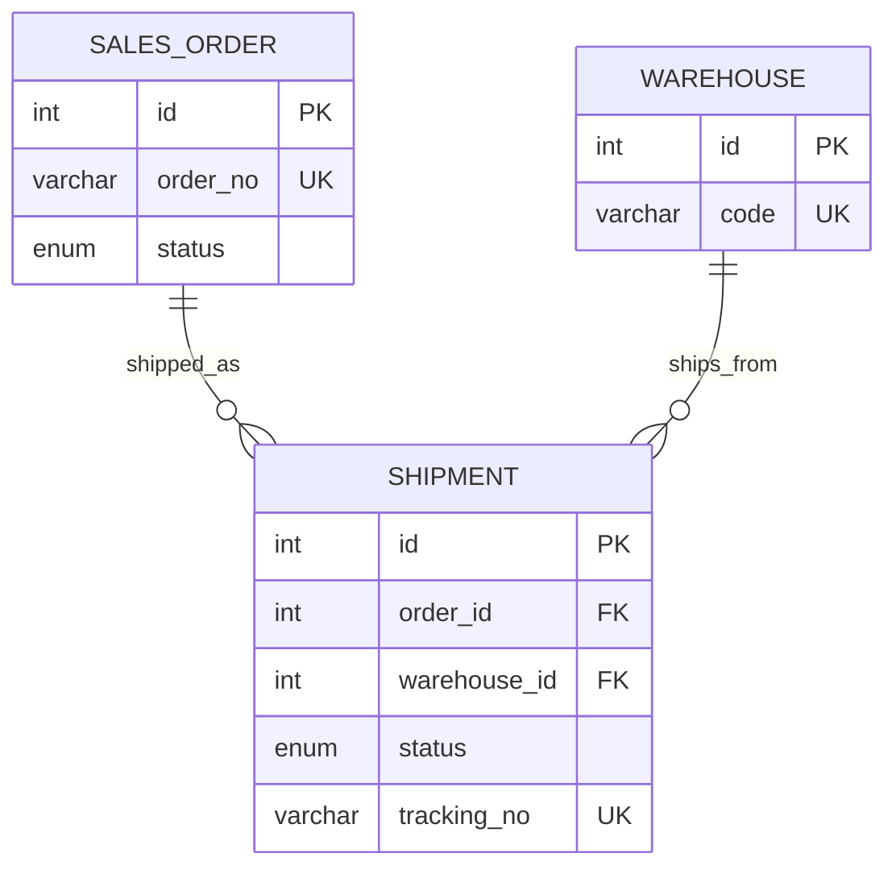

---

## 4.5) İlişki lejandı (okuma kılavuzu)

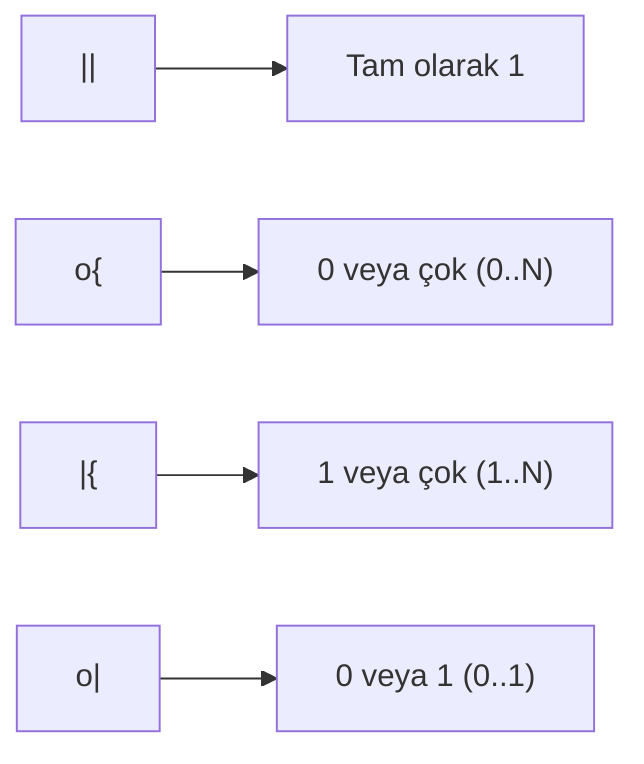

Bu işaretleri bildiğinde EER diyagramını çok daha hızlı okursun.

---

## 5) Tabloların görevleri

## `customer`

- sistemde sipariş verecek kişi/kurum kartı
- `customer_code` ve `email` benzersiz
- `segment` ile bireysel/kurumsal ayrımı yapılır

## `supplier`

- ürün tedarik eden firma bilgisi
- ürün kartı bu tabloya bağlanır (`product.supplier_id`)

## `category`

- ürünleri mantıksal gruplara ayırır
- kategori bazlı raporların temelidir

## `product`

- satılan ürün kartı
- kategori ve tedarikçiye FK ile bağlıdır
- `unit_price` satış, `cost_price` maliyet analizi için tutulur

## `warehouse`

- fiziksel depo tanımı
- stok ve sevkiyat bu tabloya bağlıdır

## `inventory`

- ürünün depoya göre stok kırılımı
- bileşik PK: `(product_id, warehouse_id)`
- stok operasyonlarının çekirdeği

## `sales_order`

- sipariş başlığı (header)
- müşteri, tarih, durum ve toplam tutar bilgisi
- yaşam döngüsü: `new -> approved -> shipped -> delivered`

## `sales_order_item`

- sipariş satırları (line item)
- her satır bir ürün + miktar + tutar içerir
- sipariş toplamları bu tablodan doğrulanır

## `payment`

- ödeme hareketi
- durumlar: `pending`, `paid`, `failed`, `refunded`
- finansal takip için ayrı tutulur

## `shipment`

- sevkiyat hareketi
- hangi depodan gönderildiği ve takip no bilgisi
- durumlar: `preparing`, `in_transit`, `delivered`, `returned`

---

## 6) İlişki kuralları (FK davranışları)

Önemli ilişki davranışları:

- `sales_order -> customer`: `ON DELETE RESTRICT`
  - müşteriye bağlı sipariş varken müşteri silinemez
- `sales_order_item -> sales_order`: `ON DELETE CASCADE`
  - sipariş silinirse satırlar da silinir
- `payment -> sales_order`: `ON DELETE CASCADE`
  - sipariş yoksa ödeme kaydının kalması engellenir
- `shipment -> warehouse`: `ON DELETE RESTRICT`
  - geçmiş sevkiyat kayıtlarını korumak için depo silme sınırlandırılır

Bu kararlar, veri tutarlılığını iş kurallarıyla uyumlu tutar.

---

## 7) Durum (status) alanları ve semantik

## Sipariş (`sales_order.status`)

- `new`: sipariş açıldı
- `approved`: operasyon onayı alındı
- `shipped`: sevkiyata çıktı
- `delivered`: teslim edildi
- `cancelled`: iptal edildi

## Ödeme (`payment.status`)

- `pending`: ödeme bekleniyor
- `paid`: ödeme tamamlandı
- `failed`: ödeme başarısız
- `refunded`: ödeme iade edildi

## Sevkiyat (`shipment.status`)

- `preparing`: hazırlık aşamasında
- `in_transit`: yolda
- `delivered`: teslim edildi
- `returned`: iade döndü

Durumların görsel özeti:

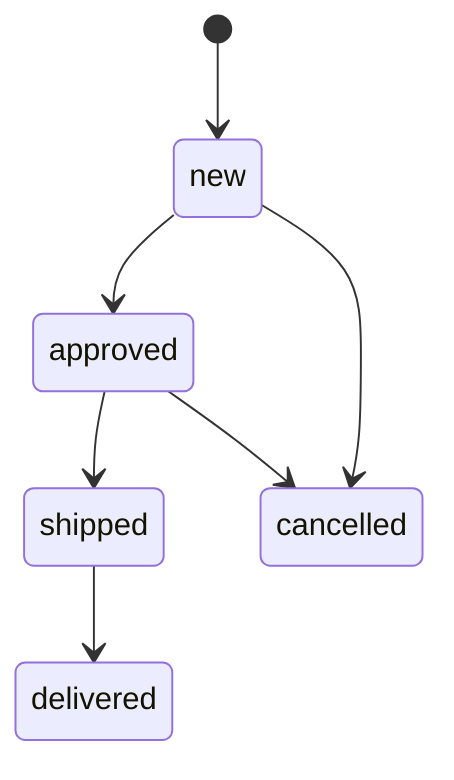

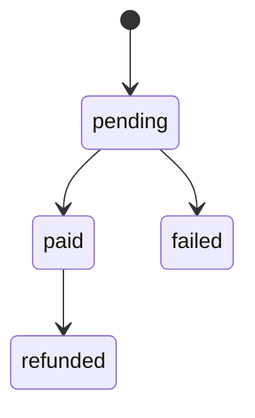

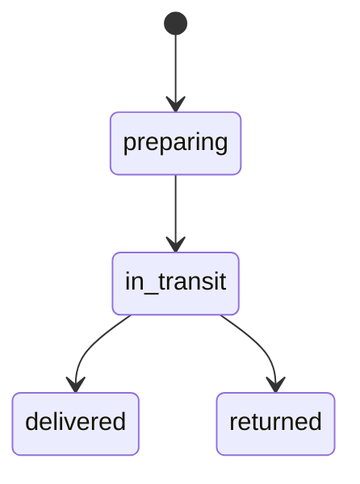

---

## 8) Siparişten teslimata iş akışı

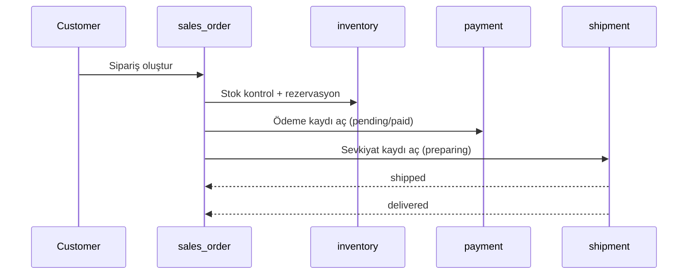

Not:
Gerçek sistemde bu adımlar transaction ve kilitleme ile güvenceye alınmalıdır.

Aynı akışın tablo odaklı kısa görünümü:

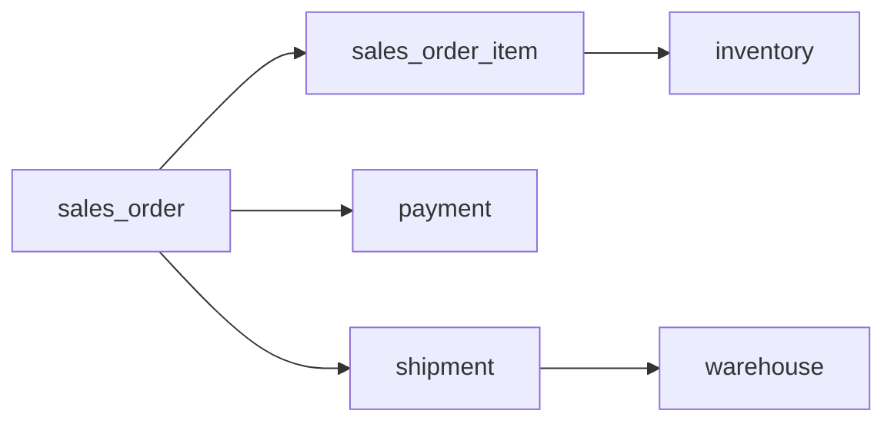

---

## 9) Sorgu örnekleri (şemayı anlamak için)

## 9.1 Sipariş özeti

```sql
SELECT so.order_no,
       c.full_name AS customer_name,
       so.status AS order_status,
       p.status AS payment_status,
       sh.status AS shipment_status
FROM sales_order so
JOIN customer c ON c.id = so.customer_id
LEFT JOIN payment p ON p.order_id = so.id
LEFT JOIN shipment sh ON sh.order_id = so.id
ORDER BY so.order_date DESC;
```

## 9.2 Kategori bazlı ciro

```sql
SELECT cat.name AS category_name,
       SUM(soi.quantity) AS total_units,
       ROUND(SUM(soi.line_total), 2) AS gross_revenue
FROM sales_order_item soi
JOIN product pr ON pr.id = soi.product_id
JOIN category cat ON cat.id = pr.category_id
GROUP BY cat.id, cat.name
ORDER BY gross_revenue DESC;
```

## 9.3 Kritik stok listesi

```sql
SELECT w.code AS warehouse_code,
       pr.sku,
       pr.name AS product_name,
       i.stock_qty,
       i.reorder_level
FROM inventory i
JOIN warehouse w ON w.id = i.warehouse_id
JOIN product pr ON pr.id = i.product_id
WHERE i.stock_qty <= i.reorder_level
ORDER BY i.stock_qty ASC;
```

---

## 10) İndeks mantığı (şemadaki ipuçları)

Şemadaki çoğu FK alanında index bulunur:

- `sales_order.customer_id`
- `sales_order_item.order_id`, `sales_order_item.product_id`
- `payment.order_id`
- `shipment.order_id`, `shipment.warehouse_id`

Sebep:
JOIN ve filtre sorgularında tam tablo taramasını azaltmak.

Ek performans senaryosu:
`sales_order(status, order_date)` bileşik indexi, durum+tarih filtreli dashboard sorgularında etkilidir.

Index düşünme akışı:

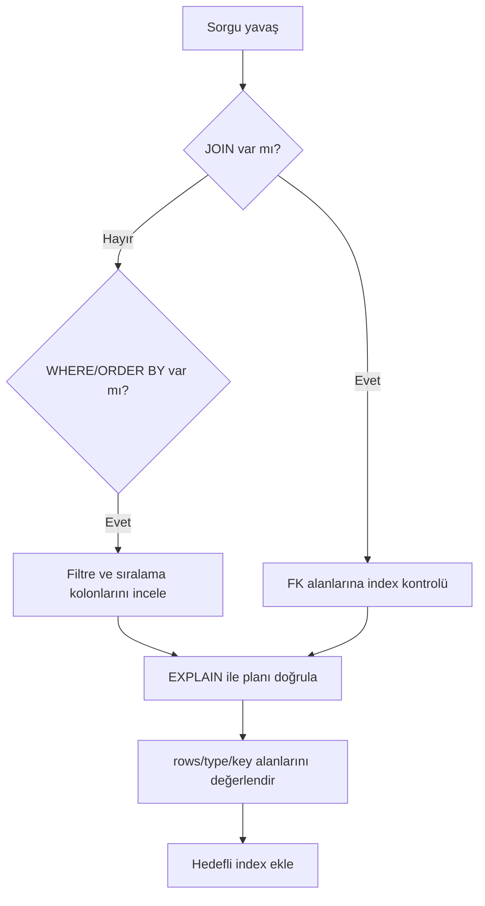

---

## 11) Veri kalitesi için kontrol sorguları

## 11.1 Sipariş total doğrulama

```sql
SELECT so.order_no,
       so.total_amount AS stored_total,
       ROUND(SUM(soi.line_total), 2) AS calculated_total,
       ROUND(so.total_amount - SUM(soi.line_total), 2) AS diff
FROM sales_order so
JOIN sales_order_item soi ON soi.order_id = so.id
GROUP BY so.id, so.order_no, so.total_amount
ORDER BY ABS(diff) DESC;
```

## 11.2 Teslim edilmiş ama ödenmemiş sipariş kontrolü

```sql
SELECT so.order_no,
       so.status AS order_status,
       p.status AS payment_status
FROM sales_order so
LEFT JOIN payment p ON p.order_id = so.id
WHERE so.status = 'delivered'
  AND COALESCE(p.status, 'pending') <> 'paid';
```

Kontrol mantığının diyagramı:

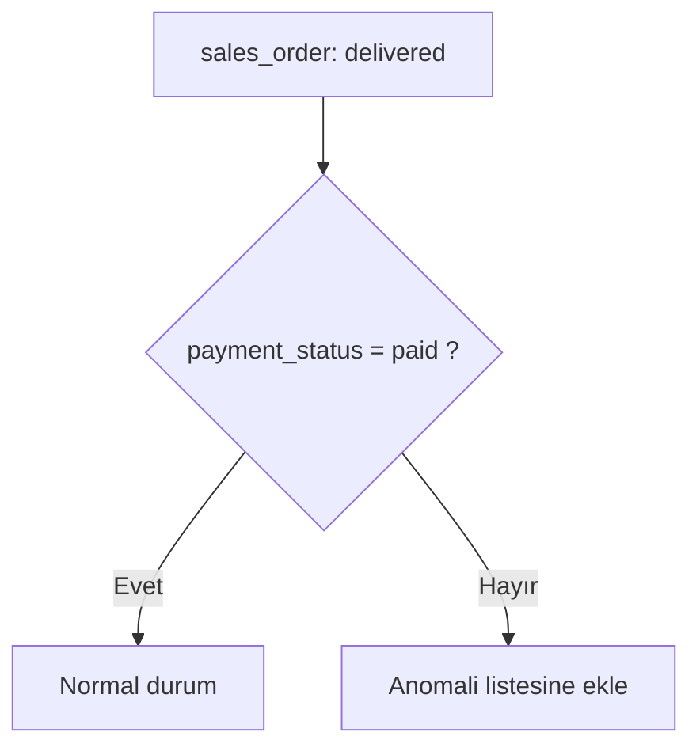

---

## 12) Geliştirme önerileri

Bu şema eğitim ve demo için yeterli; üretimde şu iyileştirmeler eklenebilir:

- `sales_order` için `currency`, `tax_total`, `net_total` alanları
- `payment` için çoklu ödeme desteği (aynı siparişe birden fazla kayıt politikası)
- `inventory_movement` tablosu ile stok hareket geçmişi
- audit log (status geçişleri için)
- soft delete yaklaşımı (`deleted_at`) gereken tablolarda

---

## 13) Sonuç

Bu veritabanı, e-ticaret operasyonlarında en kritik üç hattı bir araya getirir:

1. sipariş hattı (`sales_order`, `sales_order_item`)
2. finans hattı (`payment`)
3. lojistik hattı (`shipment`, `inventory`, `warehouse`)

Şemayı bu üç hat üzerinden okuduğunda, hem SQL sorguları hem de transaction tasarımı çok daha anlaşılır hale gelir.
