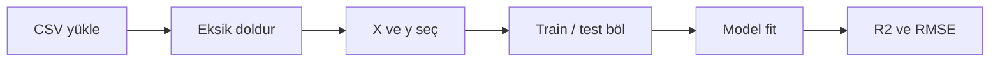

# Regresyon İçin Minimum Python: Tek Şablon

Doğrusal regresyon, bir hedef değişkeni (örneğin sınav notu) bağımsız değişkenlerle tahmin etmeye yarar. Python tarafında amaç uzman bir programcı olmak değil; **hazır bir kod şablonunu çalıştırıp çıktıyı okumaktır**.

Bu makalede tek bir veri seti ve tek bir uçtan uca akış kullanılır. Fonksiyon yazmak veya algoritma tasarlamak beklenmez.

## Veri seti: Student Performance

- Dosya: `courses/linear-statistical-models/resources/student_performance.csv`
- Hedef değişken (`y`): `final_exam_score` — dönem sonu notu
- Açıklayıcı değişkenler (`X`): öğrenci alışkanlık ve performans sütunları


| Sütun                          | Anlamı                    |
| ------------------------------ | ------------------------- |
| `study_hours_per_week`         | Haftalık çalışma saati    |
| `attendance_rate`              | Derse devam oranı (%)     |
| `sleep_hours_per_day`          | Günlük uyku süresi        |
| `solved_question_count`        | Çözülen soru sayısı       |
| `previous_term_score`          | Önceki dönem notu         |
| `internet_usage_hours_per_day` | Günlük internet kullanımı |


## Regresyon çıktısını okumak için iki metrik

- `**R2`**: Not değişiminin ne kadarının modelle açıklandığı (0–1 arası; yüksek genelde daha iyi).
- `**RMSE`**: Tahminlerin gerçek nottan ortalama sapması, puan biriminde (düşük daha iyi).

Veri **eğitim** ve **test** diye ikiye bölünür. Model yalnızca eğitimde öğrenir; test, görülmemiş gözlemlerdeki davranışı gösterir. Karar verirken **test** metrikleri önceliklidir.

## Jupyter Notebook’ta çalışma

- **Code** hücresi: Python kodu
- **Shift + Enter**: hücreyi çalıştırır
- **Kernel**: arka plandaki Python ortamı

Hata alınırsa dosya yolu, sütun adı ve eksik değer mesajları kontrol edilir.

## Tek şablon: uçtan uca akış

Tüm adımlar **tek hücrede** birleştirilmiştir; kopyalayıp çalıştırmak yeterlidir.

```python
import pandas as pd
import numpy as np
from sklearn.model_selection import train_test_split
from sklearn.linear_model import LinearRegression
from sklearn.metrics import r2_score, mean_squared_error

# 1) Veriyi yükle
df = pd.read_csv(
    "courses/linear-statistical-models/resources/student_performance.csv"
)

# 2) Sayısal sütunlardaki eksikleri medyan ile doldur
numeric_cols = [
    "study_hours_per_week",
    "attendance_rate",
    "sleep_hours_per_day",
    "solved_question_count",
    "previous_term_score",
    "internet_usage_hours_per_day",
    "final_exam_score",
]
for col in numeric_cols:
    df[col] = df[col].fillna(df[col].median())

# 3) Modele girecek sütunları seç
features = [
    "study_hours_per_week",
    "attendance_rate",
]

X = df[features]
y = df["final_exam_score"]

# 4) %80 eğitim, %20 test
X_train, X_test, y_train, y_test = train_test_split(
    X, y, test_size=0.2, random_state=42
)

# 5) Modeli yalnızca eğitim verisinde kur
model = LinearRegression()
model.fit(X_train, y_train)

# 6) Tahmin ve metrikler
y_pred_train = model.predict(X_train)
y_pred_test = model.predict(X_test)

print("Kullanılan özellikler:", features)
print("Train R2 :", round(float(r2_score(y_train, y_pred_train)), 4))
print("Test R2  :", round(float(r2_score(y_test, y_pred_test)), 4))
print(
    "Train RMSE:",
    round(float(mean_squared_error(y_train, y_pred_train, squared=False)), 4),
)
print(
    "Test RMSE :",
    round(float(mean_squared_error(y_test, y_pred_test, squared=False)), 4),
)
```

## Satır satır ne yapılıyor?


| Adım | Kod parçası           | Anlamı                                                                               |
| ---- | --------------------- | ------------------------------------------------------------------------------------ |
| 1    | `read_csv`            | CSV dosyasını tablo (`DataFrame`) olarak okur                                        |
| 2    | `fillna(median)`      | Boş hücreleri o sütunun medyanı ile doldurur; `LinearRegression` eksik kabul etmez   |
| 3    | `features`, `X`, `y`  | Bağımsız sütunlar `X`, tahmin edilecek not `y`                                       |
| 4    | `train_test_split`    | Veriyi eğitim ve test diye ayırır; `random_state=42` sonuçları tekrarlanabilir kılar |
| 5    | `fit`                 | Katsayıları eğitim verisinden öğrenir                                                |
| 6    | `predict` + metrikler | Tahmin üretir; `R2` ve `RMSE` ile uyumu sayısallaştırır                              |


`LinearRegression`, en küçük kareler ile doğrusal ilişkiyi öğrenir. Çıktıdaki katsayılar “her değişken bir birim artınca not ortalama ne kadar değişir?” sorusuna yanıt verir (diğer değişkenler sabitken).

## Tek değişiklik: `features` listesi

Şablonda değiştirilmesi beklenen ana yer `features` listesidir.

Yalnızca çalışma saati:

```python
features = ["study_hours_per_week"]
```

Altı değişkenin tamamı:

```python
features = [
    "study_hours_per_week",
    "attendance_rate",
    "sleep_hours_per_day",
    "solved_question_count",
    "previous_term_score",
    "internet_usage_hours_per_day",
]
```

Liste değiştirildikten sonra hücre yeniden çalıştırılır. Yorum soruları:

- Train metrikleri değişken ekledikçe genelde iyileşir mi?
- Test metrikleri de iyileşiyor mu, yoksa yalnızca eğitim mi güçleniyor?

Bu iki soru, birden fazla model kurarken model seçiminin temelidir.

## Sık görülen hatalar


| Belirti             | Olası neden            | Ne yapılır                                   |
| ------------------- | ---------------------- | -------------------------------------------- |
| `FileNotFoundError` | CSV yolu yanlış        | Notebook çalışma dizinine göre yolu düzeltin |
| `KeyError`          | Sütun adı yazım hatası | `print(df.columns)` ile adları kontrol edin  |
| `ValueError` (NaN)  | Eksik doldurma atlandı | `fillna` döngüsünün çalıştığından emin olun  |


## Akışın özeti




*Sekil 1: Bu makaledeki tek şablonda veriden metrik çıktısına giden adımları gösterir.*

## Sonuç

Regresyon için minimum Python becerisi: veriyi yüklemek, `features` listesini belirlemek, şablonu çalıştırmak ve train/test `R2` ile `RMSE` satırlarını yorumlamaktır. Bu iskelet, model karşılaştırması ve seçim kriterleri için de aynı yapı üzerinde kurulabilir.