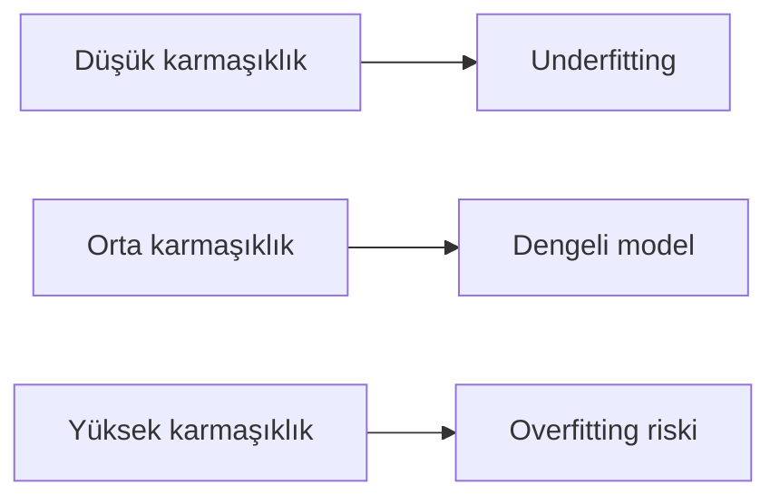

# Üç Model, Bir Karar: Eğitim–Test ve Overfitting

Aynı veri seti üzerinde farklı değişken listeleriyle birden fazla doğrusal regresyon modeli kurulabilir. Asıl soru şudur: **hangi model yalnızca eğitim verisine değil, yeni gözlemlerde de tutarlı kalır?**

Bu makalede üç aday model karşılaştırılır.

## Problem ve veri

**Student Performance** veri seti, öğrencilerin dönem sonu notunu (`final_exam_score`) çalışma alışkanlıklarıyla ilişkilendirmek için kullanılır.

- Dosya: `courses/linear-statistical-models/resources/student_performance.csv`
- Hedef: `final_exam_score`
- Bölme: %80 eğitim, %20 test (`random_state=42`)

**Eğitim seti:** modelin öğrendiği gözlemler.  
**Test seti:** modelin eğitim sırasında görmediği gözlemler; genelleme kabiliyeti burada ölçülür.

## Metrikler


| Metrik | Kısa anlam                                                |
| ------ | --------------------------------------------------------- |
| `R2`   | Hedef değişken varyansının ne kadarı modelle açıklanıyor  |
| `RMSE` | Tahmin–gerçek farkının ortalama büyüklüğü (not biriminde) |


Train metrikleri modele ne kadar uyduğunu gösterir. Test metrikleri yeni veride ne kadar işe yaradığını gösterir. Model seçiminde **test** önceliklidir.

## Veriyi hazırlama

```python
import pandas as pd
import numpy as np
from sklearn.model_selection import train_test_split
from sklearn.linear_model import LinearRegression
from sklearn.metrics import r2_score, mean_squared_error

df = pd.read_csv(
    "courses/linear-statistical-models/resources/student_performance.csv"
)

numeric_cols = [
    "study_hours_per_week",
    "attendance_rate",
    "sleep_hours_per_day",
    "solved_question_count",
    "previous_term_score",
    "internet_usage_hours_per_day",
    "final_exam_score",
]
for col in numeric_cols:
    df[col] = df[col].fillna(df[col].median())

y = df["final_exam_score"]

X_train_full, X_test_full, y_train, y_test = train_test_split(
    df.drop(columns=["final_exam_score"]),
    y,
    test_size=0.2,
    random_state=42,
)
```

## Üç aday model


| Kod | Kullanılan değişkenler                    | Karmaşıklık         |
| --- | ----------------------------------------- | ------------------- |
| M1  | `study_hours_per_week`                    | Düşük (1 değişken)  |
| M2  | `study_hours_per_week`, `attendance_rate` | Orta (2 değişken)   |
| M3  | Altı değişkenin tamamı                    | Yüksek (6 değişken) |


M1 çok sade kalırsa **underfitting** (yetersiz öğrenme) riski vardır. M3 gereğinden karmaşıksa **overfitting** (aşırı öğrenme) riski artar: eğitimde çok iyi, testte zayıf kalabilir.

## Model M1: tek değişken

```python
features_m1 = ["study_hours_per_week"]
X_train = X_train_full[features_m1]
X_test = X_test_full[features_m1]

model_m1 = LinearRegression()
model_m1.fit(X_train, y_train)

pred_train = model_m1.predict(X_train)
pred_test = model_m1.predict(X_test)

print("=== M1 ===")
print("Train R2 :", round(float(r2_score(y_train, pred_train)), 4))
print("Test R2  :", round(float(r2_score(y_test, pred_test)), 4))
print(
    "Train RMSE:",
    round(float(mean_squared_error(y_train, pred_train, squared=False)), 4),
)
print(
    "Test RMSE :",
    round(float(mean_squared_error(y_test, pred_test, squared=False)), 4),
)
```

## Model M2: iki değişken

```python
features_m2 = ["study_hours_per_week", "attendance_rate"]
X_train = X_train_full[features_m2]
X_test = X_test_full[features_m2]

model_m2 = LinearRegression()
model_m2.fit(X_train, y_train)

pred_train = model_m2.predict(X_train)
pred_test = model_m2.predict(X_test)

print("=== M2 ===")
print("Train R2 :", round(float(r2_score(y_train, pred_train)), 4))
print("Test R2  :", round(float(r2_score(y_test, pred_test)), 4))
print(
    "Train RMSE:",
    round(float(mean_squared_error(y_train, pred_train, squared=False)), 4),
)
print(
    "Test RMSE :",
    round(float(mean_squared_error(y_test, pred_test, squared=False)), 4),
)
```

## Model M3: altı değişken

```python
features_m3 = [
    "study_hours_per_week",
    "attendance_rate",
    "sleep_hours_per_day",
    "solved_question_count",
    "previous_term_score",
    "internet_usage_hours_per_day",
]
X_train = X_train_full[features_m3]
X_test = X_test_full[features_m3]

model_m3 = LinearRegression()
model_m3.fit(X_train, y_train)

pred_train = model_m3.predict(X_train)
pred_test = model_m3.predict(X_test)

print("=== M3 ===")
print("Train R2 :", round(float(r2_score(y_train, pred_train)), 4))
print("Test R2  :", round(float(r2_score(y_test, pred_test)), 4))
print(
    "Train RMSE:",
    round(float(mean_squared_error(y_train, pred_train, squared=False)), 4),
)
print(
    "Test RMSE :",
    round(float(mean_squared_error(y_test, pred_test, squared=False)), 4),
)
```

## Sonuçları tek tabloda toplama

```python
comparison = pd.DataFrame(
    [
        {
            "model": "M1",
            "n_features": 1,
            "train_r2": round(float(r2_score(y_train, model_m1.predict(X_train_full[features_m1]))), 4),
            "test_r2": round(float(r2_score(y_test, model_m1.predict(X_test_full[features_m1]))), 4),
            "train_rmse": round(
                float(
                    mean_squared_error(
                        y_train,
                        model_m1.predict(X_train_full[features_m1]),
                        squared=False,
                    )
                ),
                4,
            ),
            "test_rmse": round(
                float(
                    mean_squared_error(
                        y_test,
                        model_m1.predict(X_test_full[features_m1]),
                        squared=False,
                    )
                ),
                4,
            ),
        },
        {
            "model": "M2",
            "n_features": 2,
            "train_r2": round(float(r2_score(y_train, model_m2.predict(X_train_full[features_m2]))), 4),
            "test_r2": round(float(r2_score(y_test, model_m2.predict(X_test_full[features_m2]))), 4),
            "train_rmse": round(
                float(
                    mean_squared_error(
                        y_train,
                        model_m2.predict(X_train_full[features_m2]),
                        squared=False,
                    )
                ),
                4,
            ),
            "test_rmse": round(
                float(
                    mean_squared_error(
                        y_test,
                        model_m2.predict(X_test_full[features_m2]),
                        squared=False,
                    )
                ),
                4,
            ),
        },
        {
            "model": "M3",
            "n_features": 6,
            "train_r2": round(float(r2_score(y_train, model_m3.predict(X_train_full[features_m3]))), 4),
            "test_r2": round(float(r2_score(y_test, model_m3.predict(X_test_full[features_m3]))), 4),
            "train_rmse": round(
                float(
                    mean_squared_error(
                        y_train,
                        model_m3.predict(X_train_full[features_m3]),
                        squared=False,
                    )
                ),
                4,
            ),
            "test_rmse": round(
                float(
                    mean_squared_error(
                        y_test,
                        model_m3.predict(X_test_full[features_m3]),
                        squared=False,
                    )
                ),
                4,
            ),
        },
    ]
)
print(comparison)
```

Tabloda önce **test_r2** ve **test_rmse** sütunları okunur.

## Overfitting ve underfitting

**Overfitting (aşırı öğrenme):** Model eğitim verisine ve gürültüye aşırı uyum sağlar; test performansı belirgin düşer.

**Underfitting (yetersiz öğrenme):** Model çok sade kalır; hem train hem test zayıftır.




*Sekil 1: Değişken sayısı arttıkça model davranışının üç bölgeye kayabileceğini özetler.*


| Gözlem                            | Olası yorum                                       |
| --------------------------------- | ------------------------------------------------- |
| Train ve test ikisi de zayıf      | Underfitting                                      |
| Train iyi, test belirgin kötü     | Overfitting riski                                 |
| Train ve test birlikte iyileşiyor | Karmaşıklık artışı faydalı olabilir               |
| Train–test R2 farkı büyüyor       | Gereksiz değişken veya gürültü ekleniyor olabilir |


Robotik ve sensör uygulamalarında da fazla özellik (feature) kanalı her zaman daha iyi tahmin demek değildir; gürültülü sensörler modele gereksiz karmaşıklık taşır.

## Hangi model seçilir?

1. En düşük test `RMSE` (veya en yüksek test `R2`) adayları öne alın.
2. Benzer test skorunda **daha az değişkenli** model tercih edilebilir — yorumlanması kolaydır.
3. Train çok iyi, test zayıfsa o model seçilmez.

Örnek gerekçe: “M3’ün train R2’si M2’den yüksek; test R2 farkı küçük ve test RMSE neredeyse aynı. M2 daha sade ve testte yeterli — M2 seçilir.”

## Sonuç

Model seçiminin temel adımı, aynı veri ve aynı train–test bölmesiyle aday modelleri tabloda karşılaştırmaktır. Test metrikleri genelleme için kritiktir; train–test ayrışması overfitting işaretini gösterir. Dengeli ve yorumlanabilir model, testte yeterince iyi performans veren en sade yapıdır.