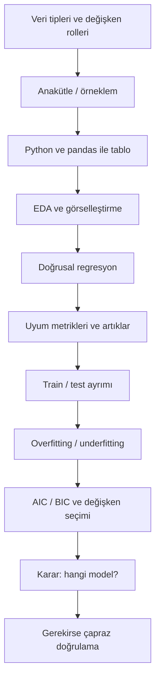

# Ders Özeti: Veriden Modele, Modelden Karara

Bu makale, **Doğrusal İstatistik Modeller** serisinin 1–12. yazılarında kurulan kavramları tek akışta toparlar. Yeni teknik konu eklenmez; amaç, veriyi okumaktan model seçimine ve gerekçeli karara uzanan yolu hatırlatmaktır.

## Uçtan uca süreç

*Sekil 1: Serinin tamamında izlenen yolu, veri anlamından model kararına kadar özetler.*

## Serinin haritası

| Makale | Konu | Özet çıktı |
|--------|------|------------|
| 1 | Veri tipleri ve değişken rolleri | Hangi sütun nitel/nicel, hangisi hedef |
| 2 | Anakütle, örneklem, dağılım | Parametre–istatistik ayrımı, belirsizlik |
| 3 | Python 101, Jupyter, pandas | Tablo okuma, `head`, `describe`, filtre |
| 4 | CSV ile EDA | Eksik değer, `groupby`, NumPy özeti |
| 5 | Matplotlib ve Seaborn | Histogram, boxplot, scatter yorumu |
| 6 | Basit doğrusal regresyon | Tek değişkenli `Y = b0 + b1*X + e` |
| 7 | Çoklu doğrusal regresyon | Birden fazla açıklayıcı, katsayı yorumu |
| 8 | Model uyumu ve değerlendirme | `R2`, `RMSE`, `MAE`, artık grafikleri |
| 9 | Model seçimi, over/underfitting | Karmaşıklık dengesi, çapraz doğrulama |
| 10 | Minimum Python şablonu | Tek hücrede `fit` → `predict` → metrik |
| 11 | Üç model, bir karar | Aynı bölme ile aday karşılaştırma |
| 12 | AIC, BIC, değişken seçimi | Sade model, korelasyon, multicollinearity |

## Veriden anlama (Makale 1–2)

**Veri, gözlem, değişken:** Tablodaki her satır bir gözlem; her sütun aynı türden bilgi taşıyan bir değişkendir. Analize başlamadan önce “satır neyi temsil ediyor, sütun ne ölçüyor?” soruları yanıtlanır.

**Nitel ve nicel:** Nitel sütunlar kategori taşır (görev türü, renk); nicel sütunlarda aritmetik genelde anlamlıdır (mesafe, sıcaklık). Kimlik sütunları (`robot_id` gibi) tipik olarak modele alınmaz.

**Bağımlı ve bağımsız:** Tahmin edilen sütun bağımlı (hedef); girdi adayları bağımsızdır. Örneğin `final_exam_score` hedef, `study_hours_per_week` açıklayıcı adaydır.

**Anakütle ve örneklem:** Anakütle, sorunun hedeflediği tüm birimlerdir; eldeki tablo çoğu zaman yalnızca bir örneklemdir. Örneklemden hesaplanan değer istatistiktir (ör. ortalama); anakütledeki bilinmeyen değer parametredir (ör. μ). Örnekleme hatası ve belirsizlik, tek bir sayının “kesin cevap” olmadığını hatırlatır.

## Keşif ve görselleştirme (Makale 3–5)

**Araç katmanı:** Jupyter hücreleri (Markdown + Code), `pandas` ile CSV okuma, `head` / `shape` / `info` / `describe` ile ilk bakış.

**EDA adımları:** Eksik değer sayımı (`isnull().sum()`), uygun doldurma (medyan), grup özeti (`groupby().mean()`), sıralama ve filtre.

**Grafik seçimi:**

| Amaç | Grafik |
|------|--------|
| Tek değişken dağılımı | Histogram (`sns.histplot`) |
| Gruplar arası dağılım | Boxplot |
| İki sayısal ilişki | Scatter |
| Kategori ortalaması | Barplot |

Keşif aşamasının çıktısı, hangi sütunların modele girebileceğine dair gerekçeli bir aday listesidir.

## Model kurma (Makale 6–7, 10)

Doğrusal regresyon, hedef değişkeni bağımsız değişkenlerin doğrusal birleşimiyle tahmin eder:

`Y = b0 + b1*X1 + b2*X2 + ... + e`

- `Y`: hedef (ör. `final_exam_score`)
- `Xi`: girdiler
- `b0`, `bi`: öğrenilen katsayılar
- `e`: açıklanamayan hata

Çoklu modelde katsayı yorumu: **diğer değişkenler sabitken** ilgili değişken bir birim artınca `Y` ortalama ne kadar değişir.

**Student Performance** veri seti (makale 6–7, 10–12): `courses/linear-statistical-models/resources/student_performance.csv`, hedef `final_exam_score`.

Minimum akış (makale 10): veriyi yükle → eksikleri doldur → `features` seç → `train_test_split` → `LinearRegression().fit` → test `R2` / `RMSE`.

## Uyumu ölçme (Makale 8)

| Metrik | Ne söyler? | Dikkat |
|--------|------------|--------|
| `R2` | Açıklanan varyans oranı | Train `R2` tek başına yeterli değil |
| `RMSE` | Ortalama tahmin hatası (hedef birimi) | Düşük daha iyi |
| `MAE` | Mutlak hata ortalaması | Aykırı değerlere `RMSE`’den daha dayanıklı |
| Adjusted `R2` | Feature sayısını cezalandırır | Gereksiz karmaşıklık sinyali |

**Artık (residual):** `gerçek - tahmin`. Artıkların tahminlere karşı grafiğinde sistematik örüntü (kavis, huni) varsa model yapısı yetersiz olabilir.

Film puanlama senaryosu (makale 8–9): `movie-rating-ds/` altında train–test farkı ve feature engineering birlikte okunur.

## Genelleme ve seçim (Makale 9–12)

**Train–test:** Model yalnızca eğitim kümesinde öğrenir; test kümesi genellemeyi ölçer. Karar için test metrikleri önceliklidir.

**Overfitting:** train iyi, test belirgin kötü — model ezberlemiş olabilir.  
**Underfitting:** train ve test birlikte zayıf — model yetersiz kalır.

**AIC / BIC:** Uyum + parametre cezası; aynı veri setinde düşük değer daha iyi aday. BIC, fazla değişkene AIC’den daha sert ceza verir. Nihai seçim yine test `R2` / `RMSE` ile doğrulanır.

**Değişken seçimi:** Korelasyon matrisinde yüksek |r| çiftleri (multicollinearity) şüpheli kabul edilir; tekrarlayan bilgi taşıyan sütunlar elenebilir.

**Çapraz doğrulama (makale 9):** Tek train–test bölmesi şanslı veya şanssız çıkabilir; `cross_val_score` ile k katlı ortalama skor daha istikrarlı bir fikir verir.

## Karar senaryosu: hangi model seçilir?

Aşağıdaki tablo, makale 11–12’deki **Student Performance** akışından türetilmiş **örnek** bir karşılaştırmadır. Sayılar mantık egzersizi içindir; amaç tabloyu birlikte okuma alıştırmasıdır.

| Model | Değişkenler | train_r2 | test_r2 | test_rmse | AIC |
|-------|-------------|----------|---------|-----------|-----|
| M1 | `study_hours_per_week` | 0.55 | 0.52 | 8.2 | 4200 |
| M2 | `study_hours_per_week`, `attendance_rate` | 0.71 | 0.68 | 6.1 | 4090 |
| M3 | + `previous_term_score` | 0.79 | 0.69 | 6.0 | 4080 |
| M4 | altı değişken | 0.82 | 0.67 | 6.3 | 4100 |

**Adım 1 — Test performansı:** En düşük test `RMSE` M3’te (6.0). M2’nin test `RMSE`’si 6.1; fark küçük.

**Adım 2 — Overfitting kontrolü:** M4’ün train `R2`’si en yüksek (0.82) ama test `R2` M3’ün gerisinde (0.67 < 0.69). Train–test ayrışması büyüyor; M4 overfitting riski taşır.

**Adım 3 — Sadelik:** AIC en düşük M3’te (4080). M2 biraz daha yüksek AIC’ye sahip olsa da yalnızca iki değişkenle testte neredeyse aynı hatayı verir.

**Adım 4 — Gerekçeli karar:**

> M3, test `RMSE` açısından en iyi adaydır ve AIC de bunu destekler. M2 ile test farkı çok küçükse, yorumlanabilirlik ve sade yapı nedeniyle M2 tercih edilebilir. M4, train’de parlamasına rağmen testte gerilediği için elenir.

Karar tek skora bırakılmaz: **test metrikleri → train–test farkı → AIC/BIC → değişken sayısı** birlikte okunur.

## Hızlı referans

**pandas EDA:** `head()`, `shape`, `info()`, `describe()`, `isnull().sum()`, `fillna()`, `groupby().mean()`

**sklearn regresyon:** `train_test_split` → `LinearRegression().fit` → `predict` → `r2_score`, `mean_squared_error(..., squared=False)`

**Veri setleri:**

| Veri | Konum | Makaleler |
|------|-------|-----------|
| Student Performance | `resources/student_performance.csv` | 6–7, 10–12 |
| Factory quality | makale 4 CSV | 4–5 |
| Movie ratings | `resources/movie-rating-ds/` | 8–9 |

## Kapanış

Doğrusal istatistik modeller serisi şu zincirle özetlenir:

**Veriyi tanı → anakütle/örneklem bağlamını kur → pandas ve grafiklerle keşfet → doğrusal modeli kur → metrik ve artıkla uyumu ölç → train–test ile genellemeyi kontrol et → AIC/BIC ve değişken seçimiyle adayları daralt → gerekçeli karar ver → gerektiğinde çapraz doğrulama ile teyit et.**

Bu çerçeve, veri temelli tahmin ve model seçimi için temel disiplini tanımlar. Sınıflandırma, derin öğrenme ve zaman serisi gibi ileri konular ayrı çalışma alanlarıdır.
