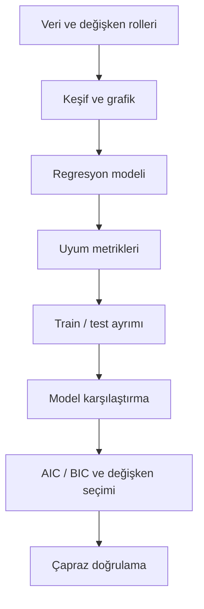

# Doğrusal İstatistik Modeller: Bütünleşik Özet

Bu yazı, doğrusal regresyon ve model değerlendirme sürecini **tek çatı altında** özetler. Yeni bir teknik konu eklenmez; veriden model seçimine uzanan hat, tablolar ve kısa kod parçalarıyla hatırlatılır.

## Uçtan uca süreç



*Sekil 1: Veri analizinden model seçimine uzanan bütünleşik akışı gösterir.*

| Aşama | Ne yapılır? | Tipik çıktı |
|-------|-------------|-------------|
| Veriyi anlama | Hedef ve açıklayıcı sütunlar belirlenir | Sütun listesi, `describe` |
| Keşif | Dağılım, ilişki, aykırı değer | Histogram, scatter |
| Model kurma | `LinearRegression` + `fit` | Katsayılar, tahmin |
| Uyum ölçme | `R2`, `RMSE`, artık grafikleri | Metrik tablosu |
| Genelleme | Train vs test karşılaştırması | Overfitting işareti |
| Formal seçim | AIC, BIC, korelasyon, feature seçimi | Seçilen model |
| Doğrulama | Cross-validation | Ortalama skor |

## Regresyon modeli

Doğrusal regresyon, hedef değişkeni bağımsız değişkenlerin doğrusal birleşimiyle tahmin eder:

`Y = b0 + b1*X1 + b2*X2 + ... + e`

- `Y`: tahmin edilen sonuç (ör. `final_exam_score`)
- `Xi`: girdiler (çalışma saati, devam oranı, …)
- `b0`, `bi`: öğrenilen katsayılar
- `e`: açıklanamayan hata

Çoklu modelde katsayı yorumu: **diğer değişkenler sabitken** ilgili değişken bir birim artınca `Y` ortalama ne kadar değişir.

## Değerlendirme metrikleri

| Metrik | Ne söyler? | Dikkat |
|--------|------------|--------|
| `R2` | Açıklanan varyans oranı | Yeni değişken ekledikçe train `R2` genelde artar |
| `RMSE` | Ortalama tahmin hatası (hedef birimi) | Düşük daha iyi |
| Train vs test | Ezber mi, genelleme mi? | Karar için test öncelikli |
| AIC / BIC | Uyum + parametre cezası | Düşük daha iyi; BIC daha sade modeli sever |

**Artık (residual):** `gerçek - tahmin`. Artıkların tahminlere karşı grafiğinde sistematik örüntü (ör. kavis) varsa model yapısı yetersiz veya yanlış olabilir.

## Model seçiminde üç soru

1. **Test performansı yeterli mi?** — Train–test tablosunda test `RMSE` / test `R2`.
2. **Daha sade model aynı işi görüyor mu?** — AIC/BIC; benzer uyumda daha az değişken.
3. **Değişkenler birbirini tekrar ediyor mu?** — Korelasyon matrisi; yüksek |r| çiftleri.

**Overfitting:** train çok iyi, test belirgin kötü.  
**Underfitting:** train ve test birlikte zayıf.

## Örnek veri: Student Performance

- Dosya: `courses/linear-statistical-models/resources/student_performance.csv`
- Hedef: `final_exam_score`

Minimum regresyon şablonu (tek hücre özeti):

```python
import pandas as pd
from sklearn.model_selection import train_test_split
from sklearn.linear_model import LinearRegression
from sklearn.metrics import r2_score, mean_squared_error

df = pd.read_csv(
    "courses/linear-statistical-models/resources/student_performance.csv"
)

numeric_cols = [
    "study_hours_per_week",
    "attendance_rate",
    "sleep_hours_per_day",
    "solved_question_count",
    "previous_term_score",
    "internet_usage_hours_per_day",
    "final_exam_score",
]
for col in numeric_cols:
    df[col] = df[col].fillna(df[col].median())

features = ["study_hours_per_week", "attendance_rate"]
X = df[features]
y = df["final_exam_score"]

X_train, X_test, y_train, y_test = train_test_split(
    X, y, test_size=0.2, random_state=42
)

model = LinearRegression()
model.fit(X_train, y_train)

print("Test R2 :", round(float(r2_score(y_test, model.predict(X_test))), 4))
print(
    "Test RMSE:",
    round(
        float(mean_squared_error(y_test, model.predict(X_test), squared=False)),
        4,
    ),
)
```

## Çapraz doğrulama

Tek bir train–test bölmesi şanslı veya şanssız bir alt kümeye denk gelebilir. **Cross-validation (çapraz doğrulama)**, veriyi birden fazla parçaya bölüp her seferinde farklı parçayı test yaparak ortalama performans üretir.

- **k-fold:** veri `k` parçaya ayrılır; her turda bir parça test, kalanı eğitim olur.
- Sonuç: `k` skorun ortalaması.

Aşağıdaki hücre, altı değişkenli bir doğrusal model için 5 katlı çapraz doğrulama skorunu üretir. `scoring="neg_mean_squared_error"` kullanıldığı için skorlar negatiftir; büyüklük karşılaştırmasında mutlak değer veya ortalama yorumlanır.

```python
import pandas as pd
import numpy as np
from sklearn.model_selection import cross_val_score
from sklearn.linear_model import LinearRegression

df = pd.read_csv(
    "courses/linear-statistical-models/resources/student_performance.csv"
)

numeric_cols = [
    "study_hours_per_week",
    "attendance_rate",
    "sleep_hours_per_day",
    "solved_question_count",
    "previous_term_score",
    "internet_usage_hours_per_day",
    "final_exam_score",
]
for col in numeric_cols:
    df[col] = df[col].fillna(df[col].median())

features = [
    "study_hours_per_week",
    "attendance_rate",
    "sleep_hours_per_day",
    "solved_question_count",
    "previous_term_score",
    "internet_usage_hours_per_day",
]

X = df[features]
y = df["final_exam_score"]

model = LinearRegression()
scores = cross_val_score(
    model, X, y, cv=5, scoring="neg_mean_squared_error"
)

print("5-fold neg_MSE skorları:", scores.round(4))
print("Ortalama:", scores.mean().round(4))
```

Çapraz doğrulama, tek bölmenin yanıltıcı olabileceği durumlarda daha istikrarlı bir performans fikri verir.

## Doğrusal olmayan ilişkiler (kavramsal)

Bazı verilerde ilişki düz çizgiyle iyi özetlenmez; polinom terimler veya `log` dönüşümü düşünülebilir. Doğrusal model yorumlanması kolay bir referanstır; esnek ama yanlış kullanılan doğrusal olmayan modeller overfitting riskini artırabilir.

## Robotik ve yapay zeka bağlantısı

| Konu | Alan karşılığı |
|------|----------------|
| Veri tipleri ve keşif | Sensör kayıtlarını anlama |
| Çoklu regresyon | Birden fazla girdiden tahmin |
| Train–test | Sahada görülmemiş veriye hazırlık |
| Feature seçimi | Gereksiz sensör kanallarını eleme |
| Cross-validation | Az veride daha güvenilir skor |

Regresyon derin öğrenmenin yerini tutmaz; veriyi ölçme, modeli değerlendirme ve seçme disiplinini taşır.

## Ölçme ve değerlendirme becerileri

Aşağıdaki beceriler bu konu kapsamıyla uyumludur:

- `R2` / `RMSE` tablosunu yorumlamak
- Train iyi, test kötü senaryosunda overfitting tanımlamak
- AIC/BIC tablosundan model seçmek ve gerekçe yazmak
- Korelasyon matrisinde şüpheli çifti işaret etmek
- Hazır regresyon şablonunda `features` değiştirip çıktı okumak

Fonksiyon yazma veya AIC formülünü ezberleme zorunlu değildir.

## Kapanış

Doğrusal istatistik modeller süreci şu zincirle özetlenir:

**Veriyi tanı → grafiği incele → modeli kur → metrik ve artıkla uyumu ölç → train–test ile genellemeyi kontrol et → AIC/BIC ve değişken seçimiyle sade modeli belirle → gerektiğinde çapraz doğrulama ile doğrula.**

Bu özet, veri temelli tahmin ve model seçimi için temel bir çerçeve sunar. İleri konular (sınıflandırma, derin öğrenme, zaman serisi) ayrı çalışma alanlarıdır.
