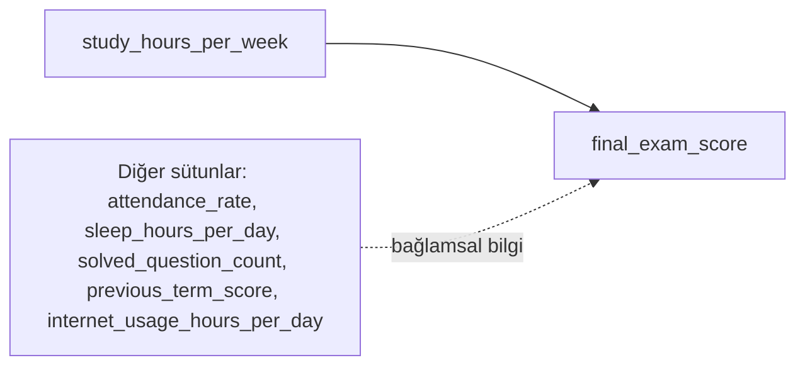

# Basit Doğrusal Regresyon ile Tahmin

Regresyon, sayısal bir sonucu başka değişkenler üzerinden tahmin etmeye yarayan bir modelleme yaklaşımıdır. Basit doğrusal regresyon ise bu yaklaşımın en temel halidir: tek bir bağımsız değişken ile tek bir bağımlı değişken arasındaki doğrusal ilişkiyi modellemeyi amaçlar.

Bu makalede, tek değişkenli model mantığını **Student Performance** veri seti üzerinden kuracağız. Hedef değişken `final_exam_score`, bağımsız değişken ise `study_hours_per_week` olacaktır.

## Veri seti: Student Performance

- Veri seti adı: **Student Performance**
- Dosya: `student_performance.csv`
- Konum: `courses/linear-statistical-models/resources/student_performance.csv`
- Sütunların tam açıklaması: `courses/linear-statistical-models/resources/article-student_performance-description.md`

## Veri kümesi diyagramı




Bu makalede tek değişkenli bir kurgu vardır. Yani `final_exam_score` yalnızca `study_hours_per_week` ile tahmin edilir. Veri setindeki diğer sütunlar daha sonra çoklu modelde kullanılmak üzere tutulur.

## Model fikri

Doğrusal model şu formülle yazılır:

`Y = b0 + b1*X + e`

Bu formülde:

- `Y`: Tahmin etmek istediğimiz değer (`final_exam_score`)
- `X`: Bağımsız değişken (`study_hours_per_week`)
- `b0`: Sabit terim (intercept)
- `b1`: Eğimi temsil eden katsayı
- `e`: Modelin açıklayamadığı kısım (hata payı)

Bu model, gözlenen ilişkiyi tek bir doğru ile özetler. `b1` pozitifse çalışma saati arttıkça not artma eğilimi beklenir; negatifse tersi yorumlanır.

## En küçük kareler: çizgi nasıl seçilir?

Her gözlem için bir hata oluşur:

- `e_k = y_k - ŷ_k`
- Burada `y_k` gerçek değer, `ŷ_k` modelin tahmin ettiği değerdir.
- `e_k`, `k` numaralı gözlemin artığını (residual) ifade eder.

**EKK (En Küçük Kareler)**, model doğrusunu seçerken bu artıkların kareleri toplamını en aza indirir:

`min Σ(e_k^2)`

EKK'nin neden gerekli olduğu:

- Artılar ve eksiler birbirini götürmesin diye hata kareye alınır.
- Büyük hatalar kare nedeniyle daha fazla cezalandırılır.
- Böylece model, tüm gözlemler için genel hatayı en düşük yapan `b0` ve `b1` katsayılarını bulur.

Buradaki arama mantığı şu şekildedir:

- Her aday doğru, bir `b0` (kesişim) ve bir `b1` (eğim) değeriyle tanımlanır.
- `b0` ve `b1` reel sayılar olduğu için olası doğru sayısı sonlu değildir; teorik olarak sonsuzdur.
- EKK, bu sonsuz adaylar içinde `Σ(e_k^2)` değerini en küçük yapan doğruyu seçer.
- **Bu minimizasyon hesaplaması tek tek tüm doğruları denemekle değil, türev temelli optimizasyon ile analitik olarak çözülür.**

Pratik karşılığı:

- Tüm noktalar doğrunun üstünde olmaz; belirli bir sapma her zaman vardır.
- Model, bu sapmaları mümkün olduğunca küçük tutan en uygun doğruyu bulur.

## Örnek akış: `student_performance.csv`

İlk adımda veriyi yükleyip yapısını kontrol ediyoruz. Amaç, model kurmadan önce veri tiplerini ve eksik değer durumunu netleştirmektir.

```python
import pandas as pd
import numpy as np

df = pd.read_csv(
    "courses/linear-statistical-models/resources/student_performance.csv"
)
print(df.head(3))
print(df.info())
```

Gerçek veri setlerinde anket, kayıt veya ölçüm eksikliği nedeniyle boş hücreler sık görülür. Önce hangi sütunda kaç eksik olduğu sayılır; ardından model türüne göre satır çıkarma veya doldurma uygulanır.

```python
print(df.isnull().sum())
```

Bu örnekte basit regresyon için `final_exam_score` (hedef) ve `study_hours_per_week` (girdi) kullanılacaktır. Hedefi olmayan satırlar gözetimli öğrenmede kullanılamaz; bu satırlar çıkarılır. `study_hours_per_week` eksikse, kalan veriye göre medyan ile doldurulur (basit ve yaygın bir yaklaşımdır).

```python
df_model = df.dropna(subset=["final_exam_score"]).copy()
median_study = df_model["study_hours_per_week"].median()
df_model["study_hours_per_week"] = df_model["study_hours_per_week"].fillna(median_study)
```

Veri, modelin hiç görmediği bir bölümle ölçülebilmesi için eğitim ve test olarak ayrılır. Bu örnekte oran **%80 eğitim** ve **%20 test** olacak şekilde `train_test_split` kullanılır. Model yalnızca eğitim kümesinde `fit` edilir; `R2` ve `RMSE` hem eğitim hem test için raporlanır; genel performans için **test metrikleri** esas alınır.

```python
from sklearn.model_selection import train_test_split
from sklearn.linear_model import LinearRegression
from sklearn.metrics import r2_score, mean_squared_error

# Girdi (X) ve hedef (y): basit regresyonda tek sütunlu X iki boyutlu olmalı
X = df_model[["study_hours_per_week"]]
y = df_model["final_exam_score"]

# Veriyi karıştırıp %80 eğitim, %20 test ayırır; random_state tekrarlanabilirlik için
X_train, X_test, y_train, y_test = train_test_split(
    X, y, test_size=0.2, random_state=42
)

# Doğrusal model: katsayılar yalnızca eğitim verisinden öğrenilir
model = LinearRegression()
model.fit(X_train, y_train)

# Öğrenilen model hem eğitim hem test girdileri için tahmin üretir
y_pred_train = model.predict(X_train)
y_pred_test = model.predict(X_test)

print("b1 (eğim):", float(model.coef_[0]))
print("b0 (sabit):", float(model.intercept_))
print("Train R2:", float(r2_score(y_train, y_pred_train)))
print("Test R2 :", float(r2_score(y_test, y_pred_test)))
print("Train RMSE:", float(mean_squared_error(y_train, y_pred_train, squared=False)))
print("Test RMSE :", float(mean_squared_error(y_test, y_pred_test, squared=False)))
```

## Metriklerin anlamı: R2 ve RMSE

- `R2` (R-squared, belirlilik katsayısı): `final_exam_score` değişiminin ne kadarının model tarafından açıklandığını gösterir.
- `RMSE` (Root Mean Squared Error): Tahminlerin gerçek değerden ortalama olarak kaç puan saptığını gösterir.

Eğitim ve test ayrımı sonrası:

- **Eğitim metrikleri**, modelin öğrendiği veriye ne kadar uyduğunu gösterir; bazen iyimser çıkabilir.
- **Test metrikleri**, modelin yeni gözlemlerdeki davranışına daha yakın bir resim verir.

Örnek yorum:

- `Test R2 = 0.70` ise, test kümesindeki not değişiminin yaklaşık `%70`'i modelle açıklanıyor demektir.
- `Test RMSE = 5.0` ise, testte tahminler tipik olarak yaklaşık `5` puan sapıyor diye okunur.

Kısa değerlendirme çerçevesi:

- `R2` değeri `1`'e yaklaştıkça açıklama gücü artar.
- `RMSE` değeri `0`'a yaklaştıkça tahmin hatası azalır.
- Eğitim çok iyi, test belirgin kötüyse aşırı uyum (overfitting) düşünülmelidir.

## Doğrunun görselleştirilmesi

Aşağıdaki grafik, tüm temizlenmiş gözlemleri ve eğitimle öğrenilen regresyon doğrusunu birlikte gösterir. İlişkinin yönü ve saçılma düzeyi görsel olarak değerlendirilir.

```python
import matplotlib.pyplot as plt
import seaborn as sns

x_min = df_model["study_hours_per_week"].min()
x_max = df_model["study_hours_per_week"].max()
x_grid = np.linspace(x_min, x_max, 100).reshape(-1, 1)
y_grid = model.predict(x_grid)

plt.figure(figsize=(7, 5))
sns.scatterplot(data=df_model, x="study_hours_per_week", y="final_exam_score", alpha=0.7)
plt.plot(x_grid, y_grid, color="red", linewidth=2)
plt.title("Basit Doğrusal Regresyon Doğrusu")
plt.xlabel("study_hours_per_week")
plt.ylabel("final_exam_score")
plt.show()
```

Grafiğin değerlendirilmesi:

- Noktalar doğru etrafında geniş bir alana yayılıyorsa hata düzeyi görece yüksektir.
- Noktalar doğruya yakın kümeleniyorsa modelin tek değişkenle yakaladığı ilişki daha güçlüdür.
- Regresyon doğrusu, gözlenen dağılımın ortalama eğilimini temsil eder; tüm gözlemleri birebir açıklaması beklenmez.

## Model sapmalarının görselleştirilmesi (Residual Analysis)

Modelin nerede hata yaptığını görmek için residual grafikleri kullanılır. Değerlendirme için **test kümesi** üzerindeki tahmin ve artıklar kullanılır; böylece grafik, eğitimde ezberlenmiş noktalara bağlı kalmaz.

```python
import matplotlib.pyplot as plt
import seaborn as sns

residuals_test = y_test - y_pred_test

# 1) Residual vs Tahmin (test)
plt.figure(figsize=(7, 4))
sns.scatterplot(x=y_pred_test, y=residuals_test, alpha=0.7)
plt.axhline(0, color="red", linestyle="--", linewidth=1.5)
plt.title("Residuals vs Predicted (test)")
plt.xlabel("Predicted final_exam_score")
plt.ylabel("Residual (y - y_pred)")
plt.show()

# 2) Test residual dağılımı
plt.figure(figsize=(7, 4))
sns.histplot(residuals_test, kde=True, bins=20)
plt.title("Residual Distribution (test)")
plt.xlabel("Residual")
plt.ylabel("Count")
plt.show()
```

Bu grafikler nasıl yorumlanır:

- Residual noktaları `0` çizgisi çevresinde rastgele dağılıyorsa doğrusal model varsayımı daha makul kabul edilir.
- Belirgin eğri/desen varsa model ilişkiyi tam yakalayamıyor olabilir.
- Residual dağılımı aşırı çarpık veya çok genişse hata yapısı yeniden incelenmelidir.

## Bu makale için çıkarım

Tek değişkenli model, çalışma saatinin notla ilişkisini görmek için güçlü bir başlangıçtır. Ancak notu etkileyen tek faktör çalışma süresi değildir. Bu nedenle modelin açıklama gücü sınırlı kalabilir.

Bir sonraki adımda, aynı veri setindeki diğer değişkenleri de modele ekleyerek çoklu doğrusal regresyon kurulmalıdır. Böylece daha gerçekçi ve daha dengeli tahminler elde edilir.


**Detay notu (EKK çözümü nasıl bulunur):** Basit doğrusal regresyonda amaç fonksiyonu `S(b0, b1) = Σ(y_k - (b0 + b1*x_k))^2` olarak yazılır. Burada `b0` ve `b1` bilinmeyendir; veri noktaları (`x_k`, `y_k`) sabittir. EKK, bu fonksiyonun minimumunu arar. Bunun için `∂S/∂b0 = 0` ve `∂S/∂b1 = 0` koşulları kurulur. Bu iki koşul, iki bilinmeyenli bir denklem sistemine (normal denklemler) dönüşür ve çözülerek en iyi `b0` ile `b1` elde edilir. Sonuçta bulunan doğru, kare hatalar toplamını en küçük yapan tek aday doğrudur; yani modelin “en iyi uyum” doğrusudur.