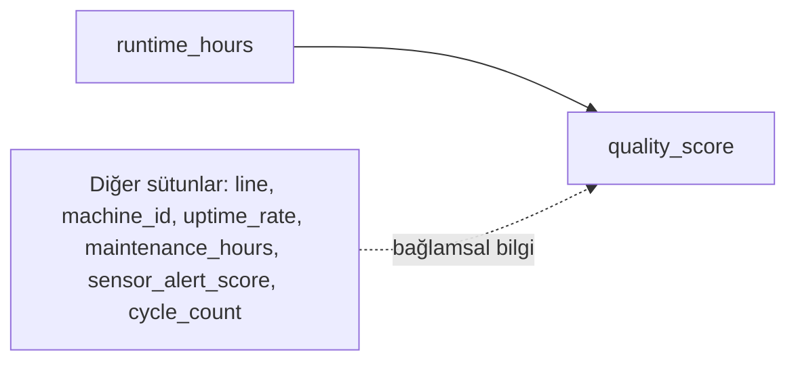

# Basit Doğrusal Regresyon ile Tahmin

Regresyon, bir hedef değişkenin sayısal değerini diğer değişkenleri kullanarak tahmin etmeye yarayan istatistiksel bir modelleme yaklaşımıdır. Basit doğrusal regresyon bu yaklaşımın en temel halidir: tek bir bağımsız değişken ile tek bir bağımlı değişken arasındaki doğrusal ilişkiyi modellemeyi amaçlar.

Bu yöntem, özellikle "tek bir değişken sonuç üzerinde nasıl bir eğilim oluşturuyor?" sorusunu yanıtlamak için kullanılır. Bu makalede `runtime_hours` değişkeninden `quality_score` değerini tahmin ederek temel mantığı adım adım inceleyeceğiz.

## Veri kümesi diyagramı



Bu makalede odaklanan model tek değişkenlidir. Yani `quality_score` için yalnızca `runtime_hours` kullanılır. Diğer sütunlar veri setinin üretim bağlamını anlamaya yardımcı olur, ancak bu örnekte modele dahil edilmez.

## Model fikri

Doğrusal model şu formülle yazılır:

`Y = b0 + b1*X + e`

Bu formülde:
- `Y`: Tahmin etmek istediğimiz değer (`quality_score`)
- `X`: Bağımsız değişken (`runtime_hours`)
- `b0`: Sabit terim (intercept)
- `b1`: Eğimi temsil eden katsayı
- `e`: Modelin açıklayamadığı kısım (hata payı)

Bu model, gözlenen veriyi tek bir doğru ile özetler. `b1` katsayısı pozitifse `runtime_hours` arttıkça `quality_score` artma eğilimi gösterir; negatifse azalma eğilimi görülür.

## En küçük kareler: çizgi nasıl seçilir?

Her gözlem noktası model doğrusunun üzerinde veya altında kalır. Bu farklara artık (residual) denir. Basit doğrusal regresyon, artıkların kareleri toplamını en aza indiren `b0` ve `b1` katsayılarını seçer.

Pratik karşılığı:
- Tüm noktalar doğrunun üstünde olmaz; belirli bir sapma her zaman vardır.
- Model, bu sapmaları mümkün olduğunca küçük tutan en uygun doğruyu bulur.

## Örnek akış: `factory_quality_regression.csv`

İlk adımda veriyi yükleyip yapısını kontrol ediyoruz. Amaç, model kurmadan önce veri tiplerini ve eksik değer durumunu netleştirmektir.

```python
import pandas as pd
import numpy as np

df = pd.read_csv("data/factory_quality_regression.csv")
print(df.head(3))
print(df.info())
```

Eksik değer varsa sayısal sütunlarda medyan ile dolduruyoruz. Medyan, aykırı değerlere ortalamaya göre daha dayanıklıdır.

```python
numeric_columns = [
    "sensor_alert_score",
    "uptime_rate",
    "maintenance_hours",
    "cycle_count",
    "quality_score",
    "runtime_hours",
]

for col in numeric_columns:
    df[col] = df[col].fillna(df[col].median())
```

Model kurulumunda `X` mutlaka iki boyutlu verilmelidir. Bu nedenle tek sütun kullanılsa bile `df[["runtime_hours"]]` biçimi tercih edilir.

```python
from sklearn.linear_model import LinearRegression
from sklearn.metrics import r2_score, mean_squared_error

# Girdi (bağımsız değişken)
X = df[["runtime_hours"]]

# Hedef (bağımlı değişken)
y = df["quality_score"]

# Modeli oluştur ve eğit
model = LinearRegression()
model.fit(X, y)

# Eğitim verisi üzerinde tahmin üret
y_pred = model.predict(X)

# Artıklar (residual): gerçek - tahmin
residuals = y - y_pred

# Katsayılar ve temel metrikler
print("b1 (eğim):", float(model.coef_[0]))
print("b0 (sabit):", float(model.intercept_))
print("R2:", float(r2_score(y, y_pred)))
print("RMSE:", float(mean_squared_error(y, y_pred, squared=False)))
```

## Metriklerin anlamı: R2 ve RMSE

- `R2` (R-squared, belirlilik katsayısı): `quality_score` değişiminin ne kadarının model tarafından açıklandığını gösterir.
- `RMSE` (Root Mean Squared Error, Kök Ortalama Kare Hata): Tahminlerin gerçek değerden ortalama olarak kaç puan saptığını gösterir.

Örnek yorum:
- `R2 = 0.70` ise, değişimin yaklaşık `%70`'i modelle açıklanıyor demektir.
- `RMSE = 5.0` ise, tahminler tipik olarak yaklaşık `5` puan hata yapıyor diye okunur.

Kısa değerlendirme çerçevesi:
- `R2` değeri `1`'e yaklaştıkça modelin açıklama gücü artar.
- `RMSE` değeri `0`'a yaklaştıkça tahmin hatası azalır.

Önemli not: Bu metrikler eğitim verisi üzerinde hesaplandığı için iyimser olabilir. Model performansını daha gerçekçi değerlendirmek için eğitim/test ayrımı yapılmalıdır.

## Doğrunun görselleştirilmesi

Aşağıdaki grafik, gözlemleri ve modelin ürettiği regresyon doğrusunu birlikte gösterir. Böylece ilişkinin yönü ve saçılma düzeyi görsel olarak değerlendirilir.

```python
import matplotlib.pyplot as plt
import seaborn as sns

x_min = df["runtime_hours"].min()
x_max = df["runtime_hours"].max()
x_grid = np.linspace(x_min, x_max, 100).reshape(-1, 1)
y_grid = model.predict(x_grid)

plt.figure(figsize=(7, 5))
sns.scatterplot(data=df, x="runtime_hours", y="quality_score", alpha=0.7)
plt.plot(x_grid, y_grid, color="red", linewidth=2)
plt.title("Basit Doğrusal Regresyon Doğrusu")
plt.xlabel("runtime_hours")
plt.ylabel("quality_score")
plt.show()
```

Grafiğin değerlendirilmesi:
- Noktalar doğru etrafında geniş bir alana yayılıyorsa hata düzeyi görece yüksektir.
- Noktalar doğruya yakın kümeleniyorsa modelin tek değişkenle yakaladığı ilişki daha güçlüdür.
- Regresyon doğrusu, gözlenen dağılımın ortalama eğilimini temsil eder; tüm gözlemleri birebir açıklaması beklenmez.

## Model sapmalarının görselleştirilmesi (Residual Analysis)

Modelin nerede hata yaptığını görmek için residual grafikleri kullanılır. Amaç, hataların rastgele mi dağıldığını yoksa belirli bir desen mi oluşturduğunu incelemektir.

```python
import matplotlib.pyplot as plt
import seaborn as sns

# 1) Residual vs Tahmin grafiği
plt.figure(figsize=(7, 4))
sns.scatterplot(x=y_pred, y=residuals, alpha=0.7)
plt.axhline(0, color="red", linestyle="--", linewidth=1.5)
plt.title("Residuals vs Predicted")
plt.xlabel("Predicted quality_score")
plt.ylabel("Residual (y - y_pred)")
plt.show()

# 2) Residual dağılımı
plt.figure(figsize=(7, 4))
sns.histplot(residuals, kde=True, bins=20)
plt.title("Residual Distribution")
plt.xlabel("Residual")
plt.ylabel("Count")
plt.show()
```

Bu grafikler nasıl yorumlanır:
- Residual noktaları `0` çizgisi çevresinde rastgele dağılıyorsa doğrusal model varsayımı daha makul kabul edilir.
- Belirgin eğri/desen varsa model ilişkiyi tam yakalayamıyor olabilir.
- Residual dağılımı aşırı çarpık veya çok genişse hata yapısı yeniden incelenmelidir.

## Bu veri seti için grafiklerin yorumu

Bu makaledeki örnek çalışmada elde edilen residual grafiklerine göre öne çıkan bulgular şunlardır:

- `Residuals vs Predicted` grafiğinde noktalar genel olarak `0` çizgisi etrafına dağılmaktadır. Bu görünüm, tek değişkenli doğrusal modelin temel eğilimi yakaladığını gösterir.
- Belirgin, keskin bir U-eğrisi veya sistematik dalga deseni görünmediği için güçlü bir doğrusal olmayan yapı sinyali gözlenmemektedir.
- Tahmin değeri yükseldikçe residual yayılımında kısmi artış işareti vardır. Bu durum, üst aralıklarda hata varyansının bir miktar büyüyebileceğini düşündürür.
- `Residual Distribution` grafiği yaklaşık çan eğrisi formundadır; ancak sağ kuyruk tarafında sınırlı bir uzama bulunur. Bu görünüm, hataların tamamen simetrik olmadığını fakat aşırı bir bozulma da içermediğini gösterir.

Uygulama açısından değerlendirme:
- Bu veri setinde basit doğrusal regresyon başlangıç seviyesi bir model olarak kullanılabilir.
- Daha güvenilir sonuç için aynı analizi eğitim/test ayrımı ile tekrarlamak ve metrikleri test setinde raporlamak gerekir.
- Üst tahmin aralığında hata artışı devam ederse çoklu regresyon, dönüşüm (ör. log) veya robust regresyon alternatifleri değerlendirilebilir.
