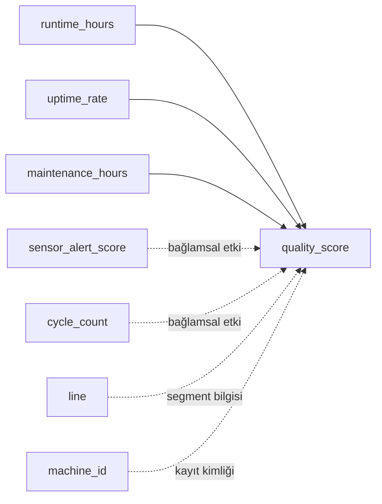

# Çoklu Doğrusal Regresyon ile Tahmin

Regresyon, bir hedef değişkenin sayısal değerini diğer değişkenleri kullanarak tahmin etmeye yarayan istatistiksel bir modelleme yaklaşımıdır. Temel amaç yalnızca tahmin üretmek değil, aynı zamanda hangi değişkenin sonuç üzerinde nasıl bir etkisi olduğunu da yorumlayabilmektir.

Çoklu doğrusal regresyon ise bu yaklaşımın birden fazla girdiyle çalışan halidir. Yani tek bir değişkene bakmak yerine, bir sonucu aynı anda etkileyen birden çok faktörü birlikte modele dahil eder. Bu sayede gerçek sistemlerde daha anlamlı ve daha dengeli tahminler elde edilir.

Pratikte çoklu doğrusal regresyon; kalite tahmini, maliyet öngörüsü, talep planlama veya performans analizi gibi birçok problemde kullanılır. Bu makaledeki örnekte de üretim hattı ölçümlerinden `quality_score` değerini tahmin ederek bu yaklaşımın temel mantığını adım adım göreceğiz.

## Veri kümesi diyagramı



Bu makalede odaklandığımız hedef değişken `quality_score` değeridir. Modelin ana girdileri `runtime_hours`, `uptime_rate` ve `maintenance_hours` sütunlarıdır; diğer alanlar veri setinin üretim bağlamını anlamaya yardımcı olur. Böylece “kalite” ifadesinin hangi ölçümlerden beslendiği baştan netleşir.

Basit doğrusal regresyon, tek bir girdi değişkeniyle çıktı tahmini yapar. Gerçek dünyada ise bir sonucu aynı anda birden fazla etken belirler. Örneğin üretim kalitesi; çalışma süresi, sistemin erişilebilirliği ve bakım yoğunluğu gibi değişkenlerden birlikte etkilenir.

Çoklu doğrusal regresyon tam olarak bu noktada kullanılır: Birden fazla girdiyi aynı modelde birleştirerek hedef değişkeni tahmin eder. Bu makalede `quality_score` (kalite skoru) hedefini, `runtime_hours` (çalışma süresi), `uptime_rate` (kullanılabilirlik oranı) ve `maintenance_hours` (bakım süresi) ile modelleyeceğiz.

## Model fikri

Çoklu doğrusal regresyon şu formülle yazılır:

`Y = b0 + b1*X1 + b2*X2 + ... + bp*Xp + e`

Bu formülde:
- `Y`: Bağımlı değişken, yani tahmin etmek istediğimiz değer (`quality_score`).
- `X1, X2, ..., Xp`: Bağımsız değişkenler (bu makalede `runtime_hours`, `uptime_rate`, `maintenance_hours`).
- `b0`: Sabit terim (intercept).
- `b1, b2, ..., bp`: Her bağımsız değişkenin etkisini taşıyan katsayılar.
- `e`: Modelin açıklayamadığı kısım (hata payı).

Temel yorum kuralı şudur:

- `bj` değeri; ilgili `Xj` bir birim arttığında **diğer girdiler sabitken** `Y` değerinin ortalama olarak ne kadar değiştiğini özetler.

## Örnek akış: `factory_quality_regression.csv`

İlk adımda veriyi yükleyip yapısını hızlıca kontrol ediyoruz. Bu kontrol, eksik değer ve veri tipi problemlerini model kurmadan önce görmemizi sağlar.

```python
import pandas as pd

df = pd.read_csv("data/factory_quality_regression.csv")
print(df.head(3))
print(df.info())
```

Bu noktada özellikle sayısal sütunlarda eksik değer olup olmadığına bakılır. Eksik değer varsa, örnekte medyanla dolduruyoruz. Medyan, aykırı değerlere ortalamadan daha dayanıklı bir seçimdir.

```python
numeric_columns = [
    "sensor_alert_score",
    "uptime_rate",
    "maintenance_hours",
    "cycle_count",
    "quality_score",
    "runtime_hours",
]

for col in numeric_columns:
    df[col] = df[col].fillna(df[col].median())
```

Sonraki adımda modelde kullanılacak girişleri (`X`) ve hedefi (`y`) ayırıyoruz. Burada sadece üç değişkeni bilinçli olarak seçiyoruz; amaç, çoklu regresyon mantığını temel düzeyde net görmek.

```python
from sklearn.linear_model import LinearRegression
from sklearn.metrics import r2_score, mean_squared_error

# Girdi değişkenleri
features = ["runtime_hours", "uptime_rate", "maintenance_hours"]
X = df[features]

# Hedef değişken
y = df["quality_score"]

# Modeli oluştur ve eğit
model = LinearRegression()
model.fit(X, y)

# Eğitim verisi üzerinde tahmin üret
y_pred = model.predict(X)

# Hızlı performans kontrolü
print("R2:", float(r2_score(y, y_pred)))
print("RMSE:", float(mean_squared_error(y, y_pred, squared=False)))
```

Buradaki metriklerin kısa anlamı:
- `R2` (belirlilik katsayısı), `quality_score` değerlerindeki dalgalanmanın ne kadarını modelin açıkladığını gösterir.
- `RMSE` (kök ortalama kare hata), model tahminlerinin gerçek `quality_score` değerlerinden ortalama olarak kaç puan saptığını gösterir.

Daha somut düşünelim:
- `R2 = 0.78` ise, `quality_score` değişiminin yaklaşık `%78`'i modeldeki girdilerle açıklanıyor, `%22`'si model dışında kalıyor demektir.
- `RMSE = 4.2` ise, model tahminleri gerçek değerden tipik olarak yaklaşık `4.2` puan sapıyor diye okunabilir.

Kısa değerlendirme çerçevesi:
- `R2` için: `1`'e yaklaştıkça açıklama gücü artar, `0`'a yaklaştıkça düşer.
- `RMSE` için: `0`'a yaklaştıkça hata azalır; daha düşük değer daha iyidir.

Önemli not: Bu metrikler eğitim verisi üzerinde hesaplandığı için genellikle iyimser çıkar. Gerçek performansı görmek için eğitim/test ayrımı yapıp aynı metrikleri test setinde hesaplamak gerekir.

## Katsayılar nasıl okunur?

Katsayıların sayısal karşılığını daha görünür hale getirelim:

```python
import pandas as pd

coef_df = pd.DataFrame({
    "feature": features,
    "coefficient": model.coef_,
}).sort_values("coefficient", ascending=False)

print("beta0 (sabit):", float(model.intercept_))
coef_df
```

Katsayıların değerlendirilmesi:
- Katsayısı pozitifse: ilgili özellik artarken kalite skoru ortalama olarak artar (diğerleri sabit kabulüyle).
- Katsayısı negatifse: ilgili özellik artarken kalite skoru ortalama olarak azalır.
- Katsayının mutlak değeri büyüdükçe, ilgili değişkenin model üzerindeki doğrusal etkisi daha güçlü kabul edilir (ölçek farklarını dikkate almak şartıyla).

Not: `uptime_rate` ve `maintenance_hours` gibi değişkenler birlikte hareket edebilir. Bu duruma çoklu doğrusal regresyon bağlamında **çoklu bağlantı (multicollinearity)** denir. Çoklu bağlantı yükseldiğinde katsayıların istatistiksel yorumu daha hassas hale gelir; bu nedenle sonuçların korelasyon analizi ve keşif grafikleri ile birlikte değerlendirilmesi önerilir.

## Basit bir tahmin örneği

Elinizde yeni bir durum için ölçümler varsa:

```python
new_row = pd.DataFrame([{
    "runtime_hours": 9.0,
    "uptime_rate": 86.0,
    "maintenance_hours": 6.5,
}])

pred = model.predict(new_row)
print("Tahmin edilen quality_score:", float(pred[0]))
```

Bu aşamada dikkat edilmesi gereken temel nokta şudur: `new_row` içinde kullanılan sütun adları, eğitimde tanımlanan `features` listesiyle birebir aynı olmalıdır. Sıra veya adlandırma uyuşmazlığında model hatalı sonuç üretebilir ya da doğrudan hata verebilir.

## Uyarılar ve iyi uygulama notları

Model doğrusal olduğu için aşağıdaki risklere dikkat etmek gerekir:
- Gerçek ilişki doğrusal değilse tahmin hatası artabilir.
- Aykırı gözlemler (outlier), katsayıları beklenenden fazla etkileyebilir.
- Eğitim ve değerlendirmeyi aynı veri üzerinde yapmak yanıltıcı sonuç verebilir; mümkünse eğitim/test ayrımı yapılmalıdır.

Bu nedenle çoklu doğrusal regresyonu tek başına katsayı çıktısı olarak değil; grafik yorumları, değişken dağılımları ve hata metrikleriyle birlikte ele almak daha güvenilir bir yaklaşımdır.

