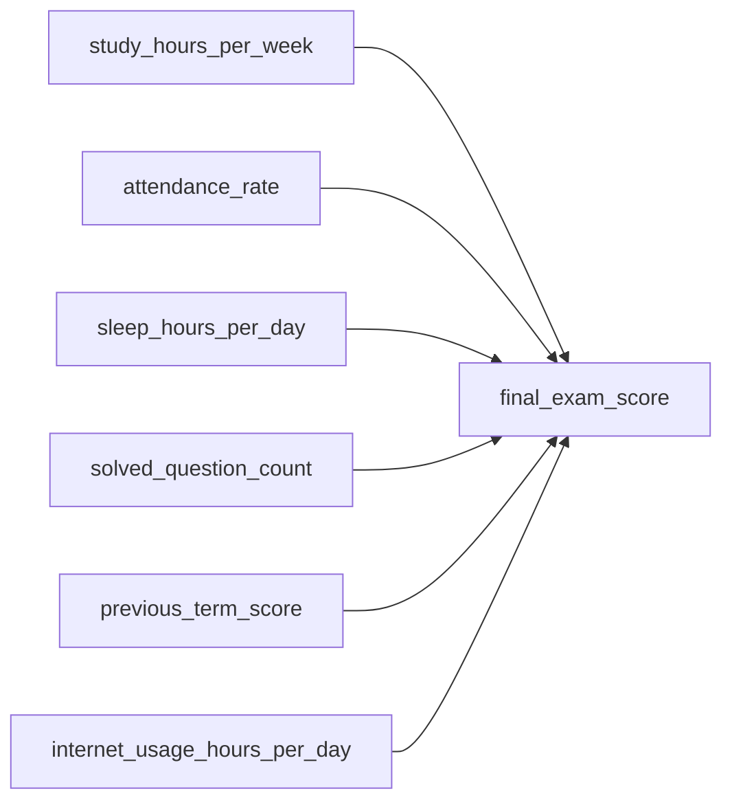

# Çoklu Doğrusal Regresyon ile Tahmin

Basit doğrusal regresyonda hedef değişken tek bir girdiye göre tahmin edilir. Gerçek hayatta ise sonuçlar çoğunlukla birden fazla etkene bağlıdır. Çoklu doğrusal regresyon, bu çok etkenli yapıyı tek model içinde ele alır.

Bu makalede hedef, öğrencilerin dönem sonu notu olan `final_exam_score` değerini birden fazla değişkenle tahmin etmektir.

## Veri seti: Student Performance

- Veri seti adı: **Student Performance**
- Dosya: `student_performance.csv`
- Konum: `courses/linear-statistical-models/resources/student_performance.csv`
- Sütunların tam açıklaması: `courses/linear-statistical-models/resources/article-student_performance-description.md`

## Problem bağlamı

Bir öğrencinin sınav notu yalnızca çalışma saatinden etkilenmez. Devam oranı, önceki dönem başarısı, uyku düzeni ve dönem boyunca çözülen soru sayısı da başarı üzerinde etkili olabilir. Bu nedenle tek değişkenli bir model çoğu durumda yetersiz kalır.

Bu veri seti aşağıdaki soruyu modellemek için uygundur:

**Bir öğrencinin dönem sonu notu, çalışma ve alışkanlık verileri birlikte kullanılarak tahmin edilebilir mi?**

## Veri kümesi yapısı



Modelde hedef değişken `final_exam_score` olur. Diğer sütunlar modelin açıklayıcı değişkenleridir.

- `study_hours_per_week`: Haftalık çalışma süresi
- `attendance_rate`: Derse devam oranı
- `sleep_hours_per_day`: Ortalama uyku süresi
- `solved_question_count`: Dönem boyunca çözülen soru adedi
- `previous_term_score`: Önceki dönem notu
- `internet_usage_hours_per_day`: Günlük ders dışı internet kullanımı

## Çoklu doğrusal regresyonun matematiksel fikri

Model genel olarak şu şekilde yazılır:

`Y = b0 + b1*X1 + b2*X2 + ... + bp*Xp + e`

- `Y`: Tahmin edilmek istenen değer (`final_exam_score`)
- `X1 ... Xp`: Girdi değişkenleri
- `b0`: Sabit terim (intercept)
- `b1 ... bp`: Her değişkenin etkisini gösteren katsayılar
- `e`: Modelin açıklayamadığı hata terimi

Temel yorum kuralı:

- Bir katsayı, ilgili değişken bir birim arttığında (diğer değişkenler sabitken) tahmin edilen notun ortalama ne kadar değiştiğini ifade eder.

## Adım adım model kurma

### 1) Veriyi yükleme ve ilk kontrol

```python
import pandas as pd

df = pd.read_csv(
    "courses/linear-statistical-models/resources/student_performance.csv"
)

print(df.head())
print(df.info())
print(df.describe().T)
```

Bu aşamada amaç:

- Sütun tiplerini doğrulamak
- Beklenmeyen boş değer olup olmadığını görmek
- Sayısal aralıkların gerçekçi olup olmadığını kontrol etmek

### 2) Eksik değerler

`LinearRegression` eksik değer kabul etmez. Bu veri setinde bazı hücreler bilinçli olarak boş bırakılmıştır. Sayısal sütunlarda yaygın bir yöntem, eksikleri o sütunun medyanı ile doldurmaktır (basit ve hızlı bir taban çözümdür).

```python
print(df.isnull().sum())

numeric_cols = [
    "study_hours_per_week",
    "attendance_rate",
    "sleep_hours_per_day",
    "solved_question_count",
    "previous_term_score",
    "internet_usage_hours_per_day",
    "final_exam_score",
]

for col in numeric_cols:
    df[col] = df[col].fillna(df[col].median())
```

Hedef değişkende de eksik satır kalmışsa, medyan ile doldurma istatistiksel olarak tartışmalıdır; alternatif olarak bu satırlar çıkarılabilir. Bu örnekte tek tip bir iş akışı için medyan doldurma kullanılmıştır.

### 3) Girdi ve hedef ayrımı

```python
features = [
    "study_hours_per_week",
    "attendance_rate",
    "sleep_hours_per_day",
    "solved_question_count",
    "previous_term_score",
    "internet_usage_hours_per_day",
]

X = df[features]
y = df["final_exam_score"]
```

Burada model, notu etkileyebilecek tüm sütunları birlikte kullanır. Bu yaklaşım, tek bir değişkene odaklanmaktan daha dengeli sonuç üretir.

### 4) Eğitim ve test ayrımı (%80 / %20)

Veri rastgele ikiye bölünür: **%80 eğitim**, **%20 test**. Model yalnızca eğitim kümesinde `fit` edilir; başarı ölçümü hem eğitim hem test üzerinde yapılır; genel performans için **test metrikleri** önceliklidir.

```python
from sklearn.model_selection import train_test_split

# Aynı satırlar X ve y'de eşleşir; %20 test, %80 eğitim; random_state sonuçları sabitler
X_train, X_test, y_train, y_test = train_test_split(
    X, y, test_size=0.2, random_state=42
)
```

### 5) Modeli eğitme

```python
from sklearn.linear_model import LinearRegression

# Sadece eğitim kümesi kullanılır; test bu aşamada modele verilmez
model = LinearRegression()
model.fit(X_train, y_train)
```

Bu işlem sonrası model, her sütun için bir katsayı öğrenir ve eğitim verisindeki doğrusal ilişkiyi temsil eder.

### 6) Eğitim ve test performansı

```python
from sklearn.metrics import r2_score, mean_squared_error

# Eğitim: modelin öğrendiği veriye uyumu; Test: genelleme kabiliyeti için daha kritik
y_pred_train = model.predict(X_train)
y_pred_test = model.predict(X_test)

print("Train R2:", round(float(r2_score(y_train, y_pred_train)), 4))
print("Test R2 :", round(float(r2_score(y_test, y_pred_test)), 4))
print(
    "Train RMSE:",
    round(float(mean_squared_error(y_train, y_pred_train, squared=False)), 4),
)
print(
    "Test RMSE :",
    round(float(mean_squared_error(y_test, y_pred_test, squared=False)), 4),
)
```

Metriklerin anlamı:

- `R2`: İlgilenilen kümede nottaki değişimin ne kadarının model tarafından açıklandığını gösterir.
- `RMSE`: Tahminlerin gerçek nottan ortalama sapma büyüklüğünü puan cinsinden verir.

Pratik yorum:

- `R2` değeri yükseldikçe açıklama gücü artar.
- `RMSE` değeri düştükçe tahmin hatası azalır.
- Eğitim metrikleri testten belirgin iyiyse aşırı uyum (overfitting) riski değerlendirilmelidir.

## Katsayıları anlamlandırma

```python
coef_df = pd.DataFrame(
    {"feature": features, "coefficient": model.coef_}
).sort_values("coefficient", ascending=False)

print("Intercept:", round(float(model.intercept_), 4))
print(coef_df)
```

Katsayı yorumu yapılırken:

- Pozitif katsayı: değişken arttıkça not artma eğilimindedir.
- Negatif katsayı: değişken arttıkça not düşme eğilimindedir.
- Katsayı büyüklükleri yorumlanırken değişken ölçekleri dikkate alınmalıdır.

Örneğin `solved_question_count` çok büyük sayılarla, `sleep_hours_per_day` daha küçük aralıklarla ölçülür. Bu nedenle yalnızca ham katsayı büyüklüğüne bakıp “en güçlü etki budur” demek her zaman doğru olmaz.

## Yeni gözlem için tahmin üretme

```python
new_data = pd.DataFrame(
    [
        {
            "study_hours_per_week": 18,
            "attendance_rate": 90,
            "sleep_hours_per_day": 7.2,
            "solved_question_count": 1100,
            "previous_term_score": 76,
            "internet_usage_hours_per_day": 2.8,
        }
    ]
)

pred = model.predict(new_data)
print("Tahmin edilen final_exam_score:", round(float(pred[0]), 2))
```

Burada kritik nokta, `new_data` içindeki sütun adlarının model eğitiminde kullanılan sütunlarla birebir aynı olmasıdır.

## Bu modelin güçlü ve zayıf yönleri

Güçlü yönler:

- Kurulumu hızlıdır.
- Sonuçlar yorumlanabilir katsayılar üretir.
- Temel tahmin problemlerinde iyi bir başlangıç sağlar.

Sınırlılıklar:

- İlişki doğrusal değilse performans düşebilir.
- Aykırı değerler katsayıları bozabilir.
- Tek bir `train_test_split` bölünmesi şanslı veya şanssız çıkabilir; gerekirse çapraz doğrulama (cross-validation) ile sonuçlar teyit edilir.

Bu nedenle katsayı yorumları, eğitim/test metrikleri ve alan bilgisi birlikte değerlendirilmelidir.

