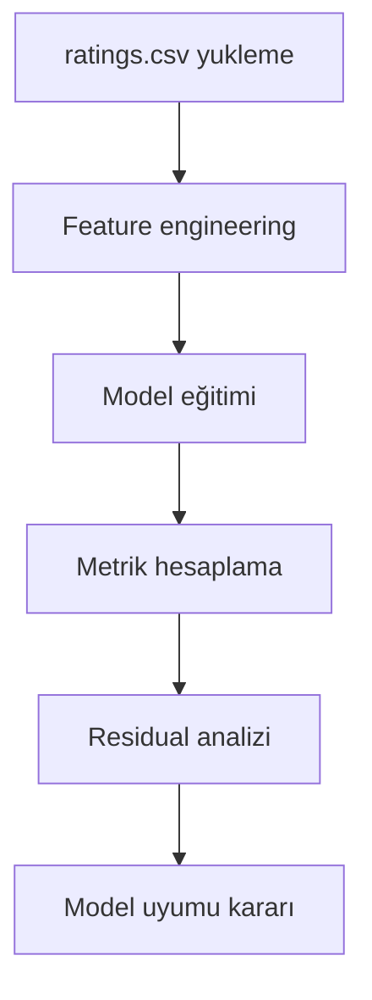

# Model Uyumu ve Değerlendirme

Bir regresyon modeli kurulduktan sonra asıl soru, modelin yalnızca eğitim verisine mi uyduğu yoksa yeni gözlemlerde de tutarlı davranıp davranmadığıdır.

Bu nedenle model değerlendirme süreci, tek bir skora bakarak değil; metrikler, artık analizi ve train-test farkı birlikte okunarak yürütülmelidir.

Bu makalede, yalnızca `ratings.csv` veri seti kullanılarak `rating` tahmini için model uyumu adım adım ele alınır.

## Veri seti: Movie Ratings

- Veri klasörü: `courses/linear-statistical-models/resources/movie-rating-ds/`
- Dosya: `ratings.csv`
- Açıklama dokümanı: `courses/linear-statistical-models/resources/2- Film Puanlama Veri Seti: movies.csv ve ratings.csv.md`
- Hedef değişken: `rating`

Bu senaryoda model, `ratings.csv` içindeki alanlardan türetilen sayısal özelliklerle puan (`rating`) tahmin eder.

## Problem bağlamı

Film puanlama verisinde modelin görevi, `ratings.csv` içindeki davranış sinyallerini kullanarak kullanıcı puanını mümkün olduğunca düşük hatayla tahmin etmektir.

Başlıca risk, modelin eğitim setinde iyi görünürken test setinde zayıf kalmasıdır. Bu nedenle değerlendirmede şu başlıklar birlikte izlenir:

- Açıklama gücü (`R2`, Adjusted `R2`)
- Hata büyüklüğü (`MSE`, `RMSE`, `MAE`)
- Artık (residual) davranışı
- Eğitim ve test performansı farkı

## Değerlendirme akışının genel resmi


*Sekil 1: Film puanlama senaryosunda model uyumu değerlendirme adımlarını gösterir.*

## Kurulum ve veri hazırlığı

### Kütüphaneler

```python
# Sayısal işlemler (karekök, dizi işlemleri)
import numpy as np
# Tablo veri işlemleri
import pandas as pd
# Temel grafik çizimleri
import matplotlib.pyplot as plt
# İstatistiksel görselleştirme
import seaborn as sns

# Çoklu doğrusal regresyon modeli
from sklearn.linear_model import LinearRegression
# Train-test bölme aracı
from sklearn.model_selection import train_test_split
# Değerlendirme metrikleri
from sklearn.metrics import r2_score, mean_squared_error, mean_absolute_error
```

### Veriyi yükleme

```python
# Veri setini CSV dosyasından DataFrame olarak yükler.
df = pd.read_csv(
    "courses/linear-statistical-models/resources/movie-rating-ds/ratings.csv"
)

# Satır-sütun bilgisi ve ilk kayıtlar ile hızlı kontrol yapılır.
print(df.shape)
print(df.head())
```

### Feature engineering

Yalnızca `ratings.csv` kullanıldığı için özellikler bu dosyadan türetilir.
Amaç, `rating` hedefini çoklu doğrusal regresyonla açıklayabilecek sayısal değişkenler üretmektir.

```python
# Kullanıcının verdiği ortalama puan (hedef sızıntısı olmaması için shift kullanılır)
# Her kullanıcıyı kendi zaman sırasına alıyoruz.
df = df.sort_values(["userId", "timestamp"])

# Bir kullanıcının geçmişte verdiği puanların ortalamasını üretir.
# shift(1) ile mevcut satırın rating değeri feature'a dahil edilmez.
df["user_prev_mean_rating"] = (
    df.groupby("userId")["rating"]
    .transform(lambda s: s.shift(1).expanding().mean())
)
# Kullanıcının ilk rating kaydında geçmiş bilgi olmadığı için global ortalama ile doldurulur.
df["user_prev_mean_rating"] = df["user_prev_mean_rating"].fillna(df["rating"].mean())

# Filme gelen birikimli rating sayısı (anlık popülerlik sinyali)
# Her filmi kendi zaman akışında sıralar.
df = df.sort_values(["movieId", "timestamp"])
# O ana kadar filme kaç rating geldiğini sayar (0,1,2,...).
df["movie_prev_rating_count"] = df.groupby("movieId").cumcount()

# Zaman bilgisinden temel davranış sinyalleri
# Unix timestamp'i okunabilir tarihe çevirip gün/saat özellikleri çıkarılır.
df["rating_day_of_week"] = pd.to_datetime(df["timestamp"], unit="s").dt.dayofweek
df["rating_hour"] = pd.to_datetime(df["timestamp"], unit="s").dt.hour

# Modelde kullanılacak bağımsız değişken listesi
features = [
    "user_prev_mean_rating",
    "movie_prev_rating_count",
    "rating_day_of_week",
    "rating_hour",
]

# Feature matrisi (X) ve hedef vektörü (y) ayrılır.
X = df[features]
y = df["rating"]
```

### Eğitim-test bölmesi

```python
# Veriyi %80 eğitim, %20 test olacak şekilde ayırır.
X_train, X_test, y_train, y_test = train_test_split(
    X, y, test_size=0.2, random_state=42
)

# Bölme sonuçlarının boyutlarını doğrular.
print("Train:", X_train.shape, y_train.shape)
print("Test :", X_test.shape, y_test.shape)
```

## Temel modelin eğitimi

```python
# Model nesnesi oluşturulur.
model = LinearRegression()
# Model, eğitim verisiyle katsayıları öğrenir.
model.fit(X_train, y_train)

# Eğitim ve test seti için tahminler üretilir.
y_pred_train = model.predict(X_train)
y_pred_test = model.predict(X_test)
```

## Performans metrikleri

### `R2`

`R2`, `rating` değişimindeki varyansın ne kadarının model tarafından açıklandığını gösterir.

### Adjusted `R2`

Adjusted `R2`, özellik sayısını dikkate alır ve gereksiz özellik eklenmesini cezalandırır.

```python
# p (feature sayısı) arttığında gereksiz karmaşıklığı cezalandıran R2 türevi
def adjusted_r2(r2, n, p):
    return 1 - (1 - r2) * (n - 1) / (n - p - 1)
```

### `MSE`, `RMSE`, `MAE`

- `MSE`: Hata karelerinin ortalaması
- `RMSE`: `MSE` karekökü, hedefle aynı birim
- `MAE`: Mutlak hataların ortalaması

## Tüm metrikleri birlikte hesaplama

```python
# Açıklama gücü: R2
train_r2 = r2_score(y_train, y_pred_train)
test_r2 = r2_score(y_test, y_pred_test)

# Hata kare ortalaması: MSE
train_mse = mean_squared_error(y_train, y_pred_train)
test_mse = mean_squared_error(y_test, y_pred_test)

# MSE'nin karekökü: RMSE
train_rmse = np.sqrt(train_mse)
test_rmse = np.sqrt(test_mse)

# Ortalama mutlak hata: MAE
train_mae = mean_absolute_error(y_train, y_pred_train)
test_mae = mean_absolute_error(y_test, y_pred_test)

# Feature sayısını da hesaba katan Adjusted R2
train_adj_r2 = adjusted_r2(train_r2, n=len(y_train), p=X_train.shape[1])
test_adj_r2 = adjusted_r2(test_r2, n=len(y_test), p=X_test.shape[1])

# Tüm metrikleri tek tabloda birleştirerek karşılaştırılabilir hale getirir.
metrics_df = pd.DataFrame(
    {
        "metric": ["R2", "Adjusted R2", "MSE", "RMSE", "MAE"],
        "train": [train_r2, train_adj_r2, train_mse, train_rmse, train_mae],
        "test": [test_r2, test_adj_r2, test_mse, test_rmse, test_mae],
    }
)

# Çıktıyı daha okunabilir olması için 4 basamağa yuvarlar.
print(metrics_df.round(4))
```

## Eğitim-test farkını yorumlama

- Eğitim sonuçları çok iyi, test sonuçları belirgin zayıfsa model aşırı öğrenme eğilimindedir.
- Eğitim ve test yakınsa modelin genelleme davranışı daha dengelidir.
- Her iki tarafta da zayıf sonuç varsa model yapısı yetersiz olabilir.

## Gerçek-tahmin grafiği

```python
# Gerçek ve tahmin değerlerinin saçılımını tek grafikte gösterir.
plt.figure(figsize=(7, 5))
plt.scatter(y_test, y_pred_test, alpha=0.5)

# Referans çizgisi için alt-üst sınırları hesaplar.
line_min = min(y_test.min(), y_pred_test.min())
line_max = max(y_test.max(), y_pred_test.max())
# İdeal durum çizgisi: tahmin = gerçek (45 derece)
plt.plot([line_min, line_max], [line_min, line_max], "r--", linewidth=2)

plt.title("Test Seti: Gerçek Rating vs Tahmin")
plt.xlabel("Gerçek Rating")
plt.ylabel("Tahmin Edilen Rating")
plt.grid(alpha=0.3)
plt.show()
```

Noktaların kırmızı çizgiye yakınlığı, tahminlerin gerçek değerlere yakınlığını gösterir.

## Residual analizi

Residual tanımı:

`residual = gerçek rating - tahmin rating`

### Residual plot

```python
# Residual = gerçek - tahmin
residuals = y_test - y_pred_test

# Tahmin-residual ilişkisi, sistematik hata deseni var mı diye incelenir.
plt.figure(figsize=(7, 5))
plt.scatter(y_pred_test, residuals, alpha=0.5)
# Sıfır çizgisi: hatasız referans
plt.axhline(0, color="red", linestyle="--", linewidth=2)

plt.title("Residual Plot")
plt.xlabel("Tahmin Edilen Rating")
plt.ylabel("Residual")
plt.grid(alpha=0.3)
plt.show()
```

Beklenen durum, noktaların `0` etrafında rastgele dağılmasıdır.

### Residual dağılımı

```python
# Residual dağılımını histogram + yoğunluk eğrisi ile gösterir.
plt.figure(figsize=(7, 5))
sns.histplot(residuals, kde=True, bins=30)
plt.title("Residual Dağılımı")
plt.xlabel("Residual")
plt.ylabel("Frekans")
plt.grid(alpha=0.2)
plt.show()
```

Bu grafik, model hatalarının simetrik dağılıp dağılmadığına dair hızlı bir kontrol sağlar.

## Değerlendirme çıktısını raporlama

```text
Model: LinearRegression
Veri: ratings.csv
Özellikler: user_prev_mean_rating, movie_prev_rating_count, rating_day_of_week, rating_hour
Bölme: %80 train / %20 test (random_state=42)

Test Sonuçları:
- R2: ...
- Adjusted R2: ...
- RMSE: ...
- MAE: ...

Yorum:
- Train-test farkı ... düzeydedir.
- Residual grafiğinde ... gözlenmiştir.
```

## Sonuç

Film puanlama veri setinde model uyumu değerlendirmesi, yalnızca tek bir metrikle değil; açıklama gücü, hata metrikleri ve residual davranışı birlikte okunarak yapılmalıdır.

Bu yaklaşım, 9. makaledeki model seçimi ve overfitting analizine güçlü bir temel sağlar.

