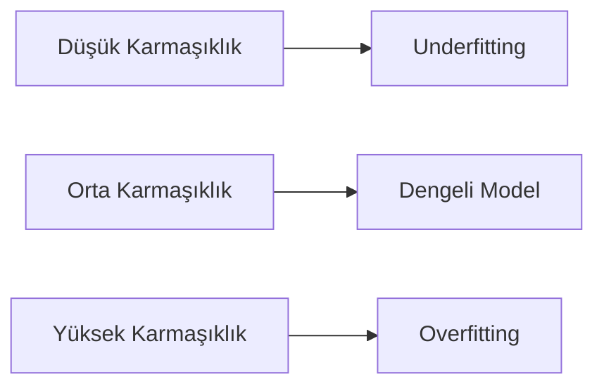
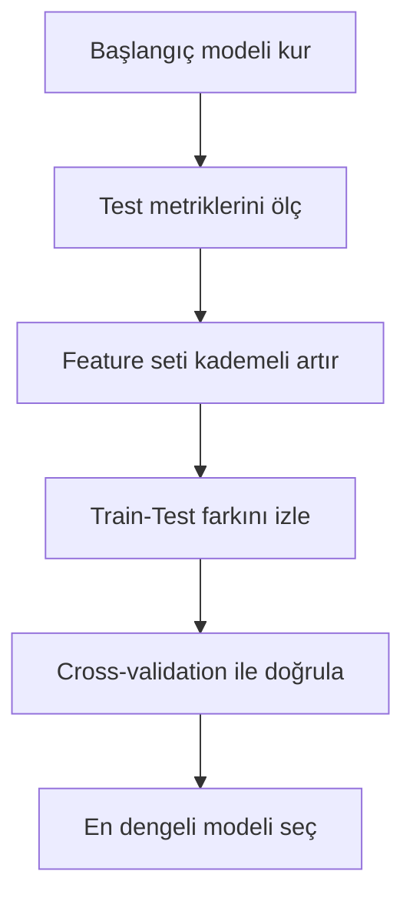

# Model Seçimi ve Overfitting

Bir modelin eğitim setinde güçlü görünmesi, üretim ortamında da güçlü olacağı anlamına gelmez.
Model seçiminin asıl amacı, genelleme performansı en dengeli yapıyı bulmaktır.

Bu makalede yalnızca `ratings.csv` veri seti üzerinden overfitting riski uygulamalı olarak incelenir.

## Veri seti: Movie Ratings

- Veri klasörü: `courses/linear-statistical-models/resources/movie-rating-ds/`
- Dosya: `ratings.csv`
- Açıklama dokümanı: `courses/linear-statistical-models/resources/2- Film Puanlama Veri Seti: movies.csv ve ratings.csv.md`
- Hedef değişken: `rating`

## Problem bağlamı

Film puanı tahmininde model karmaşıklığı arttıkça eğitim hatası genellikle düşer.
Belirli bir noktadan sonra test hatası yükselirse model, genelleme yerine ezber davranışı göstermeye başlamış olabilir.

Bu nedenle şu soru kritik hale gelir: Model gerçek ilişkiyi mi öğreniyor, yoksa eğitim setini mi ezberliyor?

## Model seçimi neden gereklidir?

Film puanlama senaryosunda farklı karmaşıklık seviyeleri, yalnızca `ratings.csv` içinden türetilen feature set büyüklüğüyle kurulabilir:

- Sade özellik seti (2 değişken)
- Dengeli özellik seti (4 değişken)
- Geniş özellik seti (6 değişken)

Her karmaşıklık artışı modele daha fazla esneklik kazandırır.
Ancak esneklik arttıkça modelin veriyi ezberleme riski de yükselir.

Model seçimi, bu dengeyi kurma sürecidir.

## Kavramsal çerçeve: underfitting ve overfitting

Model davranışı üç ana bölgede düşünülür:

1. **Underfitting (yetersiz öğrenme):** Model, puan davranışını yeterince temsil edemez.
2. **İdeal denge:** Model temel sinyali öğrenir, gürültüyü ezberlemez.
3. **Overfitting (aşırı öğrenme):** Model eğitim verisine aşırı uyum gösterir.

Bu çerçeve aşağıdaki gibi özetlenebilir.




*Sekil 1: Model karmaşıklığı arttıkça performans rejiminin underfittingden overfittinge kayabileceğini gösterir.*

## Eğitim hatası ve test hatası

Model performansı iki farklı veri üzerinde ölçülür:

- **Eğitim hatası:** Modelin öğrendiği veri üzerindeki hata
- **Test hatası:** Modelin görmediği veri üzerindeki hata

Yorum ilkesi:

- Eğitim hatası düşük, test hatası da düşükse model dengeli olabilir.
- Eğitim hatası düşük ama test hatası yüksekse overfitting riski vardır.
- Her iki hata da yüksekse model yetersiz kalmış olabilir.

Bu ayrım, model seçimi kararının temelini oluşturur.

## Kod ortamı ve temel hazırlık

### Kütüphaneler

```python
# Sayısal işlemler
import numpy as np
# Veri işleme
import pandas as pd
# Grafik
import matplotlib.pyplot as plt

# Regresyon modeli
from sklearn.linear_model import LinearRegression
# Train-test bölme
from sklearn.model_selection import train_test_split
# Hata ve açıklama gücü metrikleri
from sklearn.metrics import mean_squared_error, r2_score
# Çapraz doğrulama
from sklearn.model_selection import cross_val_score
```

### Veriyi yükleme

```python
# Puan verisini yükler.
df = pd.read_csv(
    "courses/linear-statistical-models/resources/movie-rating-ds/ratings.csv"
)
```

### Feature engineering

```python
# Zaman sırasını koruyarak kullanıcı geçmiş ortalaması
# Kullanıcı bazında kronolojik sıralama
df = df.sort_values(["userId", "timestamp"])
# Geçmiş rating ortalaması (mevcut satır hariç)
df["user_prev_mean_rating"] = (
    df.groupby("userId")["rating"]
    .transform(lambda s: s.shift(1).expanding().mean())
)
# İlk kayıtlar için boş değerleri genel ortalama ile doldurur.
df["user_prev_mean_rating"] = df["user_prev_mean_rating"].fillna(df["rating"].mean())

# Film başına birikimli rating sayısı
# Film bazında kronolojik sıralama
df = df.sort_values(["movieId", "timestamp"])
# O ana kadar gelen rating adedi
df["movie_prev_rating_count"] = df.groupby("movieId").cumcount()

# Timestamp'ten takvim/zaman özellikleri türetir.
dt = pd.to_datetime(df["timestamp"], unit="s")
df["rating_day_of_week"] = dt.dt.dayofweek
df["rating_hour"] = dt.dt.hour
df["rating_month"] = dt.dt.month
df["rating_year"] = dt.dt.year

# Küçük, orta ve geniş aday feature setleri
features_small = [
    "user_prev_mean_rating",
    "movie_prev_rating_count",
]
features_medium = [
    "user_prev_mean_rating",
    "movie_prev_rating_count",
    "rating_day_of_week",
    "rating_hour",
]
features_large = [
    "user_prev_mean_rating",
    "movie_prev_rating_count",
    "rating_day_of_week",
    "rating_hour",
    "rating_month",
    "rating_year",
]

# Her feature seti için X matrisi oluşturulur; hedef değişken aynıdır.
X_small = df[features_small]
X_medium = df[features_medium]
X_large = df[features_large]
y = df["rating"]
```

Burada üç aday özellik seti oluşturulur: sade, dengeli ve geniş.

### Train-test bölmesi

```python
# Aynı random_state ile farklı karmaşıklıkta üç veri matrisi bölünür.
X_train_s, X_test_s, y_train, y_test = train_test_split(
    X_small, y, test_size=0.2, random_state=42
)
X_train_m, X_test_m, _, _ = train_test_split(
    X_medium, y, test_size=0.2, random_state=42
)
X_train_l, X_test_l, _, _ = train_test_split(
    X_large, y, test_size=0.2, random_state=42
)
```

Test kümesi, modelin gerçek kullanım koşullarındaki performansına daha yakın bir ölçüm elde etmek için gereklidir.

## Baseline model: doğrusal regresyon

Önce daha sade özellik setiyle bir referans model kurulur.

```python
# Referans model: sade feature seti
baseline_model = LinearRegression()
baseline_model.fit(X_train_s, y_train)

# Eğitim ve test tahminleri
y_pred_train_base = baseline_model.predict(X_train_s)
y_pred_test_base = baseline_model.predict(X_test_s)

# Hata metrikleri
baseline_train_rmse = np.sqrt(
    mean_squared_error(y_train, y_pred_train_base)
)
baseline_test_rmse = np.sqrt(
    mean_squared_error(y_test, y_pred_test_base)
)

baseline_train_r2 = r2_score(y_train, y_pred_train_base)
baseline_test_r2 = r2_score(y_test, y_pred_test_base)

# Referans sonuçları yazdırır.
print("Baseline Train RMSE:", round(float(baseline_train_rmse), 4))
print("Baseline Test RMSE :", round(float(baseline_test_rmse), 4))
print("Baseline Train R2  :", round(float(baseline_train_r2), 4))
print("Baseline Test R2   :", round(float(baseline_test_r2), 4))
```

Bu model, daha karmaşık feature setlerinin gerçekten fayda sağlayıp sağlamadığını görmek için referans çizgisi oluşturur.

## Model karmaşıklığını artırma: feature set genişletme

### Farklı özellik setleri için karşılaştırma

```python
# Tek bir fonksiyonla farklı feature setlerini aynı yöntemle değerlendirir.
def evaluate_linear(X_train, X_test, y_train, y_test):
    # Modeli eğit
    m = LinearRegression()
    m.fit(X_train, y_train)
    # Train/Test tahminlerini üret
    pred_tr = m.predict(X_train)
    pred_te = m.predict(X_test)

    # Metrikleri sözlük olarak döndür
    return {
        "train_rmse": float(np.sqrt(mean_squared_error(y_train, pred_tr))),
        "test_rmse": float(np.sqrt(mean_squared_error(y_test, pred_te))),
        "train_r2": float(r2_score(y_train, pred_tr)),
        "test_r2": float(r2_score(y_test, pred_te)),
    }

# Üç aday setin sonuçlarını ayrı ayrı hesapla.
small_metrics = evaluate_linear(X_train_s, X_test_s, y_train, y_test)
medium_metrics = evaluate_linear(X_train_m, X_test_m, y_train, y_test)
large_metrics = evaluate_linear(X_train_l, X_test_l, y_train, y_test)

# Sonuçları tek tabloda birleştirip karşılaştır.
comparison_df = pd.DataFrame(
    [
        {"model": "Small feature set (2)", **small_metrics},
        {"model": "Medium feature set (4)", **medium_metrics},
        {"model": "Large feature set (6)", **large_metrics},
    ]
)
print(comparison_df.round(4))
```

Yorum mantığı:

- Train RMSE azalırken test RMSE de iyileşiyorsa karmaşıklık faydalıdır.
- Train iyileşip test bozuluyorsa overfitting riski artmaktadır.
- En dengeli nokta genellikle orta karmaşıklıkta görülür.

## Overfitting belirtileri

Bir modelde aşağıdaki durumlar birlikte görülüyorsa overfitting olasılığı artar:

- Eğitim hatası çok düşüktür.
- Test hatası eğitim hatasından belirgin yüksektir.
- Test performansı model karmaşıklığı arttıkça kötüleşmektedir.
- Farklı veri bölmelerinde metrik oynaklığı artmaktadır.

Bu belirtiler, modelin veri içindeki gürültüyü de öğrenmiş olabileceğini gösterir.

## Örnek bir metrik tablosu üzerinden okuma

Aşağıdaki tablo film puanlama senaryosu için temsili bir okumadır:

```text
Model Set               | Train RMSE | Test RMSE | Train R2 | Test R2
Small feature set (2)   | 0.99       | 1.00      | 0.15     | 0.14
Medium feature set (4)  | 0.96       | 0.97      | 0.20     | 0.18
Large feature set (6)   | 0.90       | 1.03      | 0.29     | 0.09
```

Eğitim hatasının sürekli düşmesi olumlu görünse de test hatasının belirgin artması, modelin genelleme gücünü kaybettiğini gösterir.

## Neden overfitting oluşur?

Overfittingin yaygın nedenleri şunlardır:

1. Veri miktarına göre aşırı karmaşık yapı kurulması
2. Gereğinden fazla feature eklenmesi
3. Gürültü ve aykırı gözlemlerin modele taşınması
4. Yetersiz doğrulama (tek bölme ile karar verme)

Model karmaşıklığı ile veri kapasitesi arasında dengesizlik oluştuğunda problem belirginleşir.

## Overfitting riskini azaltma yöntemleri

### 1) Modeli sadeleştirme

Daha az feature veya daha basit model tercih edilebilir.
Bu yaklaşım varyansı azaltarak test performansını dengeleyebilir.

### 2) Özellik seçimi

Kısıtlı katkı sunan türetilmiş feature alanları modelden çıkarılabilir.
Bu adım gereksiz karmaşıklığı azaltır.

### 3) Düzenlileştirme (regularization)

`Ridge` ve `Lasso` gibi yöntemler katsayı büyüklüklerini kontrol ederek aşırı öğrenme riskini azaltır.

### 4) Çapraz doğrulama

Tek bir train-test bölmesi yerine çoklu bölme ile ortalama performans ölçülür.

## Kısa çapraz doğrulama örneği

```python
# 5 katlı çapraz doğrulama ile modelin farklı bölmelerdeki kararlılığını ölçer.
cv_scores = cross_val_score(
    LinearRegression(),
    X_medium,
    y,
    cv=5,
    scoring="neg_root_mean_squared_error",
)

# sklearn negatif hata döndürdüğü için işaret çevrilir.
cv_rmse = -cv_scores
# Fold bazlı, ortalama ve standart sapma çıktıları raporlanır.
print("Fold RMSE values:", np.round(cv_rmse, 4))
print("Mean CV RMSE   :", round(float(cv_rmse.mean()), 4))
print("Std CV RMSE    :", round(float(cv_rmse.std()), 4))
```

Bu çıktı, seçilen modelin farklı fold'larda ne kadar kararlı olduğunu gösterir.

## Model seçimi için pratik karar akışı




*Sekil 2: Model seçimi sürecinde karmaşıklık artışı ve doğrulama adımlarının birlikte işletildiğini gösterir.*

Bu akış, yalnızca en düşük eğitim hatasını değil, en güvenilir genelleme performansını hedefler.

## Yanlış yorumlara karşı mini rehber

### Yanlış: "Eğitim hatası en düşük model en iyidir."

Doğru yaklaşım:
Eğitim hatası ile birlikte test hatası ve doğrulama sonuçları birlikte okunmalıdır.

### Yanlış: "Daha fazla özellik her zaman daha iyidir."

Doğru yaklaşım:
Özellik sayısı arttıkça karmaşıklık artar; bu durum test performansını düşürebilir.

### Yanlış: "Tek seferlik train-test sonucu yeterlidir."

Doğru yaklaşım:
Mümkünse çapraz doğrulama ile sonuçların kararlılığı kontrol edilmelidir.

## Uygulama notları: raporlama dili nasıl olmalı?

Model seçimi raporunda şu ifade yapısı önerilir:

```text
Model adayı 1, 2 ve 3 karşılaştırılmıştır.
En düşük eğitim hatası geniş feature setinde görülmüştür.
Ancak test RMSE ve cross-validation sonuçları orta feature setinin daha dengeli olduğunu göstermiştir.
Bu nedenle nihai model olarak orta feature seti seçilmiştir.
```

Bu ifade biçimi, karar gerekçesini sayısal ve metodolojik açıdan daha açık hale getirir.

## Basit bir uçtan uca kod akışı

```python
# 1) Baseline model (small feature set)
# En sade modeli eğit
base = LinearRegression()
base.fit(X_train_s, y_train)

# 2) Aday setleri
# Her adayın metriklerini topla
rows = []
rows.append({"model": "small", **evaluate_linear(X_train_s, X_test_s, y_train, y_test)})
rows.append({"model": "medium", **evaluate_linear(X_train_m, X_test_m, y_train, y_test)})
rows.append({"model": "large", **evaluate_linear(X_train_l, X_test_l, y_train, y_test)})

# Karşılaştırma tablosunu üret
candidate_df = pd.DataFrame(rows)
print(candidate_df.round(4))

# 3) En düşük test RMSE adayı
# En iyi aday satırını bul ve model adını yazdır
best_idx = candidate_df["test_rmse"].idxmin()
best_row = candidate_df.loc[best_idx]
print("Selected model:", best_row["model"])
```

Bu akış, model seçimini daha sistematik hale getirir.
Manuel ve sezgisel seçim yerine ölçülebilir bir kriter kullanılır.

## Sonuç

Model seçimi sürecinde hedef, eğitim skoru değil testte ve doğrulamada dengeli kalan bir model seçmektir.
Overfitting, bu dengeyi bozan temel risktir.

Bu nedenle pratikte:

- Eğitim ve test metrikleri birlikte incelenmeli
- Model karmaşıklığı kademeli artırılarak izlenmeli
- Gerekirse çapraz doğrulama ile karar güçlendirilmeli

yaklaşımı benimsenmelidir.

Bu çerçeve, 10. makaledeki ileri modelleme adımlarına geçmeden önce sağlam bir seçim disiplini oluşturur.