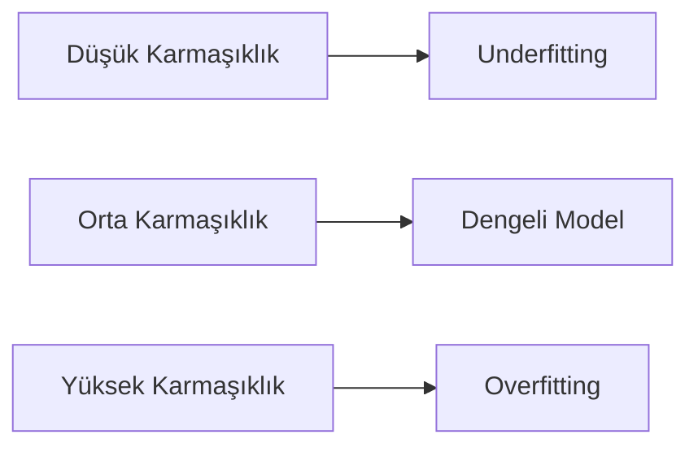
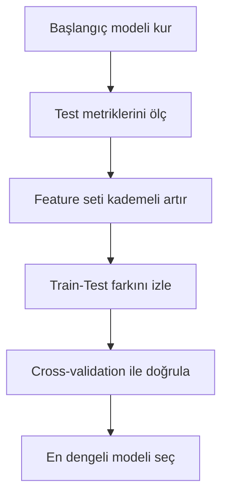
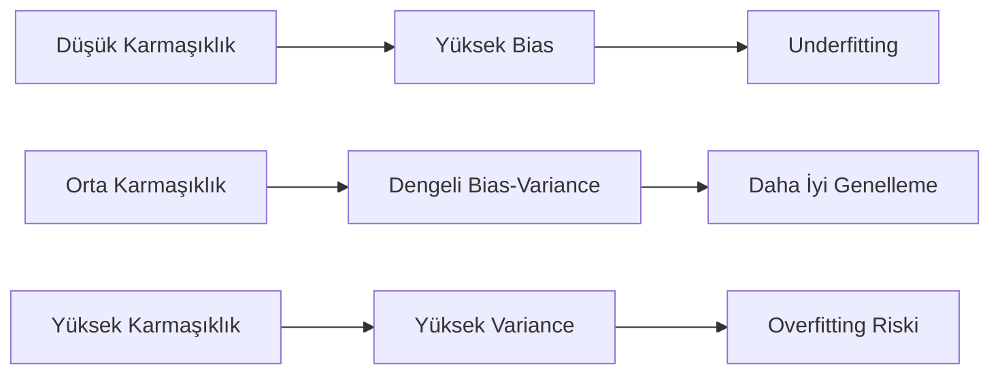

# Model Seçimi, Overfitting ve Underfitting

Bir modelin eğitim setinde güçlü görünmesi, üretim ortamında da güçlü olacağı anlamına gelmez.
Model seçiminin asıl amacı, genelleme performansı en dengeli yapıyı bulmaktır.

Bu makalede film puanlama veri seti üzerinden overfitting ve underfitting riskleri uygulamalı olarak incelenir.

## Veri seti: Movie Ratings (Birleştirilmiş)

- Veri klasörü: `courses/linear-statistical-models/resources/movie-rating-ds/`
- Dosya: `movie_ratings_merged.csv`
- Kaynak: `ratings.csv` ve `movies.csv` dosyalarının `movieId` üzerinden birleştirilmiş hali
- Hedef değişken: `rating`

Birleştirilmiş veri seti; kullanıcı puanına ek olarak filmin yapım yılını, tür sayısını ve her bir türün binary gösterimini (one-hot encoding) içerir.

## Problem bağlamı

Film puanı tahmininde model karmaşıklığı arttıkça eğitim hatası genellikle düşer.
Belirli bir noktadan sonra test hatası yükselirse model, genelleme yerine ezber davranışı göstermeye başlamış olabilir.

Bu nedenle şu soru kritik hale gelir: model gerçek ilişkiyi mi öğreniyor, yoksa eğitim setini mi ezberliyor?

## Model seçimi neden gereklidir?

Film puanlama senaryosunda farklı karmaşıklık seviyeleri, kullanılan özellik (feature) sayısının kademeli artırılmasıyla kurulabilir:

- **Sade özellik seti (2 değişken):** Yalnızca filmin yapım yılı ve tür sayısı
- **Dengeli özellik seti (6 değişken):** Yapım yılı, tür sayısı ve en yaygın dört türün binary gösterimi
- **Geniş özellik seti (~23 değişken):** Tüm tür gösterimleri, yapım yılı, tür sayısı ve zaman bilgileri

Her karmaşıklık artışı modele daha fazla esneklik kazandırır.
Ancak esneklik arttıkça modelin veriyi ezberleme riski de yükselir.

Model seçimi, bu dengeyi kurma sürecidir.

## Kavramsal çerçeve: underfitting ve overfitting

Model davranışı üç ana bölgede düşünülür:

1. **Underfitting (yetersiz öğrenme):** Model, puan davranışını yeterince temsil edemez.
2. **İdeal denge:** Model temel sinyali öğrenir, gürültüyü ezberlemez.
3. **Overfitting (aşırı öğrenme):** Model eğitim verisine aşırı uyum gösterir.

Bu çerçeve aşağıdaki gibi özetlenebilir.



*Sekil 1: Model karmaşıklığı arttıkça performans rejiminin underfittingden overfittinge kayabileceğini gösterir.*

## Eğitim hatası ve test hatası

Model performansı iki farklı veri üzerinde ölçülür:

- **Eğitim hatası:** Modelin öğrendiği veri üzerindeki hata
- **Test hatası:** Modelin görmediği veri üzerindeki hata

Yorum ilkesi:

- Eğitim hatası düşük, test hatası da düşükse model dengeli olabilir.
- Eğitim hatası düşük ama test hatası yüksekse overfitting riski vardır.
- Her iki hata da yüksekse model yetersiz kalmış olabilir.

Bu ayrım, model seçimi kararının temelini oluşturur.

## Kod ortamı ve temel hazırlık

### Kütüphaneler

```python
# Sayısal işlemler ve dizi manipülasyonu
import numpy as np
# Tablo veri işlemleri
import pandas as pd
# Grafik çizimleri
import matplotlib.pyplot as plt

# Doğrusal regresyon modeli
from sklearn.linear_model import LinearRegression
# Veriyi eğitim ve test olarak ayırma
from sklearn.model_selection import train_test_split
# Hata ve açıklama gücü metrikleri
from sklearn.metrics import mean_squared_error, r2_score
# Veriyi birden fazla parçaya bölerek modeli her seferinde farklı alt kümeyle test eder.
from sklearn.model_selection import cross_val_score
# Polinom özellik dönüşümü (karmaşık model için)
from sklearn.preprocessing import PolynomialFeatures
# Model adımlarını zincirleyen yapı
from sklearn.pipeline import Pipeline
```

### Veriyi yükleme

```python
# Birleştirilmiş film puanlama verisini yükler.
df = pd.read_csv(
    "courses/linear-statistical-models/resources/movie-rating-ds/movie_ratings_merged.csv"
)
```

Birleştirilmiş dosyada `movie_year`, `genre_count` ve 19 tür sütunu (`genre_Action`, `genre_Adventure`, ..., `genre_Western`) hazır olarak bulunur.

### Ön işleme

```python
# Yapım yılı bilinmeyen filmler için medyan yıl ile doldurulur.
df["movie_year"] = df["movie_year"].fillna(df["movie_year"].median())

# Zaman damgasından takvim özellikleri türetilir.
dt = pd.to_datetime(df["timestamp"], unit="s")
df["rating_hour"] = dt.dt.hour
df["rating_day_of_week"] = dt.dt.dayofweek
```

### Feature setleri

```python
# Tüm tür (genre) sütunlarını dinamik olarak toplar.
genre_columns = [c for c in df.columns if c.startswith("genre_")]

# Sade set: yalnızca yapım yılı ve tür sayısı
features_small = ["movie_year", "genre_count"]

# Dengeli set: yapım yılı, tür sayısı ve en yaygın 4 tür
features_medium = [
    "movie_year",
    "genre_count",
    "genre_Drama",
    "genre_Comedy",
    "genre_Action",
    "genre_Thriller",
]

# Geniş set: tüm tür sütunları + zaman bilgileri
features_large = (
    ["movie_year", "genre_count"]
    + genre_columns
    + ["rating_hour", "rating_day_of_week"]
)

# Her set için feature matrisi oluşturulur; hedef değişken ortaktır.
X_small = df[features_small]
X_medium = df[features_medium]
X_large = df[features_large]
y = df["rating"]
```

Burada üç aday özellik seti tanımlanır: sade, dengeli ve geniş.
Geniş setteki zaman özellikleri (`rating_hour`, `rating_day_of_week`) çoğu durumda puanla güçlü bir ilişki taşımaz; bu nedenle modele eklendiklerinde gerçek sinyal yerine gürültü öğrenme riski artar.

### Train-test bölmesi

```python
# Aynı random_state ile üç farklı feature matrisini aynı bölmeye tabi tutar.
X_train_s, X_test_s, y_train, y_test = train_test_split(
    X_small, y, test_size=0.2, random_state=42
)
X_train_m, X_test_m, _, _ = train_test_split(
    X_medium, y, test_size=0.2, random_state=42
)
X_train_l, X_test_l, _, _ = train_test_split(
    X_large, y, test_size=0.2, random_state=42
)
```

Test kümesi, modelin gerçek kullanım koşullarındaki performansına daha yakın bir ölçüm elde etmek için gereklidir.

## Baseline model: doğrusal regresyon

Önce sade özellik setiyle bir referans model kurulur.

```python
# Referans model: sade feature seti ile doğrusal regresyon
baseline_model = LinearRegression()
baseline_model.fit(X_train_s, y_train)

# Eğitim ve test seti üzerinde tahmin üretir.
y_pred_train_base = baseline_model.predict(X_train_s)
y_pred_test_base = baseline_model.predict(X_test_s)

# RMSE: hata karekökü (hedefle aynı birimde)
baseline_train_rmse = np.sqrt(mean_squared_error(y_train, y_pred_train_base))
baseline_test_rmse = np.sqrt(mean_squared_error(y_test, y_pred_test_base))

# R2: modelin açıklama gücü (1'e yakın → güçlü)
baseline_train_r2 = r2_score(y_train, y_pred_train_base)
baseline_test_r2 = r2_score(y_test, y_pred_test_base)

# Referans sonuçları yazdırır.
print("Baseline Train RMSE:", round(float(baseline_train_rmse), 4))
print("Baseline Test RMSE :", round(float(baseline_test_rmse), 4))
print("Baseline Train R2  :", round(float(baseline_train_r2), 4))
print("Baseline Test R2   :", round(float(baseline_test_r2), 4))
```

Beklenen çıktı:

```text
Baseline Train RMSE: 1.0405
Baseline Test RMSE : 1.0275
Baseline Train R2  : 0.0092
Baseline Test R2   : 0.0072
```

RMSE değerinin ~1.03 olması, modelin tahminlerinin ortalamada gerçek puandan yaklaşık 1 puan saptığı anlamına gelir; 0.5–5.0 aralığındaki bir ölçek için bu oldukça yüksek bir hatadır.
R2 değerlerinin sıfıra çok yakın olması ise yalnızca yapım yılı ve tür sayısının puan varyansını neredeyse hiç açıklayamadığını gösterir.
Bu referans çizgisi, daha zengin feature setlerinin gerçekten katkı sağlayıp sağlamadığını test etmeye zemin hazırlar.

## Model karmaşıklığını artırma: feature set genişletme

### Farklı özellik setleri için karşılaştırma

```python
# Tek fonksiyonla farklı feature setlerini aynı yöntemle değerlendirir.
def evaluate_linear(X_train, X_test, y_train, y_test):
    m = LinearRegression()
    m.fit(X_train, y_train)
    # Eğitim ve test tahminleri
    pred_tr = m.predict(X_train)
    pred_te = m.predict(X_test)
    # Metrikleri sözlük olarak döndürür.
    return {
        "train_rmse": float(np.sqrt(mean_squared_error(y_train, pred_tr))),
        "test_rmse": float(np.sqrt(mean_squared_error(y_test, pred_te))),
        "train_r2": float(r2_score(y_train, pred_tr)),
        "test_r2": float(r2_score(y_test, pred_te)),
    }

# Üç aday setin sonuçlarını hesaplar.
small_metrics = evaluate_linear(X_train_s, X_test_s, y_train, y_test)
medium_metrics = evaluate_linear(X_train_m, X_test_m, y_train, y_test)
large_metrics = evaluate_linear(X_train_l, X_test_l, y_train, y_test)

# Sonuçları tek tabloda birleştirerek karşılaştırır.
comparison_df = pd.DataFrame([
    {"model": "Small (2 feature)", **small_metrics},
    {"model": "Medium (6 feature)", **medium_metrics},
    {"model": "Large (~23 feature)", **large_metrics},
])
print(comparison_df.round(4))
```

Beklenen çıktı:

```text
                  model  train_rmse  test_rmse  train_r2  test_r2
   Small (2 feature)      1.0405     1.0275    0.0092    0.0072
  Medium (6 feature)      1.0296     1.0174    0.0298    0.0266
 Large (~23 feature)      1.0199     1.0094    0.0480    0.0420
```

Bu sonuçlarda üç set arasında belirgin bir overfitting gözlenmez: feature sayısı arttıkça hem train hem test metrikleri birlikte iyileşir.
Bunun temel nedeni, doğrusal regresyonun 100K satırlık veride ~23 feature ile kolayca aşırı öğrenme yapmamasıdır.
Ancak train-test R2 farkının hafifçe açılması (0.002 → 0.003 → 0.006), karmaşıklık artışıyla genelleme kaybı riskinin başlayabileceğine dair erken bir işarettir.
Polinom özellikler veya çok daha fazla feature eklendiğinde bu fark belirginleşir; bu konu aşağıda underfitting-overfitting karşılaştırmasında ele alınır.

Yorum mantığı:

- Train RMSE azalırken test RMSE de iyileşiyorsa karmaşıklık faydalıdır.
- Train iyileşip test bozuluyorsa overfitting riski artmaktadır.
- En dengeli nokta genellikle orta karmaşıklıkta görülür.

## Overfitting belirtileri

Bir modelde aşağıdaki durumlar birlikte görülüyorsa overfitting olasılığı artar:

- Eğitim hatası çok düşüktür.
- Test hatası eğitim hatasından belirgin yüksektir.
- Test performansı model karmaşıklığı arttıkça kötüleşmektedir.
- Farklı veri bölmelerinde metrik oynaklığı artmaktadır.

Bu belirtiler, modelin veri içindeki gürültüyü de öğrenmiş olabileceğini gösterir.

## Neden overfitting oluşur?

Overfittingin yaygın nedenleri şunlardır:

1. Veri miktarına göre aşırı karmaşık yapı kurulması
2. Gereğinden fazla feature eklenmesi
3. Gürültü ve aykırı gözlemlerin modele taşınması
4. Yetersiz doğrulama (tek bölme ile karar verme)

Film puanlama örneğinde; `rating_hour` ve `rating_day_of_week` gibi zaman bilgileri çoğu zaman puanla anlamlı bir bağ taşımaz.
Bu tür özelliklerin modele eklenmesi, karmaşıklık artışını getirirken gerçek açıklama gücüne katkı sağlamayabilir.

## Overfitting riskini azaltma yöntemleri

### 1) Modeli sadeleştirme

Daha az feature veya daha basit model tercih edilebilir.
Bu yaklaşım varyansı azaltarak test performansını dengeleyebilir.

### 2) Özellik seçimi

Kısıtlı katkı sunan özellikler (örneğin `rating_hour` gibi zaman bilgileri) modelden çıkarılabilir.
Bu adım gereksiz karmaşıklığı azaltır.

### 3) Düzenlileştirme (regularization)

`Ridge` ve `Lasso` gibi yöntemler katsayı büyüklüklerini kontrol ederek aşırı öğrenme riskini azaltır.

### 4) Çapraz doğrulama

Tek bir train-test bölmesi yerine çoklu bölme ile ortalama performans ölçülür.

## Kısa çapraz doğrulama örneği

Tek bir train-test bölmesinde model şanslı veya şanssız bir alt kümeye denk gelebilir.
Çapraz doğrulama (cross-validation) bu riski azaltır: veri `k` eşit parçaya (fold) bölünür; her turda bir parça test, geri kalanı eğitim olarak kullanılır.
Böylece model `k` farklı bölmeyle sınanır ve sonuçların ortalaması alınır.

```python
# Veriyi 5 eşit parçaya (fold) böler.
# Her turda 1 parça test, 4 parça eğitim olarak kullanılır.
# Toplam 5 farklı bölmeyle model sınanır ve her biri için RMSE hesaplanır.
cv_scores = cross_val_score(
    LinearRegression(),
    X_medium,
    y,
    cv=5,                                  # 5 katlı bölme
    scoring="neg_root_mean_squared_error",  # RMSE metriği (negatif döner)
)

# sklearn skorları negatif döndürür; pozitife çevrilir.
cv_rmse = -cv_scores
# Her fold'un RMSE'si, ortalaması ve fold'lar arası standart sapma raporlanır.
print("Fold RMSE values:", np.round(cv_rmse, 4))
print("Mean CV RMSE   :", round(float(cv_rmse.mean()), 4))
print("Std CV RMSE    :", round(float(cv_rmse.std()), 4))
```

Beklenen çıktı:

```text
Fold RMSE values: [1.0308 1.0002 1.0407 1.0176 1.0542]
Mean CV RMSE   : 1.0287
Std CV RMSE    : 0.0186
```

Beş fold'un RMSE değerleri birbirine yakın (standart sapma 0.019) olduğundan model farklı veri bölmelerinde tutarlı davranmaktadır.
Ortalama RMSE (~1.03), daha önceki tek bölmeli test sonucuyla uyumludur; bu da sonucun rastlantısal olmadığını doğrular.

## Model seçimi için pratik karar akışı



*Sekil 2: Model seçimi sürecinde karmaşıklık artışı ve doğrulama adımlarının birlikte işletildiğini gösterir.*

Bu akış, yalnızca en düşük eğitim hatasını değil, en güvenilir genelleme performansını hedefler.

## Uygulama notları: raporlama dili nasıl olmalı?

Model seçimi raporunda şu ifade yapısı önerilir:

```text
Model adayı 1, 2 ve 3 karşılaştırılmıştır.
En düşük eğitim hatası geniş feature setinde görülmüştür.
Ancak test RMSE ve cross-validation sonuçları orta feature setinin daha dengeli olduğunu göstermiştir.
Bu nedenle nihai model olarak orta feature seti seçilmiştir.
```

Bu ifade biçimi, karar gerekçesini sayısal ve metodolojik açıdan daha açık hale getirir.

## Basit bir uçtan uca kod akışı

```python
# 1) Referans modeli eğit
base = LinearRegression()
base.fit(X_train_s, y_train)

# 2) Her aday setin metriklerini topla
rows = []
rows.append({"model": "small", **evaluate_linear(X_train_s, X_test_s, y_train, y_test)})
rows.append({"model": "medium", **evaluate_linear(X_train_m, X_test_m, y_train, y_test)})
rows.append({"model": "large", **evaluate_linear(X_train_l, X_test_l, y_train, y_test)})

# Karşılaştırma tablosunu oluştur
candidate_df = pd.DataFrame(rows)
print(candidate_df.round(4))

# 3) En düşük test RMSE'ye sahip adayı seç
best_idx = candidate_df["test_rmse"].idxmin()
best_row = candidate_df.loc[best_idx]
print("Selected model:", best_row["model"])
```

Bu akış, model seçimini daha sistematik hale getirir.
Manuel ve sezgisel seçim yerine ölçülebilir bir kriter kullanılır.

---

## Underfitting nedir?

Model performansı değerlendirilirken yalnızca overfitting riski değil, underfitting riski de birlikte ele alınmalıdır.
Bir model çok basit kurulduğunda veri içindeki temel örüntüleri öğrenemez ve hem eğitim hem test aşamasında zayıf sonuç üretir.

Bu durum `underfitting` olarak adlandırılır.
Underfitting, çoğu zaman modelin kapasitesinin problem karmaşıklığına göre yetersiz kalmasından kaynaklanır.

Underfitting durumunda model:

- Eğitim verisinde yüksek hata üretir.
- Test verisinde de benzer biçimde yüksek hata üretir.
- Veri arttırılsa bile kısa vadede belirgin iyileşme göstermeyebilir.

Temel sezgi şudur:
Model yeterince esnek değilse önemli ilişkileri temsil edemez.

## Bias-Variance dengesi ile ilişkisi

Model performansı çoğu zaman bias-variance dengesiyle açıklanır:

- **Bias:** Modelin gerçek ilişkiyi temsil edememesinden doğan sistematik hata.
- **Variance:** Modelin veri değişimlerine aşırı duyarlı olmasından doğan oynaklık.

Underfitting senaryosunda baskın sorun genellikle **yüksek bias** değeridir.
Model çok katı kaldığı için farklı veri örneklerinde benzer şekilde zayıf sonuç verir.



*Sekil 3: Model karmaşıklığı ile bias-variance dengesinin underfitting ve overfitting bölgelerine nasıl ayrıldığını gösterir.*

## Underfittingin pratik belirtileri

Bir modelde aşağıdaki işaretler birlikte görülüyorsa underfitting olasılığı yüksektir:

1. Eğitim RMSE değeri yüksek kalır.
2. Test RMSE değeri de yüksek kalır.
3. Eğitim ve test metrikleri arasında dramatik fark yoktur.
4. Artıklar (residuals) belirgin bir desen gösterir ve model bu deseni açıklayamaz.

Bu tablo, modelin ezber yaptığına değil; tam tersine yeterince öğrenemediğine işaret eder.

## Bilinçli olarak underfitting üretmek

Underfitting davranışını net görmek için model kapasitesi kasıtlı olarak düşürülebilir.
Burada tek bir özellikle kurulan basit bir doğrusal model kullanılır.

```python
# Kasıtlı olarak yalnızca tek feature ile model kurulur.
simple_feature = ["genre_count"]

X_train_simple = X_train_m[simple_feature]
X_test_simple = X_test_m[simple_feature]

# Tek değişkenli doğrusal regresyon modeli
underfit_model = LinearRegression()
underfit_model.fit(X_train_simple, y_train)

# Eğitim ve test tahminleri
y_pred_train_underfit = underfit_model.predict(X_train_simple)
y_pred_test_underfit = underfit_model.predict(X_test_simple)

# Hata metrikleri
underfit_train_rmse = np.sqrt(mean_squared_error(y_train, y_pred_train_underfit))
underfit_test_rmse = np.sqrt(mean_squared_error(y_test, y_pred_test_underfit))

# Açıklama gücü metrikleri
underfit_train_r2 = r2_score(y_train, y_pred_train_underfit)
underfit_test_r2 = r2_score(y_test, y_pred_test_underfit)

# Her iki sette de yüksek RMSE ve düşük R2 beklenir.
print("Underfit Train RMSE:", round(float(underfit_train_rmse), 4))
print("Underfit Test RMSE :", round(float(underfit_test_rmse), 4))
print("Underfit Train R2  :", round(float(underfit_train_r2), 4))
print("Underfit Test R2   :", round(float(underfit_test_r2), 4))
```

Yalnızca `genre_count` bilgisiyle puanı tahmin etmeye çalışan bu model, veri içindeki anlamlı ilişkileri yakalayamaz.
Her iki sette de yüksek kalan RMSE ve sıfıra yakın R2, underfittingin tipik göstergesidir.

## Çok basit, orta düzey ve çok karmaşık modeli karşılaştırma

Bu bölümde üç farklı model kurulur:

- **Çok basit model:** Tek özellikli doğrusal regresyon (underfitting adayı)
- **Orta düzey model:** Altı özellikle doğrusal regresyon (dengeli aday)
- **Çok karmaşık model:** Polinom özelliklerle yüksek esneklik (overfitting adayı)

```python
# Ortak değerlendirme fonksiyonu: model eğitip train/test metriklerini döndürür.
def evaluate_model(model, X_train_data, y_train_data, X_test_data, y_test_data, name):
    model.fit(X_train_data, y_train_data)
    y_pred_train = model.predict(X_train_data)
    y_pred_test = model.predict(X_test_data)
    return {
        "model": name,
        "train_rmse": np.sqrt(mean_squared_error(y_train_data, y_pred_train)),
        "test_rmse": np.sqrt(mean_squared_error(y_test_data, y_pred_test)),
        "train_r2": r2_score(y_train_data, y_pred_train),
        "test_r2": r2_score(y_test_data, y_pred_test),
    }

results = []

# Çok basit model: tek feature ile doğrusal regresyon
simple_model = LinearRegression()
results.append(
    evaluate_model(
        simple_model,
        X_train_m[["genre_count"]],
        y_train,
        X_test_m[["genre_count"]],
        y_test,
        "Very Simple (1 feature)",
    )
)

# Dengeli model: 6 feature ile doğrusal regresyon
balanced_model = LinearRegression()
results.append(
    evaluate_model(
        balanced_model,
        X_train_m,
        y_train,
        X_test_m,
        y_test,
        "Balanced (6 features)",
    )
)

# Karmaşık model: 6 feature üzerine polinom dönüşümü (degree=3)
complex_model = Pipeline([
    ("poly", PolynomialFeatures(degree=3, include_bias=False)),
    ("linreg", LinearRegression()),
])
results.append(
    evaluate_model(
        complex_model,
        X_train_m,
        y_train,
        X_test_m,
        y_test,
        "Complex Polynomial (degree=3)",
    )
)

# Üç model adayını tek tabloda karşılaştırır.
comparison_df = pd.DataFrame(results)
print(comparison_df.round(4))
```

Polinom dönüşümü 6 temel özelliğe uygulandığında ikili ve üçlü etkileşim terimleri de dahil olmak üzere onlarca yeni feature üretilir.
Bu durum modeli çok esnek hale getirir; ancak esneklik gürültüyü de öğrenme riski taşır.

Bu tablo yorumlanırken yalnızca eğitim başarısına odaklanmak yanıltıcı olabilir.
Karar, train-test dengesi üzerinden verilmelidir.

## Karşılaştırmayı görselleştirme

```python
plot_df = comparison_df.copy()

# Yan yana çubuk grafik: her model için train ve test RMSE
plt.figure(figsize=(10, 5))
x = np.arange(len(plot_df["model"]))
bar_width = 0.35

plt.bar(x - bar_width / 2, plot_df["train_rmse"], width=bar_width, label="Train RMSE")
plt.bar(x + bar_width / 2, plot_df["test_rmse"], width=bar_width, label="Test RMSE")

plt.xticks(x, plot_df["model"], rotation=15, ha="right")
plt.ylabel("RMSE")
plt.title("Model Türlerine Göre Train-Test Hata Karşılaştırması")
plt.legend()
plt.grid(axis="y", alpha=0.3)
plt.tight_layout()
plt.show()
```

Grafik, underfitting ve overfitting bölgelerini birlikte görmeyi kolaylaştırır.
Amaç en düşük eğitim hatası değil, en dengeli test performansıdır.

## Yanlış yorumlara karşı mini rehber

### Yanlış: "Eğitim hatası en düşük model en iyidir."

Doğru yaklaşım:
Eğitim hatası ile birlikte test hatası ve doğrulama sonuçları birlikte okunmalıdır.

### Yanlış: "Daha fazla özellik her zaman daha iyidir."

Doğru yaklaşım:
Özellik sayısı arttıkça karmaşıklık artar; bu durum test performansını düşürebilir.

### Yanlış: "Tek seferlik train-test sonucu yeterlidir."

Doğru yaklaşım:
Mümkünse çapraz doğrulama ile sonuçların kararlılığı kontrol edilmelidir.

### Yanlış: "Eğitim hatası yüksekse veri kötüdür."

Doğru yaklaşım:
Modelin kapasitesi yetersiz olabilir; önce model karmaşıklığı değerlendirilmelidir.

### Yanlış: "Tek değişkenli model daha sade, o yüzden her zaman daha iyidir."

Doğru yaklaşım:
Sadelik değerlidir; ancak veri yapısını açıklayamayacak kadar sade model underfitting üretir.

### Yanlış: "Karmaşık model her zaman daha güçlüdür."

Doğru yaklaşım:
Karmaşıklık belirli bir noktadan sonra test performansını düşürebilir; denge aranmalıdır.

## Underfitting nasıl azaltılır?

Underfitting riski görüldüğünde şu adımlar uygulanabilir:

1. Model kapasitesini artırmak (ek özellik, dönüşüm, etkileşim terimi)
2. Doğrusal olmayan ilişkilere uygun model sınıfları denemek
3. Özellik mühendisliği ile anlamlı sinyali güçlendirmek
4. Veri bağlamını gözden geçirerek hedefle ilişkili değişkenleri genişletmek

Bu adımlar, biası düşürmeye yardımcı olur ve modelin öğrenme gücünü artırır.

## Sonuç

Model seçimi sürecinde hedef, eğitim skoru değil testte ve doğrulamada dengeli kalan bir model seçmektir.

Bu denge iki yönden bozulabilir:

- **Overfitting:** Model eğitim verisine aşırı uyum gösterir; eğitim hatası düşük ama test hatası yüksek kalır. Fazla feature, polinom karmaşıklığı veya yetersiz doğrulama bu riski artırır.
- **Underfitting:** Model çok basit kalır; hem eğitim hem test hatası birlikte yüksek seyreder. Temel neden genellikle yüksek biastır.

Bu nedenle pratikte:

- Çok basit model ile başlangıç yapılmalı,
- Karmaşıklık kademeli artırılarak train-test farkı izlenmeli,
- Gerekirse çapraz doğrulama ile karar güçlendirilmeli,
- En dengeli genelleme performansını veren model seçilmelidir.

Bu çerçeve, hem underfitting hem overfitting riskini birlikte yönetmeyi mümkün hale getirir.
