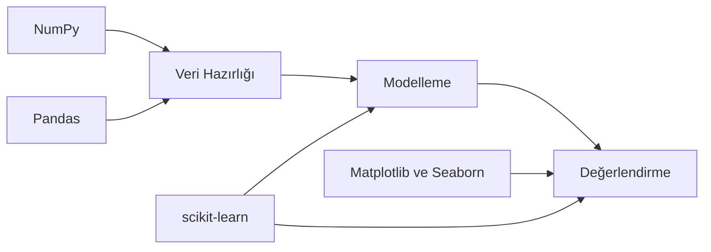

# Python Kütüphaneleri: Veri Analizi ve Modelleme Araçları

Doğrusal istatistik modelleriyle çalışırken kodun önemli bir kısmı, farklı Python kütüphanelerinin birlikte kullanılmasına dayanır.
Bu nedenle modelleme sürecinde kullanılan kütüphanelerin ne yaptığı açık şekilde bilinmelidir.

Bu makalede amaç, sık kullanılan temel kütüphaneleri ezber listesi gibi değil, iş akışı bağlamında açıklamaktır.
Odak, özellikle şu import yapısında geçen araçlardır:

```python
import numpy as np
import pandas as pd
import matplotlib.pyplot as plt
import seaborn as sns

from sklearn.linear_model import LinearRegression
from sklearn.model_selection import train_test_split
```

## Neden kütüphane bilgisi önemlidir?

Bir makine öğrenmesi çalışmasında kodun doğru çalışması tek başına yeterli değildir.
Kodun neden o şekilde yazıldığı da anlaşılmalıdır.

Kütüphaneleri tanımadan yazılan kodda iki sorun sık görülür:

- Gereksiz karmaşık çözümler
- Hatalı metrik veya yöntem seçimi

Kütüphane bilgisi, bu riskleri azaltır ve modelleme sürecini daha bilinçli hale getirir.

## Modelleme iş akışında kütüphanelerin yeri




*Sekil 1: Kütüphanelerin modelleme hattındaki rollerini ve birbirleriyle ilişkisini gösterir.*

Bu akış, her kütüphanenin farklı bir sorumluluğa odaklandığını gösterir.
Birlikte kullanıldıklarında, veri analizi ve modelleme süreci daha hızlı ve düzenli yürür.

## `NumPy` nedir?

`NumPy`, sayısal hesaplama için geliştirilmiş temel Python kütüphanesidir.
Özellikle çok boyutlu diziler (`ndarray`) ve vektörel işlemler için kullanılır.

### Ne işe yarar?

- Hızlı sayısal işlem yapar.
- Matris ve vektör hesaplarını kolaylaştırır.
- İstatistiksel temel işlemler için altyapı sağlar.

### Neden `import numpy as np`?

`np` kısa ad (alias), kod okunabilirliğini artırır.
Topluluk standardı olduğu için farklı projelerde aynı yazım biçimi korunur.

### Mini örnek

```python
import numpy as np

scores = np.array([62, 71, 85, 90, 77])

mean_score = np.mean(scores)
std_score = np.std(scores)

print("Mean:", round(float(mean_score), 2))
print("Std :", round(float(std_score), 2))
```

Bu örnekte `NumPy`, ham liste yerine sayısal dizi yapısı kullanarak işlemleri sadeleştirir.

## `Pandas` nedir?

`Pandas`, tablo biçimindeki verilerle çalışmak için kullanılan kütüphanedir.
`DataFrame` yapısı, veri analizi sürecinin temel taşıdır.

### Ne işe yarar?

- CSV/Excel dosyalarını okumayı kolaylaştırır.
- Sütun bazlı işlem yapmayı hızlandırır.
- Filtreleme, dönüştürme ve özetleme adımlarını düzenler.

### Neden `import pandas as pd`?

`pd` kısa adı, Python ekosisteminde standarttır.
Kodun daha kısa ve tanıdık biçimde yazılmasını sağlar.

### Mini örnek

```python
import pandas as pd

df = pd.DataFrame(
    {
        "study_hours_per_week": [8, 12, 15, 6],
        "final_exam_score": [60, 74, 83, 55],
    }
)

print(df.head())
print(df.describe())
```

Bu yapı, modelleme öncesindeki veri keşfi için pratik bir başlangıç sağlar.

## `Matplotlib` nedir?

`Matplotlib`, Python'da temel grafik çizimi için kullanılan kütüphanedir.
Özellikle `pyplot` modülü üzerinden kontrol sağlanır.

### Ne işe yarar?

- Çizgi, saçılım, histogram gibi temel grafikler üretir.
- Grafik başlık, eksen, etiket ve stil yönetimi sağlar.
- Model sonuçlarını görselleştirmeye yardımcı olur.

### Neden `import matplotlib.pyplot as plt`?

`plt` kısa adı, neredeyse tüm örneklerde aynı şekilde kullanılır.
Bu tutarlılık, kodun hızlı okunmasını sağlar.

### Mini örnek

```python
import matplotlib.pyplot as plt

x = [1, 2, 3, 4, 5]
y = [52, 60, 67, 73, 80]

plt.plot(x, y, marker="o")
plt.title("Çalışma Saatine Göre Not Eğilimi")
plt.xlabel("Haftalık Çalışma Saati")
plt.ylabel("Not")
plt.grid(alpha=0.3)
plt.show()
```

Bu grafik, ilişkiyi tek bakışta görmeyi sağlar.

## `Seaborn` nedir?

`Seaborn`, `Matplotlib` üzerine kurulmuş daha yüksek seviyeli bir görselleştirme kütüphanesidir.
İstatistiksel grafikler için daha hızlı ve estetik çıktılar üretir.

### Ne işe yarar?

- Dağılım ve ilişki grafiklerini daha kolay üretir.
- Varsayılan stil desteği ile okunabilir grafikler sunar.
- Korelasyon ve residual analizi gibi görevlerde pratiktir.

### Neden `import seaborn as sns`?

`sns` kısa adı toplulukta yerleşmiştir.
Kodlarda bu alias ile görmek yaygın olduğu için öğrenme maliyetini düşürür.

### Mini örnek

```python
import seaborn as sns
import pandas as pd
import matplotlib.pyplot as plt

df = pd.DataFrame(
    {
        "study_hours_per_week": [8, 10, 12, 14, 16, 18],
        "final_exam_score": [58, 63, 70, 75, 81, 87],
    }
)

sns.scatterplot(
    data=df,
    x="study_hours_per_week",
    y="final_exam_score",
)
plt.title("Çalışma Saati ve Not İlişkisi")
plt.show()
```

## `scikit-learn` nedir?

`scikit-learn`, klasik makine öğrenmesi algoritmaları ve yardımcı araçlar içeren bir kütüphanedir.
Regresyon, sınıflandırma, model seçimi ve metrik hesapları gibi temel ihtiyaçları kapsar.

Bu makaledeki importlarda iki alt modül kullanılır:

- `linear_model` içinden `LinearRegression`
- `model_selection` içinden `train_test_split`

## `LinearRegression` nedir?

`LinearRegression`, doğrusal regresyon modelini kuran sınıftır.
Amaç, hedef değişken ile açıklayıcı değişkenler arasındaki doğrusal ilişkiyi öğrenmektir.

### Ne işe yarar?

- Eğitim verisinden katsayıları öğrenir (`fit`).
- Yeni gözlemler için tahmin üretir (`predict`).
- Baseline model olarak güçlü bir başlangıç sağlar.

### Mini örnek

```python
import pandas as pd
from sklearn.linear_model import LinearRegression

df = pd.DataFrame(
    {
        "study_hours_per_week": [5, 8, 10, 12, 14],
        "final_exam_score": [50, 59, 66, 72, 78],
    }
)

X = df[["study_hours_per_week"]]
y = df["final_exam_score"]

model = LinearRegression()
model.fit(X, y)

pred = model.predict(pd.DataFrame({"study_hours_per_week": [11]}))
print("Predicted score:", round(float(pred[0]), 2))
```

## `train_test_split` nedir?

`train_test_split`, veriyi eğitim ve test bölümlerine ayıran yardımcı fonksiyondur.
Modelin yalnızca eğitim verisiyle öğrenmesi, test verisiyle değerlendirilmesi için kullanılır.

### Ne işe yarar?

- Genelleme performansını ölçmeyi mümkün kılar.
- Overfitting riskini fark etmeyi kolaylaştırır.
- Tek satırla güvenilir veri bölme sağlar.

### Mini örnek

```python
import pandas as pd
from sklearn.model_selection import train_test_split

df = pd.DataFrame(
    {
        "hours": [2, 4, 6, 8, 10, 12, 14, 16],
        "score": [40, 48, 55, 63, 70, 76, 82, 88],
    }
)

X = df[["hours"]]
y = df["score"]

X_train, X_test, y_train, y_test = train_test_split(
    X, y, test_size=0.25, random_state=42
)

print("Train size:", len(X_train))
print("Test size :", len(X_test))
```

## Import satırları neden bu sırada yazılır?

Python projelerinde import sırası çoğu ekipte belirli bir düzen izler:

1. Genel sayısal/veri kütüphaneleri (`numpy`, `pandas`)
2. Görselleştirme araçları (`matplotlib`, `seaborn`)
3. Modelleme ve makine öğrenmesi modülleri (`sklearn`)

Bu sıralama teknik zorunluluk değildir ancak okunabilirliği artırır.

## Kütüphaneleri birlikte düşünme

Aşağıdaki kısa akış, kütüphanelerin beraber nasıl çalıştığını gösterir:

```python
import numpy as np
import pandas as pd
import matplotlib.pyplot as plt
from sklearn.linear_model import LinearRegression
from sklearn.model_selection import train_test_split

df = pd.DataFrame(
    {
        "hours": [3, 5, 7, 9, 11, 13, 15, 17],
        "score": [44, 52, 58, 64, 71, 77, 83, 89],
    }
)

X = df[["hours"]]
y = df["score"]

X_train, X_test, y_train, y_test = train_test_split(
    X, y, test_size=0.25, random_state=42
)

model = LinearRegression()
model.fit(X_train, y_train)

y_pred = model.predict(X_test)

plt.scatter(X_test["hours"], y_test, label="Actual")
plt.scatter(X_test["hours"], y_pred, label="Predicted")
plt.title("Actual vs Predicted")
plt.xlabel("Hours")
plt.ylabel("Score")
plt.legend()
plt.grid(alpha=0.3)
plt.show()
```

Bu örnekte:

- `Pandas` veri tablosunu kurar.
- `train_test_split` veriyi böler.
- `LinearRegression` modeli eğitir.
- `Matplotlib` sonucu görselleştirir.
- `NumPy` ise arka plandaki sayısal hesaplamaların temelini destekler.

## Sık karışan noktalar

### `NumPy` ve `Pandas` aynı şey mi?

Hayır.
`NumPy` sayısal dizi tabanlıdır.
`Pandas` tablo veri yapısına odaklanır ve çoğu durumda arka planda `NumPy` kullanır.

### `Matplotlib` varken `Seaborn` neden var?

`Matplotlib` daha temel ve ayrıntılı kontrol sunar.
`Seaborn` ise daha hızlı istatistiksel grafik üretimi sağlar.
Birlikte kullanımları yaygındır.

### `LinearRegression` tek başına yeterli mi?

Başlangıç için çoğu senaryoda yeterlidir.
Ancak problem yapısına göre daha gelişmiş veya düzenlileştirilmiş modellere geçmek gerekebilir.

## Kısa karar rehberi

Bir doğrusal modelleme çalışmasında:

- Veri okuma/düzenleme için `Pandas`
- Sayısal işlem için `NumPy`
- Temel model için `LinearRegression`
- Güvenilir değerlendirme için `train_test_split`
- Sonuç anlatımı için `Matplotlib` ve gerektiğinde `Seaborn`

kombinasyonu pratik ve sağlam bir başlangıç sunar.

## Sonuç

Kütüphaneler yalnızca kodu kısa yazmak için değil, doğru düşünme biçimini kurmak için kullanılır.
Hangi aracın hangi sorunu çözdüğünü bilmek, modelleme kalitesini doğrudan etkiler.

Bu makalede ele alınan altı yapı, doğrusal istatistik modelleme sürecinin temel omurgasını oluşturur:

- `numpy`
- `pandas`
- `matplotlib.pyplot`
- `seaborn`
- `LinearRegression`
- `train_test_split`

Bu çerçeve oturduğunda, sonraki makalelerde geçen kod blokları daha hızlı ve doğru şekilde yorumlanabilir.