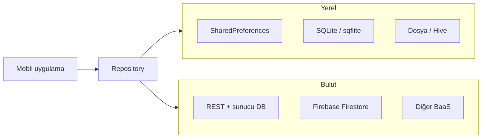
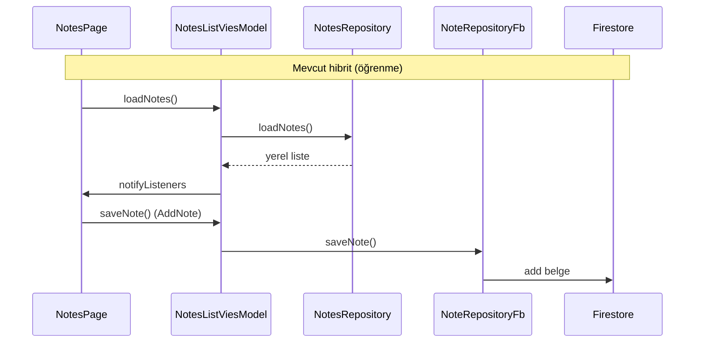

# Yerel ve Bulut Veritabanları: Mobil Uygulamalarda Veri Depolama

**Önceki yazılarda MVVM ve Repository ile veri erişiminin ekranlardan ayrıldığı, `full_note` projesinde notların önce yerel depoda tutulduğu anlatıldı. Bu yazıda mobil uygulamalarda verinin nerede saklandığı — cihazda mı, bulutta mı — genel çerçevede ele alınır; yerel ve bulut seçenekleri karşılaştırılır, `full_note` üzerinden iki Repository'nin yan yana nasıl durduğu gösterilir.**

---

Mobil uygulama kapatıldığında veri kaybolmamalıdır. Kullanıcı tercihleri, oturum bilgisi, notlar veya sepet içeriği bir sonraki açılışta da erişilebilir olmalıdır. Bu ihtiyaç, **veri kalıcılığı (persistence)** konusunu gündeme getirir.

Pratikte iki ana eksen vardır:

- **Yerel depolama:** Veri cihazda tutulur; ağ bağlantısı olmadan okunup yazılabilir.
- **Bulut depolama:** Veri uzak bir sunucuda veya yönetilen bir hizmette tutulur; birden fazla cihaz veya kullanıcı aynı kaynağı paylaşabilir.

Hangisinin seçileceği teknik bir tercih değildir; ürün gereksinimine bağlıdır. Önemli olan, bu seçimin **Repository katmanında** toplanmasıdır — böylece kaynak değiştiğinde View ve ViewModel aynı kalabilir.

---

## 1. Mobil ortamda veri neden ayrı düşünülür?

Masaüstü veya sunucu tarafı uygulamalarda depolama çoğu zaman tek bir veritabanı sunucusuna dayanır. Mobil tarafta ise şu kısıtlar sürekli hesaba katılır:

| Kısıt | Sonuç |
|-------|--------|
| Ağ kesintisi | Uçak modu, zayıf sinyal, kota sınırı |
| Pil ve bellek | Sürekli sunucu çağrısı maliyetli |
| Gecikme | Her işlem için ağ gecikmesi kullanıcı deneyimini yavaşlatır |
| Çoklu cihaz | Aynı hesap telefon ve tablette kullanılabilir |
| Güvenlik | Cihazda ve bulutta farklı tehdit modelleri vardır |

Bu nedenle mobil projelerde sık görülen yaklaşımlar şunlardır:

- Yalnızca yerel depo (çevrimdışı uygulamalar, basit araçlar)
- Yalnızca bulut (hesap tabanlı, senkron odaklı uygulamalar)
- **Hibrit:** Önce yerel, arka planda bulutla senkron (offline-first)

`full_note` projesi bu geçişi adım adım gösterir: önce `SharedPreferences` ile yerel kayıt, ardından Firebase Firestore ile bulut kaydı.

---

## 2. Yerel depolama seçenekleri

**Yerel depolama**, verinin uygulamanın çalıştığı cihazda — telefon veya emülatörde — saklanmasıdır. İnternet gerekmez; veri uygulama silinene veya kullanıcı temizleyene kadar kalır.

### 2.1 `SharedPreferences`: anahtar-değer deposu

**`SharedPreferences`**, Flutter'da en hafif kalıcılık yoludur. Küçük ayarlar ve basit veri listeleri için uygundur: tema tercihi, son açılan sekme, birkaç düz metin alanı.

Çalışma mantığı **anahtar-değer (key-value)** modeline dayanır. `String`, `int`, `bool` veya `String` listesi gibi sınırlı tipler desteklenir. İlişkisel sorgu (`WHERE title LIKE ...`) veya karmaşık tablo yapısı yoktur.

`full_note` projesindeki `NotesRepository` bu yolu kullanır:

```dart
class NotesRepository {
  static const String prefStringListKey = 'notes';

  Future<List<Note>> loadNotes() async {
    final prefs = await SharedPreferences.getInstance();
    final notesData = prefs.getStringList(prefStringListKey) ?? [];

    return notesData.map((noteString) {
      final noteMap = jsonDecode(noteString) as Map<String, dynamic>;
      return Note(
        id: noteMap['id'] as String,
        title: noteMap['title'] as String,
        content: noteMap['content'] as String,
      );
    }).toList();
  }
}
```

Her not JSON string'e çevrilip bir liste halinde saklanır. Az sayıda kayıt için yeterlidir; yüzlerce not, arama ve sıralama gerektiğinde yapı zorlanır.

**Ne zaman tercih edilir?**

- Kullanıcı ayarları, onboarding bayrakları
- Küçük, düz listeler (birkaç onlarca kayıt)
- Hızlı prototip ve öğrenme projeleri

**Sınırlar:** İlişkisel veri modeli yok, büyük veri setlerinde performans düşer, şifreleme yerleşik değildir.

### 2.2 SQLite ve `sqflite`: ilişkisel yerel veritabanı

**SQLite**, cihazda çalışan gömülü bir **ilişkisel veritabanı** motorudur. Tablolar, satırlar, kolonlar ve SQL sorguları (`SELECT`, `INSERT`, `JOIN`) desteklenir. Flutter tarafında en yaygın paket **`sqflite`**'dır.

Örnek kullanım alanları:

- Mesaj geçmişi, takvim kayıtları
- Çevrimdışı okunabilir makale arşivi
- Filtreleme ve sıralama gerektiren listeler

`SharedPreferences` ile karşılaştırıldığında SQLite daha fazla kurulum ister (tablo şeması, migration), ancak veri büyüdükçe ölçeklenir.

### 2.3 Dosya sistemi ve nesne depoları

Büyük dosyalar (görsel, PDF, ses) doğrudan uygulama dizinine yazılabilir. Yapılandırılmış metin verisi için **`path_provider`** ile dizin alınır, dosya okunur/yazılır.

**Hive**, **Isar** gibi paketler ise SQLite'a alternatif **nesne tabanlı** yerel depolar sunar; şema tanımı ve hızlı okuma/yazma için tercih edilebilir.

Yerel seçeneklerin özeti:

| Yöntem | Veri modeli | Tipik kullanım | Ölçek |
|--------|-------------|----------------|-------|
| `SharedPreferences` | Anahtar-değer | Ayarlar, küçük listeler | Düşük |
| SQLite / `sqflite` | İlişkisel tablo | Listeler, filtre, sıralama | Orta–yüksek |
| Dosya / Hive / Isar | Dosya veya nesne | Medya, önbellek, hızlı KV | Değişken |

---

## 3. Bulut depolama seçenekleri

**Bulut depolama**, verinin uygulama dışındaki bir sunucuda veya yönetilen bir platformda tutulmasıdır. Kullanıcı cihaz değiştirdiğinde veriye yeniden erişebilir; birden fazla istemci aynı kaynağı güncelleyebilir.

### 3.1 Kendi backend'iniz: REST API + veritabanı

Klasik model: mobil uygulama HTTP istekleri atar, sunucu PostgreSQL, MySQL veya MongoDB gibi bir veritabanına yazar. Tam kontrol sağlar; sunucu kurulumu, güvenlik, ölçekleme ve bakım sizin sorumluluğunuzdadır.

Repository bu senaryoda `http` veya `dio` paketiyle API uç noktalarını çağırır; JSON cevabını `Model` sınıflarına dönüştürür.

### 3.2 Backend-as-a-Service (BaaS)

Sunucu altyapısının büyük kısmını sağlayan platformlar vardır. **Firebase** (Google), **Supabase**, **AWS Amplify** bu gruba girer. Kimlik doğrulama, gerçek zamanlı dinleme ve dosya depolama gibi özellikler paket halinde gelir; mobil ekip yalnızca istemci ve veri modeline odaklanır.

### 3.3 Firebase Firestore

**Firestore**, Firebase'in belge tabanlı (document-oriented) **NoSQL** veritabanıdır. Veri **koleksiyon (collection)** ve **belge (document)** hiyerarşisinde tutulur; her belge alan-değer çiftlerinden oluşur.

Örnek yapı (`full_note` için):

```text
notes/                    ← koleksiyon
  abc123/                 ← belge kimliği (otomatik üretilir)
    title: "Alışveriş"
    content: "Süt, ekmek"
    createdAt: <sunucu zaman damgası>
  def456/
    title: "Toplantı notları"
    ...
```

**NoSQL** terimi, verinin sabit tablo şeması yerine esnek belge yapısında tutulduğunu ifade eder. İlişkisel veritabanlarındaki `JOIN` yerine denormalizasyon veya alt koleksiyonlar kullanılır.

Firestore'un mobil taraftaki güçlü yönleri:

- **Gerçek zamanlı dinleme:** `snapshots()` ile koleksiyon değişince arayüz otomatik güncellenebilir
- **Çevrimdışı önbellek:** SDK, ağ yokken yerel önbellekten okuyabilir (platform ve yapılandırmaya bağlı)
- **Sunucu zaman damgası:** `FieldValue.serverTimestamp()` ile tutarlı `createdAt` alanı

---

## 4. Yerel ve bulut: ne zaman hangisi?

Tek doğru cevap yoktur; gereksinim matrisi karar vermeyi kolaylaştırır:

| Gereksinim | Yerel | Bulut |
|------------|-------|-------|
| İnternet olmadan tam işlev | Güçlü | Zayıf (önbellek hariç) |
| Cihazlar arası senkron | Zayıf | Güçlü |
| Kurulum hızı (öğrenme / MVP) | `SharedPreferences` hızlı | Firebase hızlı kurulur |
| Karmaşık sorgular | SQLite uygun | Firestore sınırlı sorgu modeli |
| Veri güvenliği / uyumluluk | Cihazda kalır | Sunucu politikası gerekir |
| Maliyet | Cihaz depolaması | Okuma/yazma kotası, trafik |



*Şekil 1: Uygulama katmanları veri kaynağını doğrudan değil, Repository üzerinden seçer.*

Çoğu üretim uygulaması **hibrit** çalışır: kritik veri önce yerelde, arka planda buluta gönderilir; ağ gelince senkron tamamlanır. `full_note`'ta geçiş bilinçli olarak kademeli yapılmıştır — okuma hâlâ yerelden, yazma Firestore'a yönlendirilmiştir.

---

## 5. Repository ile kaynak değiştirmek

Önceki mimari yazıda Repository'nin amacı, ViewModel'in veri kaynağını bilmemesiydi. Yerelden buluta geçişte bu ayrım somutlaşır:

| Sınıf | Kaynak | Rol |
|-------|--------|-----|
| `NotesRepository` | `SharedPreferences` | Yerel okuma/yazma |
| `NoteRepositoryFb` | Firestore | Bulut okuma/yazma |

Bulut tarafındaki Repository:

```dart
class NoteRepositoryFb {
  Stream<List<Note>> loadNotes() {
    return FirebaseFirestore.instance
        .collection('notes')
        .snapshots()
        .map((snapshot) {
      return snapshot.docs.map((doc) {
        final data = doc.data();
        return Note(
          id: doc.id,
          title: data['title'] ?? '',
          content: data['content'] ?? '',
        );
      }).toList();
    });
  }

  Future<void> saveNote(Note note) async {
    await FirebaseFirestore.instance.collection('notes').add({
      'title': note.title,
      'content': note.content,
      'createdAt': FieldValue.serverTimestamp(),
    });
  }
}
```

`loadNotes` burada `Future` değil **`Stream`** döndürür: Firestore koleksiyonu her değiştiğinde yeni liste akar. Yerel `NotesRepository` ise tek seferlik `Future<List<Note>>` kullanır. ViewModel, hangi kaynağı seçeceğini bilir; View bu ayrıntıyı görmez.

`NoteAddViewModel` kaydetmeyi Firestore'a taşır:

```dart
Future<void> saveNote(Note note) async {
  // await _notesRepository.saveNote(note); // yerel
  await _noteRepositoryFb.saveNote(note);   // bulut
}
```

Liste ekranında okuma henüz yerelde bırakılmıştır; tek satır yorum değiştirilerek buluta geçilebilir. Bu, mimari kararın **kodun tek bir noktasında** toplandığını gösterir.

### 5.1 Kimlik alanı: `int` → `String`

Yerel depoda not kimliği zaman damgasından üretilirken (`DateTime.now().microsecondsSinceEpoch`), Firestore belge kimliğini kendisi atar (`doc.id`). Bu yüzden `Note` modelindeki `id` alanı `String` yapılmıştır — hem yerel hem bulut aynı modeli paylaşabilir.

---

## 6. Firebase'i Flutter projesine bağlamak

Firestore kullanmak için istemci tarafında birkaç adım gerekir. Genel akış şöyledir:

1. [Firebase Console](https://console.firebase.google.com/) üzerinde proje oluşturulur.
2. Android ve iOS uygulamaları projeye eklenir (paket adı / bundle id eşleşmeli).
3. FlutterFire CLI ile yapılandırma dosyaları üretilir: `firebase_options.dart`, `google-services.json` (Android), `GoogleService-Info.plist` (iOS).
4. `pubspec.yaml`'a `firebase_core` ve `cloud_firestore` eklenir.
5. `main.dart` içinde uygulama başlamadan önce Firebase başlatılır.

```dart
void main() async {
  WidgetsFlutterBinding.ensureInitialized();
  await Firebase.initializeApp(
    options: DefaultFirebaseOptions.currentPlatform,
  );
  runApp(const NoteApp());
}
```

`WidgetsFlutterBinding.ensureInitialized()` çağrısı, `runApp` öncesinde yapılan async işlemler için zorunludur; aksi halde platform kanalları henüz hazır olmayabilir.

Android tarafında `build.gradle` dosyalarına Google Services eklentisi eklenir; iOS tarafında minimum platform sürümü Firestore gereksinimine göre yükseltilebilir. Bu dosyalar proje şablonuna özgüdür; FlutterFire kurulumu çoğunu otomatik yazar.

**Güvenlik notu:** `google-services.json` ve benzeri yapılandırma dosyaları proje kimliği içerir. Açık repolarda commit edilecekse Firebase Console'dan API anahtarı kısıtlaması yapılmalı; hassas kurallar sunucu tarafında değil, **Firestore Security Rules** ile tanımlanmalıdır.

---

## 7. Okuma ve yazmanın farklı kaynaklarda olması

`full_note`'un güncel hâlinde **yazma** Firestore'a, **okuma** yerel depodan yapılır. Bu bilinçli bir öğrenme adımı olabilir; üretimde ise tutarsızlık yaratır — yeni kaydedilen not listede görünmez.

Üretim için tipik yollar:

| Yaklaşım | Açıklama |
|----------|----------|
| Tek kaynak | Hem okuma hem yazma aynı Repository'de (yalnızca Firestore veya yalnızca yerel) |
| Önce yerel, sonra bulut | Yazarken her iki depoya da yaz; okurken birini "doğru kaynak" kabul et |
| Offline-first | Yerel SQLite ana kaynak; arka planda Firestore ile senkron |

Liste ekranını Firestore'a taşımak için `NotesListViesModel` içindeki `loadNotes` yöntemi `Stream` dinleyecek şekilde güncellenmeli; `ChangeNotifier` yerine `StreamBuilder` veya stream aboneliği düşünülmelidir. Bu, bir sonraki geliştirme adımı olarak bırakılmış bir mimari egzersizidir.



*Şekil 2: Okuma yerelden, yazma buluta gider; tam senkron için her iki yön aynı kaynağa alınmalıdır.*

---

## 8. Mobil dünyada yaygın desenler

### 8.1 Tamamen yerel uygulamalar

Hesap gerektirmeyen araçlar (hesap makinesi, yerel not defteri, oyun skor tablosu) çoğu zaman yalnızca yerel depo kullanır. Veri paylaşımı veya yedekleme istenmiyorsa bulut maliyeti gereksizdir.

### 8.2 Hesap merkezli bulut uygulamaları

Sosyal ağ, e-ticaret, iş birliği araçları veriyi sunucuda tutar. Mobil istemci önbellek veya kısa süreli yerel kopya kullanabilir; **doğruluk kaynağı (source of truth)** sunucudadır.

### 8.3 Offline-first

Harita, doküman editörü, saha veri toplama uygulamalarında önce yerel yazılır, bağlantı gelince senkron edilir. Kullanıcı deneyimi kesintisiz kalır; çatışma çözümü (iki cihazda aynı kaydın düzenlenmesi) ayrı bir tasarım konusudur.

### 8.4 Önbellek katmanı

Sık okunan, seyrek değişen veriler (ürün kataloğu, haber başlıkları) REST API'den çekilip yerelde önbelleğe alınır. Ağ yokken son bilinen liste gösterilir; yenileme ile güncellenir.

---

## 9. Karar özeti

Mobil uygulamada veri depolama seçimi şu sorularla netleşir:

- Veri **yalnızca bu cihazda** mı kalmalı?
- **Birden fazla cihaz** veya kullanıcı aynı veriyi görmeli mi?
- **İnternet olmadan** temel işlevler çalışmalı mı?
- Veri **ne kadar büyüyecek**; filtreleme ve ilişkiler gerekli mi?
- **Backend ekibi** var mı, yoksa BaaS ile hız mı öncelikli?

Yanıtlar yerel mi bulut mu sorusunu belirler. Mimari tarafta ise cevap her zaman aynı kalır: ham erişim **Repository**'de toplanır, ViewModel kaynak ayrıntısını bilmez, View yalnızca hazır model listesini gösterir.

`full_note` bu çerçevenin küçük ama eksiksiz bir laboratuvarıdır: `NotesRepository` yerel anahtar-değer yolunu, `NoteRepositoryFb` Firestore yolunu temsil eder. Proje büyüdükçe SQLite önbelleği, güvenlik kuralları veya tam senkron katmanı eklenebilir — temel katman sınırları (View — ViewModel — Repository) korunduğu sürece bu eklemeler kontrollü kalır.

Kavramsal mimari (MVVM, `ChangeNotifier`, katman bağımlılıkları) için **Mimari Örnek: MVVM, Repository ve ChangeNotifier** yazısına; form ve liste arayüzü için **Form Girdileri, Arama Kutusu ve Listede Filtreleme** yazısına bakılabilir.
