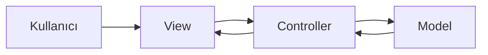
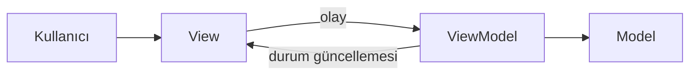
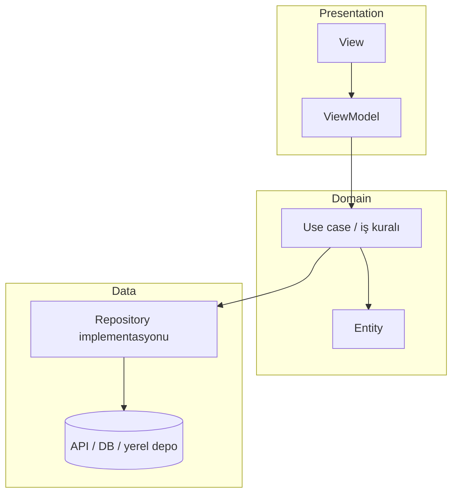

# Mobil Mimariler

**Mobil uygulama geliştirirken yalnızca ekran çizmek yetmez; kodun zaman içinde nasıl organize edileceği de önemlidir. Yazılım mimarisi, bu organizasyonun prensiplerini tanımlar: hangi parça ne iş yapar, birbirine nasıl bağlanır, değişiklik nerede yapılır. Bu yazıda mimarinin ne olduğu ve neden kullanıldığı anlatılır; MVC, MVP, MVVM ve Clean Architecture gibi yaygın yaklaşımlar karşılaştırılır. Flutter’da bu kalıpların nasıl düşünüleceği özetlenir; seçilen yapının kodla birleştirilmesi bir sonraki yazıda ele alınır.**

---

## 1. Yazılım mimarisi nedir?

**Mimari**, bir binanın planı gibi düşünülebilir; fakat burada konu tuğla değil, **kodun sorumlulukları ve ilişkileridir**. Mimari şu sorulara cevap verir:

- Kullanıcı arayüzü nerede durur?
- İş kuralları (ör. “şifre en az sekiz karakter”, “stok sıfırsa satın alma kapalı”) hangi katmanda yazılır?
- Veri diskten mi, ağdan mı gelir; bu ayrıntıyı kim bilir?
- Yeni bir özellik eklendiğinde hangi dosyalar değişir?

**Mimari bir klasör adı değildir.** `lib/view_models/` klasörü açmak tek başına mimari sayılmaz; önemli olan sorumlulukların gerçekten ayrılmasıdır. Klasör yapısı mimariyi **görünür kılar**; asıl mesele **sorumluluk ayrımıdır**.

Mobil projede genelde üç geniş katman konuşulur:

| Katman | Ne yapar? | Örnek (soyut) |
|--------|-----------|----------------|
| **Sunum (presentation)** | Ekran, dokunma, navigasyon | `LoginScreen`, `ProductListScreen` |
| **İş / uygulama mantığı** | Ekrana özel durum ve komutlar | `LoginViewModel`, `ProductListViewModel` |
| **Veri** | Okuma, yazma, önbellek, API | Servis / depo erişim katmanı |

Bu katmanlar her zaman ayrı modül veya paket olmak zorunda değildir; küçük uygulamada aynı `lib/` altında klasörlerle de ayrılabilir. Önemli olan **bağımlılık yönü**: sunum katmanı veri kaynağının nasıl çalıştığını bilmemeli; veri katmanı ekranın hangi rengi kullandığını bilmemelidir.

---

## 2. Mimari neden kullanılır?

Mimari, yalnızca çok büyük projeler için değildir. İki ekranlı bir uygulamada bile şu sorular çıkar: liste nerede tutulur, oturum bilgisi nereye yazılır, ikinci ekran eklendiğinde kod nereye kopyalanır?

### 2.1 Okunabilirlik

Sorumluluklar net olduğunda, “liste neden güncellenmiyor?” sorusunda önce iş mantığı ve veri katmanına bakılır; yüzlerce satırlık tek bir `State` sınıfında arama yapılmaz.

### 2.2 Değişime dayanıklılık

Bugün veri yerel depoda; yarın REST API veya bulut servisi kullanılabilir. Veri erişimi tek bir yerde toplanmışsa ekranlar çoğu zaman **aynı kalır**; yalnızca veri katmanının içi değişir. Mimari olmadan her ekrandaki ham API veya depo çağrısı tek tek güncellenmek zorunda kalır.

### 2.3 Test edilebilirlik

İş kuralı widget içindeyse test için tüm widget ağacı kurulması gerekir. İş mantığı ve veri erişimi ayrıldığında, “geçersiz giriş reddedilir mi?” gibi senaryolar **UI olmadan** denenebilir.

### 2.4 Ekip çalışması

Biri arayüz, biri veri katmanı üzerinde çalışırken çakışma azalır. Arayüz geliştiricisi hazır veri ve komutlara güvenir; JSON veya veritabanı şemasını bilmesi gerekmez.

### 2.5 Tekrar kullanım

Aynı kullanıcı profili hem ayarlar hem ana sayfada gösterilecekse, profil mantığının tek yerde olması kopya hatayı önler.

Özetle mimari, **kısa vadede biraz daha fazla yapı**, **uzun vadede ise bakım maliyetini düşürmek** için kullanılır.

---

## 3. Mimari olmadan geliştirme: ne ters gider?

Başlangıçta her şeyi tek `StatefulWidget` içinde yazmak doğaldır. Proje büyüdükçe aynı dosyada biriken sorumluluklar sorun üretir.

```dart
class _ProductListScreenState extends State<ProductListScreen> {
  final List<Product> _items = [];

  Future<void> _loadFromApi() async {
    final response = await http.get(Uri.parse('https://api.example.com/products'));
    // parse, hata kontrolü, setState...
  }

  void _onBuyPressed(Product product) {
    // sepet mantığı, validasyon, setState...
  }
}
```

Bu örnekte üç farklı “iş” iç içe geçmiştir:

1. **Arayüz:** `ListView`, düğmeler, yükleme göstergesi.
2. **Durum:** Bellekteki ürün listesi, seçili öğe.
3. **Veri erişimi:** HTTP isteği, JSON ayrıştırma, hata yönetimi.

Sonuçlar tipik olarak şunlardır:

- **İkinci ekran** aynı API’yi farklı URL veya farklı modelle çağırırsa veri tutarsız kalır.
- **İş kuralı** bir yerde var, başka yerde yoktur.
- **`setState` unutulursa** veri değişmiş olsa da arayüz güncellenmez.
- **Test** zorlaşır; her şey widget’a bağlıdır.

Mimari, bu işleri **ayrı katmanlara** taşımayı hedefler:

| Soru | Cevap veren katman |
|------|-------------------|
| Taşınan veri nedir? | **Model** |
| Veri nereden okunur / yazılır? | **Veri katmanı** |
| Bu ekranda ne yapılır, durum ne? | **ViewModel** (veya Presenter / Controller) |
| Kullanıcı ne görür, neye dokunur? | **View** |

---

## 4. Mimari kalıp (pattern) nedir?

**Mimari kalıp**, yıllar içinde tekrar eden sorunlara önerilen çözüm şablonudur. “MVVM kullanıyoruz” demek, Model–View–ViewModel rollerinin nasıl paylaşılacağını kabul etmek demektir.

Kalıp seçimi mutlak doğru/yanlış değildir; ekip alışkanlığı, proje büyüklüğü ve test ihtiyacına göre değişir. Mobil ve Flutter dünyasında en sık karşılaşılanlar MVC, MVP, MVVM ve büyüyen projelerde **Clean Architecture** (veya ondan esinlenen katmanlı yapılardır).

---

## 5. MVC: Model — View — Controller

**MVC**, en eski ve en yaygın ayrımlardan biridir.

| Bileşen | Görevi |
|---------|--------|
| **Model** | Veri ve temel veri kuralları |
| **View** | Kullanıcıya gösterilen arayüz |
| **Controller** | Kullanıcı girdisini alır, Model’i günceller, View’ı yenilemeye yönlendirir |



*Şekil 1: MVC’de kullanıcı View ile etkileşir; Controller iş mantığını ve Model güncellemesini yürütür.*

**Flutter’daki gerçek:** `StatefulWidget` + `State` sınıfı çoğu zaman hem **View** (`build`) hem **Controller** (`onPressed`, `setState`) görevini üstlenir. Bu yüzden “Flutter’da MVC var mı?” sorusunun cevabı genelde “kısmen, ama Controller ile View sık sık birleşir” şeklindedir.

**Artıları:** Basit projelerde anlaşılması kolay.  
**Eksileri:** `State` şişer; test ve yeniden kullanım zorlaşır.

---

## 6. MVP: Model — View — Presenter

**MVP**, View’ı daha **pasif** tutmayı hedefler. Presenter, iş mantığını taşır; View yalnızca çizer ve olayları Presenter’a iletir.

| Bileşen | Görevi |
|---------|--------|
| **Model** | Veri |
| **View** | Pasif arayüz; Presenter tarafından güncellenir |
| **Presenter** | View’dan bağımsız; Model ile konuşur, View’a ne gösterileceğini söyler |

Presenter, widget ağacından **ayrı bir sınıftır** ve mümkün olduğunca `BuildContext` taşımaz. Bu, birim test için MVC’ye göre daha uygun bir zemindir.

**Flutter’da:** Presenter ile `StatefulWidget` manuel bağlanır; hazır çerçeve yoktur. “İş mantığı widget dışında olsun” fikri MVP ile netleşir; günümüzde birçok ekip bunu MVVM ve state management paketleriyle sürdürür.

---

## 7. MVVM: Model — View — ViewModel

**MVVM**, mobil ve reaktif arayüzlerde sık tercih edilir. ViewModel, ekranın **durumunu ve komutlarını** taşır; View bu durumu gösterir.

| Bileşen | Görevi |
|---------|--------|
| **Model** | Taşınan veri (kullanıcı, ürün, sipariş vb.) |
| **View** | Widget ağacı; mümkün olduğunca “aptal” kalır |
| **ViewModel** | `login()`, `loadItems()`, `isLoading` gibi komutlar ve durum |



*Şekil 2: ViewModel, View ile veri katmanı arasında aracıdır; View veri kaynağını doğrudan bilmez.*

**Neden Flutter projelerinde MVVM sık önerilir?**

- UI (`Widget`) ile iş mantığı (`ViewModel` sınıfı) **dosya düzeyinde** ayrılır.
- Ekran başına bir ViewModel mantıklıdır: giriş ekranı ve liste ekranı farklı ViewModel’ler kullanabilir.
- View, ViewModel’deki durumu **yansıtır**; bu yansımanın Flutter’da nasıl kurulacağı uygulama yazısında ele alınır.

MVVM, View ile iş mantığını ayırır; fakat **verinin hangi kaynaktan geleceğini** (API, veritabanı, yerel depo) tek başına tanımlamaz. Bu boşluk pratikte ViewModel’lerin içine HTTP veya depo kodunun girmesiyle kapanır; veri erişimini düzenlemek için ayrı **yazılım desenleri** (ör. Repository) kullanılır — bunlar bir sonraki yazıda ele alınır.

---

## 8. Clean Architecture: katmanlı ve içe bağımlı yapı

**Clean Architecture** (Robert C. Martin / “Uncle Bob”), tek bir ekran kalıbı değil; uygulamayı **iç içe katmanlara** bölen ve **bağımlılık yönünü** netleştiren bir yaklaşımdır. MVC, MVP veya MVVM “sunum katmanında roller nasıl paylaşılır?” sorusuna cevap verirken; Clean Architecture “tüm uygulama nasıl katmanlanır, iç katman dış detayları bilmez” sorusuna odaklanır.

Pratikte sık görülen üç katman özeti:

| Katman | Görevi | Örnek içerik |
|--------|--------|----------------|
| **Presentation (sunum)** | UI, kullanıcı olayları, ekran durumu | Widget’lar, ViewModel, sayfa geçişi |
| **Domain (iş / uygulama)** | İş kuralları, use case’ler | `PlaceOrder`, `ValidateLogin`; entity’ler |
| **Data (veri)** | Veri kaynağı implementasyonu | Repository somut sınıfları, API istemcisi, yerel DB |



*Şekil 3: Clean Architecture’da bağımlılıklar içe doğru akar; dış katmanlar iç katmanı kullanır, iç katman UI veya API ayrıntısını bilmez.*

### 8.1 Temel kural: bağımlılık yönü

Clean Architecture’ın özü **Dependency Rule** (bağımlılık kuralı)dır:

- **Dış katman** iç katmanı bilir ve onu çağırır.
- **İç katman** dış katmanı bilmez: domain, Flutter widget’ından veya HTTP kütüphanesinden habersiz kalır.

Bu sayede API değişince yalnızca data katmanı; tasarım değişince yalnızca presentation katmanı etkilenir. İş kuralları ortada sabit kalabilir.

Somut örnek: “Sipariş ver” use case’i stok kontrolü yapar; veriyi nereden okuduğunu bilmez. Repository **arayüzü** domain’de tanımlanır (`abstract class OrderRepository`), implementasyon data katmanında yazılır. ViewModel use case’i çağırır; doğrudan `http.get` kullanmaz.

### 8.2 Clean Architecture ile MVVM ilişkisi

İkisi **rakip değil**, farklı seviyede çalışır:

- **MVVM** çoğu zaman **presentation** katmanının iç yapısıdır (View + ViewModel).
- **Repository** çoğu zaman **data** katmanında somutlaşır; domain tarafında arayüz olarak tanımlanabilir.
- **Use case** (veya “interactor”), domain’de tek bir iş akışını temsil eder; ViewModel ince kalır.

Yani “Clean Architecture kullanıyoruz” demek, ekranda yine MVVM benzeri bir düzen olabileceği anlamına gelir; fark, iş kurallarının ve veri sözleşmelerinin UI’dan **daha sıkı** ayrılmasıdır.

**Artıları:**

- Uzun ömürlü projelerde bakım ve test kolaylaşır.
- İş kuralları UI ve veri kaynağından bağımsız test edilebilir.
- Ekip büyüdükçe katman sınırları netleşir.

**Eksileri:**

- Küçük projede dosya ve soyutlama sayısı artar (her özellik için use case, her veri kaynağı için arayüz).
- Öğrenme eğrisi MVC/MVVM’e göre daha diktir.
- Aşırı uygulandığında “her satır için üç katman” gereksiz karmaşıklık üretebilir.

**Flutter’da:** Resmî bir Clean Architecture paketi yoktur; `lib/features/...` altında `domain`, `data`, `presentation` klasörleri veya benzeri modül yapıları yaygındır. Büyük ekipli ve çok özellikli uygulamalarda tercih edilir; ders ve orta ölçekli projelerde MVVM + veri katmanı ayrımı çoğu zaman yeterlidir.

---

## 9. Kalıp karşılaştırması

| Özellik | MVC | MVP | MVVM | Clean Architecture |
|---------|-----|-----|------|-------------------|
| Odak | Üç rol: Model, View, Controller | Pasif View + Presenter | View + ViewModel + Model | Katmanlar ve bağımlılık yönü |
| İş mantığı nerede? | Controller (çoğu zaman `State`) | Presenter | ViewModel (ve isteğe bağlı domain) | Domain / use case |
| View’ın rolü | Olay iletir, çizer | Pasif | Durumu ViewModel’den alır | Presentation katmanında çizer |
| Veri erişimi | Genelde Controller/Model içinde dağınık | Presenter veya Model üzerinden | ViewModel + veri katmanı (sonraki yazı) | Data katmanı; domain arayüzü |
| Flutter uyumu | Doğal ama birleşik `State` | Manuel bağlama | Yaygın; ViewModel ayrımı | Klasör/modül disiplini; ölçekli projeler |
| Test | Zor (`State` şişkin) | Presenter test edilebilir | ViewModel test edilebilir | Domain ve data ayrı test edilebilir |
| Tipik proje ölçeği | Küçük, öğrenme | Orta | Orta–büyük | Büyük, uzun ömürlü, ekip |

### 9.1 Hangi yaklaşım ne zaman?

- **Tek ekranlı, kısa ömürlü prototip:** Katman zorunlu değildir; düz `StatefulWidget` (fiilen MVC’ye yakın, birleşik State) yeterli olabilir.
- **Birkaç ekran, yerel veya ağ verisi:** İş mantığını View’dan ayırmak gerekir; **MVP** veya **MVVM** uygun başlangıçtır. MVC’nin “şişmiş State” sorunu burada belirginleşir.
- **Büyüyen Flutter projesi, test ve küçük ekip:** **MVVM**; sunum ile iş mantığı net ayrılır, Flutter ekosisteminde yaygındır.
- **Çok özellik, uzun bakım, sıkı iş kuralları, büyük ekip:** **Clean Architecture** (veya domain / data / presentation ayrımı); MVVM presentation içinde kalabilir, veri erişimi data katmanında toplanır.
- **Aşırı soyutlama riski:** Clean Architecture her projeye zorunlu değildir; iki ekranlı uygulamada use case ve arayüz yağmuru bakımı zorlaştırabilir. Ölçeğe göre sadeleştirmek mimari disiplinin parçasıdır.

### 9.2 Özet karar çerçevesi

| İhtiyaç | Öncelikli seçenek |
|---------|-------------------|
| Hızlı öğrenme, az dosya | MVC (birleşik State) veya düz widget |
| UI dışında test edilebilir iş mantığı | MVP, MVVM |
| Flutter’da yaygın pratik, orta ölçek | MVVM |
| İş kuralları merkezi, çok veri kaynağı, uzun ömür | Clean Architecture (+ presentation’da MVVM) |

Bu yazı kalıpları **kavramsal** düzeyde karşılaştırdı. Bir sonraki yazıda (**Mimari Örnek: MVVM, Repository ve ChangeNotifier**) MVVM’in Flutter’daki uygulaması, **Repository** yazılım deseni ve View ile ViewModel’in nasıl bağlanacağı somut örneklerle anlatılır.
