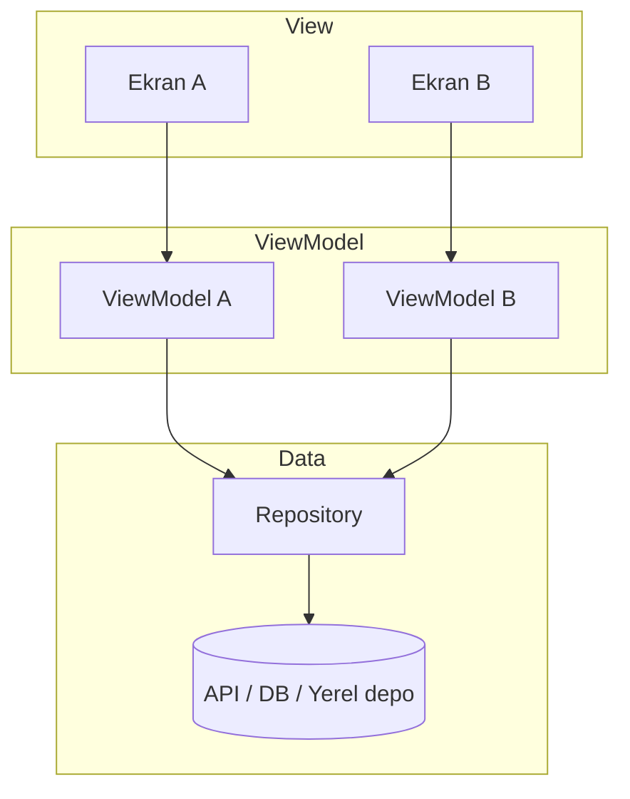
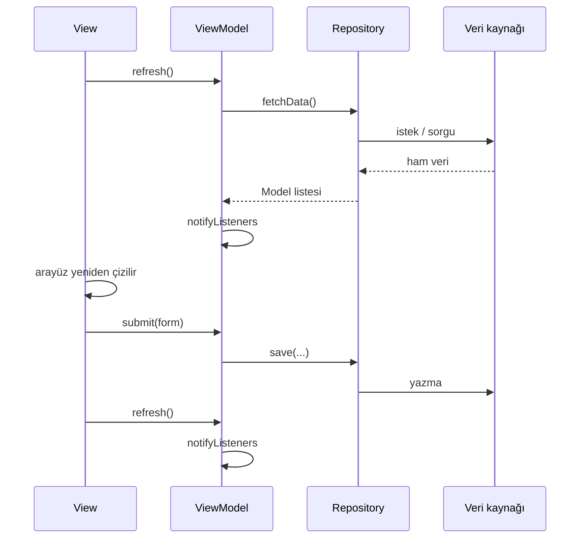

# Mimari Örnek: MVVM, Repository ve ChangeNotifier

**Önceki yazıda MVC, MVP ve MVVM kavramsal olarak karşılaştırıldı; MVVM’in View ile iş mantığını ayırdığı, fakat veri kaynağını tanımlamadığı belirtildi. Bu yazıda Flutter tarafında MVVM nasıl kurulur, bu boşluğu kapatmak için **Repository** yazılım deseni neden eklenir ve arayüz **ChangeNotifier** ile ViewModel’e nasıl bağlanır — genel örneklerle anlatılır.**

---

## 1. MVVM tek başına nerede yetmez?

MVVM üç rolü netleştirir: **Model** (veri), **View** (arayüz), **ViewModel** (ekran durumu ve komutlar). Örneğin liste ekranında ViewModel `refresh()` komutunu ve `isLoading` bayrağını taşır; View yalnızca bunları gösterir.

Ancak MVVM şu soruya **cevap vermez**: `refresh()` veriyi **nereden** alacak?

- REST API mi?
- Yerel veritabanı mı?
- `SharedPreferences` mı?
- Önce önbellek, ağ yoksa disk mi?

Bu ayrıntılar tanımlanmazsa doğal çözüm, her ViewModel içine `http.get`, `jsonDecode` veya depo çağrılarını yazmaktır. İki ekran aynı veriyi kullanınca kod kopyalanır; API değişince birden fazla dosya güncellenir. Yani MVVM arayüzü düzenler, **veri erişimini otomatik düzenlemez**.

---

## 2. Repository: yazılım deseni (mimari kalıp değil)

**Repository**, MVVM’in parçası değildir; **ayrı bir yazılım desenidir**. Amacı, uygulamanın geri kalanına veri kaynağını **tek ve anlamlı bir kapı** üzerinden sunmaktır.

| | MVVM | Repository |
|---|-----|------------|
| Tür | **Mimari kalıp** (roller: View, ViewModel, Model) | **Tasarım deseni** (veri erişimini soyutlama) |
| Ne soruya cevap verir? | Ekranda ne olur, hangi komutlar var? | Veri nereden okunur / yazılır? |
| MVVM’deki yeri | View + ViewModel (+ Model) | Veri katmanı; ViewModel Repository’yi **kullanır** |

Repository ile üst katmanlar `fetchProducts()`, `signIn()`, `getCurrentUser()` gibi **iş anlamlı** metotlara güvenir; altta API, SQLite veya yerel depo değişebilir.

```dart
abstract class AuthRepository {
  Future<User?> getCurrentUser();
  Future<void> signIn({required String email, required String password});
  Future<void> signOut();
}
```

Somut sınıf gerçek API’yi, test için yazılan mock sınıf ise sahte veriyi sağlar. ViewModel HTTP URL’sini bilmez.

### 2.1 MVVM’in eksik bıraktığı alanı nasıl kapatır?

1. **Tek kapı:** Tüm okuma/yazma bir sınıfta (veya arayüz + implementasyon çiftinde) toplanır.
2. **ViewModel incelir:** Yalnızca “yükleniyor → veriyi al → hata/başarı” akışını yönetir; ağ veya depo ayrıntısı Repository’dedir.
3. **Kaynak değişimi:** Bugün REST, yarın farklı backend; ViewModel imzası çoğu zaman aynı kalır.
4. **Test:** Sahte Repository ile ViewModel, UI kurulmadan denenebilir.

Özetle: **MVVM sunumu ve ekran mantığını düzenler; Repository veri erişimini düzenler.** İkisi birlikte, önceki yazıdaki üç katmana Flutter’da şöyle oturur:

| Kavramsal katman | Flutter’daki karşılık |
|------------------|-------------------------|
| Sunum | **View** (widget’lar) |
| İş / uygulama mantığı | **ViewModel** (ekran durumu ve komutlar) |
| Veri | **Repository** (+ **Model**; ham kaynak API/DB) |

MVVM olmadan Repository yalnızca “veri sınıfı” kalır; ekranlar iş kuralını widget içinde taşımaya devam eder. Repository olmadan MVVM’de ViewModel’ler veri kodunu şişirir. Daha **sürdürülebilir** yapı için ikisi birlikte düşünülür.

---

## 3. Katmanların bir arada çalışması

Tipik bir Flutter projesinde sorumluluklar şöyle dağılır:



*Şekil 1: Her ekran kendi ViewModel’ine bağlanır; ham veri erişimi yalnızca Repository üzerinden yapılır.*

**Bağımlılık kuralı:** `views` → `view_models` → `repository` → harici paket. View dosyası `http`, `SharedPreferences` veya veritabanı paketini doğrudan import etmemelidir.

Örnek klasör düzeni:

```text
lib/
  main.dart
  models/
    user.dart
    product.dart
  repository/
    auth_repository.dart
    catalog_repository.dart
  view_models/
    login_view_model.dart
    product_list_view_model.dart
  views/
    login_screen.dart
    product_list_screen.dart
```

İsimler projeye göre değişir; önemli olan **import yönünün** yukarıdaki mantığı korumasıdır.

Aşağıdaki bölümler (4–8) şemadaki parçaları sırayla açıklar: **Model**, **Repository**, **ViewModel**, **View**; ardından View ile ViewModel’in Flutter’da nasıl senkronize edildiği gelir.

---

## 4. Model: taşınan veri

**Model**, uygulamanın “ne taşıdığını” tanımlar: alanlar, tipler. İdeal olarak widget veya API JSON şemasına bağımlı olmaz.

```dart
class User {
  final String id;
  final String displayName;
  final String email;

  const User({
    required this.id,
    required this.displayName,
    required this.email,
  });
}
```

Model’e temel doğrulama (ör. e-posta formatı) konulabilir; ekrana özel akışlar (yükleme göstergesi, sayfa geçişi) ViewModel’de kalır. Model **verinin şekli**; Repository **verinin kaynağı**; ViewModel **veriyle ne yapılacağı**dır.

---

## 5. Repository: uygulamada veri katmanı

Yukarıda Repository’nin MVVM’e neden eklendiği anlatıldı; burada **uygulama içindeki rolü** özetlenir.

Repository **ViewModel değildir**: `isLoading`, hata metni veya boş liste mesajı taşımaz; yalnızca veri okur/yazar. ViewModel ise “kullanıcı giriş yaptı → repository oturumu kaydetti → listeyi yenile” akışını koordine eder.

Pratik kurallar:

- **Tek doğruluk kaynağı:** Endpoint, sorgu, JSON ayrıştırma, hata eşlemesi tek yerde toplanır.
- **Paylaşılan örnek:** Aynı veri kaynağı için birden fazla ekran **aynı** Repository örneğini kullanmalıdır; her ekranda `CatalogRepository()` yeniden oluşturmak tutarsızlık riski doğurur.
- **View ve Repository arasında doğrudan bağ yok:** View yalnızca ViewModel görür; ViewModel Repository’yi çağırır.

---

## 6. ViewModel: ekranın durumu ve komutları

**ViewModel**, belirli bir ekran veya özellik için **durum** ve **komutlar** taşır.

Örnek sorumluluklar:

- Giriş ekranı: `email`, `password`, `isSubmitting`, `login()`
- Liste ekranı: `items`, `isLoading`, `errorMessage`, `refresh()`
- Detay ekranı: `selectedItem`, `toggleFavorite()`

ViewModel, Repository üzerinden veri alır; HTTP veya depo ayrıntısına girmez.

```dart
class ProductListViewModel extends ChangeNotifier {
  ProductListViewModel(this._catalogRepository);

  final CatalogRepository _catalogRepository;

  List<Product> items = [];
  bool isLoading = false;
  String? errorMessage;

  Future<void> refresh() async {
    isLoading = true;
    errorMessage = null;
    notifyListeners();

    try {
      items = await _catalogRepository.fetchProducts();
    } catch (e) {
      errorMessage = 'Ürünler yüklenemedi.';
    } finally {
      isLoading = false;
      notifyListeners();
    }
  }
}
```

`refresh` sırası: durumu “yükleniyor” yap → repository’den oku → sonucu modele yaz → arayüze sinyal gönder. View yalnızca `refresh()` çağırır ve `items` / `isLoading` / `errorMessage` değerlerini okur.

Farklı ekranlar **farklı ViewModel** kullanır; ortak veri kaynağına **aynı Repository örneği** paylaştırılmalıdır.

---

## 7. View: yalnızca arayüz

**View**, Flutter’da `StatelessWidget` / `StatefulWidget` ve altındaki widget ağacıdır. Görevleri:

- Layout, metin, görsel, animasyon çizmek.
- Dokunma ve form olaylarını ViewModel metoduna veya navigasyona yönlendirmek.

View şunları **bilmemelidir**:

- API base URL, header, token yenileme
- Veritabanı tablo adı veya yerel depo anahtarı
- JSON alan adlarının ham hâli (bunlar Repository / Model dönüşümünde kalır)

View şunları **bilir**:

- Hangi ViewModel örneğine bağlı olduğu
- Göstermek için `viewModel.items`, `viewModel.isLoading` gibi hazır alanlar
- Yenilemenin `setState`, `ListenableBuilder` veya `Consumer` ile nasıl yapıldığı (sunum detayı)

Tasarım değiştiğinde iş kuralı dosyaları çoğu zaman dokunulmaz kalır.

---

## 8. View ile ViewModel’i bağlamak: `setState` ve `ChangeNotifier`

Önceki yazıda View’ın ViewModel durumunu **yansıtması** gerektiği söylendi; fakat hangi Flutter mekanizmasıyla yansıtılacağına girilmedi. Bu bölümde o bağ kurulur: önce geçici olarak `setState`, ardından **`ChangeNotifier`** ile ViewModel’den View’a otomatik güncelleme.

MVVM’e geçiş genelde iki adımda yapılır: önce iş mantığı ViewModel’e taşınır; ardından arayüz senkronizasyonu iyileştirilir.

### 8.1 Aşama 1: `setState` ile köprü

İş kuralları ViewModel’deyken View, her değişiklikten sonra `setState` çağırabilir:

```dart
Future<void> _init() async {
  await viewModel.refresh();
  if (mounted) setState(() {});
}
```

Bu **çalışır** ve katman ayrımını büyük ölçüde sağlar. Sorun, yenileme sorumluluğunun View’da kalmasıdır: `setState` unutulursa arayüz eski kalır; aynı ViewModel’i kullanan ikinci bir widget eklendiğinde her yerde `setState` tekrarlanır.

### 8.2 Aşama 2: `ChangeNotifier` — gözlemci modeli

**`ChangeNotifier`**, Flutter’ın sunduğu hafif bir **gözlemci (observer)** mekanizmasıdır (`package:flutter/foundation.dart`). ViewModel durumu değiştirdiğinde `notifyListeners()` çağrılır; abone olan widget’lar yeniden çizilir.

Akış:

1. ViewModel veriyi veya bayrakları günceller (`isLoading`, `items` vb.).
2. `notifyListeners()` çağrılır.
3. `ListenableBuilder` (veya `Provider` / `Consumer`) `builder`’ı yeniden çalıştırır.

View tarafı:

```dart
@override
Widget build(BuildContext context) {
  return ListenableBuilder(
    listenable: viewModel,
    builder: (context, child) {
      if (viewModel.isLoading) {
        return const Center(child: CircularProgressIndicator());
      }
      if (viewModel.errorMessage != null) {
        return Center(child: Text(viewModel.errorMessage!));
      }
      return ListView.builder(
        itemCount: viewModel.items.length,
        itemBuilder: (context, index) {
          final product = viewModel.items[index];
          return ListTile(title: Text(product.name));
        },
      );
    },
  );
}
```

Durum değişince **`setState` gerekmez**; ViewModel sinyal gönderir. Bu, MVVM’in “View, ViewModel durumunu yansıtır” ilkesinin Flutter’daki doğal karşılığıdır.

| Durum | `setState` ile MVVM | `ChangeNotifier` + `ListenableBuilder` |
|-------|---------------------|----------------------------------------|
| İş mantığı yeri | ViewModel | ViewModel |
| Yenileme kimde? | View her seferinde `setState` | ViewModel `notifyListeners` |
| Aynı veriyi iki widget | Ortak State veya çift `setState` | Aynı ViewModel, birden fazla dinleyici |
| Sonraki adım | Elle ViewModel geçirme | `Provider` / `Riverpod` |

Her ViewModel’in `ChangeNotifier` olması şart değildir; yalnızca kayıt yapıp kapanan kısa formlar düz sınıf olarak kalabilir. **Durumu sürekli yansıtan** ekranlar dinlemeyi gerektirir.

`notifyListeners()` yalnızca kullanıcının görmesi gereken bir değişiklikten sonra çağrılmalıdır; gereksiz çağrılar gereksiz yeniden çizim üretir.

---

## 9. Uçtan uca akış (genel)

Aşağıdaki sıra, katmanların pratikte nasıl iş birliği yaptığını gösterir; domain (e-ticaret, haber, sağlık) değişse de akış aynı kalır:



*Şekil 2: View hiçbir adımda veri kaynağına doğrudan gitmez; okuma ve yazma Repository üzerinden yürür.*

1. Ekran açılır → ViewModel veriyi yükler.
2. Repository ham kaynaktan okur, Model döner.
3. ViewModel durumu günceller, arayüze haber verir.
4. Kullanıcı işlem yapar → ViewModel repository’ye yazar, gerekirse listeyi yeniden yükler.

**Tek veri kapısı** Repository + seçilen kaynaktır; View belleğe “tahmini” veri ekleyerek gerçek kaynağı atlamamalıdır.

---

## 10. Sık yapılan mimari hatalar

**Repository’yi her ekranda yeniden oluşturmak.** Aynı veri kaynağı için birden fazla örnek, önbellek ve senkronizasyon tutarsızlığı riski taşır.

**View içinde veri erişimi.** `http.get`, `SharedPreferences` veya veritabanı çağrısı View dosyasında görülüyorsa katman ihlal edilmiş demektir.

**ViewModel’e `BuildContext` vermek.** ViewModel widget ağacından bağımsız kalmalı; navigasyon ve `SnackBar` çoğu zaman View’da kalır.

**Repository’yi ViewModel sanmak.** Yükleme bayrağı, hata metni, boş liste mesajı Repository’ye taşınırsa sorumluluklar karışır.

**`notifyListeners` unutmak.** `ChangeNotifier` kullanılıyorsa sinyal gönderilmezse arayüz eski kalır.

**Model’i API JSON’ına birebir bağlamak.** Serileştirme Repository veya ayrı mapper’da tutulursa API değişince tek nokta güncellenir.

---

## 11. State management paketleriyle ilişki

`Provider`, `Riverpod`, `Bloc` gibi araçlar mimariyi **değiştirmez**; ViewModel örneğini paylaşmayı, dinlemeyi ve yaşam döngüsünü kolaylaştırır. Önce katman sınırları (View — ViewModel — Repository) oturmalı; paketler bu sınırları bozmadan tekrarı azaltır.

---

## 12. Mimari kararları toparlamak

Yeni bir ekran veya özellik eklerken şu sorular yanıtlanabilir olmalıdır:

- **Model:** Taşınan veri hangi sınıftır?
- **Repository:** Okuma ve yazma hangi metotlardan geçer?
- **ViewModel:** Bu ekranın durumu ve komutları nerede?
- **View:** Yalnızca çizim ve olay yönlendirmesi mi yapılıyor?
- **Güncelleme:** Durum değişince arayüz nasıl haberdar ediliyor?

Bu sorular net olduğunda kod yalnızca “çalışan” değil, **büyüyebilen** bir yapıya dönüşür. Kavramsal çerçeve (MVC, MVP, MVVM karşılaştırması) için önceki **Mobil Mimariler** yazısına bakılabilir.
