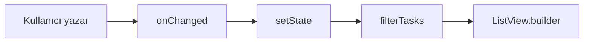

# Form Girdileri, Arama Kutusu ve Listede Filtreleme

**Liste ekranlarında kullanıcı girdisi çoğu zaman yalnızca “yeni kayıt ekle” formuyla sınırlı kalmaz: üstte bir arama kutusu, altta filtrelenmiş satırlar ve tutarlı form stilleri bir arada düşünülür. Bu yazıda `TextField` ve `TextEditingController` ile metin okuma, `InputDecoration` ile görünüm, bellek içi filtreleme ve `Column` + `Expanded` düzeni konu olarak ele alınır; belirli bir uygulama projesi anlatılmaz.**

---

Önceki yazılarda `ListView.builder` ile kaydırılabilir listeler ve MVVM ile katmanlı yapı tanıtıldı. Burada odak, **aynı listede anlık arama** ve **tekrar kullanılabilir form stili** üzerindedir. Veri kaynağı REST API veya yerel depo olabilir; filtreleme mantığı bu yazıda **istemci tarafında**, eldeki liste üzerinde çalışır.

---

## 1. `TextField` ve `TextEditingController`

**`TextField`**, tek satır veya çok satırlı metin girişi için Material bileşenidir. Kullanıcının yazdığı metni okumak, temizlemek veya kaydetmek için çoğu zaman **`TextEditingController`** kullanılır.

**Controller**, metin alanının “dışarıdan okunabilir hafızası” gibidir: `controller.text` ile anlık değer alınır; `controller.clear()` ile alan sıfırlanır.

```dart
final TextEditingController _searchController = TextEditingController();

@override
void dispose() {
  _searchController.dispose();
  super.dispose();
}
```

- **`dispose`:** `StatefulWidget` yok edilirken controller serbest bırakılır; aksi halde bellek sızıntısı riski doğar.
- **Kural:** `TextEditingController` oluşturulduğu `State` içinde `dispose` edilmelidir.

Arama kutusu örneği:

```dart
TextField(
  controller: _searchController,
  decoration: const InputDecoration(
    hintText: 'Ara...',
    prefixIcon: Icon(Icons.search),
  ),
  onChanged: (_) {
    setState(() {});
  },
)
```

**`onChanged`:** Her tuş vuruşunda çağrılır. Filtrelenmiş listeyi yeniden çizmek için `setState` ile `build` tetiklenir; aksi halde controller’daki metin değişse bile ekran eski liste ile kalır.

---

## 2. `InputDecoration`: etiket, ipucu ve kenarlık

**`InputDecoration`**, `TextField`’ın etrafındaki görsel ve metinsel katmandır: `labelText`, `hintText`, `prefixIcon`, `suffixIcon`, dolgu rengi, kenarlık şekli.

| Alan | Rol |
|------|-----|
| `labelText` | Odaklanınca veya dolu alanda üstte görünen etiket |
| `hintText` | Boşken içeride soluk ipucu |
| `prefixIcon` | Solda ikon (arama, başlık vb.) |
| `suffixIcon` | Sağda ikon veya düğme (temizle, göster/gizle) |
| `filled` / `fillColor` | Arka plan dolgusu |
| `enabledBorder` / `focusedBorder` | Normal ve odaklı kenarlık |

Odaklı ve normal durumda farklı kenarlık vermek yaygındır:

```dart
enabledBorder: OutlineInputBorder(
  borderRadius: BorderRadius.circular(12),
  borderSide: BorderSide(color: Colors.grey.shade300),
),
focusedBorder: OutlineInputBorder(
  borderRadius: BorderRadius.circular(12),
  borderSide: const BorderSide(color: Colors.indigo),
),
```

### Ortak stil fonksiyonu

Aynı kenarlık ve dolgu birden fazla `TextField`’da tekrarlanıyorsa, **`InputDecoration` döndüren bir yardımcı fonksiyon** yazılabilir. Bu bir “widget sınıfı” olmak zorunda değildir; proje küçükken fonksiyon yeterlidir.

```dart
InputDecoration searchFieldDecoration({
  required String hintText,
  Widget? suffixIcon,
}) {
  return InputDecoration(
    hintText: hintText,
    prefixIcon: const Icon(Icons.search),
    suffixIcon: suffixIcon,
    filled: true,
    fillColor: Colors.white,
    enabledBorder: OutlineInputBorder(
      borderRadius: BorderRadius.circular(12),
      borderSide: BorderSide(color: Colors.grey.shade300),
    ),
    focusedBorder: OutlineInputBorder(
      borderRadius: BorderRadius.circular(12),
      borderSide: const BorderSide(color: Colors.indigo),
    ),
  );
}
```

Form ekranında `labelText` gerekirken arama kutusunda yalnızca `hintText` kullanılabilir; isteğe bağlı parametreler (`labelText`, `suffixIcon`) ile tek fonksiyon esnetilir.

---

## 3. Arama kutusunda “temizle” düğmesi

Kullanıcı yazdıkça sağda bir **kapat** ikonu göstermek için `suffixIcon`, controller metnine bağlanır. Metin boşken ikon gösterilmez; doluysa `IconButton` ile `clear()` çağrılır.

```dart
suffixIcon: _searchController.text.isEmpty
    ? null
    : IconButton(
        icon: const Icon(Icons.close),
        onPressed: () {
          _searchController.clear();
          setState(() {});
        },
      ),
```

`onPressed` içinde de `setState` gerekir; aksi halde ikon kaybolmaz ve liste filtrelenmiş halde kalabilir.

---

## 4. Bellek içi filtreleme

Sunucuya istek atmadan, **eldeki liste** üzerinde filtre yapmak için `Iterable.where` uygun bir araçtır. Kullanıcı sorgusu küçük harfe çevrilir; her öğenin aranan alanları da aynı biçimde karşılaştırılır.

```dart
class Task {
  final String title;
  final String description;

  const Task({required this.title, required this.description});
}

List<Task> filterTasks(List<Task> source, String rawQuery) {
  final query = rawQuery.trim().toLowerCase();
  if (query.isEmpty) return source;

  return source
      .where(
        (task) =>
            task.title.toLowerCase().contains(query) ||
            task.description.toLowerCase().contains(query),
      )
      .toList();
}
```

- **`trim`:** Baştaki ve sondaki boşlukları yok sayar.
- **`toLowerCase`:** Türkçe karakterlerde tam eşleşme garantisi vermez; ileri senaryolarda `package:intl` ile `toLowerCase` yerelleştirmesi düşünülebilir. Başlangıç seviyesinde basit `contains` yeterlidir.
- **Boş sorgu:** Tüm liste döndürülür; arama kutusu silindiğinde tam liste geri gelir.

`build` içinde tipik kullanım:

```dart
final filtered = filterTasks(allTasks, _searchController.text);
```

Filtre sonucu `ListView.builder`’a `itemCount: filtered.length` ve `itemBuilder` içinde `filtered[index]` ile verilir.



*Şekil 1: Her tuşta controller güncellenir, filtre yeniden hesaplanır ve liste yeniden çizilir.*

---

## 5. Düzen: sabit arama alanı + kaydırılabilir liste

Arama kutusu üstte sabit kalmalı, liste altta kalan yüksekliği doldurmalıdır. **`Column`** alt alta dizim sağlar; **`Expanded`**, kalan dikey alanı `ListView`’e verir.

```dart
body: Column(
  crossAxisAlignment: CrossAxisAlignment.stretch,
  children: [
    Padding(
      padding: const EdgeInsets.fromLTRB(12, 8, 12, 8),
      child: TextField(
        controller: _searchController,
        decoration: searchFieldDecoration(
          hintText: 'Görev ara...',
          suffixIcon: /* temizle ikonu */,
        ),
        onChanged: (_) => setState(() {}),
      ),
    ),
    Expanded(
      child: _buildTaskList(filtered),
    ),
  ],
),
```

- **`crossAxisAlignment: CrossAxisAlignment.stretch`:** Arama alanı yatayda tam genişlikte uzanır.
- **`Expanded` olmadan `ListView`:** `Column` içinde sınırsız yükseklik isteyen `ListView`, “unbounded height” hatasına yol açabilir.

Bu düzen, **Ana Sayfa, Navigator ve UI Bileşenleri** yazısındaki `Column` / `Expanded` konusunun liste ekranındaki pratik karşılığıdır.

---

## 6. Liste satırını zenginleştirmek: `Card` ve `ListTile`

Düz `ListTile` yeterli olabilir; başlık ve alt metin uzunsa **`Card`** ile çerçeve, **`maxLines`** ve **`TextOverflow.ellipsis`** ile taşma kontrolü okunabilirliği artırır.

```dart
Card(
  margin: const EdgeInsets.symmetric(horizontal: 8, vertical: 4),
  shape: RoundedRectangleBorder(
    borderRadius: BorderRadius.circular(12),
    side: BorderSide(color: Colors.grey.shade300),
  ),
  child: ListTile(
    contentPadding: const EdgeInsets.fromLTRB(14, 6, 14, 6),
    title: Text(
      task.title,
      maxLines: 1,
      overflow: TextOverflow.ellipsis,
      style: const TextStyle(fontWeight: FontWeight.w600),
    ),
    subtitle: Text(
      task.description,
      maxLines: 2,
      overflow: TextOverflow.ellipsis,
    ),
    trailing: const Icon(Icons.chevron_right),
  ),
)
```

- **`ellipsis`:** Uzun metin üç nokta ile kesilir; satır yüksekliği sabit kalır.
- **`ListView.builder`:** Uzun listelerde yalnızca görünür öğeler üretilir; filtre sonucu kısalsa `itemCount` otomatik küçülür.

---

## 7. Boş durumlar (empty state)

İki farklı “boşluk” karıştırılmamalıdır:

| Durum | Anlam | Örnek mesaj |
|-------|--------|----------------|
| Kaynak liste boş | Henüz veri yok | Henüz görev eklenmedi |
| Liste dolu, filtre sonucu boş | Arama eşleşmedi | Eşleşen görev bulunamadı |

Kontrol sırası önemlidir: önce kaynak liste boş mu bakılır; değilse filtre uygulanır; filtre sonucu boşsa arama mesajı gösterilir.

```dart
Widget buildBody(List<Task> all, List<Task> filtered) {
  if (all.isEmpty) {
    return const Center(child: Text('Henüz görev eklenmedi.'));
  }
  if (filtered.isEmpty) {
    return const Center(child: Text('Eşleşen görev bulunamadı.'));
  }
  return ListView.builder(
    itemCount: filtered.length,
    itemBuilder: (context, index) => TaskRow(task: filtered[index]),
  );
}
```

Yanlış örnek: yalnızca `filtered.isEmpty` kontrol edip “liste boş” demek; kullanıcı arama yaptığında yanıltıcı olur.

---

## 8. MVVM ile ilişki: filtre nerede durmalı?

**Mimari Örnek** yazısında ViewModel ekran durumunu taşır. Basit arama, ilk aşamada View içinde `setState` ile çözülebilir; liste zaten ViewModel’den (`items`) geliyorsa View yalnızca **görüntülenecek alt küme**yi hesaplar.

Liste büyüdükçe veya arama gecikmeli (debounce) sunucuya gidecekse filtre mantığı **ViewModel**’e taşınır:

```dart
class TaskListViewModel extends ChangeNotifier {
  List<Task> items = [];
  String searchQuery = '';

  List<Task> get visibleItems {
    final q = searchQuery.trim().toLowerCase();
    if (q.isEmpty) return items;
    return items
        .where(
          (t) =>
              t.title.toLowerCase().contains(q) ||
              t.description.toLowerCase().contains(q),
        )
        .toList();
  }

  void updateSearch(String value) {
    searchQuery = value;
    notifyListeners();
  }
}
```

View, `TextField.onChanged` içinde `viewModel.updateSearch` çağırır; `ListenableBuilder` veya `Consumer` ile `visibleItems` dinlenir. Repository ve veri yükleme ViewModel’de kalır; View yalnızca çizim ve olay yönlendirmesi yapar.

---

## 9. Sık karışan noktalar

**`setState` unutmak.** Controller değişir ama liste güncellenmez; `onChanged` ve temizle düğmesinde `setState` veya ViewModel `notifyListeners` şarttır.

**Filtrelenmiş listeyi kaynak sanmak.** `itemCount` için her zaman orijinal liste uzunluğu kullanılırsa boş satırlar veya taşma oluşur; `filtered.length` kullanılmalıdır.

**Controller’ı dispose etmemek.** Her `TextField` için ayrı controller varsa her biri `dispose` edilmelidir.

**İç içe kaydırma.** Arama + liste düzeninde tek `Expanded` + `ListView` yeterlidir; arama alanını da `ListView` içine koymak gereksiz karmaşıklık doğurur.

**View içinde ağ isteği.** Arama sunucuya taşınsa bile HTTP çağrısı View’da değil, ViewModel + Repository katmanında kalmalıdır.

---

## 10. Uygulama akışını bir arada görmek

Aşağıdaki iskelet, bu yazıdaki parçaların nasıl birleştiğini özetler (tam uygulama değil, referans):

```dart
class TaskListPage extends StatefulWidget {
  const TaskListPage({super.key});

  @override
  State<TaskListPage> createState() => _TaskListPageState();
}

class _TaskListPageState extends State<TaskListPage> {
  final _searchController = TextEditingController();
  final List<Task> _allTasks = [
    const Task(title: 'Alışveriş', description: 'Süt, ekmek'),
    const Task(title: 'Rapor', description: 'Haftalık özet'),
  ];

  @override
  void dispose() {
    _searchController.dispose();
    super.dispose();
  }

  @override
  Widget build(BuildContext context) {
    final filtered = filterTasks(_allTasks, _searchController.text);

    return Scaffold(
      appBar: AppBar(title: const Text('Görevler')),
      body: Column(
        children: [
          Padding(
            padding: const EdgeInsets.all(12),
            child: TextField(
              controller: _searchController,
              decoration: searchFieldDecoration(
                hintText: 'Görev ara...',
                suffixIcon: _searchController.text.isEmpty
                    ? null
                    : IconButton(
                        icon: const Icon(Icons.close),
                        onPressed: () {
                          _searchController.clear();
                          setState(() {});
                        },
                      ),
              ),
              onChanged: (_) => setState(() {}),
            ),
          ),
          Expanded(child: buildBody(_allTasks, filtered)),
        ],
      ),
    );
  }
}
```

Burada veri sabit bir listedir; gerçek projede `_allTasks`, ViewModel üzerinden Repository’den yüklenir. Filtreleme mantığı (`filterTasks`) aynı kalır; yalnızca verinin geldiği katman değişir.

---

Bu yazıyla birlikte liste ekranında **girdi → filtre → görünüm** zinciri tamamlanmış olur. Katmanlı yapı ve `ChangeNotifier` ayrıntıları için **Mimari Örnek: MVVM, Repository ve ChangeNotifier**; `ListView.builder` temelleri için **Ana Sayfa, Navigator ve UI Bileşenleri** yazılarına başvurulabilir.
