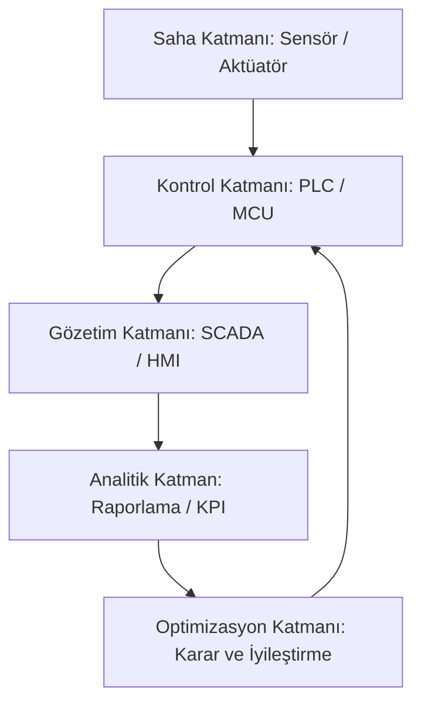

# 10. Otomasyon ve Endüstri 4.0

Robotik ve gömülü sistemler uzun süre tekil makinelerin kontrolü etrafında gelişti.
Ancak güncel üretim dünyasında tek bir cihazın doğru çalışması yeterli değildir.
Asıl değer, farklı cihazların aynı hedef için birlikte çalışabilmesinden doğar.
Bu birlikte çalışma ihtiyacı otomasyon kavramını merkezi hale getirir.

Otomasyon, bir sürecin insan müdahalesini azaltarak kontrollü şekilde yürütülmesidir.
Amaç yalnızca iş gücünü azaltmak değildir.
Daha tutarlı kalite, daha düşük hata oranı, daha izlenebilir üretim ve daha güvenli operasyon, otomasyonun temel çıktılarıdır.

Endüstri 4.0 ise otomasyonun dijital dönüşümle birleşmiş halidir.
Makineler, sensörler, yazılımlar ve veri platformları ortak bir sistem gibi davranır.
Bu yaklaşımda veri yalnızca kayıt için değil, karar üretmek için de kullanılır.
Böylece sistemler geçmişe bakmakla kalmaz, anlık duruma uyum da sağlayabilir.

Bu makalede önce Endüstri 4.0'ın temeli açıklanır.
Ardından otomasyon seviyeleri, PLC ve SCADA mimarileri, haberleşme protokolleri ele alınır.
Son bölümde ise pratik bir proje senaryosu üzerinden uçtan uca bir otomasyon tasarımı örneklendirilir.

## 1. Endüstri

Endüstri 4.0, üretim sistemlerinde fiziksel dünya ile dijital dünyanın entegre çalışmasıdır.
Makineler sensörlerle veri üretir.
Bu veri ağ üzerinden ilgili sistemlere taşınır.
Yazılım katmanları veriyi analiz ederek operasyona geri besleme üretir.

Bu yaklaşımın özünde üç fikir yer alır:

- Süreçlerin ölçülebilir olması
- Ölçümlerin anlamlı karara dönüşmesi
- Kararların sisteme hızlı geri uygulanması

Bu üçlü birlikte çalışmadığında dijitalleşme çoğunlukla raporlama seviyesinde kalır.
Endüstri 4.0 yaklaşımında ise hedef, kapalı çevrim (ölçüm -> karar -> eylem -> yeniden ölçüm) iyileştirme döngüsüdür.

### 1.1. Endüstri 4.0 Nedir?

### 1.2. Endüstri Devrimlerinin Kısa Bağlamı

Endüstri 4.0'ı doğru konumlandırmak için önceki devrimlere kısa bakış faydalıdır.

#### 1.2.1. Endüstri 1.0: Mekanikleşme

Buhar gücü ve mekanik makineler üretimi dönüştürdü.
Üretim miktarı arttı ancak süreç görünürlüğü sınırlı kaldı.

#### 1.2.2. Endüstri 2.0: Elektrifikasyon ve Seri Üretim

Elektrik motorları ve montaj hattı modeli verimlilikte sıçrama yarattı.
Standart ürün, yüksek hacim ve düşük birim maliyet mümkün oldu.

#### 1.2.3. Endüstri 3.0: Otomasyon ve Bilgisayarlaşma

PLC sistemleri, CNC makineler ve bilgisayar tabanlı kontrol öne çıktı.
Süreçler otomatikleşti fakat sistemler çoğunlukla kendi içinde kapalıydı.

#### 1.2.4. Endüstri 4.0: Bağlanabilirlik ve Veri Odaklı Karar

Siber-fiziksel sistemler, IoT, bulut altyapısı ve yapay zeka birlikte devreye girdi.
Makine verisi sadece yerel panelde değil, kurumsal karar katmanlarında da kullanılabilir hale geldi.

### 1.3. Endüstri 4.0 Bileşenleri

Endüstri 4.0 tek bir teknoloji değil, bir teknoloji kümesidir.
Her bileşen farklı bir sorunu çözer.

#### 1.3.1. IoT (Nesnelerin İnterneti)

IoT, fiziksel cihazların internete veya yerel ağa bağlı veri düğümleri haline gelmesidir.
Sensör değerleri, cihaz durumları ve alarm bilgileri gerçek zamanlı toplanabilir.
Bu sayede sahadaki görünürlük artar.

#### 1.3.2. Big Data

Big Data, yüksek hacimli ve yüksek hızda üretilen verinin, geleneksel veri işleme araçlarının sınırlarını aşacak ölçekte yönetilmesini ifade eder.
Üretim hatlarında saniyede binlerce veri noktası oluşabilir.
Bu ölçek, klasik tablo raporlarının ötesinde veri işleme yaklaşımı gerektirir.

#### 1.3.3. Cloud Computing

Bulut bilişim, işlem ve depolama kapasitesinin ihtiyaç kadar kullanılmasını sağlar.
Özellikle çok lokasyonlu yapılarda merkezi görünürlük için önemlidir.
Bununla birlikte kritik kontrol kararlarında gecikme ve bağlantı riski dikkate alınmalıdır.

#### 1.3.4. Yapay Zeka

Yapay zeka, arıza tahmini, kalite sınıflandırma ve enerji optimizasyonu gibi alanlarda değer üretir.
Modelin sahadaki davranışı eğitim verisinin kalitesine bağlıdır.
Bu nedenle veri toplama disiplini model başarısının temelidir.

#### 1.3.5. Siber-Fiziksel Sistemler

Siber-fiziksel sistem, fiziksel süreç ile yazılım karar katmanının sürekli etkileşim içinde olmasıdır.
Süreçteki bir değişim dijital modelde karşılık bulur.
Dijitalde üretilen karar da fiziksel katmana eylem olarak döner.

## 2. Otomasyon

Otomasyon, bir sürecin ölçüm, karar ve eylem adımlarının sistematik biçimde yönetilmesidir.
Bu tanım robotik uygulamalarda da geçerlidir.
Bir robotik hücrede otomasyonun seviyesi arttıkça insan operatörün rolü uygulama düzeyinden denetim düzeyine kayar.

Otomasyonun temel kazanımları:

- Tekrarlanabilir kalite
- Operasyonel hız artışı
- İnsan hatasında azalma
- İş güvenliği iyileştirmesi
- İzlenebilirlik ve raporlanabilirlik

Ancak yanlış tasarlanmış otomasyon, hataları daha hızlı üretir.
Bu nedenle otomasyon yalnızca teknik entegrasyon değil, süreç mühendisliği çalışmasıdır.

### 2.1. Otomasyon Nedir ve Neden Önemlidir?

### 2.2. Otomasyon Seviyeleri

Bir tesiste tüm bölümlerin aynı otomasyon seviyesinde olması zorunlu değildir.
Doğru seviye seçimi yatırım geri dönüşü için kritiktir.

#### 2.2.1. Manuel Seviye

İşlemler operatör ağırlıklı yürütülür.
Ölçüm ve kayıtlar sınırlı olabilir.
Düşük başlangıç maliyeti olsa da sürdürülebilir kalite risklidir.

#### 2.2.2. Yardımlı Otomasyon

Bazı adımlar sensör, röle veya zamanlayıcı ile otomatikleşmiştir.
Kararların önemli bölümü hâlâ insan kontrolündedir.
Geçiş seviyesi olarak yaygın görülür.

#### 2.2.3. Kısmi Otomasyon

Süreç adımlarının belirli bir bölümü PLC veya gömülü kontrolcü ile yönetilir.
Alarm, sayaç ve temel izleme mekanizmaları bulunur.
Operasyonel verimlilikte belirgin artış sağlar.

#### 2.2.4. Tam Otomasyon

Üretim adımları merkezi kontrol mantığıyla sürekli çalışır.
HMI ekranları, alarm yönetimi, veri kayıt sistemi ve uzaktan izleme bileşenleri entegredir.
İnsan rolü müdahale yerine gözetim ve optimizasyona odaklanır.

## 3. PLC Sistemleri

PLC (Programmable Logic Controller), endüstriyel koşullara dayanıklı kontrol bilgisayarıdır.
Yüksek sıcaklık, titreşim ve elektriksel gürültü gibi koşullarda güvenilir çalışması için tasarlanır.

PLC'nin temel bileşenleri:

- CPU modülü
- Dijital giriş ve çıkış modülleri
- Analog giriş ve çıkış modülleri
- Haberleşme modülleri
- Güç kaynağı

PLC programı çoğunlukla Ladder Diagram, Structured Text veya Function Block ile yazılır.
Seçim, ekip yetkinliği ve proses karmaşıklığına göre yapılır.

### 3.1. PLC Kullanımına Örnek Senaryo

Bir konveyör hattında aşağıdaki akış kurulabilir:

1. Giriş sensörü ürün varlığını tespit eder.
2. PLC zamanlayıcıyı başlatır.
3. Motor sürücüsüne hız komutu gönderilir.
4. Çıkış sensörü belirli sürede tetiklenmezse alarm üretir.
5. Operatör panelinde arıza kodu gösterilir.

Bu akış, bir üretim adımının hem kontrolünü hem izlenebilirliğini sağlar.

## 4. SCADA Sistemleri

SCADA (Supervisory Control and Data Acquisition), sahadan veri toplama ve üst seviye gözetim altyapısıdır.
SCADA genellikle milisaniye seviyesinde kapalı çevrim kontrol yapmaz; bu görev çoğunlukla PLC katmanındadır.
Ana rolü görünürlük, kayıt, alarm ve operatör etkileşimidir.

SCADA'nın temel fonksiyonları:

- Gerçek zamanlı proses izleme
- Alarm üretme ve alarm geçmişi tutma
- Trend grafikleri ve raporlama
- Operatör ekranları üzerinden komut verme
- Farklı PLC istasyonlarını tek merkezden yönetme

SCADA katmanı doğru kurgulandığında bakım ve operasyon ekipleri aynı veriye bakarak karar alabilir.
Bu da iletişim hatalarını ve müdahale süresini azaltır.

### 4.1. PLC ve SCADA İlişkisi

*Şekil 1: PLC saha kontrolünü yürütürken SCADA katmanı merkezi izleme, alarm ve raporlama görevini üstlenir.*

## 5. Endüstriyel Haberleşme Protokolleri

Saha cihazlarının birlikte çalışabilmesi için ortak iletişim kuralları gerekir.
Bu kurallar protokol olarak adlandırılır.

### 5.1. Modbus

Modbus, basit yapısı nedeniyle uzun yıllardır kullanılan bir endüstriyel protokoldür.
RTU veya TCP varyantları ile uygulanabilir.
Kayıt tabanlı veri alışverişi sunar.

Avantajları:

- Basit entegrasyon
- Geniş cihaz desteği
- Düşük öğrenme eşiği

Sınırları:

- Gelişmiş zaman senkronizasyonu sağlamaz
- Yüksek deterministik performans gerektiren senaryolarda sınırlı kalabilir

### 5.2. Profinet

Profinet, Ethernet tabanlı endüstriyel iletişim standardıdır.
Daha yüksek hız ve genişletilmiş teşhis imkanları sunar.
Özellikle kompleks üretim hatlarında tercih edilir.

Avantajları:

- Yüksek performans
- Gelişmiş ağ yönetimi
- Çok cihazlı yapılarda güçlü ölçeklenebilirlik

Sınırları:

- Kurulum ve bakım karmaşıklığı daha yüksek olabilir
- Altyapı maliyeti bazı senaryolarda artabilir

## 6. Robotik Otomasyon Sistemleri

Robotik otomasyon, mekanik hareket kabiliyetinin süreç zekası ile birleştiği noktadır.
Sadece robot kolu eklemek otomasyon başarısı anlamına gelmez.
Sistem, çevre koşullarını algılayıp doğru durumda doğru davranışı üretebilmelidir.

Temel bileşenler:

- Robot veya hareketli mekanizma
- Sensör altyapısı
- Hareket kontrol sürücüleri
- Emniyet katmanı
- Üst seviye koordinasyon yazılımı

Bu yapıda gömülü sistemler genellikle saha seviyesinde gerçek zamanlı karar verir.
Üst seviye yazılımlar ise planlama, raporlama ve optimizasyon görevini üstlenir.

## 7. Uygulama: Basit Otomasyon Projesi

Somut bir örnek olarak otomatik sulama sistemi ele alınabilir.
Bu sistem küçük görünse de endüstriyel otomasyonun temel fikirlerini içerir.

### 7.1. Problem Tanımı

Bitki sulama işleminin sabit saatlerde manuel yapılması istenmeyen sonuçlar üretebilir.
Toprak zaten nemliyken sulama yapmak su israfına yol açar.
Aşırı kuruluk durumunda geç müdahale ise bitki sağlığını bozar.

### 7.2. Çözüm Yaklaşımı

Sistem üç kaynaktan karar üretir:

- Toprak nem sensörü
- Zaman planı
- Uzaktan komut girişi

Karar mantığı şu şekilde kurgulanabilir:

1. Nem değeri eşik altına düşerse sulama hazır duruma geçilir.
2. Saat bilgisi uygun zaman penceresindeyse pompa tetiklenir.
3. Uzaktan kapatma komutu gelirse güvenli duruş uygulanır.
4. Çalışma ve hata verisi kayıt altına alınır.

### 7.3. Donanım Bileşenleri

- MCU kartı (örnek: ESP32)
- Toprak nem sensörü
- Röle modülü
- Su pompası
- Güç kaynağı ve koruma elemanları

### 7.4. Yazılım Katmanı

- Sensör okuma ve filtreleme
- Eşik tabanlı karar motoru
- Güvenlik kontrolleri
- Bağlantı yönetimi (WiFi/Bluetooth)
- Durum kaydı

Bu yaklaşım, daha büyük otomasyon projelerine taşınabilecek bir mimari alışkanlığı kazandırır.

## 8. Endüstriyel Simülasyon Yaklaşımı

Gerçek saha yatırımı öncesinde simülasyon yapmak hata maliyetini ciddi biçimde düşürür.
Basit bir üretim hattı modeliyle birçok kontrol senaryosu test edilebilir.

Simülasyonda değerlendirilebilecek başlıklar:

- Sensör gecikmesi
- Yanlış pozitif alarm
- Motor duruşu
- Veri paket kaybı
- Operatör müdahale senaryoları

Simülasyon çıktıları yalnızca teknik test için değil, kapasite planlama için de kullanılabilir.

### 8.1. Veri Analizi ve Raporlama

Toplanan verinin anlamlı hale gelmesi için metrik seçimi net olmalıdır.
Örnek metrikler:

- Toplam çevrim süresi
- Hata başına duruş süresi
- Alarm sıklığı
- Enerji tüketim eğilimi
- Vardiya bazlı üretim miktarı

Bu metrikler düzenli izlendiğinde süreçteki dar boğazlar görünür hale gelir.

## 9. Hata Durumu Yönetimi

Otomasyon tasarımında en kritik konu normal çalışma değildir.
Asıl kritik kısım, anormal durumda sistemin nasıl davranacağıdır.

Temel yaklaşım:

- Arıza tespiti
- Güvenli duruş
- Operatöre anlaşılır bildirim
- Kök neden analizi için kayıt
- Kontrollü yeniden başlatma

Yanlış yaklaşım:

- Alarmı susturup üretime devam etmek

Doğru yaklaşım:

- Alarmı sınıflandırmak, etkisini değerlendirmek ve kontrollü aksiyon planı uygulamak

Bu disiplin hem güvenliği hem ekipman ömrünü korur.

## 10. Uçtan Uca Otomasyon Mimarisi

*Şekil 2: Uçtan uca otomasyon mimarisi, saha verisinin kontrol ve analitik katmanlardan geçerek iyileştirme döngüsüne geri dönmesini gösterir.*

Bu mimari doğrusal değil döngüseldir.
Sistem her ölçümde yeni veri üretir; bu veri karar mantığını güncellemek için kullanılır.
Doğru uygulandığında operasyon zaman içinde daha kararlı hale gelir.

## 11. Türkiye'de Endüstri 4.0 Dönüşüm Dinamikleri

Türkiye'de dijital dönüşüm farklı sektörlerde farklı hızlarda ilerler.
Otomotiv, beyaz eşya ve lojistik sektörleri daha hızlı dönüşüm örnekleri sunar.
KOBİ ölçeğinde ise yatırım öncelikleri ve yetkinlik erişimi belirleyici olur.

Başarılı dönüşüm için dikkat edilen noktalar:

- İhtiyaca uygun teknoloji seçimi
- Saha verisinin standartlaştırılması
- İnsan kaynağının teknik yetkinlik gelişimi
- Pilot proje ile kontrollü geçiş
- Ölçülebilir hedeflerle yatırım planı

Bu yaklaşım, teknoloji yatırımlarının sürdürülebilir sonuç üretmesine katkı sağlar.

## 12. Tasarım İlkeleri ve Yaygın Hatalar

### 12.1. Tasarım İlkeleri

- Önce süreç problemi tanımlanır, sonra teknoloji seçilir.
- Veri kalitesi otomasyon kalitesinin temelidir.
- Emniyet katmanı kontrol katmanından bağımsız düşünülmelidir.
- Bakım kolaylığı için modüler mimari tercih edilmelidir.
- Alarm sayısı değil, alarmın eyleme dönüştürülebilirliği önemlidir.

### 12.2. Yaygın Hatalar

- Sadece cihaz alımıyla dönüşümün tamamlandığını varsaymak
- Veri toplarken veri modeli planlamamak
- İzleme ekranlarını operasyon senaryosundan bağımsız tasarlamak
- Hata yönetimi yerine alarm bastırma kültürünü normalleştirmek
- Operasyon ekibini tasarım sürecine dahil etmemek

## 13. Sonuç

Otomasyon ve Endüstri 4.0, robotik sistemlerin yalnızca hareket eden makine olmasının ötesine geçmesini sağlar.
Asıl hedef, ölçülebilir, yönetilebilir ve sürekli iyileştirilebilir bir üretim sistemi kurmaktır.
PLC ve SCADA altyapısı, doğru haberleşme protokolü seçimi ve veri odaklı iyileştirme kültürü bu hedefin temelini oluşturur.
Küçük bir otomasyon projesinden başlayan disiplinli yaklaşım, daha büyük endüstriyel dönüşüm adımlarına güvenli geçiş sağlar.

