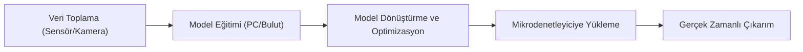

# Yapay Zeka ve Robotik: TinyML ile Uçta Karar Verme

Robotik sistemler uzun süre boyunca sensör verisini okuyup sabit kurallarla çalışan yapılardan oluştu. Bu yaklaşım birçok problem için yeterli olsa da ortam değişkenliği arttığında yalnızca eşik tabanlı kararlar yetersiz kalabilir. Yapay zeka yöntemleri, robotların çevre verisini daha esnek yorumlamasını ve daha isabetli karar üretmesini mümkün hale getirir.

Bu makalede yapay zeka ile robotik entegrasyonunun temeli ele alınır; ardından TinyML ve Edge AI yaklaşımı açıklanır. Sonrasında karar ağacı, görüntü işleme ve mikrodenetleyici üzerinde küçük model çalıştırma örnekleri adım adım verilir. Ek olarak, model eğitimi ve saha kullanımında sık karşılaşılan teknik terimler tek tek açıklanır.

## 1. Yapay zeka ve robotik ilişkisi

Robotik sistemlerde temel döngü üç ana adımdan oluşur: algılama, karar verme ve eylem. Yapay zeka bu döngüde özellikle karar verme katmanını güçlendirir.

- **Algılama:** Sensör, kamera veya mikrofon verisi toplanır.
- **Yorumlama:** Toplanan verinin anlamı çıkarılır.
- **Karar:** Sistem bir sonraki adımı seçer.
- **Eylem:** Motor, röle veya farklı bir aktüatör tetiklenir.

Kural tabanlı sistemlerde karar adımı önceden yazılmış if-else bloklarına dayanır. Yapay zeka destekli sistemlerde ise model, örnek veriden öğrendiği örüntülerle karar üretir. Bu yaklaşım, özellikle gürültülü sensör verisi, karmaşık çevre koşulları ve çok değişkenli problemlerde daha güçlüdür.

Burada sık geçen üç kavram:

- **Model:** Veriden öğrenilen matematiksel karar mekanizmasıdır.
- **Feature (özellik):** Modelin karar verirken kullandığı ölçülebilir girdidir (sıcaklık, nem, titreşim gibi).
- **Inference (çıkarım):** Eğitilmiş modelin yeni bir veri üzerinde tahmin üretmesidir.

### 1.1 Kural tabanlı sistem ve model tabanlı sistem farkı

Kural tabanlı yapı, problem alanı dar ve netse etkilidir. Ancak ortam değişkenliği yükseldiğinde bakım maliyeti hızla artar.

Kısa karşılaştırma:

- **Kural tabanlı yaklaşım:** "Sıcaklık 30'un üstündeyse fan aç."
- **Model tabanlı yaklaşım:** Sıcaklık, nem, son 10 saniyenin ortalaması ve değişim yönü birlikte analiz edilir; ardından bu birleşik veriye göre karar üretilir.

Problem -> çözüm örneği:

- **Problem:** Eşik değerin etrafında sürekli dalgalanan sensör verisi fanın sık aç-kapa yapmasına neden olur.
- **Çözüm:** Fan açma eşiği `30°C`, kapama eşiği `27°C` olarak ayrılır (histerezis) veya sıcaklık-nem trendini birlikte okuyan bir model kullanılır; böylece küçük dalgalanmalarda gereksiz aç-kapa engellenir ve kontrol daha stabil olur.

### 1.2 Robotikte yapay zeka kullanım alanları

- **Görüntü tabanlı algılama:** Kamera verisinden şerit, nesne veya engel tespiti.
- **Sesli komut işleme:** Basit komut sınıflandırma ile cihaz kontrolü.
- **Anomali tespiti:** Motor titreşimi veya akım verisinde normal dışı durumları bulma.
- **Tahmine dayalı bakım:** Arıza oluşmadan önce riskli davranışı yakalama.

## 2. Makine öğrenmesi türleri

Makine öğrenmesi (Machine Learning), sistemin açıkça her adım programlanmadan örneklerden davranış öğrenmesini sağlayan yöntemler bütünüdür.

### 2.1 Supervised learning (Denetimli öğrenme)

Bu yöntemde eğitim verisinin doğru cevabı bellidir. Model, giriş-çıkış eşleşmelerinden öğrenir.

- Örnek: Sıcaklık, nem ve ışık verisine karşılık "fan aç" veya "fan kapat" etiketi.
- Kullanım alanı: Sınıflandırma ve tahmin problemleri.
- **Label (etiket):** Her veri örneğinin doğru cevabıdır.
- **Train set (eğitim seti):** Modelin öğrenmesi için kullanılan veri bölümüdür.
- **Test set (test seti):** Modelin daha önce görmediği veride ne kadar iyi çalıştığını ölçen veri bölümüdür.

Mini örnek:

- Girdi: `temperature=31`, `humidity=72`, `light=210`
- Etiket: `fan=high`
- Amaç: Benzer girdilerde doğru fan seviyesini otomatik seçmek.

### 2.2 Unsupervised learning (Denetimsiz öğrenme)

Veride etiket bulunmaz. Amaç, benzer örnekleri gruplayarak veri yapısını keşfetmektir.

- Örnek: Robotun farklı çalışma durumlarını titreşim verisine göre kümelere ayırma.
- Kullanım alanı: Anomali tespiti, segmentasyon.
- **Clustering (kümeleme):** Benzer örnekleri gruplandırma işlemidir.
- **Outlier (aykırı değer):** Genel veri dağılımından belirgin şekilde sapmış örnektir.
- **Centroid:** Kümenin merkezini temsil eden noktadır.

Mini örnek:

- Gerçek hayat senaryosu: Bir lojistik deposunda çalışan taşıma robotu her gün aynı koridorda hareket ederken motor titreşim verisi toplanır.
- İlk haftalarda veri doğal olarak üç kümeye ayrılır: normal sürüş, dönüş anı ve yük taşırken oluşan titreşim.
- Bir süre sonra yeni ölçümler bu üç kümeden düzenli olarak uzaklaşmaya başlarsa robotun davranışı değişmiş demektir.
- Bu sapma tek başına kesin arıza anlamına gelmez; ancak rulman gevşemesi, teker dengesizliği veya motor bağlantısında aşınma gibi mekanik problemler için erken uyarı üretir.
- Böylece sistem, "arıza olduktan sonra durdurma" yerine "arıza olmadan bakım planlama" yaklaşımına geçer.

### 2.3 Reinforcement learning (Pekiştirmeli öğrenme)

Sistem bir ortamda aksiyon alır, sonuçlara göre ödül veya ceza alır ve zamanla daha iyi strateji öğrenir.

- Örnek: Çizgi izleyen robotta kamera sensörü çizginin merkezde olup olmadığını ölçer. Robot doğru yönde küçük bir düzeltme yapıp çizgiyi merkezde tutarsa `+1` ödül alır; çizgiden uzaklaşırsa `-1` ceza alır; çizgiyi tamamen kaybederse daha yüksek ceza verilir. Bu geri bildirim tekrarlandıkça robot, hangi durumda sola-küçük, sağa-küçük veya düz git komutunu seçmesi gerektiğini öğrenir.
- Kullanım alanı: Otonom navigasyonda yön kararı verme, dinamik ortamlarda rota düzeltme ve kontrol optimizasyonunda enerji/verim dengesi kurma.
- **Agent:** Karar veren yazılım bileşenidir.
- **Environment:** Agent'ın etkileşimde olduğu fiziksel veya simülasyon ortamıdır.
- **Reward (ödül):** Alınan aksiyonun başarısını puanlayan geri bildirimdir.
- **Policy:** Agent'ın hangi durumda hangi aksiyonu alacağını belirleyen stratejidir.

Not: Pekiştirmeli öğrenme teorik olarak güçlüdür; ancak gömülü projelerde eğitim maliyeti yüksektir. Pratikte çoğu projede model eğitimi PC tarafında yapılır, cihazda yalnız inference çalıştırılır.

## 3. Model geliştirme süreci

Yapay zeka destekli bir robotik çözüm, sadece model eğitimiyle tamamlanmaz. Veri toplama, doğrulama, dağıtım ve izleme adımları birlikte planlanmalıdır.

### 3.1 Veri toplama

Veri kalitesi düşükse en iyi algoritma bile zayıf sonuç verir.

Dikkat edilmesi gerekenler:

- Sensör kalibrasyonu doğru yapılmalı.
- Farklı çevre koşullarında veri toplanmalı.
- Etiketleme kuralları net tanımlanmalı.
- Veri dengesi korunmalı (örneğin yalnızca "normal" veri birikmemeli).
- **Sampling rate:** Sensörün saniyede kaç ölçüm aldığını ifade eder.
- **Windowing:** Zaman serisi verisini sabit uzunluklu parçalara bölme yöntemidir.
- **Data imbalance:** Sınıflar arası veri sayısı dengesizliğidir.

### 3.2 Ön işleme (Preprocessing)

Ön işleme, ham verinin modelin öğrenebileceği daha temiz forma dönüştürülmesidir.

Yaygın adımlar:

- Gürültü azaltma (moving average, low-pass filtre). Örneğin ivme sensöründe ardışık 5 ölçümün ortalaması alınarak ani sıçramalar yumuşatılır ve modelin yanlış alarm üretme ihtimali düşürülür.
- Normalizasyon (değerleri ortak ölçekte toplama). Örneğin sıcaklık `0-50`, nem `0-100` aralığındaysa her iki değişken `0-1` aralığına çekilir; böylece model bir değişkenin sayısal büyüklüğü nedeniyle yanlı karar vermez.
- Eksik veri temizleme. Örneğin bağlantı kopması nedeniyle boş gelen ölçümler silinir veya uygun yöntemle doldurulur; aksi halde model eksik kayıtları farklı bir sınıfmış gibi yorumlayabilir.
- Özellik çıkarımı (ortalama, varyans, tepe değer gibi). Örneğin ham titreşim sinyalini doğrudan vermek yerine 1 saniyelik pencerelerden RMS, maksimum değer ve standart sapma çıkarılarak modele daha anlamlı özet bilgi sunulur.

Problem -> çözüm örneği:

- **Problem:** İvmeölçer verisi çok gürültülü olduğu için model hatalı sınıf üretiyor.
- **Çözüm:** 1 saniyelik kayan pencere ortalaması kullanılarak ani sıçramalar yumuşatılıyor.

### 3.3 Eğitim ve doğrulama

Modelin eğitimi sırasında yalnızca başarı oranına bakmak çoğu zaman yanıltıcıdır.

Önemli ölçütler:

- **Accuracy:** Toplam doğru tahmin oranı.
- **Precision:** Pozitif tahminlerin ne kadarının gerçekten pozitif olduğu.
- **Recall:** Gerçek pozitif örneklerin ne kadarını yakalayabildiği.
- **F1-score:** Precision ve recall dengesini veren birleşik skor.

Yanlış -> doğru örneği:

- **Yanlış yorum:** Accuracy yüzde 95 ise model her durumda iyidir.
- **Doğru yorum:** Dengesiz veri setinde accuracy tek başına yeterli değildir; precision/recall birlikte incelenmelidir.

## 3. TinyML ve Edge AI

Edge AI, model çıkarımının (inference) bulut yerine verinin üretildiği cihazda yapılmasıdır. TinyML ise bu yaklaşımın mikrodenetleyici sınıfına uygulanmış halidir; yani çok sınırlı RAM, flash ve enerji bütçesinde çalışan küçük makine öğrenmesi modelleridir.

### 3.1 Neden TinyML?

- **Düşük gecikme:** Karar buluta gitmeden yerelde verilir.
- **Düşük güç tüketimi:** Sürekli kablosuz aktarım ihtiyacı azalır.
- **Gizlilik:** Ham veri cihaz dışına çıkmadan işlenebilir.
- **Çevrimdışı çalışma:** Ağ bağlantısı yokken de temel kararlar üretilebilir.

### 3.2 Temel çalışma akışı

*Şekil 1: TinyML sürecinde model, güçlü ortamda eğitilip optimize edilerek mikrodenetleyici üzerinde gerçek zamanlı çalıştırılır.*

TensorFlow Lite Micro, TinyML projelerinde yaygın kullanılan bir çalışma zamanıdır. Eğitilmiş modelin gömülü cihazda bellek dostu biçimde çalıştırılmasını sağlar. Arduino ve sensörlerle uçtan uca gerçek uygulama için `13- TinyML ile Arduino ve Sensör Uygulaması: Uçtan Uca Rehber.md` makalesine bakılabilir.

### 3.3 Edge AI nedir?

Edge AI, yapay zeka çıkarımının veri kaynağına yakın cihazlarda yapılmasıdır. Bu cihaz bir mikrodenetleyici olabileceği gibi endüstriyel gateway, tek kart bilgisayar veya güçlü bir edge sunucu da olabilir.

Gerçek hayat örneği:

- Fabrika hattındaki kameralar görüntüyü önce edge gateway üzerinde analiz eder.
- "Normal ürün" ve "hatalı ürün" ayrımı anında yapılır, böylece tüm görüntü buluta gönderilmez.
- Buluta sadece özet veri ve alarm kayıtları aktarılır; bu yaklaşım hem bant genişliğini hem gecikmeyi düşürür.

Edge AI için temel avantajlar:

- Ağ kesintisinde sistemin tamamen durmamasını sağlar.
- Kritik kararları milisaniye seviyesinde yerelde üretir.
- Ham veriyi yerelde tutarak veri gizliliğini güçlendirir.

### 3.4 TinyML ve Edge AI kıyaslaması

İki yaklaşım birbiriyle rakip değil, çoğu projede tamamlayıcıdır.

- **TinyML:** Mikrodenetleyici sınıfı cihazlarda düşük güç ve düşük bellekle çalışacak küçük modeller için uygundur.
- **Edge AI:** Daha güçlü edge cihazlarda daha karmaşık modelleri çalıştırmak ve çoklu veri kaynağını birlikte işlemek için uygundur.
- **Ortak nokta:** Her ikisinde de karar buluta gitmeden yerelde üretilir.
- **Temel fark:** TinyML kaynak kısıtı çok yüksek sistemlere odaklanır; Edge AI ise daha geniş donanım yelpazesinde çalışır.

### 3.5 Model optimizasyonu

Mikrodenetleyici tarafında model çalıştırmak için optimizasyon zorunludur.

Temel yöntemler:

- **Quantization:** Ağırlıkları düşük bit hassasiyetine düşürerek modeli küçültme.
- **Pruning:** Etkisi düşük bağlantıları kaldırarak hesap yükünü azaltma.
- **Knowledge distillation:** Büyük model bilgisini daha küçük modele aktarma.

Kısa etki tablosu:

- Quantization -> Bellek düşer, hız artar.
- Pruning -> Hesap yükü düşer, model sadeleşir.
- Distillation -> Daha küçük modelde kabul edilebilir doğruluk korunur.

### 3.6 Edge AI ve bulut birlikte nasıl kullanılır?

Sadece edge ya da sadece bulut yaklaşımı her proje için ideal değildir. Hibrit yaklaşım çoğu zaman daha dengeli sonuç verir.

Örnek mimari:

- Cihaz üzerinde hızlı ön karar verilir.
- Kritik olmayan ham veri arşivi buluta gönderilir.
- Model güncellemeleri belirli aralıklarla OTA (Over-The-Air) dağıtılır.

Buradaki OTA, fiziksel erişim olmadan cihaz yazılımını ağ üzerinden güncelleme yöntemidir.

## 4. Uygulama örnekleri

### 4.1 Karar ağacı ile sensör tabanlı kontrol

Karar ağacı (Decision Tree), veriyi eşiklere göre dallandırarak karar veren sade ve yorumlanabilir bir modeldir. Özellikle başlangıç seviyesinde robotik kontrol problemlerinde iyi bir geçiş adımıdır.

Örnek senaryo: Sıcaklık ve nem verisine göre fan kontrolü.

- Eğer `temperature > 30` ve `humidity > 70` ise fan hızı artırılır.
- Eğer `temperature < 26` ise fan kapanır.
- Ara bölgede mevcut durum korunur.

Bu yaklaşım, tek eşikli sistemlere göre daha kararlı davranır ve sık aç-kapa problemini azaltır.

- **Threshold (eşik):** Kararı tetikleyen sınır değerdir.
- **Hysteresis (histerezis):** Açma ve kapama için farklı eşik belirleyerek titreşimi azaltma yöntemidir.
- **Rule explosion:** Kural sayısının kontrol edilemeyecek kadar büyümesi problemidir.

Pratik genişletme:

- Gündüz/gece bilgisi eklenirse fan eşiği değiştirilebilir.
- Nem trendi eklenirse ani yükselişlerde proaktif soğutma yapılabilir.

### 4.2 Görüntü işleme temelleri

Robotikte görüntü işleme, kameradan gelen verinin anlamlandırılmasıdır. Başlangıç seviyesinde renk algılama ve temel nesne tespiti yeterli bir başlangıçtır.

- **ESP32-CAM:** Üzerinde kamera ve Wi-Fi bulunan küçük bir mikrodenetleyici karttır. Ucuzdur ve basit projelerde görüntü alma, fotoğraf gönderme veya temel renk algılama gibi işler için hızlı başlangıç sağlar.
- **Raspberry Pi + OpenCV:** Raspberry Pi küçük bir bilgisayar, OpenCV ise görüntü işleme kütüphanesidir. Birlikte kullanıldığında nesne takibi, yüz/şekil algılama ve daha karmaşık görüntü işleme adımları ESP32-CAM'e göre daha rahat uygulanır.

Temel bir akış:

1. Kameradan kare alınır.
2. Gürültü azaltma veya renk uzayı dönüşümü uygulanır.
3. Hedef renk/şekil için maskeleme yapılır.
4. Sonuçtan konum veya durum bilgisi çıkarılır.

Bu bilgi, robotun yön değiştirme, hedefe yaklaşma veya engelden kaçınma kararlarında kullanılabilir.

- **Frame:** Kameranın tek görüntü karesidir.
- **FPS (Frame per second):** Saniyede işlenen kare sayısıdır.
- **ROI (Region of Interest):** Görüntüde işlenecek hedef bölgedir.
- **Contour:** Nesne sınırını temsil eden noktalar dizisidir.

Yanlış -> doğru örneği:

- **Yanlış:** Tüm kareyi yüksek çözünürlükte sürekli işlemek.
- **Doğru:** ROI seçip çözünürlüğü düşürerek işlem maliyetini azaltmak.

ROI seçimi pratikte şöyle yapılır:

1. Kamerada kararın verileceği alan belirlenir (örneğin çizgi izleme için görüntünün alt orta bölgesi).
2. Kare bu alanla kırpılır, gereksiz üst/yan bölgeler işlenmez.
3. Kırpılan görüntü daha düşük çözünürlüğe indirilir (örneğin `320x240` yerine `160x120`).
4. Algoritma sadece bu ROI üzerinde çalıştırılır; böylece işlem süresi ve güç tüketimi düşer.

Ek senaryo:

- Kırmızı çizgi izleyen robotta HSV renk uzayı kullanılır.
- RGB yerine HSV seçilmesinin nedeni, parlaklık değişiminde renk eşiğinin daha kararlı kalmasıdır.

## 5. Sık yapılan hatalar ve düzeltmeler

- **Hata:** Eğitim verisini yalnız laboratuvar ortamında toplamak.
- **Düzeltme:** Farklı sıcaklık, ışık ve kullanım senaryolarında saha verisi eklemek.
- **Hata:** Model doğruluğunu tek metrikle değerlendirmek.
- **Düzeltme:** Precision, recall ve confusion matrix birlikte incelemek.
- **Hata:** Model güncellemesini plansız bırakmak.
- **Düzeltme:** Sürümleme ve OTA güncelleme sürecini baştan tanımlamak.
- **Hata:** Cihaz belleğini sınırda kullanmak.
- **Düzeltme:** Güvenlik payı bırakıp en kötü durum testleri yapmak.

## 6. Sonuç

Yapay zeka, robotik sistemlerde yalnızca yeni bir özellik değil, karar katmanını dönüştüren bir yaklaşımdır. TinyML ve Edge AI ile bu dönüşüm buluta bağımlı kalmadan saha cihazlarında uygulanabilir hale gelir. Doğru kapsamda seçilmiş bir model, iyi hazırlanmış veri ve kaynak dostu optimizasyonlarla robotik projelerde hem tepki süresi hem de sistem dayanıklılığı anlamlı biçimde iyileştirilebilir.

Başarılı bir proje için temel prensip nettir: önce problemi doğru tanımlamak, sonra veri kalitesini güvenceye almak, ardından cihaz kaynaklarına uygun modeli seçmek gerekir. Bu sıralama korunduğunda TinyML, robotik sistemlerde pratik ve sürdürülebilir bir mühendislik çözümüne dönüşür.