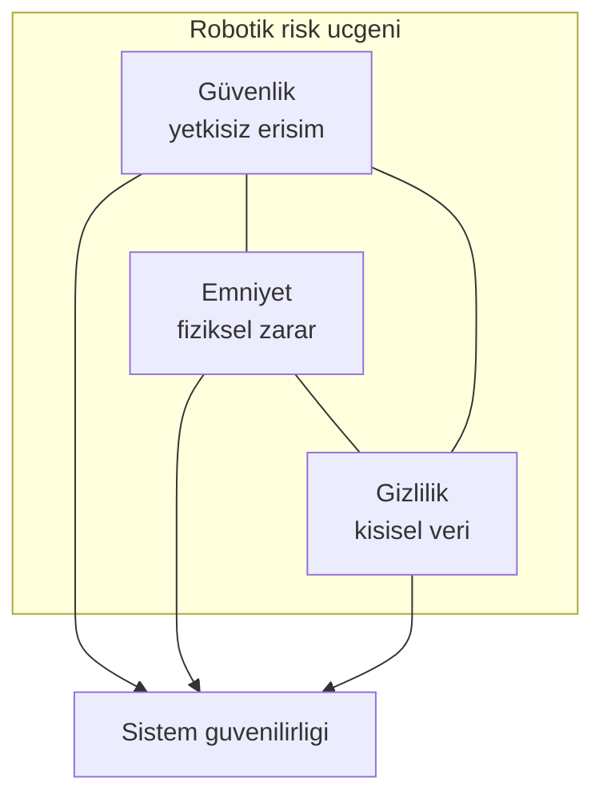
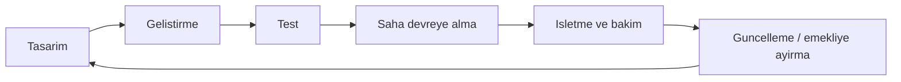

# Robotik Etik ve Güvenlik: Doğru Çalışmak ve Doğru Davranmak

Robotik sistemler fabrika, hastane, depo, tarla ve ev gibi alanlara hızla yayılıyor. Bir AMR (Autonomous Mobile Robot) paleti taşırken, bir cerrahi asistan robot hassas hareket yaparken veya bir teslimat robotu kaldırımda ilerlerken ortak bir soru ortaya çıkar: sistem hem teknik olarak doğru mu çalışıyor, hem de insan ve çevre açısından kabul edilebilir mi davranıyor?

İlk soru kalite ve performansı, ikinci soru etik ile güvenliği ilgilendirir. Bu iki boyut ayrı düşünüldüğünde projeler eksik kalır: güçlü şifreleme olan ama acil durdurması devre dışı kalan bir robot “güvenli yazılım” taşısa da emniyet açısından risklidir. Tersine, yavaş ve dikkatli hareket eden ama kimlik doğrulaması olmayan bir sistem, uzaktan ele geçirildiğinde yine ciddi zarar üretebilir.

Bu makalede robotikte etik ilkeler, güvenlik–emniyet–gizlilik ayrımı, tehdit modelleme, yaşam döngüsü, veri ve gizlilik ile olay müdahalesi birlikte ele alınır. Amaç, “ileri seviye siber güvenlik uzmanı” profili çizmek değil; gömülü ve robotik projelerde hemen uygulanabilecek, ölçülebilir ve sürdürülebilir bir çerçeve sunmaktır.

## 1. Robotikte etik neden ayrı bir konudur?

Etik, “teknik olarak yapılabiliyor” ile “toplumsal ve hukuki olarak yapılması doğru” arasındaki farkı tanımlar. Yazılımda hatalı bir karar çoğu zaman veri kaybı veya hizmet kesintisi üretir; robotikte aynı hata fiziksel dünyada çarpma, yaralanma veya mahremiyet ihlali olarak somutlaşabilir.

Kısa örnek: Bir teslimat robotu görevi zamanında tamamlasa bile yaya alanında hız sınırını aşıyor veya engelli bireylerin geçişini zorlaştırıyorsa, “görev başarılı” metriği etik açıdan yetersiz kalır. Sistem teknik olarak çalışıyor olabilir; davranışı kabul edilebilir sayılmayabilir.

### 1.1. Temel etik ilkeler

Aşağıdaki ilkeler soyut değildir; doğrudan gereksinim ve test maddesine dönüştürülebilir:

| İlke               | Kısa anlam                                      | Tasarıma yansıması                                |
| ------------------ | ----------------------------------------------- | ------------------------------------------------- |
| Zarar vermeme      | İnsan ve çevreye gereksiz risk yükleme          | Hız sınırı, güvenli duruş, acil durdurma          |
| Adil davranma      | Benzer durumlarda tutarlı ve önyargısız karar   | Eğitim verisi ve kural setinin gözden geçirilmesi |
| İzlenebilirlik     | Kararın neden verildiğinin sonradan anlaşılması | Olay günlüğü, sürüm ve parametre kaydı            |
| Sorumluluk         | Hata veya olayda net muhatap                    | Rol tanımı, bakım ve onay süreci                  |
| Veri minimizasyonu | Yalnızca gerekli kişisel veriyi toplama         | Kamera çözünürlüğü, saklama süresi, maskeleme     |

Bu tablo, “etik” konusunu felsefe dersinden çıkarıp mühendislik kontrol listesine taşır.

### 1.2. Otomasyon, iş gücü ve şeffaflık

Robotik projelerde yalnızca teknik risk değil, organizasyonel ve toplumsal etkiler de değerlendirilmelidir. Bir hattın otomatikleştirilmesi verimliliği artırabilir; aynı zamanda görev tanımlarının, eğitim ihtiyacının ve insan–robot iş bölümünün yeniden düşünülmesini gerektirir.

Şeffaflık burada kritiktir: Sistem ne yapıyor, hangi veriyi topluyor, kim müdahale edebiliyor? Kullanıcı veya saha personeli bu sorulara net cevap alamıyorsa güven duygusu zayıflar; bu da güvenlik kurallarının fiilen uygulanmamasına yol açabilir.

### 1.3. Yapay zeka ve karar sorumluluğu

Görüntü sınıflandırma, nesne algılama veya yol planlama gibi öğrenme tabanlı bileşenler kullanıldığında karar artık yalnızca sabit `if` kurallarından gelmez. Model, eğitim verisindeki eksiklik veya önyargıyı sahaya taşıyabilir.

Pratik yaklaşım:

- Kritik emniyet kararlarını mümkün olduğunca deterministik katmanlara (sınır kontrolü, watchdog, donanım kilidi) bağlamak
- Model çıktısını doğrudan “son karar” yapmak yerine politika katmanından geçirmek
- Model sürümünü, eğitim veri kaynağını ve dağıtım tarihini kayıt altına almak

Böylece bir olay sonrası “hangi yazılım, hangi veriyle, hangi parametreyle çalışıyordu?” sorusuna cevap verilebilir.

## 2. Güvenlik, emniyet ve gizlilik: üç ayrı eksen

Bu kavramlar günlük dilde birbirinin yerine kullanılır; risk analizinde ise ayrı değerlendirilmeleri gerekir.

| Kavram              | Odak                       | Tipik soru                      | Örnek risk                        |
| ------------------- | -------------------------- | ------------------------------- | --------------------------------- |
| Güvenlik (security) | Yetkisiz erişim ve saldırı | Kim komut gönderebilir?         | Sahte MQTT komutu                 |
| Emniyet (safety)    | Fiziksel zararın önlenmesi | İnsan yakındayken ne olur?      | Sensör arızasında çarpma          |
| Gizlilik (privacy)  | Kişisel verinin korunması  | Hangi veri ne kadar saklanıyor? | Kamera kaydının izinsiz paylaşımı |

Üçü birbirini tamamlar. Güçlü şifreleme (güvenlik), zayıf acil durdurma (emniyet) veya gereksiz yüz görüntüsü saklama (gizlilik) ile birlikte “güvenli sistem” tanımı bozulur.

*Şekil 1: Robotik sistemde güvenlik, emniyet ve gizliliğin birbirini tamamlayan üç ekseni.*

## 3. Yaşam döngüsü boyunca düşünmek

Etik ve güvenlik yalnızca “canlıya almadan önce bir kez” yapılan iş değildir. Donanım, yazılım, ağ ve operasyon değiştikçe risk profili de değişir.

*Şekil 2: Etik ve güvenlik değerlendirmesinin proje yaşam döngüsünün her aşamasında tekrarlanması.*

Her aşamada sorulabilecek örnek sorular:

- **Tasarım:** Hangi senaryoda insan fiziksel olarak yakın olabilir?
- **Geliştirme:** Dışarıdan gelen komut ve sensör verisi nasıl doğrulanıyor?
- **Test:** Emniyet fonksiyonları kasıtlı arıza ile denendi mi?
- **Saha:** Varsayılan parolalar değiştirildi mi, debug portları kapatıldı mı?
- **İşletme:** Olay günlükleri izleniyor mu, yama süreci imzalı mı?
- **Emekliye ayırma:** Cihazdaki veriler güvenli siliniyor mu?

## 4. Tehdit modeli: riskleri erken görmek

Tehdit modeli, “kim, hangi varlığa, hangi yöntemle zarar verebilir?” sorusuna tasarımın başında cevap aramaktır. Bu adım atlanırsa önlemler rastgele kalır; ya gereksiz maliyet oluşur ya da kritik açık gözden kaçar.

### 4.1. Dört adımlı başlangıç

1. **Varlıkları listele:** Firmware, konfigürasyon, sensör akışı, kullanıcı verisi, fiziksel erişim noktaları.
2. **Tehditleri yaz:** Sahte komut, veri sızıntısı, sensör manipülasyonu, fiziksel müdahale.
3. **Etkiyi değerlendir:** Gizlilik ihlali mi, duruş mu, yaralanma mı?
4. **Önceliklendir ve önlem al:** Yüksek etki + kolay istismar önce ele alınır.

Model, yeni özellik (ör. uzaktan güncelleme, kamera analizi) eklendiğinde güncellenmelidir.

### 4.2. STRIDE ile hızlı sınıflandırma

`STRIDE`, tehditleri altı kategoride toplamaya yarayan yaygın bir çerçevedir. Robotik projede her kategori somut örnekle eşleştirilebilir:

| STRIDE                 | Anlam                  | Robotik örneği                                |
| ---------------------- | ---------------------- | --------------------------------------------- |
| Spoofing               | Kimlik taklidi         | Sahte kontrol paneli veya sahte robot kimliği |
| Tampering              | Verinin değiştirilmesi | Ağ üzerinde komut paketinin kurcalanması      |
| Repudiation            | İnkar                  | Kritik komutun loglanmaması                   |
| Information disclosure | Bilgi sızıntısı        | Debug çıktısında Wi-Fi parolası               |
| Denial of service      | Hizmet engelleme       | Komut kanalının flood ile tıkanması           |
| Elevation of privilege | Yetki yükseltme        | Bakım hesabıyla üretim komutlarına erişim     |

STRIDE tablosu, tehdit modeli toplantısında “bu senaryoyu atladık mı?” kontrolü için kullanılabilir.

### 4.3. Varlık–tehdit–önlem zinciri

Örnek zincir:

- **Varlık:** Robotun hareket komut kanalı (`MQTT` veya özel TCP)
- **Tehdit:** Ortadaki adam (MITM) ile komutun değiştirilmesi
- **Önlem:** TLS, cihaz kimlik doğrulaması, komut imzası veya nonce ile tekrar saldırısına karşı koruma

Bu zincir, Haberleşme ve Ağ Teknolojileri makalesindeki protokol seçimini güvenlik gereksinimine bağlar: hız ve enerji kadar, kimlik doğrulama ve bütünlük de tasarım kriteri olmalıdır.

## 5. Veri, gizlilik ve uyumluluk

Robotlar görüntü, konum, ses veya kullanıcı kimliği toplayabilir. Fazla toplanan ve uzun süre saklanan veri, hem saldırı yüzeyini hem hukuki riski artırır.

Temel yaklaşım:

- **Veri minimizasyonu:** Örneğin tam HD yerine algılama için yeterli çözünürlük; yüz yerine silüet veya bbox
- **Saklama süresi:** “Sonsuza kadar bulutta” varsayılanı yerine gün/hafta sınırı
- **Erişim kontrolü:** Rol bazlı erişim ve erişim günlüğü
- **Silme ve taşınabilirlik:** Cihaz hurdaya çıkmadan önce güvenli silme

Türkiye’de kişisel veriler için `KVKK`, AB ile ilişkili projelerde `GDPR` gibi çerçeveler geçer; teknik önlemler (şifreleme, maskeleme) tek başına yeterli değildir, amaç sınırlaması ve aydınlatma yükümlülükleri de vardır. Proje başında hukuk ve veri koruma tarafıyla netleştirme yapılması önerilir.

## 6. Olay müdahalesi ve sürekli iyileştirme

Bir güvenlik veya emniyet olayı yaşandığında veya “az kalsın” durumu raporlandığında yapılandırılmış müdahale süreci öğrenmeyi hızlandırır.

Önerilen akış:

1. **Sınırla:** Etkilenen robotu veya servisi izole et.
2. **Kaydet:** Log, sürüm, konfigürasyon ve saha koşullarını koru (kanıt zinciri).
3. **Analiz et:** Kök neden — teknik mi, süreç mi, insan faktörü mü?
4. **Düzelt:** Yama, prosedür güncellemesi veya donanım değişikliği.
5. **Doğrula:** Aynı senaryonun test ortamında tekrarlanmaması.
6. **Paylaş:** Ekip içi öğrenme; gerekiyorsa müşteri veya düzenleyiciye bildirim.

Olay sonrası suçlama kültürü yerine “sistem neden buna izin verdi?” sorusu, tekrarlayan kazaları azaltır.

## 7. Başlangıç kontrol listesi

Aşağıdaki maddeler periyodik gözden geçirme için kullanılabilir:

**Kimlik ve erişim**

- Varsayılan parolalar kaldırıldı mı?
- Roller ve yetkiler ayrıldı mı?
- Kritik komutlar kimlik doğrulamalı mı?

**Emniyet**

- Acil durdurma test edildi mi?
- Güvenli hız ve engel tepkisi doğrulandı mı?
- Bakım modu üretimde otomatik kapanıyor mu?

**Veri ve izlenebilirlik**

- Olay ve güvenlik logları tutuluyor mu?
- Veri saklama süresi ve erişim tanımlı mı?
- Model/yazılım sürümü kayıt altında mı?

**Güncelleme ve saha**

- Güncellemeler imzalı ve doğrulanıyor mu?
- Debug portları üretimde kapalı mı?
- Tehdit modeli son mimari değişiklikten sonra güncellendi mi?

Bu liste “tam güvenlik” sağlamaz; ancak en sık görülen boşlukların büyük bölümünü kapatır.

## 8. Sonuç

Robotikte etik ve güvenlik, projenin sonradan eklenen süsü değildir. Doğru çalışmanın yanında doğru davranışı da tanımlar; güvenlik, emniyet ve gizlilik birlikte düşünülmediğinde sistem kısmen güvenli kalır.

İyi yaklaşım: Tasarımın başında tehdit modeli ve etik gereksinimleri netleştirmek, yaşam döngüsü boyunca test ve gözden geçirmeyi sürdürmek, sahada basit ama disiplinli kuralları (parola, log, E-stop, veri süresi) ihmal etmemektir. Sistem büyüdükçe önlemler de katmanlı şekilde derinleştirilir; temel ilkeler — zarar vermeme, izlenebilirlik, güvenli varsayılan — değişmez.