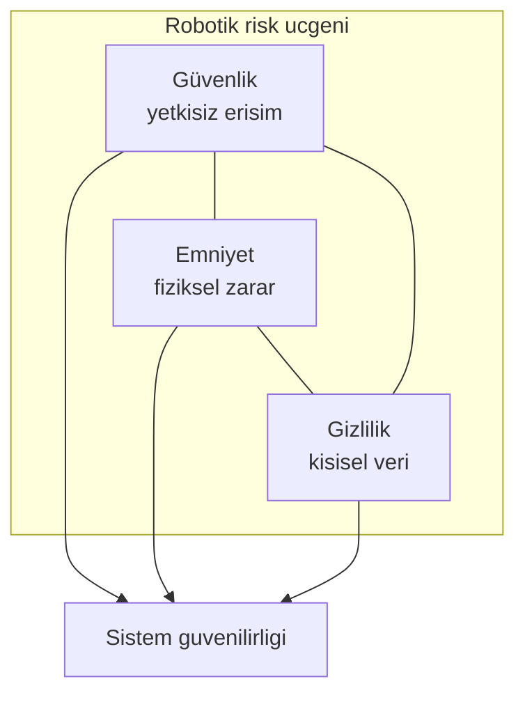
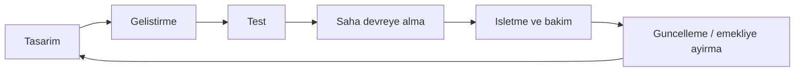

# Robotik Etik ve Güvenlik: Doğru Çalışmak ve Doğru Davranmak

Robotik sistemler fabrika, hastane, depo, tarla ve ev gibi alanlara hızla yayılıyor. Bir AMR (Autonomous Mobile Robot) paleti taşırken, bir cerrahi asistan robot hassas hareket yaparken veya bir teslimat robotu kaldırımda ilerlerken ortak bir soru ortaya çıkar: sistem hem teknik olarak doğru mu çalışıyor, hem de insan ve çevre açısından kabul edilebilir mi davranıyor?

İlk soru kalite ve performansı, ikinci soru etik ile güvenliği ilgilendirir. Bu iki boyut ayrı düşünüldüğünde projeler eksik kalır: güçlü şifreleme olan ama acil durdurması devre dışı kalan bir robot “güvenli yazılım” taşısa da emniyet açısından risklidir. Tersine, yavaş ve dikkatli hareket eden ama kimlik doğrulaması olmayan bir sistem, uzaktan ele geçirildiğinde yine ciddi zarar üretebilir.

Bu makalede robotikte etik ilkeler ve çerçeveler, özerklik ve sorumluluk, tartışmalı kullanım alanları, güvenlik–emniyet–gizlilik ayrımı, gömülü sistem tehditleri, tehdit modelleme, güvenli kod yazma, yaşam döngüsü, veri ve gizlilik ile olay müdahalesi birlikte ele alınır. Amaç, “ileri seviye siber güvenlik uzmanı” profili çizmek değil; gömülü ve robotik projelerde hemen uygulanabilecek, ölçülebilir ve sürdürülebilir bir çerçeve sunmaktır.

## 1. Robotikte etik neden ayrı bir konudur?

Etik, “teknik olarak yapılabiliyor” ile “toplumsal ve hukuki olarak yapılması doğru” arasındaki farkı tanımlar. Yazılımda hatalı bir karar çoğu zaman veri kaybı veya hizmet kesintisi üretir; robotikte aynı hata fiziksel dünyada çarpma, yaralanma veya mahremiyet ihlali olarak somutlaşabilir.

Kısa örnek: Bir teslimat robotu görevi zamanında tamamlasa bile yaya alanında hız sınırını aşıyor veya engelli bireylerin geçişini zorlaştırıyorsa, “görev başarılı” metriği etik açıdan yetersiz kalır. Sistem teknik olarak çalışıyor olabilir; davranışı kabul edilebilir sayılmayabilir.

### 1.1. Temel etik ilkeler

Aşağıdaki ilkeler soyut değildir; doğrudan gereksinim ve test maddesine dönüştürülebilir:

| İlke               | Kısa anlam                                      | Tasarıma yansıması                                |
| ------------------ | ----------------------------------------------- | ------------------------------------------------- |
| Zarar vermeme      | İnsan ve çevreye gereksiz risk yükleme          | Hız sınırı, güvenli duruş, acil durdurma          |
| Adil davranma      | Benzer durumlarda tutarlı ve önyargısız karar   | Eğitim verisi ve kural setinin gözden geçirilmesi |
| İzlenebilirlik     | Kararın neden verildiğinin sonradan anlaşılması | Olay günlüğü, sürüm ve parametre kaydı            |
| Sorumluluk         | Hata veya olayda net muhatap                    | Rol tanımı, bakım ve onay süreci                  |
| Veri minimizasyonu | Yalnızca gerekli kişisel veriyi toplama         | Kamera çözünürlüğü, saklama süresi, maskeleme     |

Bu tablo, “etik” konusunu felsefe dersinden çıkarıp mühendislik kontrol listesine taşır.

### 1.2. Otomasyon, iş gücü ve şeffaflık

Robotik projelerde yalnızca teknik risk değil, organizasyonel ve toplumsal etkiler de değerlendirilmelidir. Bir hattın otomatikleştirilmesi verimliliği artırabilir; aynı zamanda görev tanımlarının, eğitim ihtiyacının ve insan–robot iş bölümünün yeniden düşünülmesini gerektirir.

Şeffaflık burada kritiktir: Sistem ne yapıyor, hangi veriyi topluyor, kim müdahale edebiliyor? Kullanıcı veya saha personeli bu sorulara net cevap alamıyorsa güven duygusu zayıflar; bu da güvenlik kurallarının fiilen uygulanmamasına yol açabilir.

### 1.3. Özerklik ve sorumluluk

**Özerklik**, robotun hedefe ulaşmak için çevreye göre kendi kararlarını üretmesidir. Seviye arttıkça insan müdahalesi azalır: teleoperasyon (uzaktan sürüş) düşük özerklik; tam otonom depo robotu yüksek özerkliktir.

Özerklik teknik bir özellik olsa da hukuki ve etik sonuçları vardır. Bir kaza anında “robot mu, operatör mü, yazılım üreticisi mi, işletme mi?” sorusu net değilse sorumluluk dağılır ve önleyici tasarım zayıflar.

Mühendislik açısından netleştirilmesi gerekenler:

- **Yetki sınırı:** Robot hangi kararları tek başına verebilir (hız ayarı), hangilerinde insan onayı zorunludur (bakım moduna geçiş)?
- **Geri alınabilirlik:** Operatör her an güvenli şekilde durdurabilir mi (E-stop, yazılımsal kill switch)?
- **Kayıt:** Olay öncesi komut, sensör özeti ve yazılım sürümü saklanıyor mu?
- **Sorumluluk zinciri:** Tasarım, entegrasyon, saha kurulumu ve işletme rolleri dokümante mi?

Özerklik arttıkça test kapsamı ve emniyet katmanları da artmalıdır; “daha akıllı” ile “daha az sorumlu” eş anlamlı değildir.

### 1.4. Yapay zeka ve karar sorumluluğu

Görüntü sınıflandırma, nesne algılama veya yol planlama gibi öğrenme tabanlı bileşenler kullanıldığında karar artık yalnızca sabit `if` kurallarından gelmez. Model, eğitim verisindeki eksiklik veya önyargıyı sahaya taşıyabilir.

Pratik yaklaşım:

- Kritik emniyet kararlarını mümkün olduğunca deterministik katmanlara (sınır kontrolü, watchdog, donanım kilidi) bağlamak
- Model çıktısını doğrudan “son karar” yapmak yerine politika katmanından geçirmek
- Model sürümünü, eğitim veri kaynağını ve dağıtım tarihini kayıt altına almak

Böylece bir olay sonrası “hangi yazılım, hangi veriyle, hangi parametreyle çalışıyordu?” sorusuna cevap verilebilir.

### 1.5. Askeri robotik ve silahlanma

Askeri robotik; keşif, lojistik, mayın temizleme ve otonom silah platformları gibi alanları kapsar. Tartışmanın merkezinde teknik kapasite değil, **insanın döngüde kalıp kalmaması** ve **ölümcül kararın kime ait olduğu** yer alır.

Otonom silah sistemleri (LAWS — Lethal Autonomous Weapon Systems) ifadesi, hedef seçimi ve ateş kararının insan onayı olmadan verildiği senaryoları tanımlar. Birçok ülke ve sivil toplum kuruluşu, bu tür sistemlerin yasaklanması veya sıkı insan kontrolü şartı talep eder; mühendislik ekipleri de “bu özellik askeri müşteriye mi gidiyor?” sorusunu proje başında netleştirmelidir.

Pratik ayrım:

- **Savunma ve emniyet teknolojisi:** Mayın arama, sınır gözetleme — risk yüksek, ancak insan hedefi seçimi genelde dışarıda
- **Ölümcül otonomi:** Hedef tanıma + ateş kararı tamamen makinede — en yüksek etik ve hukuki risk

Kurumsal etik politikası, tedarik zinciri ve ihracat kontrolleri bu alanda teknik karardan önce gelir. Akademik veya endüstriyel robotik projelerinde bile açık kaynak modellerin askeri kullanıma dönüşebileceği unutulmamalıdır.

### 1.6. Robot hakları

“Robot hakları” ifadesi, insan haklarına benzer yasal statünün yapay varlıklara tanınması fikrini ifade eder. Güncel hukuk sistemlerinde robotlar **hukuki kişi** değildir; sorumluluk her zaman insan veya tüzel kişilere (üretici, işleten, kullanıcı) bağlanır.

Yine de tartışma önemlidir:

- **Hukuki gerçeklik:** Hasar, sözleşme ve veri ihlali insan/tüzel kişi üzerinden çözülür.
- **Tasarım etiği:** Robotlara “acıma” veya “hak” dili, bakım ve güncelleme disiplinini gevşetmemeli; insan güvenliği öncelikli kalmalıdır.
- **Sosyal etki:** İnsan benzeri robotlarda empati tetiklenmesi, kullanıcıyı sistemin yeteneklerini olduğundan fazla sanmasına yol açabilir (aşırı güven).

Mühendislik perspektifinden çıkarım nettir: Robotlara hak tanımak yerine, insanlara karşı **güvenli, şeffaf ve hesap verebilir** robot tasarımı hedeflenir.

### 1.7. Gelecek senaryoları

Etik tartışmalar yalnızca bugünkü ürünler için değil, olası gelişim yolları için de yapılır. Senaryo düşünmek, “en kötüyü varsayarak” gereksinimleri bugünden yazmayı kolaylaştırır.

| Senaryo                           | Kısa tanım                           | Etik / güvenlik odak noktası                           |
| --------------------------------- | ------------------------------------ | ------------------------------------------------------ |
| Yoğun otonom lojistik             | Depo ve şehir içi tam otonom filolar | İş gücü, trafik güvenliği, siber filo ele geçirme      |
| Ev ve bakım robotları             | Yaşlı bakımı, ev yardımcısı          | Mahremiyet, fiziksel güvenlik, yalnızlık ve bağımlılık |
| İnsan–robot iş birliği            | Aynı alanda çalışan cobot’lar        | Emniyet sensörleri, hız/kuvvet sınırı, eğitim          |
| Tam otonom araç                   | Sürücüsüz taşıt                      | Sorumluluk, edge case, yazılım güncellemesi            |
| Genel amaçlı / çok becerili robot | Tek platform, çok görev              | Öngörülemeyen davranış, geniş saldırı yüzeyi           |

Senaryolar korku üretmek için değil, **erken uyarı** içindir: “Beş yıl sonra kamera her odada olabilir” düşüncesi, bugün veri minimizasyonu ve yerel işleme gereksinimini güçlendirir.

## 2. Güvenlik, emniyet ve gizlilik: üç ayrı eksen

Bu kavramlar günlük dilde birbirinin yerine kullanılır; risk analizinde ise ayrı değerlendirilmeleri gerekir.

| Kavram              | Odak                       | Tipik soru                      | Örnek risk                        |
| ------------------- | -------------------------- | ------------------------------- | --------------------------------- |
| Güvenlik (security) | Yetkisiz erişim ve saldırı | Kim komut gönderebilir?         | Sahte MQTT komutu                 |
| Emniyet (safety)    | Fiziksel zararın önlenmesi | İnsan yakındayken ne olur?      | Sensör arızasında çarpma          |
| Gizlilik (privacy)  | Kişisel verinin korunması  | Hangi veri ne kadar saklanıyor? | Kamera kaydının izinsiz paylaşımı |

Sahte MQTT komutu, yetkisiz bir kaynağın robotun dinlediği kanala hareket emri göndermesidir. `MQTT` publish/subscribe modeliyle `robot/hareket` gibi kanallara mesaj taşır; panel `ileri` veya `dur` yazar, robot abone olduğu kanaldan okur. Kimlik doğrulama ve TLS yoksa saldırgan aynı kanala mesaj yazabilir ve robot emri gerçek operatörden sanır. TLS, broker ve cihaz kimlik doğrulaması ile konu bazlı yayın yetkisi bu riski kapatır.

```mermaid
flowchart TB
  subgraph Ucgen["Robotik risk ucgeni"]
    SEC[Güvenlik\nyetkisiz erisim]
    SAF[Emniyet\nfiziksel zarar]
    PRV[Gizlilik\nkisisel veri]
  end
  SEC --- SAF
  SAF --- PRV
  PRV --- SEC
  MERKEZ[Sistem guvenilirligi]
  SEC --> MERKEZ
  SAF --> MERKEZ
  PRV --> MERKEZ
```

*Şekil 1: Robotik sistemde güvenlik, emniyet ve gizliliğin birbirini tamamlayan üç ekseni.*

## 3. Yaşam döngüsü boyunca düşünmek

Etik ve güvenlik yalnızca “canlıya almadan önce bir kez” yapılan iş değildir. Donanım, yazılım, ağ ve operasyon değiştikçe risk profili de değişir.

```mermaid
flowchart LR
  A[Tasarim] --> B[Gelistirme]
  B --> C[Test]
  C --> D[Saha devreye alma]
  D --> E[Isletme ve bakim]
  E --> F[Guncelleme / emekliye ayirma]
  F --> A
```

*Şekil 2: Etik ve güvenlik değerlendirmesinin proje yaşam döngüsünün her aşamasında tekrarlanması.*

Her aşamada sorulabilecek örnek sorular:

- **Tasarım:** Hangi senaryoda insan fiziksel olarak yakın olabilir?
- **Geliştirme:** Dışarıdan gelen komut ve sensör verisi nasıl doğrulanıyor?
- **Test:** Emniyet fonksiyonları kasıtlı arıza ile denendi mi?
- **Saha:** Varsayılan parolalar değiştirildi mi, debug portları kapatıldı mı?
- **İşletme:** Olay günlükleri izleniyor mu, yama süreci imzalı mı?
- **Emekliye ayırma:** Cihazdaki veriler güvenli siliniyor mu?

## 4. Tehdit modeli: riskleri erken görmek

Tehdit modeli, “kim, hangi varlığa, hangi yöntemle zarar verebilir?” sorusuna tasarımın başında cevap aramaktır. Bu adım atlanırsa önlemler rastgele kalır; ya gereksiz maliyet oluşur ya da kritik açık gözden kaçar.

### 4.1. Dört adımlı başlangıç

1. **Varlıkları listele:** Firmware, konfigürasyon, sensör akışı, kullanıcı verisi, fiziksel erişim noktaları.
2. **Tehditleri yaz:** Sahte komut, veri sızıntısı, sensör manipülasyonu, fiziksel müdahale.
3. **Etkiyi değerlendir:** Gizlilik ihlali mi, duruş mu, yaralanma mı?
4. **Önceliklendir ve önlem al:** Yüksek etki + kolay istismar önce ele alınır.

Model, yeni özellik (ör. uzaktan güncelleme, kamera analizi) eklendiğinde güncellenmelidir.

### 4.2. STRIDE ile hızlı sınıflandırma

`STRIDE`, tehditleri altı kategoride toplamaya yarayan yaygın bir çerçevedir. Robotik projede her kategori somut örnekle eşleştirilebilir:

| STRIDE                 | Anlam                  | Robotik örneği                                |
| ---------------------- | ---------------------- | --------------------------------------------- |
| Spoofing               | Kimlik taklidi         | Sahte kontrol paneli veya sahte robot kimliği |
| Tampering              | Verinin değiştirilmesi | Ağ üzerinde komut paketinin kurcalanması      |
| Repudiation            | İnkar                  | Kritik komutun loglanmaması                   |
| Information disclosure | Bilgi sızıntısı        | Debug çıktısında Wi-Fi parolası               |
| Denial of service      | Hizmet engelleme       | Komut kanalının flood ile tıkanması           |
| Elevation of privilege | Yetki yükseltme        | Bakım hesabıyla üretim komutlarına erişim     |

STRIDE tablosu, tehdit modeli toplantısında “bu senaryoyu atladık mı?” kontrolü için kullanılabilir.

### 4.3. Varlık–tehdit–önlem zinciri

Örnek zincir:

- **Varlık:** Robotun hareket komut kanalı (`MQTT` veya özel TCP)
- **Tehdit:** Ortadaki adam (MITM) ile komutun değiştirilmesi
- **Önlem:** TLS, cihaz kimlik doğrulaması, komut imzası veya nonce ile tekrar saldırısına karşı koruma

Bu zincir, Haberleşme ve Ağ Teknolojileri makalesindeki protokol seçimini güvenlik gereksinimine bağlar: hız ve enerji kadar, kimlik doğrulama ve bütünlük de tasarım kriteri olmalıdır.

## 5. Gömülü ve robotik sistemlerde güvenlik

Robotik kartlar (Arduino, ESP32, Raspberry Pi, endüstriyel PLC) genelde sınırlı bellek, uzun ömür ve sahada fiziksel erişimle karakterize edilir. Bu ortam, masaüstü yazılımına göre farklı tehditler üretir.

### 5.1. Gömülü sistemlerde tipik tehditler

| Tehdit kaynağı       | Örnek                                | Olası sonuç                    |
| -------------------- | ------------------------------------ | ------------------------------ |
| Fiziksel erişim      | UART/USB debug, SD kart, JTAG        | Firmware okuma veya değiştirme |
| Ağ arayüzü           | Wi-Fi, Ethernet, BLE, LoRa           | Sahte komut, veri dinleme      |
| Zayıf yapılandırma   | Varsayılan parola, açık telnet       | Uzaktan tam kontrol            |
| Tedarik zinciri      | Sahte veya eski firmware imajı       | Arka kapı, bilinmeyen davranış |
| Sensör manipülasyonu | Lidar önüne engel, manyetik müdahale | Yanlış duruş veya çarpma       |

Gömülü cihaz “internete çıkmıyor” diye güvende sayılmamalıdır; sahada veya bakım ağında bir kez erişim yeterli olabilir.

### 5.2. Güvenlik açıkları ve saldırı türleri

**Güvenlik açığı**, tasarım veya uygulamadaki zayıflıktır; **saldırı** bu zayıflığın istismarıdır. Robotikte sık görülenler:

| Tür                              | Ne yapar?                            | Gömülü / robotik örnek     |
| -------------------------------- | ------------------------------------ | -------------------------- |
| Varsayılan kimlik bilgisi        | Bilinen parola ile giriş             | `admin/admin` web arayüzü  |
| Buffer overflow / bellek taşması | Beklenmeyen kod yürütme              | Seri porttan uzun string   |
| Firmware extraction              | Flash içeriğini kopyalama            | Debug port açıkken dump    |
| Replay                           | Eski geçerli paketi yeniden gönderme | Tekrarlayan “ileri” komutu |
| MITM                             | İletişimi dinleme veya değiştirme    | Şifresiz MQTT komutu       |
| DoS                              | Kaynakları tüketme                   | Komut kanalını flood       |
| Supply chain                     | Zararlı veya zayıf bileşen           | Üçüncü parti kütüphane     |

Açıkların bir kısmı yazılımdan, bir kısmı konfigürasyondan, bir kısmı donanım tasarımından gelir; hepsi tehdit modelinde ayrı satır olarak yazılmalıdır.

### 5.3. Güvenlik önlemleri

Önlemler katmanlı uygulanır; tek bir “sihirli” çözüm yoktur.

| Önlem                      | Amaç                                   | Uygulama notu                                                      |
| -------------------------- | -------------------------------------- | ------------------------------------------------------------------ |
| **Şifreleme**              | Gizlilik ve bütünlük                   | TLS/mTLS; flash’ta hassas anahtarları düz metin saklamama          |
| **Kimlik doğrulama**       | Yalnız yetkili aktör                   | Cihaz sertifikası, API anahtarı rotasyonu, güçlü parola politikası |
| **Güvenli haberleşme**     | Sahte veya kurcalanmış mesajı reddetme | TLS, mesaj imzası, zaman damgası/nonce                             |
| **Yazılım güncellemeleri** | Bilinen açıkları kapatma               | İmzalı OTA; geri alma (rollback) planı; test ortamında doğrulama   |

Donanım tarafında: debug portlarını üretimde kapatma veya kilitli erişim, güvenli önyükleme (secure boot) ve kritik pinlerde fiziksel koruma ek önlemlerdir.

## 6. Güvenli kod yazma prensipleri

Güvenli kod, “sonradan güvenlik eklenmiş” kod değil; gereksinimden itibaren sınır, doğrulama ve varsayılan güvenli davranış içeren koddur.

### 6.1. Temel prensipler

- **Güvenli varsayılan:** İlk açılışta robot hareket etmemeli; ağ veya kimlik doğrulama hazır değilse güvenli duruşta kalmalıdır.
- **Girdi doğrulama:** Seri, ağ ve sensör verisi uzunluk, aralık ve tipte kontrol edilmelidir; güvenilir olmayan girdi reddedilmelidir.
- **En az ayrıcalık:** Bakım, operatör ve üretim modları farklı yetki setlerine sahip olmalıdır.
- **Sabit sınır:** Hız, ivme, PWM ve komut sıklığı üst sınırı yazılımda sabitlenmeli; dış komut bu sınırı aşamamalıdır.
- **Hata durumunda güvenli:** Watchdog, sensör arızası ve iletişim kesintisinde tanımlı güvenli duruş (fail-safe) uygulanmalıdır.
- **Gizli bilgi yönetimi:** Parola ve anahtarlar kaynak kodda veya seri logda düz metin olmamalıdır.
- **Güncellenebilirlik:** Sürüm numarası, derleme tarihi ve konfigürasyon özeti loglanmalı; yama sonrası regresyon testi yapılmalıdır.

### 6.2. Yaygın hatalar ve düzeltme

| Problem                                  | Risk                                | Daha güvenli yaklaşım               |
| ---------------------------------------- | ----------------------------------- | ----------------------------------- |
| `Serial.readString()` ile sınırsız okuma | Taşma, beklenmeyen davranış         | Maksimum uzunluk ve zaman aşımı     |
| `delay()` ile bloklayan ana döngü        | Watchdog ve acil durdurma gecikmesi | Non-blocking zamanlayıcı            |
| Debug print’te hassas veri               | Bilgi sızıntısı                     | Üretim derlemesinde debug kapalı    |
| Global değişkende komut durumu           | Yarış durumu, tutarsız hareket      | Durum makinesi ve atomik güncelleme |

Bu prensipler Arduino veya ESP32 ölçeğinde de geçerlidir; karmaşıklık arttıkça statik analiz, kod incelemesi ve penetrasyon testi eklenir.

## 7. Veri, gizlilik ve uyumluluk

Robotlar görüntü, konum, ses veya kullanıcı kimliği toplayabilir. Fazla toplanan ve uzun süre saklanan veri, hem saldırı yüzeyini hem hukuki riski artırır.

Temel yaklaşım:

- **Veri minimizasyonu:** Örneğin tam HD yerine algılama için yeterli çözünürlük; yüz yerine silüet veya bbox
- **Saklama süresi:** “Sonsuza kadar bulutta” varsayılanı yerine gün/hafta sınırı
- **Erişim kontrolü:** Rol bazlı erişim ve erişim günlüğü
- **Silme ve taşınabilirlik:** Cihaz hurdaya çıkmadan önce güvenli silme

Türkiye’de kişisel veriler için `KVKK`, AB ile ilişkili projelerde `GDPR` gibi çerçeveler geçer; teknik önlemler (şifreleme, maskeleme) tek başına yeterli değildir, amaç sınırlaması ve aydınlatma yükümlülükleri de vardır. Proje başında hukuk ve veri koruma tarafıyla netleştirme yapılması önerilir.

## 8. Olay müdahalesi ve sürekli iyileştirme

Bir güvenlik veya emniyet olayı yaşandığında veya “az kalsın” durumu raporlandığında yapılandırılmış müdahale süreci öğrenmeyi hızlandırır.

Önerilen akış:

1. **Sınırla:** Etkilenen robotu veya servisi izole et.
2. **Kaydet:** Log, sürüm, konfigürasyon ve saha koşullarını koru (kanıt zinciri).
3. **Analiz et:** Kök neden — teknik mi, süreç mi, insan faktörü mü?
4. **Düzelt:** Yama, prosedür güncellemesi veya donanım değişikliği.
5. **Doğrula:** Aynı senaryonun test ortamında tekrarlanmaması.
6. **Paylaş:** Ekip içi öğrenme; gerekiyorsa müşteri veya düzenleyiciye bildirim.

Olay sonrası suçlama kültürü yerine “sistem neden buna izin verdi?” sorusu, tekrarlayan kazaları azaltır.

## 9. Başlangıç kontrol listesi

Aşağıdaki maddeler periyodik gözden geçirme için kullanılabilir:

**Kimlik ve erişim**

- Varsayılan parolalar kaldırıldı mı?
- Roller ve yetkiler ayrıldı mı?
- Kritik komutlar kimlik doğrulamalı mı?

**Emniyet**

- Acil durdurma test edildi mi?
- Güvenli hız ve engel tepkisi doğrulandı mı?
- Bakım modu üretimde otomatik kapanıyor mu?

**Veri ve izlenebilirlik**

- Olay ve güvenlik logları tutuluyor mu?
- Veri saklama süresi ve erişim tanımlı mı?
- Model/yazılım sürümü kayıt altında mı?

**Güncelleme ve saha**

- Güncellemeler imzalı ve doğrulanıyor mu?
- Debug portları üretimde kapalı mı?
- Tehdit modeli son mimari değişiklikten sonra güncellendi mi?

**Güvenli kod ve gömülü yüzey**

- Ağ ve seri girdileri uzunluk/aralık ile doğrulanıyor mu?
- Üretim derlemesinde debug çıktısı ve hassas log kapalı mı?
- İletişim kesintisi ve sensör arızasında güvenli duruş tanımlı mı?
- Kritik komutlar hız/kuvvet üst sınırını aşamıyor mu?

Bu liste “tam güvenlik” sağlamaz; ancak en sık görülen boşlukların büyük bölümünü kapatır.

## 10. Sonuç

Robotikte etik ve güvenlik, projenin sonradan eklenen süsü değildir. Doğru çalışmanın yanında doğru davranışı da tanımlar; güvenlik, emniyet ve gizlilik birlikte düşünülmediğinde sistem kısmen güvenli kalır.

İyi yaklaşım: Tasarımın başında etik çerçeve ve tehdit modeli netleştirmek, özerklik ve sorumluluk sınırlarını yazmak, gömülü tehditlere karşı şifreleme ve kimlik doğrulama uygulamak, güvenli kod prensiplerini geliştirme sürecine dahil etmek, yaşam döngüsü boyunca test ve gözden geçirmeyi sürdürmektir. Sahada basit ama disiplinli kurallar (parola, log, E-stop, veri süresi) ihmal edilmemelidir. Sistem büyüdükçe önlemler katmanlı derinleşir; temel ilkeler — zarar vermeme, izlenebilirlik, güvenli varsayılan — değişmez.