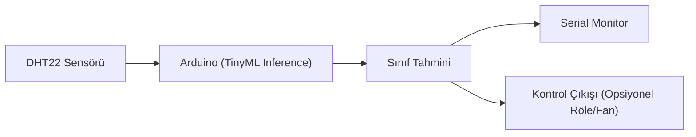
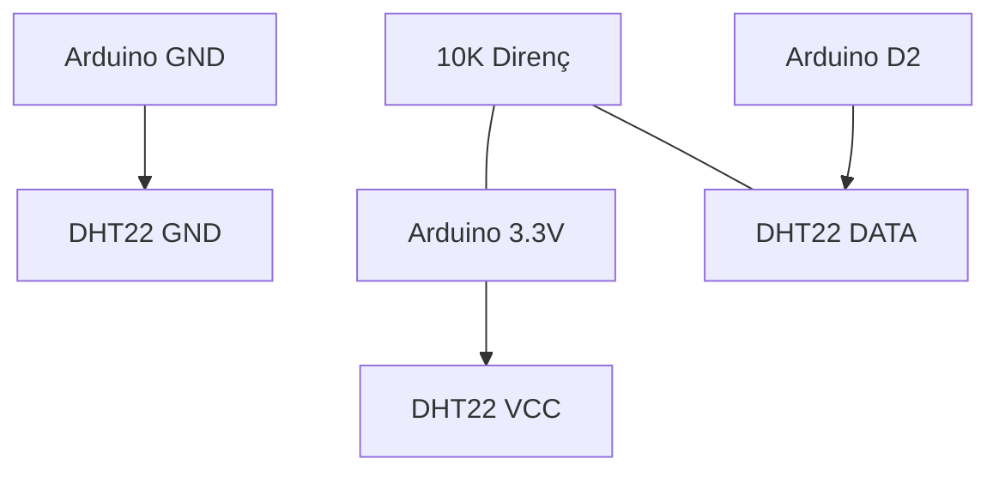

# TinyML ile Arduino ve Sensör Uygulaması: Uçtan Uca Rehber

TinyML konusu teoride anlaşılabilir görünse de asıl değer, gerçek donanım üzerinde çalışan bir örnekle ortaya çıkar. Bu makalede bir Arduino kartı, bir sıcaklık-nem sensörü ve TensorFlow Lite Micro kullanılarak uçtan uca bir uygulama kurulacaktır.

Bu uygulamanın hedefi, sensör verisini okuyup ortam durumunu sınıflandırmaktır:

- `normal`
- `sicak_nemli`
- `soguk_kuru`

Model, Python tarafında eğitilir; Arduino tarafında ise yalnızca çıkarım (inference) çalıştırılır.

> Not: TinyML kavramlarının temel açıklaması için önce `9- Yapay Zeka ve Robotik: TinyML ile Uçta Karar Verme.md` makalesini okumak faydalıdır.

## 1. Uygulama mimarisi

Akış basit ve üretime yakın bir mantıkla kurulmuştur:

1. DHT22 sensörü sıcaklık ve nem ölçer.
2. Arduino bu veriyi alır ve modele uygun ölçeğe dönüştürür.
3. TensorFlow Lite Micro modeli sınıf tahmini üretir.
4. Sonuç Serial Monitor üzerinden izlenir.
5. İstenirse role/fan gibi bir aktüatör tetiklenir.



*Şekil 1: Sensörden alınan veri Arduino üzerindeki TinyML modele girer ve tahmin sonucu izleme veya kontrol çıkışına aktarılır.*

## 2. Donanım ve yazılım gereksinimleri

## 2.1 Donanım listesi

- Arduino Nano 33 BLE Sense (önerilen) veya Arduino Nano 33 IoT
- DHT22 (AM2302) sıcaklık-nem sensörü
- 10K pull-up direnç (DHT data hattı için)
- Breadboard ve jumper kablolar
- USB kablosu

## 2.2 Yazılım gereksinimleri

- Arduino IDE 2.x
- `DHT sensor library` (Adafruit)
- `Adafruit Unified Sensor`
- `Arduino_TensorFlowLite` kütüphanesi
- Python 3.10+ (model eğitimi/dönüştürme için)
- TensorFlow (model oluşturma için)

## 3. Bağlantı şeması

DHT22 pin dizilimi modüle göre değişebilir; üretici dokümantasyonu kontrol edilmelidir. Aşağıdaki bağlantı en yaygın pin düzenine göredir.

| DHT22 Pin | Arduino Pin | Açıklama |
|---|---|---|
| VCC | 3.3V | Sensör besleme |
| DATA | D2 | Ölçüm verisi |
| GND | GND | Ortak toprak |

Ek bağlantı:

- `VCC` ile `DATA` arasına 10K direnç bağlanır (pull-up).



*Şekil 2: DHT22 sensörünün Arduino'ya temel bağlantısı; DATA hattında pull-up direnç kullanılır.*

## 4. Modeli hazırlama yaklaşımı

Arduino tarafında model eğitimi yapılmaz. Eğitim harici ortamda yapılır, sonra model `.tflite` olarak dışa alınır.

## 4.1 Eğitim verisi örneği

Basit CSV yapısı:

```csv
temperature,humidity,label
24.1,45.0,normal
32.8,79.5,sicak_nemli
18.3,28.2,soguk_kuru
```

## 4.2 Etiket kodlaması

- `normal -> 0`
- `sicak_nemli -> 1`
- `soguk_kuru -> 2`

## 4.3 Dönüştürme çıktısı

Eğitim tamamlandıktan sonra:

- `model.tflite` üretilir
- C dizisine dönüştürülerek `model.h` dosyasına alınır

Örnek dönüştürme komutu:

```bash
xxd -i model.tflite > model.h
```

## 5. Arduino tarafı dosya yapısı

Bu makaledeki uygulama için iki dosya yeterlidir:

- `tinyml_dht22.ino`
- `model.h`

`model.h` dosyası model byte dizisini içerir. Aşağıdaki örnekte dizi kısa tutulmuştur; gerçek dosyada uzun bir byte dizisi bulunur.

```cpp
// model.h
#ifndef MODEL_H
#define MODEL_H

const unsigned char model_tflite[] = {
  // Buraya xxd -i çıktısı gelir
  0x20, 0x00, 0x00, 0x00
};

const unsigned int model_tflite_len = sizeof(model_tflite);

#endif
```

## 6. Tam Arduino kodu

Aşağıdaki kod sensör verisini okuyup TinyML modeline verir ve sınıf sonucunu seri porta yazdırır.

```cpp
#include <Arduino.h>
#include <DHT.h>
#include "TensorFlowLite.h"
#include "model.h"

#include "tensorflow/lite/micro/all_ops_resolver.h"
#include "tensorflow/lite/micro/micro_error_reporter.h"
#include "tensorflow/lite/micro/micro_interpreter.h"
#include "tensorflow/lite/schema/schema_generated.h"
#include "tensorflow/lite/version.h"

#define DHTPIN 2
#define DHTTYPE DHT22

DHT dht(DHTPIN, DHTTYPE);

namespace {
tflite::MicroErrorReporter micro_error_reporter;
tflite::ErrorReporter* error_reporter = &micro_error_reporter;
const tflite::Model* model = nullptr;
tflite::AllOpsResolver resolver;

constexpr int kTensorArenaSize = 12 * 1024;
uint8_t tensor_arena[kTensorArenaSize];
tflite::MicroInterpreter* interpreter = nullptr;
TfLiteTensor* input = nullptr;
TfLiteTensor* output = nullptr;
}

const char* kClassNames[] = {"normal", "sicak_nemli", "soguk_kuru"};

float normalizeTemperature(float t) {
  // Eğitimde 0-50 aralığı kullanıldığı varsayılmıştır.
  return (t - 0.0f) / 50.0f;
}

float normalizeHumidity(float h) {
  // Eğitimde 0-100 aralığı kullanıldığı varsayılmıştır.
  return h / 100.0f;
}

int argmax(const float* data, int size) {
  int max_index = 0;
  float max_value = data[0];
  for (int i = 1; i < size; i++) {
    if (data[i] > max_value) {
      max_value = data[i];
      max_index = i;
    }
  }
  return max_index;
}

void setup() {
  Serial.begin(115200);
  while (!Serial) {}

  dht.begin();

  model = tflite::GetModel(model_tflite);
  if (model->version() != TFLITE_SCHEMA_VERSION) {
    Serial.println("Model schema uyumsuz.");
    while (true) {}
  }

  static tflite::MicroInterpreter static_interpreter(
      model, resolver, tensor_arena, kTensorArenaSize, error_reporter);
  interpreter = &static_interpreter;

  if (interpreter->AllocateTensors() != kTfLiteOk) {
    Serial.println("Tensor allocate hatasi.");
    while (true) {}
  }

  input = interpreter->input(0);
  output = interpreter->output(0);

  Serial.println("TinyML DHT22 uygulamasi basladi.");
}

void loop() {
  float temperature = dht.readTemperature();
  float humidity = dht.readHumidity();

  if (isnan(temperature) || isnan(humidity)) {
    Serial.println("Sensor okumasi basarisiz.");
    delay(1000);
    return;
  }

  float t_norm = normalizeTemperature(temperature);
  float h_norm = normalizeHumidity(humidity);

  // Model girişi: [temperature_norm, humidity_norm]
  input->data.f[0] = t_norm;
  input->data.f[1] = h_norm;

  if (interpreter->Invoke() != kTfLiteOk) {
    Serial.println("Model invoke hatasi.");
    delay(1000);
    return;
  }

  int class_index = argmax(output->data.f, 3);

  Serial.print("T=");
  Serial.print(temperature);
  Serial.print(" C, H=");
  Serial.print(humidity);
  Serial.print(" %, Tahmin=");
  Serial.println(kClassNames[class_index]);

  delay(2000);
}
```

## 7. Çıktıyı yorumlama

Serial Monitor örneği:

```text
T=24.80 C, H=46.10 %, Tahmin=normal
T=33.20 C, H=81.50 %, Tahmin=sicak_nemli
T=17.90 C, H=29.20 %, Tahmin=soguk_kuru
```

Bu çıktılar beklenen sınıflarla uyumluysa model-mikrodenetleyici entegrasyonu doğru çalışıyor demektir.

## 8. Opsiyonel kontrol çıktısı (fan tetikleme)

Tahmini doğrudan kontrole bağlamak için basit bir kural eklenebilir:

- Tahmin `sicak_nemli` ise röle pinini `HIGH` yap.
- Diğer sınıflarda röle pinini `LOW` yap.

Bu adımı eklerken güvenlik için manuel override (elle kapatma) anahtarı önerilir.

## 9. Sık karşılaşılan sorunlar

- **DHT okuma hatası:** Data hattı ve pull-up direnci kontrol edilmeli.
- **Model invoke hatası:** Giriş tensör boyutu modelle uyuşmuyor olabilir.
- **Bellek yetersizliği:** `kTensorArenaSize` artırılmalı veya model küçültülmeli.
- **Tahminler anlamsız:** Normalizasyon aralıkları eğitim tarafıyla aynı olmalı.

## 10. Geliştirme adımları

Bu temel uygulama kolayca genişletilebilir:

- Daha fazla sensör ekleyip feature sayısını artırma
- Zaman penceresi özellikleri (ortalama, varyans) kullanma
- Model güven skoru düşükse güvenli moda geçme
- OTA ile model güncelleme akışı ekleme

## 11. Sonuç

Bu makalede TinyML akışı teoriden pratiğe taşındı: sensör bağlantısı, modelin Arduino'ya gömülmesi, tam çalışan inference kodu ve seri çıktı doğrulaması birlikte ele alındı. Bu yapı, robotik projelerde "sadece veri okuyan" sistemden "veriye göre karar veren" sisteme geçiş için güvenilir bir başlangıçtır.
