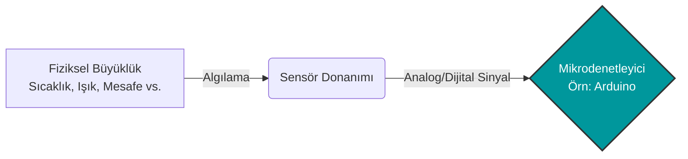
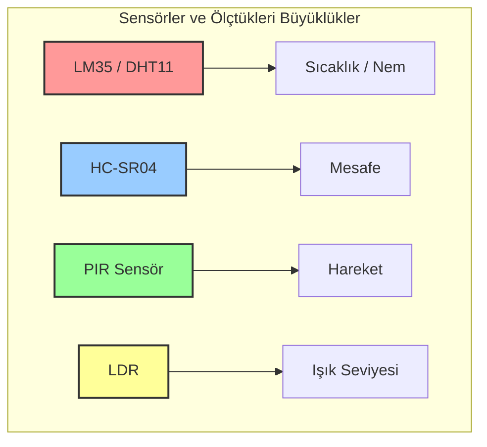
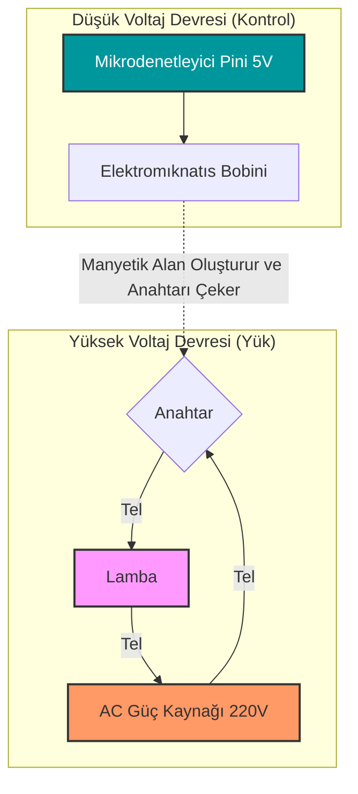
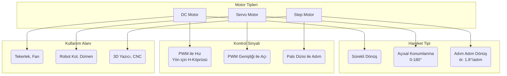
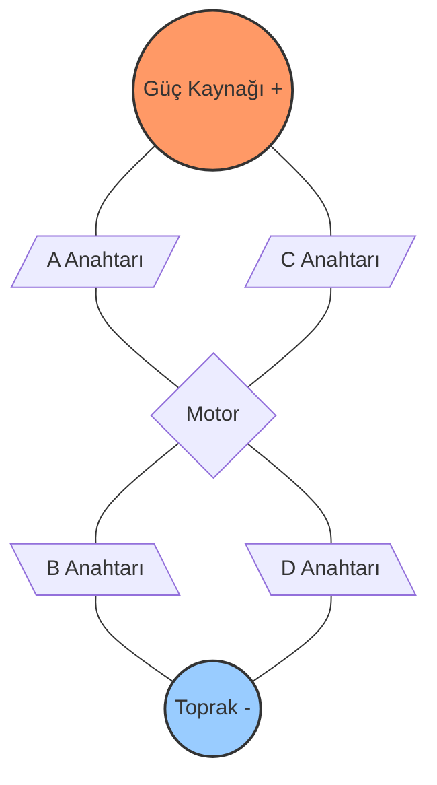
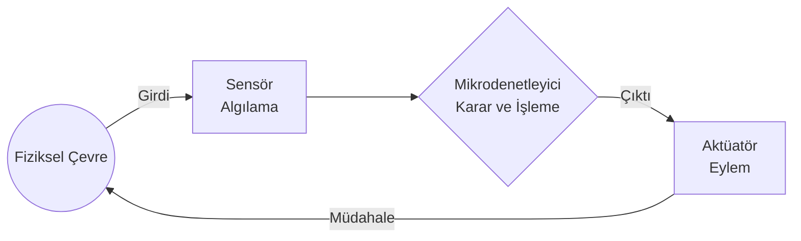

# Sensörler ve Aktüatörler: Çevreyi Algılama ve Fiziksel Etkileşim

**Bu metin, gömülü sistemlerin dış dünyayı nasıl hissettiğini (sensörler) ve fiziksel dünyaya nasıl müdahale ettiğini (aktüatörler) temel çalışma prensipleriyle açıklar. Amaç, sıcaklık, mesafe veya hareket gibi çevresel verilerin mikrodenetleyici tarafından nasıl okunduğunu ve bu verilerle motor, röle gibi donanımların nasıl kontrol edildiğini uygulama odaklı bir referansla sunmaktır.**

---

## İçerik başlıkları

- Sensör nedir? Temel mantık ve kalibrasyon kavramı
- Yaygın sensör türleri: Sıcaklık, Mesafe, Hareket ve Işık
- Aktüatör nedir? Fiziksel eyleyicilere giriş
- Temel aktüatörler: Röle ve Buzzer
- Motor türleri: DC, Servo ve Step motorlar arasındaki farklar
- Motor sürücü devreleri (H-Köprüsü) ve gerekliliği
- Sensör-Aktüatör Entegrasyonu: Algıla → Karar Ver → Eyleme Geç
- Kavram soruları ve uygulama problemleri

---

## 1. Sensör Nedir? Çalışma Prensipleri

Gömülü sistemler (veya mikrodenetleyiciler) sağır ve kördür; sadece elektrik sinyallerini anlarlar (voltaj ve akım). **Sensör (Algılayıcı)**, fiziksel bir büyüklüğü (ışık, sıcaklık, basınç, ses) alıp mikrodenetleyicinin anlayabileceği elektriksel bir sinyale (analog veya dijital) dönüştüren donanımdır.



### 1.1. Sensör Verilerinin Okunması

- **Analog Sensörler**: Çevresel değişime göre çıkış voltajını sürekli olarak değiştirirler (Örn: LDR, LM35). Bu veriler mikrodenetleyicinin **ADC (Analog-Digital Converter)** pinleri üzerinden okunur.
- **Dijital Sensörler**: Çıkışında sadece 1 (HIGH) veya 0 (LOW) üretirler ya da I2C, SPI gibi belirli bir iletişim protokolü ile paketlenmiş sayısal veri gönderirler (Örn: DHT11, düğme anahtarlar).

### 1.2. Kalibrasyon

Bir sensörden alınan ham veri her zaman gerçek dünyadaki kesin değere eşit olmayabilir. Sensörden okunan voltaj veya dijital sayının, gerçek birime (Örn: Santigrat derece veya Santimetre) doğru bir formülle dönüştürülmesine ve hassasiyet ayarının yapılmasına **kalibrasyon** denir.

---

## 2. Sensör Türleri

Robotik ve IoT projelerinde en sık karşılaşılan sensör tipleri şunlardır:



### 2.1. Sıcaklık Sensörleri

- **LM35**: Klasik analog sıcaklık sensörü. Her 1°C artış için çıkış voltajını 10 mV artırır. Çok basit bir ADC okuması ile sıcaklık hesaplanabilir.
- **DHT11 / DHT22**: Hem sıcaklık hem de nem ölçen dijital sensörlerdir. Mikrodenetleyici ile tek bir pin üzerinden kendi özel dijital protokolüyle haberleşirler.
- **DS18B20**: "1-Wire" protokolü kullanan, çok hassas dijital sıcaklık sensörü. Su geçirmez versiyonları sayesinde sıvı ölçümlerinde sıkça kullanılır.

### 2.2. Mesafe Sensörleri

- **Ultrasonik (HC-SR04)**: Yarasa mantığıyla çalışır. Yüksek frekanslı bir ses dalgası gönderir ve engele çarpıp geri dönme süresini ölçer. `Mesafe = (Hız × Zaman) / 2` formülü ile santimetre cinsinden mesafe hesaplanır.
- **IR (Kızılötesi) Engel Algılayıcılar**: Işık yansıma prensibiyle çalışır. Mesafe ölçmekten ziyade "yakında bir engel var mı yok mu?" (dijital 1 veya 0) tespiti için daha uygundur.

### 2.3. Hareket Sensörleri (PIR)

- **PIR (Passive Infrared) Sensör**: Canlıların vücut sıcaklığından yayılan kızılötesi ışıma değişikliklerini algılar. Ortamda hareket eden bir insan veya hayvan olduğunda tetiklenerek dijital "1" (HIGH) sinyali üretir. Akıllı evlerde aydınlatma otomasyonunda standarttır.

### 2.4. Işık Sensörleri

- **LDR (Light Dependent Resistor)**: Fotodirenç olarak da bilinir. Üzerine düşen ışık miktarı arttıkça elektriksel direnci azalır. Gerilim bölücü (voltage divider) bir devre kurularak analog bir sensör haline getirilir. Gece lambası uygulamalarının temel elemanıdır.

---

## 3. Aktüatör Nedir?

Sensörler sistemin "duyu organları" ise, **Aktüatör (Eyleyici)** sistemin "kaslarıdır". Aktüatör, mikrodenetleyiciden aldığı zayıf elektriksel sinyali, fiziksel bir harekete, sese, ışığa veya yüksek güçlü bir anahtarlamaya dönüştüren donanımdır.

Bir mikrodenetleyicinin (örneğin Arduino) bir pini genellikle en fazla **20-40 mA** akım verebilir. Çoğu aktüatör bu akımdan çok daha fazlasına ihtiyaç duyar. Bu nedenle aktüatörler doğrudan pinlere bağlanmaz; aracı donanımlara (transistör, röle, motor sürücü) ihtiyaç duyulur.

---

## 4. Temel Aktüatörler: Röle ve Buzzer

### 4.1. Röle (Relay)

Röle, düşük voltajlı/akımlı bir sinyalle (Örn: Arduino'nun 5V pini), çok yüksek voltaj ve akım çeken (Örn: 220V AC priz lambası veya büyük bir su pompası) cihazları kontrol etmeye yarayan elektromekanik veya katı hal (SSR) anahtardır.



- **Mekanik tık sesi**: Elektromıknatısın kontakları çekmesiyle oluşur.
- **Güvenlik**: Mikrodenetleyici ile yüksek gerilim devresini fiziksel olarak izole eder (galvanik izolasyon).

### 4.2. Buzzer (Ses Çıkışı)

- **Aktif Buzzer**: Sadece 5V (veya 3.3V) elektrik verildiğinde kendi iç devresi sayesinde sabit tonda ses çıkarır (Dijital 1/0 ile kontrol).
- **Pasif Buzzer**: Kendi ton üreticisi yoktur. Mikrodenetleyiciden gönderilen PWM (Pulse Width Modulation) sinyalinin frekansına göre farklı notalarda (melodiler) ses çıkarabilir.

---

## 5. Motor Türleri

Robotik sistemlerde hareketi sağlamak için farklı motor türleri kullanılır. Her birinin kullanım amacı farklıdır.



### 5.1. DC Motorlar

- **Özellik**: Elektrik verildiğinde sürekli döner. Kutup (+ ve -) yönü değiştirilirse dönüş yönü de değişir.
- **Kontrol**: Hızı ayarlamak için PWM sinyali kullanılır. Voltajın ortalaması (duty cycle) ne kadar yüksekse motor o kadar hızlı döner.
- **Kullanım Alanı**: Tekerlekli robot arabalar (çizgi izleyen, engelden kaçan), fanlar, pervaneler.

### 5.2. Servo Motorlar

- **Özellik**: DC motorun içine potansiyometre ve kontrol kartı eklenmiş halidir. Sürekli dönmez; genellikle 0° ile 180° arasında istenilen kesin bir açıya gidip o açıda bekler.
- **Kontrol**: PWM sinyalinin *genişliği* (örneğin 1 ms = 0 derece, 2 ms = 180 derece) motorun gideceği açıyı belirler.
- **Kullanım Alanı**: Robot kollardaki eklemler, otomatik kapılar, kamera yönlendirme sistemleri.

### 5.3. Step (Adım) Motorlar

- **Özellik**: Çok hassas konumlama yapabilen motorlardır. Elektrik verildiğinde dönmek yerine, belirli bir derecelik (örneğin 1.8°) bir "adım" atar.
- **Kontrol**: Sargılara sırayla pals (darbe) gönderilerek adım adım ilerletilir.
- **Kullanım Alanı**: 3 Boyutlu (3D) yazıcılar, CNC makineleri, hassas medikal cihazlar.

---

## 6. Motor Sürücü Devreleri ve H-Köprüsü

DC motorlar ve Step motorlar mikrodenetleyici pinlerine **doğrudan bağlanamaz.** (Çok fazla akım çekerler ve durma anında oluşan ters elektromotor kuvveti (back-EMF) pini yakabilir). Çözüm: **Motor Sürücü Entegreleri** (Örn: L298N, L293D).

### H-Köprüsü (H-Bridge) Mantığı

Motorun dönüş yönünü değiştirmek için akımın yönünü çevirmek gerekir. Bunu 4 adet anahtarla (transistörle) yapan devreye "H-Köprüsü" denir.



- Çapraz iki anahtar kapalıyken akım soldan sağa akar (Motor ileri döner).
- Diğer çapraz anahtarlar kapalıyken akım sağdan sola akar (Motor geri döner).
- Mikrodenetleyici sadece bu anahtarlara aç/kapa komutu (zayıf sinyal) gönderir, gücü çeken taraf motor sürücü devresinin beslemesidir.

---

## 7. Sensör - Aktüatör Entegrasyonu (Sinyal Zinciri)

Gömülü sistem projelerinde sihir, bu iki yapının bir araya gelmesiyle başlar:



**Örnek Senaryo: Otomatik Soğutma Sistemi**

1. **Algılama**: LM35 sıcaklık sensörü odanın sıcaklığını ölçer ve mikrodenetleyiciye analog voltaj gönderir.
2. **İşleme / Karar**: ADC bu voltajı sayıya çevirir. Kod içinde bir kural vardır: `Eğer sıcaklık > 30°C ise...`
3. **Eylem**: Karar "Evet" ise mikrodenetleyici bir röleyi tetikler. Röle de 220V ile çalışan büyük bir vantilatörü çalıştırır. (Aktüatör devrede).

**Örnek Senaryo: Engelden Kaçan Robot**

1. **Algılama**: HC-SR04 ultrasonik sensör karşıdaki duvara 15 cm kaldığını hesaplar.
2. **İşleme / Karar**: Kod der ki: `Eğer mesafe < 20 cm ise, dur ve sağa dön.`
3. **Eylem**: Motor sürücüye giden sol motor pinleri "ileri", sağ motor pinleri "geri" şeklinde ayarlanarak robotun olduğu yerde sağa dönmesi (tank dönüşü) sağlanır.

Bu entegrasyon mantığı, en basit oyuncaktan en gelişmiş otonom araca kadar tüm robotik sistemlerin çekirdeğidir.

---

## 8. Kavram Soruları ve Uygulama Problemleri

Bu bölümdeki sorular, sensörlerin doğası ve aktüatör seçimi arasındaki ilişkiyi pekiştirmek için hazırlanmıştır. Ayrıntılı çözümler ilerleyen süreçte `5C- Sensörler ve Aktüatörler Çözümler.md` dosyasında bulunabilir.

### 8.1. Temel Kavram Soruları (S1–S5)

**S1 – Sensör Seçimi**
Aşağıdaki senaryolar için en uygun sensörü (LDR, PIR, HC-SR04, DS18B20) seçin ve nedenini kısaca açıklayın.
- A) Bir ofiste insanlar yokken ışıkların kapatılmasını sağlayan sistem.
- **Cevap:** **PIR (Passive Infrared) Sensör**. Çünkü PIR sensörler, ortamdaki canlıların (insanların) hareketini vücut sıcaklıklarından yayılan kızılötesi ışıma değişikliklerini algılayarak tespit eder. "İnsan var/yok" tespiti için idealdir.
- B) Bir arabanın geri vitese takıldığında arkadaki duvara olan uzaklığını bildiren park asistanı.
- **Cevap:** **HC-SR04 (Ultrasonik Mesafe Sensörü)**. Çünkü bu sensör, ses dalgaları gönderip yansımasını ölçerek mesafeyi santimetre hassasiyetinde hesaplayabilir. Park asistanı için kesin mesafe bilgisi gereklidir.
- C) Bir seradaki toprak suyunun veya havuzun donup donmadığını ölçen sistem.
- **Cevap:** **DS18B20 (Su Geçirmez Dijital Sıcaklık Sensörü)**. Çünkü su geçirmez kılıfı sayesinde doğrudan sıvı veya nemli toprak içine daldırılabilir ve hassas sıcaklık ölçümü yaparak donma noktasını (0°C) tespit edebilir.
- D) Güneş battığında sokak lambalarının otomatik yanmasını sağlayan sistem.
- **Cevap:** **LDR (Light Dependent Resistor)**. Çünkü LDR, ortamdaki ışık seviyesine göre direncini değiştirir. Hava karardığında direnci artar ve bu değişiklik bir eşik değeriyle karşılaştırılarak lambaların yanması tetiklenebilir.

**S2 – Analog ve Dijital Sensör Farkı**
LM35 sıcaklık sensörü ile DHT11 sıcaklık/nem sensörü arasındaki temel elektriksel veri çıkış farkı nedir? Mikrodenetleyicide hangi donanımsal özellikler kullanılarak okunurlar?

- **Cevap:**
  - **LM35 (Analog):** Çıkışında sıcaklıkla doğrusal orantılı, sürekli değişen bir **analog voltaj** üretir (örn: 25°C için 250mV). Bu voltaj, mikrodenetleyicinin **ADC (Analog-Digital Converter)** pini tarafından okunur ve sayısal bir değere (0-1023 gibi) dönüştürülür.
  - **DHT11 (Dijital):** Çıkışında kendi özel **dijital haberleşme protokolü** ile paketlenmiş sayısal veri (sıcaklık ve nem değeri) gönderir. Tek bir **dijital I/O pini** üzerinden okunur ve bu veriyi çözmek için özel bir kütüphane kullanılır. ADC'ye ihtiyaç duymaz.

**S3 – Aktüatör Doğrudan Neden Bağlanmaz?**
5V ile çalışan bir DC motor, neden Arduino'nun doğrudan 5V Dijital çıkış pinlerinden birine takılarak kontrol edilmemelidir? İki önemli donanımsal nedeni (akım ve EMF) açıklayın.

- **Cevap:**
  1.  **Yüksek Akım Çekimi:** DC motorlar, özellikle ilk kalkış anında, bir Arduino pininin güvenle sağlayabileceği akımdan (genellikle 20-40 mA) çok daha fazlasını (yüzlerce mA veya Amper) çeker. Bu durum, mikrodenetleyicinin pinine veya çipin kendisine kalıcı olarak hasar verir.
  2.  **Ters Elektromotor Kuvveti (Back-EMF):** Motor dönerken veya aniden durdurulduğunda, sargılarında zıt yönde bir gerilim (voltaj sıçraması) indüklenir. Bu yüksek ve ani voltaj, motorun bağlı olduğu hassas mikrodenetleyici pinini yakabilir. Motor sürücü devreleri bu iki sorunu da çözmek için tasarlanmıştır.

**S4 – Servo ve DC Motor Karşılaştırması**
Bir "robot kol" tasarımı yapıyorsunuz. Eklemleri (dirsekleri) hareket ettirmek için standart DC motor mu kullanırdınız, yoksa Servo motor mu? Nedenini pozisyon kontrolü kavramıyla açıklayın.

- **Cevap:** **Servo motor** kullanırdım.
  - **Neden:** Robot kol eklemlerinin belirli bir **açıda durması** ve o pozisyonu koruması gerekir (pozisyon kontrolü). DC motorlar sadece sürekli döner ve hassas açı kontrolü yapamazlar. Servo motorlar ise dahili geri bildirim mekanizmaları (potansiyometre) sayesinde 0-180 derece gibi belirli bir aralıkta istenen açıya gidip orada sabit kalabilirler. Bu, bir robot kolun hassas hareketleri için zorunludur.

**S5 – Rölenin Görevi**
Akıllı ev sisteminde, 5V ile çalışan bir mikrodenetleyicinin 220V şehir şebekesine bağlı bir fırını veya ısıtıcıyı nasıl çalıştırıp kapatabildiğini röle mekanizmasını kullanarak açıklayın.

- **Cevap:** Röle, düşük ve yüksek voltajlı devreler arasında bir **elektromekanik anahtar** görevi görür.
  1.  **Kontrol Devresi (Düşük Voltaj):** Mikrodenetleyici, 5V'luk zayıf bir sinyali rölenin bobinine gönderir.
  2.  **Elektromıknatıs:** Bu sinyal, bobini bir elektromıknatısa dönüştürür.
  3.  **Anahtarlama (Yüksek Voltaj):** Elektromıknatıs, yüksek voltaj devresine (220V) bağlı olan fiziksel bir anahtarı mekanik olarak çeker ve kontağı kapatır.
  4.  **Sonuç:** Kontak kapandığında 220V'luk akım fırına veya ısıtıcıya ulaşır ve cihaz çalışır. Mikrodenetleyici sinyali kestiğinde mıknatıslanma biter, kontak geri açılır ve cihaz durur. Bu sayede iki devre arasında **galvanik izolasyon** sağlanarak mikrodenetleyici korunmuş olur.

### 8.2. Tasarım ve Hesaplama Problemleri (S6–S10)

**S6 – Ultrasonik Mesafe Hesabı**
HC-SR04 sensörü bir ses dalgası yolluyor. Sesin yollanması ile engele çarpıp eko (echo) pinine dönmesi arasında geçen süre 1000 mikrosaniye (1 ms) olarak ölçülüyor.
- Sesin havadaki hızı yaklaşık 340 m/s (veya 0.034 cm/µs) kabul edilirse, cisim kaç cm uzaklıktadır? (Formülü hatırlayın: alınan toplam yolun gidiş-dönüş olduğunu unutmayın).
- **Cevap:**
  - **Formül:** `Mesafe = (Ses Hızı × Zaman) / 2`
  - **Veriler:**
    - Zaman = 1000 µs
    - Ses Hızı = 0.034 cm/µs
  - **Hesaplama:**
    - Gidiş-dönüş toplam yol = 0.034 cm/µs * 1000 µs = 34 cm
    - Tek yönlü mesafe = Toplam Yol / 2 = 34 cm / 2 = **17 cm**
  - Cisim **17 cm** uzaklıktadır.

**S7 – LDR ve Gerilim Bölücü Tasarımı**
LDR'nin direnci tam karanlıkta 100 kΩ, aydınlık ortamda ise 1 kΩ olmaktadır. Bu LDR'yi 5V kaynağı ile 10 kΩ'luk sabit bir dirence seri bağlayarak bir gerilim bölücü kuruyorsunuz (LDR üstte (5V tarafında), 10kΩ direnç altta (GND tarafında)).
- Aydınlık ortamda mikrodenetleyicinin okuyacağı analog voltaj yaklaşık nedir?
- Karanlık ortamda okunacak voltaj yaklaşık nedir?
- **Cevap:**
  - **Formül (Gerilim Bölücü):** `V_out = V_in * (R2 / (R1 + R2))`
  - **Veriler:**
    - V_in = 5V
    - R1 = LDR'nin direnci
    - R2 = 10 kΩ (sabit direnç)
  - **Aydınlık Ortam (LDR = 1 kΩ):**
    - `V_out = 5V * (10k / (1k + 10k)) = 5V * (10 / 11) ≈ 4.55V`
  - **Karanlık Ortam (LDR = 100 kΩ):**
    - `V_out = 5V * (10k / (100k + 10k)) = 5V * (10 / 110) ≈ 0.45V`

**S8 – H-Köprüsü Senaryosu**
Bir H-Köprüsü motor sürücüsünde A, B, C, D transistörleri/anahtarları vardır. A ve D açıkken motor ileri dönmektedir. B ve C açıkken geri dönmektedir. 
- Eğer yanlış bir yazılım hatası sonucu A ve B anahtarları aynı anda kapatılırsa (iletken hale getirilirse) elektronik devrede ne gibi bir tehlike oluşur?
- **Cevap:** A ve B anahtarları H-Köprüsünün aynı kolunda yer alır (biri güç kaynağına, diğeri toprağa bağlıdır). İkisi aynı anda iletken hale gelirse, güç kaynağı (+) ile toprak (GND) arasında doğrudan bir yol oluşur. Bu duruma **"shoot-through"** veya **kısa devre** denir. Sonuç olarak, güç kaynağından çok yüksek bir akım çekilir, bu da transistörlerin, motor sürücü entegresinin ve hatta güç kaynağının anında yanmasına veya kalıcı hasar görmesine neden olur.

**S9 – Soğutma Fanı Algoritması**
Bir DC motor ve LM35 içeren bir devrede:
Sıcaklık 25°C altındaysa fan duracak. 25-35°C arasında fan %50 güçte dönecek. 35°C üzerinde tam güç (%100) çalışacak.
- Bu eylemleri gerçekleştirmek için hangi aktüatör kontrol tekniği (röle mi, PWM mi) kullanılmalıdır? Mantığını blok şema sırasıyla yazın.
- **Cevap:**
  - **Kontrol Tekniği:** **PWM (Pulse Width Modulation)** kullanılmalıdır. Çünkü röle sadece tam aç/kapa (%0 veya %100 güç) kontrolü sağlar. Fanın %50 gibi ara hızlarda çalışabilmesi için PWM ile motorun ortalama gücünü ayarlamak gerekir.
  - **Mantık Sırası (Blok Şema):**
    1.  **[Sensör Oku]** -> LM35'ten analog voltajı oku.
    2.  **[Veriyi İşle]** -> Okunan ADC değerini Santigrat dereceye çevir.
    3.  **[Karar Ver (if/else if/else)]**
        - `if (sicaklik < 25)` -> PWM duty cycle'ı **0** yap (`analogWrite(pin, 0)`).
        - `else if (sicaklik >= 25 && sicaklik <= 35)` -> PWM duty cycle'ı **%50** yap (`analogWrite(pin, 127)`).
        - `else (sicaklik > 35)` -> PWM duty cycle'ı **%100** yap (`analogWrite(pin, 255)`).
    4.  **[Eyleme Geç]** -> Hesaplanan PWM değerini motor sürücüye bağlı pine göndererek fan hızını ayarla.
    5.  **[Başa Dön]** -> Döngüye devam et.

**S10 – Karma Entegrasyon Senaryosu: Otomatik Garaj Kapısı**
Bir garaj kapısında şu bileşenler var: Mesafe sensörü (HC-SR04), LDR, Servo motor, Buzzer ve 2 adet LED (Kırmızı, Yeşil). Sistem şu kurala göre çalışmalıdır:
- Araba garaja 50 cm'den fazla yaklaşırsa kapı açılacak (Servo 90 derece), yeşil LED yanacak ve Buzzer 1 saniye ötüp duracak. 
- Eğer hava çok karanlıksa (LDR eşiği geçerse) ekstra aydınlatma olarak garaj içindeki röle tetiklenecek.
Bu sistem için: "Girdiler (Inputs)" ve "Çıktılar (Outputs)" listesi yapın ve mikrodenetleyici içindeki mantıksal karar ağacını (if/else şeklinde) metinsel olarak özetleyin.

- **Cevap:**
  - **Girdiler (Inputs):**
    - HC-SR04 Mesafe Sensörü (Arabanın uzaklığını ölçer)
    - LDR Işık Sensörü (Havanın karanlık olup olmadığını anlar)
  - **Çıktılar (Outputs):**
    - Servo Motor (Garaj kapısını açar/kapatır)
    - Yeşil LED (Kapının açıldığını belirtir)
    - Kırmızı LED (Kapının kapalı olduğunu belirtir)
    - Buzzer (Sesli uyarı verir)
    - Röle (Garaj içi aydınlatmayı kontrol eder)
  - **Mantıksal Karar Ağacı (Özet):**
    ```c
    // Ana döngü içinde sürekli çalışır
    
    // 1. Girdileri Oku
    mesafe = HC_SR04_oku();
    isik_seviyesi = LDR_oku();
    
    // 2. Kapı Kontrolü
    if (mesafe < 50) { // Araba yaklaştı
        servo.write(90);      // Kapıyı aç
        digitalWrite(yesil_led, HIGH);
        digitalWrite(kirmizi_led, LOW);
        tone(buzzer_pin, 1000); // Sesi başlat
        delay(1000);            // 1 saniye bekle
        noTone(buzzer_pin);     // Sesi durdur
    } else { // Araba uzakta
        servo.write(0);       // Kapıyı kapalı tut
        digitalWrite(yesil_led, LOW);
        digitalWrite(kirmizi_led, HIGH);
    }
    
    // 3. Aydınlatma Kontrolü (kapı kontrolünden bağımsız)
    if (isik_seviyesi < KARANLIK_ESIGI) {
        digitalWrite(role_pini, HIGH); // Hava karanlık, ışığı aç
    } else {
        digitalWrite(role_pini, LOW); // Hava aydınlık, ışığı kapat
    }
    ```
