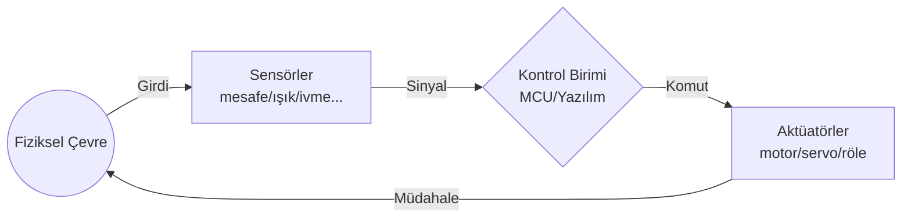

# Robotik Sistemler: Algıla → Kontrol Et → Eyleme Geç

**Bu metin, robotik sistemleri kapalı çevrim bir kontrol döngüsü olarak açıklar. Robot; çevreden sinyal toplar (sensörler), bu sinyali bir kontrol mantığıyla yorumlar (mikrodenetleyici/yazılım) ve fiziksel dünyaya müdahale eder (aktüatör/motor sürücü). Ardından tekerlekli robotlarda hareket mantığını ve PID kontrol sezgisini kullanarak “neden bazı davranışlar kararsız veya sapmalı olabilir?” sorusuna pratik bir çerçeve sunar.**

---
## İçerik başlıkları
- Robotik döngü: Algılama → Karar Verme → Eylem
- Kapalı çevrim kontrol ve geri bildirim (encoder vb.)
- Robot türleri ve kullanım alanları
- Hareket mekanizmaları: tekerlekli, yürüyen, drone
- Motor sürme mantığı: yön, hız ve H-köprüsü
- PID kontrol kavramı: hata, düzeltme ve sönümleme
- Arduino ile basit Engel Kaçınma (state machine)
- Kavram soruları ve uygulama problemleri

---
## 1. Robotik Sistem Nedir?

Robotik, fiziksel dünyada çalışan bir sistemin “duyu + karar + eylem” döngüsünü tasarlama sanatıdır. Gömülü sistemler tek başına çevreyi “anlamaz”; sadece elektrik sinyallerini işleyebilir. Bu yüzden robotik sistemin kalbi bir zincir gibidir:



### 1.1 Algılama (Sensörler)

Sensörler, fiziksel büyüklükleri mikrodenetleyicinin anlayacağı elektrik sinyallerine dönüştürür:

- **Analog sensörler**: ADC ile sayısallaştırılır (LDR, LM35 gibi).
- **Dijital sensörler**: HIGH/LOW ya da belirli protokollerle veri iletir (PIR, DHT11 gibi).

### 1.2 Karar Verme (Mikrodenetleyici/Yazılım)

Karar bloğu, sensörden gelen veriyi bir mantığa göre yorumlar:

- Basit kural tabanlı kararlar: `if/else` ile “ne yapacağına” karar verme.
- Gelişmiş kontrol: PID gibi geri bildirimli algoritmalar.
- Pratikte ek katmanlar: eşikleme, filtreleme, örnekleme zamanlaması.

### 1.3 Eyleme Geçme (Aktüatörler ve Motor Sürücüler)

Aktüatörler, kontrol biriminin ürettiği komutu fiziksel harekete çevirir:

- Doğrudan pinlerden sürmek çoğu zaman mümkün değildir (akım gereksinimi, geri-EMF vb.).
- Bu yüzden çoğunlukla **motor sürücü (H-köprüsü)** ya da **röle/transistör devreleri** kullanılır.

---
## 2. Robotun Bileşenleri: Pratik Bakış

Robotu “parçaların toplamı” yerine “işleyen bir sistem” olarak görmek için şu katmanlara ayırmak işe yarar:

1. **Güç katmanı**: pil/batarya, regülatör, kablo kalınlığı, ortak referans (GND).
2. **Kontrol katmanı**: Arduino/MCU, sürücü için çıkış pinleri, yazılım döngüsü.
3. **Hareket katmanı**: tekerlek, motor, şase, bağlantı mekanikleri.
4. **Geri bildirim (opsiyonel ama güçlü)**: enkoder, durum sensörleri, “ölç-yeniden ayarla” zinciri.

> Önemli fikir: Robotik projelerde “koddaki hata” kadar “zincirdeki yanlış varsayım” da davranışı bozabilir. Örneğin ortak GND yoksa sensör verileri saçmalayabilir; motor sürücü yanlış beslenirse hız/ yön tutarsızlaşır.

---
## 3. Robot Türleri ve Kullanım Alanları

Robot türleri, çoğu zaman “ne kadar çeviklik” ve “ne kadar güvenlik gerekliliği” ile ayrılır:

- **Endüstriyel robotlar**
  - Tekrarlı görevler, üretim hattı, hassas hareket.
- **Mobil robotlar**
  - Ortam içinde hareket eder; tekerlekli veya yürüyen mekaniklerle uygulanır.
- **Hizmet robotları**
  - İnsanların günlük ihtiyacına yanıt verir (yönlendirme, temizlik, yön bulma vb.).
- **Otonom sistemler**
  - Çevreyi sürekli algılar, planlama/ kontrol döngüsü uzun sürer ve güvenlik kritiktir.

---
## 4. Hareket Mekanizmaları

Robotun hareket biçimi, kontrol yaklaşımını doğrudan etkiler:

### 4.1 Tekerlekli Robotlar

- **DC motor + tekerlek** ile ileri/geri ve dönüş yapılır.
- Pratik sürüş tipleri:
  - **Tank dönüşü**: sol ve sağ tekerlekler zıt yönde döner.
  - **Açısal düzeltme**: sol/sağ hızları farklılaştırarak yön değiştirilir.

### 4.2 Yürüyen Robotlar

- Adım zamanlaması ve dengeleme daha karmaşıktır.
- Genellikle denge/ivme sensörleriyle kapalı çevrim çalıştırılır.

### 4.3 Drone / Uçan Robotlar

- Çok yüksek örnekleme (sample rate) ve stabilite kontrolü ister.
- Sensör füzyonu (IMU vb.) daha sık kullanılır.

---
## 5. Motor Sürme Mantığı: Yön + Hız + (Opsiyonel) Geri Bildirim

Tekerlekli robotlarda tipik motor kontrol problemi şuna indirgenir:

1. İstenen hareketi tanımla (ileri, geri, dön, hedef hız).
2. Motorun **yönünü** ayarla.
3. Motorun **hızını** (PWM) ayarla.
4. (Varsa) encoder ile ölç, gerekirse düzelt.

### 5.1 Hız Kontrolü (DC Motorlarda PWM)

DC motorlarda PWM, ortalama gerilimi değiştirir:

- PWM duty cycle arttıkça ortalama güç artar.
- Bu da çoğunlukla daha yüksek dönüş hızı anlamına gelir.

### 5.2 Yön Kontrolü (H-köprüsü)

Yönü ters çevirmek için akım yönünü terslemek gerekir. H-köprüsü mantığı dört anahtarla (transistör) çalışır:

- İleri için diyagonal iki anahtar iletken olur.
- Geri için diğer diyagonal iki anahtar iletken olur.
- Aynı anda hatalı şekilde “yanlış kol” anahtarları açılırsa **shoot-through** (kısa devre benzeri akım) oluşabilir.

### 5.3 Encoder ile Kapalı Çevrim

Encoder, motorun döndüğünü “ölçen” geri bildirim sensörüdür:

- Amaç: hedef hız/konuma yaklaşmak.
- Neden gerekli?
  - Batarya seviyesi, sürtünme ve yük değiştiğinde açık çevrim PWM her zaman aynı hızı vermez.
- PID gibi kontrol algoritmaları, encoder verisiyle “ölç-düzelt” yapar.

---
## 6. PID Sezgisi: Robot Kontrolünde Neden Gerekli?

PID kontrolün hedefi basittir: Robotun yapmak istediği şey (hedef) ile yaptığı şey (ölçüm) arasındaki farkı (hata) azaltmak.

### 6.1 Hata (Error) Tanımı

Genel form:

- `e(t) = hedef - ölçüm`

Kontrol, `e(t)` büyüdükçe daha güçlü düzeltme üretmeye çalışır.

### 6.2 P, I, D Ne Yapar?

- **P (Proportional)**: Hata büyüdükçe düzeltmeyi artırır.
  - Çok yüksek P: hızlı tepki ama aşım ve salınım riski.
- **I (Integral)**: Sürekli kalan küçük sapmayı zamanla azaltır.
  - Çok yüksek I: “wind-up” ve gecikmeli/kararsız davranış.
- **D (Derivative)**: Hatanın hızlı değişimini görüp aşımı azaltmaya yardım eder.
  - D, genellikle sönüm etkisi sağlar ama ölçüm gürültüsüne hassas olabilir.

PID formülü (sembolik):

`u(t) = Kp*e(t) + Ki*∫e(t)dt + Kd*de(t)/dt`

### 6.3 Robotlarda PID Nerede Kullanılır?

En sık kullanım senaryoları:

- **Hız kontrolü**: hedef hız sabit kalsın.
- **Yön/başlık kontrolü**: çizgiyi takip ederken sapmayı azalt.
- **Konum kontrolü**: enkoder veya IMU ile hedef açıda/konumda kal.

---
## 7. Basit Robot Tasarımı: Engel Kaçınma (State Machine Örneği)

Bu bölüm, önceki mantığı (algıla → karar ver → eyleme geç) somutlaştırır. Engel kaçınma, kural tabanlı karar ile başlayıp istenirse PID ile iyileştirilebilir.

### 7.1 Basit Donanım Tasarımı (Örnek)

- **Kontrol**: Arduino / benzeri MCU
- **Hareket**: 2 adet DC motor + motor sürücü (H-köprüsü / motor shield)
- **Algılama**: `HC-SR04` ultrasonik mesafe sensörü
- **Güç**: batarya + ortak `GND` (sensör ve sürücü için referans)

### 7.2 State Machine: İLERİ → ENGEL → GERİ/DÖN

Basit durum fikri:

```text
Durum: İLERİ
  - Mesafe > eşik      -> İLERİ
  - Mesafe <= eşik     -> ENGEL_DURUM (geri + dön)

Durum: GERİ
  - Geri hareket süresi bitti -> DÖN

Durum: DÖN
  - Dönüş tamamlanınca -> İLERİ
```

Akış (pseudo-kod) örneği:

```c
// Mesafe sensörü döngüsü içinde ölçülür ve durum değişimi yapılır.
enum Durum { ILERI, GERI, DON };
Durum durum = ILERI;

loop {
  mesafe = HC_SR04_oku_cm();

  switch (durum) {
    case ILERI:
      if (mesafe > ESİK) ileri();      // iki motor da ileri
      else { durum = GERI; geri_yap(); }
      break;

    case GERI:
      geri(devam_suresi);
      durum = DON;
      break;

    case DON:
      don(sure);                        // tank dönüş veya hız farkı
      durum = ILERI;
      break;
  }
}
```

### 7.3 Önce Test Et: “Kablo doğru mu?”

Robotik projelerde “garip davranış” çoğu zaman kök neden analizi ister. Basit bir test akışı:

1. **Kablolama testi**: sadece motorlar (ileri/geri) çalışıyor mu?
2. **Hız/dönüş testi**: PWM duty ile davranış gözleniyor mu? Sol/sağ motorlar benzer mi?
3. **Sensör entegrasyonu**: mesafe sensörü doğru ölçüyor mu ve eşik kararları beklediğin gibi mi?
4. **Fail-safe**: sensör beklenmeyen değer verirse (ör. `0`, `NaN`, çok büyük değer) robot güvenli duruma geçiyor mu?

---
## 8. Kavram Soruları ve Uygulama Problemleri

Bu bölüm, robotik döngü ve kontrol mantığını pekiştirmek için hazırlanmıştır.

### 8.1 Temel Kavram Soruları (S1–S5)

**S1 – Robotun çekirdek döngüsü nedir?**  
Aşağıdaki kavramları doğru sırayla yazın: sensör, mikrodenetleyici/yazılım, aktüatör. Ek olarak, zincirdeki bir halkada hata olursa robot davranışı nasıl etkilenebilir?

- **Cevap:**
  - Sıra: **Algılama (sensör) → Karar Verme (MCU/yazılım) → Eylem (aktüatör)**
  - Örnek etki: Sensör yanlış ölçerse (hatalı konumlandırma/kalibrasyon) MCU yanlış karar üretir ve aktüatör hatalı harekete geçer.

**S2 – Açık çevrim neden sorun çıkarır?**  
Açık çevrim motor kontrolünde (sadece PWM verip geri bildirim almadan) hangi durumlarda sapma artar?

- **Cevap:**
  - Batarya gerilimi düşerken
  - Yük değişirken (zemin sürtünmesi, eğim, robotun taşıdığı şey)
  - Motorların toleransları farklıyken (sol/sağ çekiş farkı)

**S3 – PWM duty cycle mantığı**  
PWM duty cycle %80 iken robotun hızının yükselmesini beklerken, bazı durumlarda hızın beklenenden düşük kalmasına sebep olabilecek 2 pratik faktör yazın.

- **Cevap:**
  - Batarya geriliminin düşük olması veya kablo/bağlantı kayıpları
  - Motor sürücünün ısınması veya motorun yük altında zorlanması (mekanik sürtünme)

**S4 – PID’de P, I, D etkisini sezgisel açıklayın**  
Hedef hızın üstünde sürekli salınım yaşayan bir robot düşünün. Önce hangi bileşen daha “alarm” sayılır ve neden?

- **Cevap:**
  - Genelde **P** aşırı yüksekse salınım/aşım artar; hata büyüdükçe düzeltme gereğinden fazla olur.
  - Sönüm için **D** faydalı olabilir; kalıcı sapma için **I** gerekir (ama tek başına I artırmak salınımı kötüleştirebilir).

**S5 – Encoder neden “kontrol edilebilirlik” sağlar?**  
Encoder olmadan da hedefe ulaşabilir miyiz? Ne tür problem daha görünür olur?

- **Cevap:**
  - Encoder olmadan çoğu zaman “yaklaşık” kontrol yapılır; hedefe ulaşma ihtimali yük/durum değiştikçe azalır.
  - Daha görünür hale gelen problem: **hata düzeltmesi yapacak ölçüm yoktur** (ölç-geri bildirim döngüsü zayıflar).

### 8.2 Tasarım ve Hesaplama Problemleri (S6–S10)

**S6 – HC-SR04 mesafe hesabı**  
HC-SR04’te echo dönüş süresi `1200 µs` ölçülüyor. Hava için ses hızı `0.034 cm/µs` kabul edilirse mesafe kaç cm’dir?

- **Cevap:**
  - `Mesafe = (Ses Hızı × Zaman) / 2`
  - `Mesafe = (0.034 × 1200) / 2 = (40.8) / 2 = **20.4 cm**`

**S7 – Engel kaçınma için fail-safe ekleyin**  
Robot “mesafe ölçemiyor” gibi beklenmeyen bir değer döndürürse (ör. `0 cm` veya sensörün aralığın dışı değerleri) ne yapmalıdır? Durum makinesine bir fail-safe durumu ekleyerek mantığı yazın.

- **Cevap:**
  - Öneri durum: `GÜVENLİ_DUR`
  - Mantık:
    - Eğer `mesafe` geçerli aralıkta değilse: **motorları durdur**
    - Kısa süre bekle, tekrar ölç
    - Hâlâ geçersizse: **sürekli döngü yerine güvenli dur**

**S8 – H-köprüsünde hatalı anahtarlama tehlikesi**  
H-köprüsünde “yanlış iki anahtarın aynı anda iletken olması” durumunda elektronik devrede ne olur? Sonuçları iki maddeyle yazın.

- **Cevap:**
  - **Shoot-through (kısa devre benzeri yol)** oluşur.
  - Güç kaynağından çok yüksek akım çekilir; sürücü entegresi/transistörler ve hatta batarya zarar görebilir.

**S9 – PID ile hedef hızı tutma (tasarım sorusu)**  
Hedef hızın `v_hedef` olduğu bir tekerlekli robot düşünün. Encoder ile mevcut hızı ölçüyor ve PID çıktısına göre PWM üretiyorsunuz. Bu sistem için kontrol döngüsünün adımlarını sırayla yazın.

- **Cevap:**
  1. **Ölçüm:** Encoder darbelerinden `v_olc` hesapla.
  2. **Hata:** `e = v_hedef - v_olc`
  3. **PID hesapla:** `u = Kp*e + Ki*... + Kd*...`
  4. **PWM üret:** `PWM = clamp(|u|, 0, MAX)`
  5. **Yön ayarla:** işaret (u pozitif/negatif) ile ileri/geri belirle.
  6. **Tekrar et:** döngü periyodunu sabit tut (sample rate).

**S10 – Basit dönüş kuralı (tank dönüş)**  
Tank dönüşte robotun sağa dönmesi için tipik motor yönleri nasıldır? Bir cümleyle açıklayın.

- **Cevap:**
  - Sağa dönüş için çoğunlukla **sol teker ileri**, **sağ teker geri** yapılır; bu sayede robotun gövdesi saat yönüne doğru döner.

---
#### Ders Sonrası Çalışma

- Farklı robot türlerinin (ör. mobil vs. otonom) “algılama + kontrol + güvenlik” gereksinimlerini 1 sayfalık karşılaştırma notu olarak yazın.
- Engel kaçınma algoritmanıza bir “durum günlüğü” ekleyin: `ILERI/GERI/DON` geçişlerini seri porttan yazdırın ve bir senaryo verin (koridor, geniş oda, dar geçiş).
