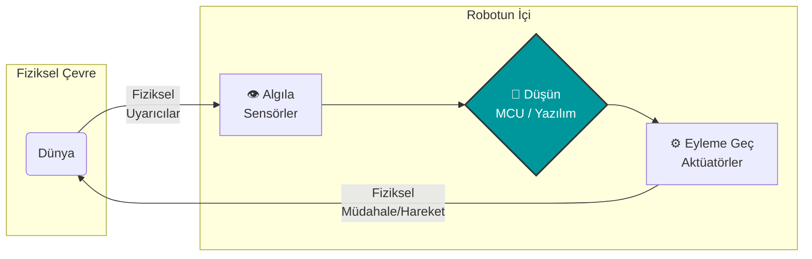
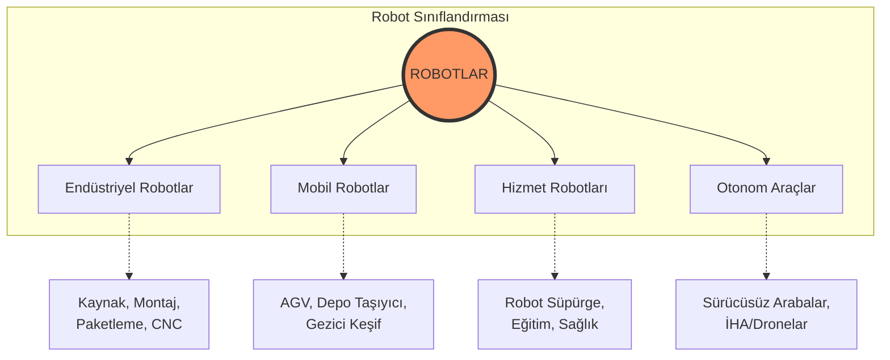

# Robotik Sistemler: Algıla, Karar Ver ve Harekete Geç

**Bu metin, basit elektronik devrelerin ve kod bloklarının nasıl birleşerek otonom kararlar alabilen fiziksel ajanlara (robotlara) dönüştüğünü açıklar. Amaç; robot anatomisini, temel hareket (lokomosyon) mekanizmalarını, tekerlekli robot sürüş mantığını ve PID kontrol gibi ileri düzey kavramların temellerini anlaşılır bir şekilde sunmaktır.**

---

## İçerik başlıkları

- Robot ve Robotik nedir? "Algıla - Düşün - Eyleme Geç" döngüsü
- Robot türleri ve endüstriyel / günlük hayat uygulamaları
- Hareket mekanizmaları (Lokomosyon): Tekerlekli, yürüyen ve uçan sistemler
- Diferansiyel Sürüş (Differential Drive) ve yönlendirme mantığı
- Robot şasesi, motorlar ve güç gereksinimleri
- PID Kontrole Giriş: Hatayı pürüzsüzce düzeltmek
- Sensör Entegrasyonu: Engelden kaçan robot senaryosu
- Kavram soruları ve uygulama problemleri

---

## 1. Robot ve Robotik Nedir?

**Robot**, fiziksel çevresiyle etkileşime giren, sensörleri aracılığıyla veri toplayan, bu verileri işleyerek otonom veya yarı otonom kararlar alan ve aktüatörleri vasıtasıyla çevresinde fiziksel bir değişiklik yaratan elektromekanik sistemdir.

**Robotik** ise bu sistemlerin tasarımı, üretimi, programlanması ve çalıştırılması ile ilgilenen çok disiplinli (Makine, Elektronik, Bilgisayar) mühendislik dalıdır.

Bir çamaşır makinesi de sensörlere ve motorlara sahiptir ancak bir robot değildir (sadece sabit bir programı uygular, çevresel değişkenlere karşı konum/davranış değiştirmez). Gerçek bir robotik sistemin kalbinde şu temel döngü yatar:



---

## 2. Robot Türleri ve Uygulama Alanları

Robotlar kullanım amaçlarına ve çalışma ortamlarına göre çeşitli sınıflara ayrılır:



---

## 3. Hareket Mekanizmaları (Lokomosyon)

Bir robotun bir noktadan diğerine gitme yöntemine **lokomosyon** denir. Seçilecek yöntem, robotun çalışacağı zemine bağlıdır.

1.  **Tekerlekli Robotlar:** En yaygın, enerji açısından en verimli ve kontrolü en kolay olanlardır. Düz zeminlerde (fabrika, ev) mükemmeldir. (Örn: Çizgi izleyen robot, robot süpürge).
2.  **Yürüyen (Bacaklı) Robotlar:** Engebeli araziler, merdivenler ve doğa koşulları için idealdir. Ancak dengede durmaları ve programlanmaları (ters kinematik) çok daha zordur. (Örn: Boston Dynamics Spot).
3.  **Uçan Robotlar (Dronelar):** Pervaneler (aktüatör) ve IMU (İvmeölçer/Jiroskop) sensörlerinin sürekli geri bildirimiyle havada kalırlar. Üç boyutlu alanda hareket ederler.

---

## 4. Tekerlekli Robotlarda Kontrol: Diferansiyel Sürüş

Giriş seviyesi projelerde ve birçok ticari AGV'de (Otonom Yönlendirmeli Araç) **Diferansiyel Sürüş (Differential Drive)** mantığı kullanılır. Bu sistemde bir direksiyon yoktur; robotun yönü, sağ ve sol tekerleklerin dönüş hızları arasındaki *farka* göre belirlenir.

```mermaid
graph TD
    subgraph Diferansiyel Sürüş Mantığı
        direction LR
        İLERİ[İleri Git\nSol: +Hız\nSağ: +Hız]
        GERİ[Geri Git\nSol: -Hız\nSağ: -Hız]
        SAGA_DON[Sağa Dön (Tank Dönüşü)\nSol: +Hız\nSağ: -Hız]
        YAY_SAGA[Sağa Kavis Çiz\nSol: Yüksek Hız\nSağ: Düşük Hız]
    end
```

- **Tank Dönüşü (Pivot Turn):** Sol tekerlek ileri, sağ tekerlek geri dönerse robot kendi ekseni etrafında (olduğu yerde) sağa döner. Dar alanlar için harikadır.

---

## 5. Robot Şasesi ve Güç Gereksinimleri

Bir robot sadece yazılımdan ibaret değildir; mekanik kararlılık ve enerji yönetimi kritik öneme sahiptir.

- **Şase (Gövde):** Motorları, pili, mikrodenetleyiciyi ve sensörleri bir arada tutan yapıdır. Ağırlık merkezinin yere yakın olması devrilmeyi önler.
- **Serbest Tekerlek (Sarhoş Teker / Caster Wheel):** Diferansiyel sürüşlü 2 motorlu robotlarda, robotun dengede durması ve rahat dönebilmesi için öne veya arkaya eklenen, motora bağlı olmayan bilyeli tekerlektir.
- **Güç Kaynağı (Batarya):** Arduino'yu çalıştırmak için gereken akım (ör. 50mA) ile motorları çalıştırmak için gereken akım (ör. 1-2 Amper) çok farklıdır. Bu yüzden motorlar, yüksek akım verebilen Li-Po veya Li-ion pillerle, uygun bir Motor Sürücü üzerinden beslenmelidir.

---

## 6. PID Kontrol Kavramına Giriş

Basit bir robot tasarladınız ve "düz gitmesini" istiyorsunuz. Ancak motorlardan biri hafifçe farklı üretildiği için robot sağa çekiyor. Veya bir çizgi izleyen robot tasarladınız, çizgi sensörü çizgiden çıktığını söylüyor. Motorlara "hemen tam güçle sola dön" derseniz robot çizgiyi çok geçer, bu kez "tam güçle sağa dön" der. Robot yalpalar (osilasyon) ve kontrolden çıkar.

Bunu çözmek için endüstride standart olan **PID Kontrol (Proportional, Integral, Derivative)** kullanılır:

```mermaid
flowchart LR
    H[Hedef (Örn: Çizginin Ortası)] --> F((Fark / Hata))
    D[Durum (Sensörden Okunan)] --> F
    F --> P[P: Oransal \nHata ne kadar büyükse o kadar sert düzelt]
    F --> I[I: İntegral \nHata uzun süredir devam ediyorsa gücü yavaşça artır]
    F --> D_P[D: Türev \nHata hızla kapanıyorsa fren yap/yumuşat]
    P & I & D_P --> M((Motorlara \nUygulanacak Güç))
```

- **P (Proportional - Oransal):** O anki hataya bakar. Hata büyükse büyük tepki, küçükse küçük tepki verir. (Sadece P kullanılırsa robot hedefe yaklaşır ama etrafında salınım yapar).
- **I (Integral - İntegral):** Geçmişteki hataların toplamına bakar. Hedefe çok yaklaşılıp orada takılındıysa, zamanla biriken bu değeri motorlara ekstra itici güç olarak uygular.
- **D (Derivative - Türev):** Hatanın değişim hızına (geleceğine) bakar. Eğer robot hedefe çok hızlı uçuyorsa, hedefe varmadan "fren (sönümleme)" uygular ki hedefi pas geçmesin.

---

## 7. Sensör Entegrasyonu: Engelden Kaçan Robot Senaryosu

Teori pratiğe döküldüğünde en popüler ilk proje **"Engelden Kaçan Robot"**tur. Bu sistem, Diferansiyel Sürüş ve HC-SR04 Mesafe sensörünü birleştirir.

**Basit Algoritma (Durum Makinesi Mantığı):**

1. **Algıla:** Ultrasonik sensör ile önündeki engelin mesafesini oku.
2. **Düşün (Karar Ver):**
   - `Eğer mesafe > 30 cm`: Önüm boş.
   - `Eğer mesafe <= 30 cm`: Önümde engel var!
3. **Eyleme Geç:**
   - Önü boşsa -> `Sol Motor: İLERİ, Sağ Motor: İLERİ`
   - Engel varsa -> `Sol Motor: GERİ, Sağ Motor: GERİ` (kısa süre fren/geri kaçış)
   - Sonra -> `Sol Motor: İLERİ, Sağ Motor: GERİ` (olduğu yerde sağa dönerek yeni yol ara).

Bu basit `if-else` mantığı, otonom davranışın temelini oluşturur. Daha gelişmiş versiyonlarında bir servo motor üzerine takılan sensör, sağa ve sola bakarak "en boş" yönü seçebilir.

---

## 8. Kavram Soruları ve Uygulama Problemleri

Bu bölümdeki sorular, robotik bileşenlerin ve algoritmaların anlaşılmasını pekiştirmek için tasarlanmıştır.

### 8.1. Temel Kavram Soruları (S1–S5)

**S1 – Robot ve Makine Ayrımı**
Evimizdeki standart bir fırın (zamanlayıcılı ve sıcaklık ayarlı) ile bir "robot süpürge" arasındaki temel "robotik" fark nedir?

- **Cevap:** Fırın önceden belirlenmiş sabit bir programı (örneğin 200 derecede 30 dakika) körü körüne uygular. Çevresinde beklenmedik bir şey olduğunda buna göre karar değiştirmez. Robot süpürge ise sensörleriyle çevresinin haritasını çıkarır, önüne bir eşya (engel) çıktığında rotasını **dinamik olarak (otonom)** değiştirir. Temel fark **"çevreyi algılayıp yeni duruma göre karar verebilme"** (Sense-Think-Act) yeteneğidir.

**S2 – Lokomosyon Seçimi**
Bir arama kurtarma görevi için enkaz ve moloz yığınları üzerinde hareket edecek bir robot tasarlıyorsunuz. Tekerlekli bir yapı mı seçersiniz, bacaklı (yürüyen) bir yapı mı? Neden?

- **Cevap:** **Bacaklı (yürüyen)** bir yapı seçerdim. Tekerlekli robotlar düz ve pürüzsüz zeminlerde çok başarılı olsalar da, moloz, merdiven ve yüksek engellerin olduğu düzensiz zeminlerde tekerlekler kolayca takılır veya boşa döner. Bacaklı robotlar engellerin üzerinden adım atarak geçebilirler, bu yüzden zorlu arazilerde lokomosyon açısından çok daha avantajlıdırlar.

**S3 – Motor ve Mikrodenetleyici İzolasyonu**
Robotunuzda 4 adet DC motor var. Bu motorların güç (VCC) kablolarını Arduino'nun üzerindeki 5V pinine bağlamak neden yanlış ve tehlikeli bir yaklaşımdır?

- **Cevap:** Motorlar çalıştıklarında, özellikle ilk kalkış anında (stall current) ve yük altındayken çok yüksek akım (amperlerce) çekerler. Arduino'nun regülatörü ve pinleri bu kadar yüksek akımı sağlayamaz. Motorları doğrudan bağlamak Arduino'nun anında kapanmasına (reset atmasına), regülatörünün yanmasına veya kartın kalıcı olarak bozulmasına neden olur. Motorlar her zaman **harici bir batarya** ve **motor sürücü devresi** üzerinden beslenmelidir.

**S4 – Diferansiyel Sürüş ile Dönüş**
İki tekerlekli, diferansiyel sürüşe sahip bir robotun yavaşça **sola doğru geniş bir kavis çizerek** dönmesini (ilerlerken sola dönmesini) istiyorsunuz. Sağ ve sol motorların hızlarını birbirine göre nasıl ayarlamalısınız?

- **Cevap:** Geniş bir kavis için her iki motor da **ileri** yönde dönmelidir. Ancak sola kavis çizebilmesi için **Sağ tekerlek hızlı**, **Sol tekerlek ise daha yavaş** dönmelidir. Sağ taraf daha fazla yol kat edeceği için robot sol merkeze doğru bir yay çizecektir.

**S5 – Tank Dönüşü (Pivot Turn) Nedir?**
"Tank dönüşü" manevrasının dar alanlardaki avantajı nedir ve bu dönüşü sağlamak için sol ve sağ motorlara hangi yönde sinyal gönderilir?

- **Cevap:** Tank dönüşünde robot ilerlemez, **kendi ekseni etrafında** döner (sıfır dönüş yarıçapı). Bu sayede dar koridorlarda veya köşeye sıkıştığında yer kaplamadan yön değiştirebilir. Sağa doğru tank dönüşü yapmak için: **Sol motor ileri**, **Sağ motor geri** tam zıt yönlerde çalıştırılır.

### 8.2. Tasarım ve Kontrol Problemleri (S6–S10)

**S6 – Engelden Kaçma Algoritması Hatası**
Bir öğrenci engelden kaçan robot kodu yazıyor: "Eğer mesafe < 20cm ise, sağa dön". Ancak robot köşeye geldiğinde sürekli sağa dönüyor, tekrar engeli görüyor, tekrar sağa dönüyor ve köşede sıkışıp kalıyor. Algoritmaya hangi adımı veya mantığı ekleyerek bu "sonsuz döngüden" kurtarabilirsiniz?

- **Cevap:** Sadece sağa dönmek yerine duruma göre farklı kararlar alan bir mantık (rastgelelik veya yön tarama) eklenmelidir. Örneğin: Robot engele gelince durur. Üzerindeki servo motorla sensörü **önce sağa, sonra sola** çevirip mesafeleri okur. Hangi taraf daha boşsa (mesafe daha büyükse) o yöne doğru döner. Eğer her iki taraf da kapalıysa, bir miktar geri gidip öyle dönme (Geri + Dönüş) manevrası eklenir.

**S7 – Çizgi İzleyen Robot Mantığı**
Robotun altında sol ve sağ olmak üzere iki adet kızılötesi (IR) sensör var. Siyah çizgi üzerinde beyaz bir zeminde ilerliyor (Siyah IR ışığını emer, sensör 1 verir). Eğer **Sol Sensör çizgiyi görürse** (Sol=1, Sağ=0), robotun hangi tekerleğine daha fazla güç verilmelidir? Neden?

- **Cevap:** Eger Sol Sensör çizgiyi görüyorsa, bu çizginin robotun soluna doğru kaydığı (yani robotun farkında olmadan sağa doğru saptığı) anlamına gelir. Robotu tekrar çizginin (ortanın) üzerine getirmek için **sola doğru manevra** yapması gerekir. Sola dönmek için de **Sağ tekerleğe daha fazla güç** verilmeli (veya sol tekerlek yavaşlatılmalı/durdurulmalı) ki robot sola doğru itilsin.

**S8 – PID: Salınım (Osilasyon) Sorunu**
Bir çizgi izleyen robota sadece 'P' (Oransal) kontrol uyguladınız. Robot çizgiyi buluyor ancak çizginin üzerinde düz gitmek yerine sürekli bir sağa bir sola zikzak çizerek ilerliyor (aşırı düzeltme yapıyor). PID'nin hangi parametresini devreye alarak veya artırarak bu yalpalama hareketini "yumuşatıp" frenleyebilirsiniz?

- **Cevap:** **'D' (Derivative - Türev)** parametresi devreye alınmalıdır. Türev kontrol, hatanın değişim hızına bakar. Robot çizgiye (hedefe) doğru hızla yaklaşırken, D parametresi bu hızlı değişimi algılar ve hedefe ulaşmadan önce motora karşıt (frenleyici/sönümleyici) bir tepki verir. Bu sayede hedefi pas geçip zikzak yapmak yerine çizgiye pürüzsüzce oturur.

**S9 – Serbest Tekerlek (Caster Wheel) Gerekliliği**
Sadece iki adet tahrikli (motorlu) tekerleği olan bir şase tasarladınız. Eğer robota üçüncü bir dayanak noktası koymazsanız ne olur? Üçüncü nokta olarak sabit (dönmeyen) bir tekerlek kullanmak diferansiyel dönüşü nasıl etkiler?

- **Cevap:** İki tekerlekli robot üçüncü bir dayanak noktası olmazsa dengede duramaz, öne veya arkaya devrilip sürünür. Üçüncü nokta olarak *sabit* yönlü bir tekerlek kullanırsanız, diferansiyel dönüş sırasında (özellikle olduğu yerde dönerken) bu sabit tekerlek yere sürtünecek ve dönüş manevrasına ciddi bir mekanik direnç (sürtünme) gösterecektir. Bu yüzden her yöne rahatça dönebilen bilyeli tekerlek (Caster wheel/Sarhoş teker) kullanılır.

**S10 – Otonom Davranış Döngüsü**
Aşağıdaki kod parçasında robotun davranışını tek cümleyle özetleyin. Robot ne yapmaya çalışmaktadır?

```c
mesafe = mesafeOku();
if (mesafe < 15) {
    geriGit();
    delay(500);
    solaDon();
    delay(500);
} else {
    ileriGit();
}
```

- **Cevap:** Robot varsayılan olarak sürekli **ileri gitmektedir**. Eğer önünde 15 cm'den daha yakın bir engel (duvar, eşya vb.) algılarsa, engele çarpmamak için önce yarım saniye **geri kaçar**, ardından yarım saniye **sola dönerek** yönünü değiştirir ve döngü başa döndüğü için yeni yönünde tekrar ileri gitmeye devam eder. Bu, klasik "Engelden Kaçan Robot" refleksidir.
