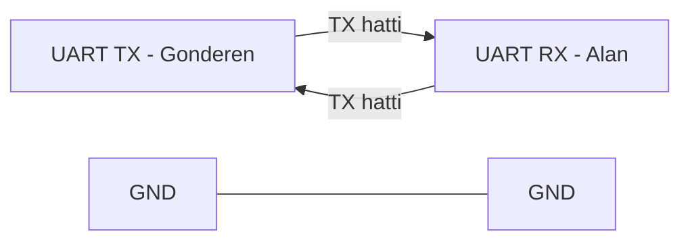
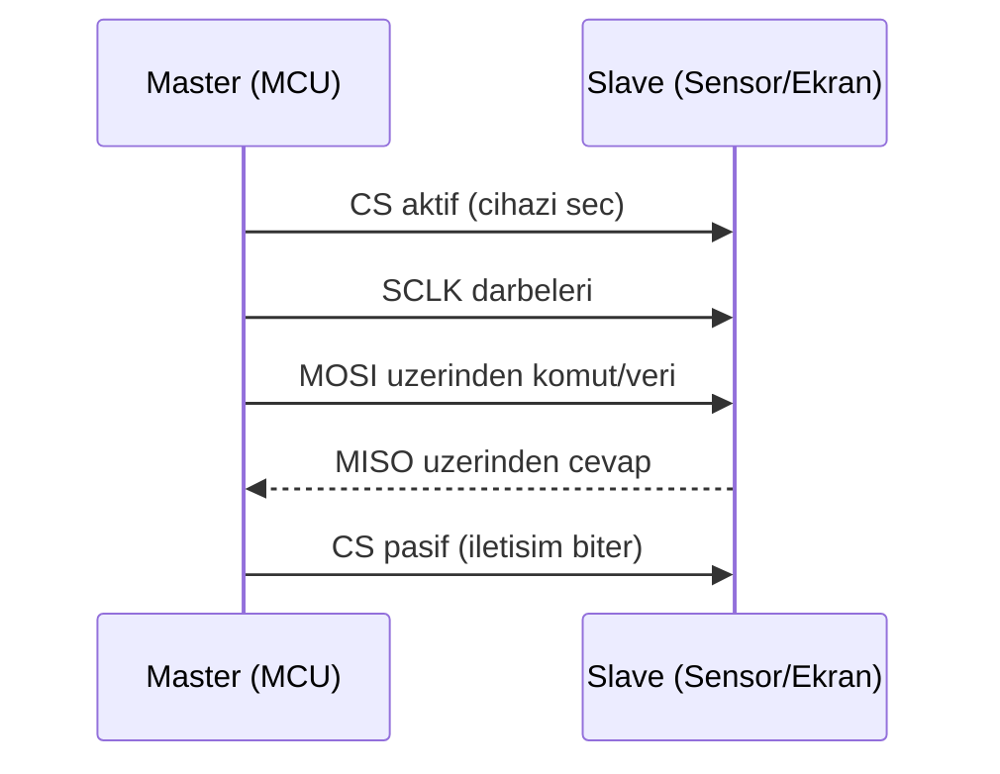
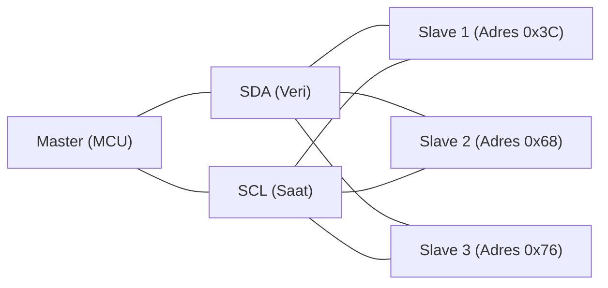

# Haberleşme ve Ağ Teknolojileri: Cihazlar Nasıl Konuşur?

Gömülü sistemlerde doğru karar vermek kadar, doğru veriyi doğru yere ulaştırmak da kritiktir. Bir sensörden alınan ölçüm, başka bir modüle, bir kontrolcüye veya buluta güvenilir biçimde taşınamıyorsa sistemin geri kalanı ne kadar iyi tasarlanmış olursa olsun beklenen sonuç elde edilemez. Bu yüzden haberleşme konusu yalnızca “kablo bağlantısı” değil, aynı zamanda hız, gecikme, güvenilirlik, enerji tüketimi ve güvenlik kararlarının birleştiği bir mühendislik problemidir.

Bu makalede önce seri haberleşme protokolleri olan `UART`, `SPI` ve `I2C` ele alınır; ardından `WiFi`, `Bluetooth`, `MQTT` ve `HTTP` gibi kablosuz ve IoT odaklı yapıların nasıl konumlandırılacağı açıklanır. Son bölümde ise gerçek projelerde sık karşılaşılan bağlantı ve güvenlik problemlerine karşı uygulanabilir tasarım yaklaşımı verilir.

## 1. Seri haberleşmenin temeli

Seri haberleşme, verinin bitler halinde zamana yayılarak aktarılmasıdır. Paralel hatlar yerine daha az pin kullanıldığı için gömülü sistemlerde yaygın tercih edilir. Ancak her protokolün tasarım felsefesi farklıdır; bu fark doğrudan sistem mimarisine yansır.

### 1.1 UART (Universal Asynchronous Receiver-Transmitter)

`UART`, saat hattı olmadan çalışan asenkron bir protokoldür. İki temel hat kullanır:

- `TX` (Transmit): veri gönderme
- `RX` (Receive): veri alma

Asenkron çalışma nedeniyle iki tarafın aynı baud rate ile yapılandırılması gerekir (`9600`, `115200` gibi). Baud rate, seri iletişimde saniyede taşınan sembol/bit hızını ifade eder. Aksi durumda veri çerçevesi yanlış yorumlanır ve bozuk karakterler görülür.

UART güçlü bir “debug” aracıdır. Bir mikrodenetleyicinin iç durumunu Serial Monitor üzerinden gözlemek, hataların kök nedenini bulmayı ciddi biçimde hızlandırır. Bu nedenle pratikte UART yalnızca cihazlar arası veri aktarımı için değil, yazılım doğrulama için de kullanılır. Buradaki Serial Monitor, Arduino IDE içinde seri porttan gelen verileri anlık gösteren penceredir. Borada kodun beklenen şekilde çalıştığı test edilebilir; örneğin `Serial.print(...)` ile ara değerleri yazdırıp bir koşulun doğru anda tetiklenip tetiklenmediği kontrol edilebilir.

UART paket örneği:

```text
[0xAA][LEN][CMD][DATA...][CRC8]
```

- `0xAA`: Paketin başlangıç imzası (alıcı senkronizasyonu için).
- `LEN`: Veri alanının uzunluğu (kaç byte okunacağını belirtir).
- `CMD`: Komut kodu (paketin ne amaçla gönderildiğini tanımlar).
- `DATA`: Komuta ait asıl veri yükü.
- `CRC8`: Hata kontrol byte'ı (veri bozuldu mu kontrolü).




*Şekil 1: UART bağlantısında TX/RX hatlarının çapraz, GND hattının ortak bağlanması gerekir.*

### 1.2 SPI (Serial Peripheral Interface)

`SPI`, senkron çalışan ve genellikle yüksek hız hedefleyen bir protokoldür. Tipik hatlar:

- `SCLK`: Saat hattıdır; veri aktarımının ritmini belirler. Verinin hangi anda okunup yazılacağını bu sinyal belirler.
- `MOSI`: `Master Out, Slave In` hattıdır. Veri master cihazdan çıkar, slave cihaza gider.
- `MISO`: `Master In, Slave Out` hattıdır. Veri slave cihazdan çıkar, master cihaza gider.
- `CS/SS`: `Chip Select/Slave Select` hattıdır. Master, hangi slave ile konuşacaksa sadece onun `CS` hattını aktif eder.

Pratik akış şu şekildedir: Master önce ilgili slave'in `CS` hattını aktif eder, ardından `SCLK` ile saat darbeleri üretir. Komut/veri `MOSI` üzerinden slave'e gider; slave'in cevabı varsa `MISO` üzerinden master'a döner.

Buradaki rol ayrımı şu mantıktadır: Master, iletişimi başlatan ve saati üreten taraftır; Slave ise seçildiğinde komut alan ve yanıt veren taraftır. Örneğin bir Arduino ile harici sensör veya ekran bağlantısında Arduino çoğunlukla master, sensör/ekran modülü ise slave olur. Sistem tasarımında "kim master?" sorusunun cevabı genellikle "iletişimi kim yönetiyor?" sorusuyla aynıdır.

SPI işlem çerçevesi örneği:

```text
[CS aktif] -> [CMD/ADDR MOSI] -> [DATA MOSI veya MISO] -> [CS pasif]
```

- `CS aktif`: Hedef slave seçilir, işlem başlar.
- `CMD/ADDR`: Yazma/okuma komutu veya register adresi.
- `MOSI`: Master'dan slave'e giden veri hattı.
- `MISO`: Slave'den master'a dönen veri hattı.
- `CS pasif`: İşlem biter, bus serbest kalır.




*Şekil 2: SPI iletişim akışı; master cihaz iletişimi başlatır, saat üretir ve slave cihazı CS hattıyla seçer.*

SPI’ın güçlü yanı hız ve deterministik davranıştır. Özellikle ekran sürme, hızlı ADC/DAC iletişimi ve kısa mesafeli yüksek veri aktarımı gereken durumlarda öne çıkar. Buna karşılık her slave için ayrı `CS` hattı gerekmesi pin maliyetini artırabilir.

### 1.3 I2C (Inter-Integrated Circuit)

`I2C`, iki hatla çoklu cihaz iletişimini hedefler:

- `SDA` (Serial Data): Veri hattıdır. Master ve slave cihazlar adres, komut ve veri baytlarını bu hat üzerinden taşır.
- `SCL` (Serial Clock): Saat hattıdır. Veri bitlerinin hangi anda örnekleneceğini belirler; senkronizasyon bu hatla sağlanır.

Adresleme mekanizması sayesinde aynı hatta birden fazla sensör ve çevre birimi bağlanabilir. Buradaki adresleme, her slave cihaza bir kimlik (7-bit veya bazı sistemlerde 10-bit adres) verilmesi anlamına gelir; master iletişime başlamadan önce bu adresi gönderir, yalnızca hedef cihaz yanıt verir. Bu yaklaşım pin tasarrufu sağlar çünkü UART veya SPI'daki gibi her cihaz için ek hat ayırmak gerekmez.

Ancak fiziksel katman doğru kurulmazsa iletişim kararsız hale gelebilir. `Pull-up` dirençler, SDA ve SCL hatlarını besleme gerilimine bağlayarak hatları boştayken otomatik olarak lojik 1 seviyesinde tutar. I2C açık-drenç (open-drain) yapıda çalıştığı için cihazlar hattı aktif olarak yukarı süremez, sadece aşağıya (lojik 0) çekebilir; bu nedenle hattın tekrar 1'e dönebilmesi için pull-up direnç zorunludur. Direnç değeri çok yüksek seçilirse hat yavaş yükselir ve özellikle yüksek frekansta bit hataları görülebilir; çok düşük seçilirse gereksiz akım tüketimi artar. `Bus kapasitansı` (hat, kablo ve girişlerin toplam elektriksel kapasitesi) yükseldikçe sinyal kenarları yavaşlar, bu da saat frekansı arttığında veri bütünlüğünü bozabilir. Bu nedenle kablo uzunluğu, cihaz sayısı ve pull-up değeri birlikte değerlendirilmelidir.

I2C özellikle sensör kümelerinde ve düşük-orta hız gereksiniminde verimli bir çözümdür. OLED ekranlar, IMU (Inertial Measurement Unit: ivmeölçer ve jiroskop gibi hareket sensörlerini birlikte içeren birim) modülleri ve birçok çevre birimi I2C desteğiyle gelir; aynı iki hat üzerinden birden fazla modül okunabildiği için prototipleme ve kart yerleşimi önemli ölçüde sadeleşir.

I2C frame örneği:

```text
[START][7-bit ADDRESS + R/W][ACK][REG][ACK][DATA...][ACK/NACK][STOP]
```

- `START`: Master hattı başlatır, yeni frame açılır.
- `ADDRESS + R/W`: Hedef cihaz adresi ve işlem yönü (`R`=read, `W`=write).
- `ACK`: Alıcı "veriyi aldım" onayı.
- `REG`: Cihaz içindeki hedef register/adres.
- `DATA`: Taşınan veri byte'ları.
- `NACK`: Veri alımının bittiğini veya reddi bildirir.
- `STOP`: Frame kapanır, iletişim sonlanır.




*Şekil 3: I2C bus yapısı; bir master aynı SDA/SCL hattı üzerinde birden fazla adresli slave cihazla haberleşir.*

## 2. Protokol seçimi: hız, mesafe, karmaşıklık dengesi

Bir protokol “en iyi” olduğu için değil, bağlamla uyumlu olduğu için seçilmelidir. Bu seçimde üç soru belirleyicidir:

1. Ne kadar veri taşınacak?
2. Veri ne kadar hızlı güncellenmeli?
3. Donanımda kaç pin ve ne kadar kablo disiplini ayrılabilir?

Genel bir çerçeve:

- Düşük karmaşıklık ve debug kolaylığı: `UART`
- Yüksek hız ve kısa mesafe: `SPI`
- Çoklu sensör ve pin verimliliği: `I2C`

Gerçek sistemlerde bu protokoller birlikte kullanılır. Günlük hayata yakın bir örnek olarak, iki tekerlekli kendi dengesini koruyan bir teslimat robotu düşünülebilir: Robotun eğim ve açısal hız bilgisi IMU (Inertial Measurement Unit) üzerinden düzenli olarak `I2C` ile okunur; çünkü aynı iki hat üzerinde birden fazla sensör taşımak pin açısından verimlidir. Motor sürücü kartına gönderilen hız/akım ayarları `SPI` ile yapılır; çünkü bu hat daha yüksek hızda ve daha deterministik (zamanlaması daha öngörülebilir) iletişim sağlar. Geliştirme ve saha testinde ise robotun hata kodları, anlık sensör değerleri ve durum mesajları `UART` üzerinden seri monitöre veya servis bilgisayarına aktarılır; böylece sahada "neden durdu, neden dengesini kaybetti?" gibi sorular daha hızlı teşhis edilebilir.

## 3. Haberleşme hataları ve hata kontrolü

Haberleşme hatalarının önemli kısmı protokol teorisinden değil, fiziksel koşullardan doğar:

- Ortak `GND` eksikliği: İki cihazın referans seviyesi aynı olmadığında sinyal seviyeleri doğru yorumlanamaz ve rastgele veri hataları oluşur.
- Hatalı voltaj seviyesi (5V-3.3V uyumsuzluğu): Seviye dönüştürme yapılmadan bağlantı kurmak hem iletişimi bozabilir hem de düşük voltajlı girişlere donanımsal zarar verebilir.
- Uzun ve düzensiz kablolama: Hat uzunluğu ve kötü kablo düzeni sinyal bozulmasını artırır, özellikle yüksek hızda zamanlama hatalarına yol açar.
- Elektromanyetik gürültü: Motorlar, röleler veya güç hatları çevresindeki parazit, veri hatlarına istenmeyen darbeler bindirerek paket bozulmasına neden olabilir.
- Yanlış baud rate veya yanlış saat ayarı: Gönderici ve alıcı aynı zamanlama parametresini kullanmadığında bit sınırları kayar ve veri çerçevesi hatalı çözülür.

Güvenilirliği artırmak için uygulanabilecek temel yöntemler:

- Mesaj çerçevesi oluşturma (`header`, `length`, `payload`, `checksum`): Her paketin yapısını tanımlamak, alıcının paketi doğrulamasını ve bozuk veriyi erken tespit etmesini sağlar.
- Zaman aşımı (timeout) yönetimi: Beklenen yanıt belirli sürede gelmezse sistemin sonsuza kadar beklemesini engelleyip kontrollü hata akışına geçmesini sağlar.
- Tekrar deneme (retry) mekanizması: Geçici iletişim hatalarında aynı isteği sınırlı sayıda yeniden göndererek bağlantının dayanıklılığını artırır.
- Geçersiz paket için güvenli durum (ör. hareketi durdurma): Hatalı veri alındığında sistemi riskli davranıştan çıkarıp güvenli moda almak, fiziksel kazaları ve zincirleme hataları önler.

## 4. Kablosuz haberleşme: WiFi, Bluetooth ve RF yaklaşımı

Kablolu haberleşme kart içi iletişimde güçlüdür; ancak cihaz dış dünya ile etkileşecekse kablosuz katman gerekir.

### 4.1 WiFi (ESP32/ESP8266)

`WiFi`, ağ tabanlı sistemlerle entegrasyon için uygundur. `ESP32` ve `ESP8266` ile:

- Yerel ağa bağlanılabilir
- Cihaz içinde basit bir web sunucusu çalıştırılabilir
- Sensör verisi HTTP endpoint üzerinden yayınlanabilir

WiFi tasarımında kritik konu bağlantı dayanıklılığıdır. Ağ kopmalarında sistemin kilitlenmemesi, yeniden bağlanma stratejisi ve zaman aşımı kontrolü mutlaka yazılımda ele alınmalıdır.

### 4.2 Bluetooth (HC-05 / HC-06)

`Bluetooth`, kısa mesafede düşük kurulum maliyetiyle hızlı prototipleme sağlar. Özellikle mobil uygulamadan komut gönderme, robotu manuel kontrol etme ve yapılandırma parametrelerini güncelleme senaryolarında etkili bir çözümdür.

Bluetooth tasarımında dikkat edilmesi gereken nokta, komut protokolünün net tanımlanmasıdır. Örneğin tek karakter komutlar (`F`, `B`, `L`, `R`) basit görünse de doğrulama yapılmazsa hatalı giriş robot davranışını bozabilir. Daha güvenli yaklaşım, komutu çerçeveleyip doğrulama alanı eklemektir.

Bluetooth (seri komut) çerçevesi örneği:

```text
<STX><CMD><SEP><VALUE><ETX><CRC>
```

- `STX` (Start of Text): Mesaj başlangıcı.
- `CMD`: Komut adı/kodu (`START`, `STOP`, `SPEED` gibi).
- `SEP`: Alan ayırıcı karakter (`:`, `,` vb.).
- `VALUE`: Komuta ait parametre değeri.
- `ETX` (End of Text): Mesaj bitişi.
- `CRC`: Mesaj bütünlüğü kontrol alanı.

### 4.3 RF modüller (433MHz, 2.4GHz)

RF modüller uzun mesafe veya düşük enerji senaryolarında değerlidir; ancak parazit, kanal yönetimi ve çevresel etkenler daha görünür hale gelir. Bu yüzden RF tabanlı sistemlerde test yalnız laboratuvar ortamında değil, gerçek saha koşullarında da yapılmalıdır.

Buradaki RF yaklaşımı, WiFi/Bluetooth gibi daha üst seviye ağ katmanlarından farklı olarak çoğu zaman daha "ham" bir kablosuz taşıma sunar; yani mesaj çerçevesi, doğrulama ve tekrar deneme kuralları uygulamaya göre ayrıca tanımlanır. Günlük hayatta garaj kapısı kumandası, kablosuz kapı zili ve basit uzaktan tetikleme sistemleri bu yaklaşımın tipik örnekleridir.

RF paket örneği:

```text
[PREAMBLE][SYNC][NODE_ID][TYPE][PAYLOAD][CRC]
```

- `PREAMBLE`: Alıcının taşıyıcıya kilitlenmesi için ön bit dizisi.
- `SYNC`: Paket başlangıcını kesinleştiren eşleşme alanı.
- `NODE_ID`: Paketin hangi düğüme ait olduğunu belirtir.
- `TYPE`: Mesaj türü (telemetri, komut, alarm vb.).
- `PAYLOAD`: Asıl taşınan veri.
- `CRC`: Hata tespiti için doğrulama kodu.

## 5. IoT katmanı: MQTT ve HTTP ne zaman seçilir?

### 5.1 HTTP

`HTTP`, öğrenmesi kolay ve servislerle entegrasyonu güçlü bir modeldir. REST endpoint yapısı sayesinde web panelleri ve backend servisleri ile hızlı entegrasyon sağlar. Ancak sürekli küçük veri paketleri için header maliyeti nedeniyle verimsiz olabilir.

HTTP mesaj örneği:

```text
GET /sensor HTTP/1.1
Host: robot.local
```

- `GET`: İstek yöntemi (sunucudan veri okuma).
- `/sensor`: İstenen kaynak yolu (endpoint).
- `HTTP/1.1`: Protokol sürümü.
- `Host`: Hedef sunucu adı/adresi.

### 5.2 MQTT

`MQTT`, publish/subscribe modeline dayanan hafif bir protokoldür. Özellikle düşük bant genişliği, sık telemetri ve çoklu istemci senaryolarında avantaj sağlar.

MQTT publish mesajı örneği:

```text
TOPIC: robot/telemetry/temp
PAYLOAD: {"temp":24.7}
QoS: 1
```

- `TOPIC`: Mesajın yayınlandığı mantıksal kanal.
- `PAYLOAD`: Taşınan asıl veri içeriği (genelde JSON/metin).
- `QoS`: Teslim güvenilirlik seviyesi (`0` en hafif, `2` en güvenli).

Temel kavramlar:

- `Broker`: mesaj yönlendirme merkezi
- `Topic`: mesajın mantıksal adresi (`robot/telemetry/temp` gibi)
- `Publisher`: mesajı üreten istemci
- `Subscriber`: ilgili topic’i dinleyen istemci

Örneğin sıcaklık verisi paylaşımı:

```text
Publisher (ESP32) -> topic: factory/line1/temp -> Broker -> Dashboard Subscriber
```

Bu modelde cihazlar birbirini doğrudan bilmek zorunda değildir; sistem daha ölçeklenebilir hale gelir.

## 6. Uygulama senaryoları

### 6.1 Senaryo 1: Arduino-Arduino UART haberleşmesi

Amaç, bir karttan ölçüm verisini diğer karta iletmektir. Gönderen kart sabit periyotta veri yollar, alan kart veri çerçevesini kontrol eder.

Gönderen taraf örnek yaklaşım:

```cpp
void loop() {
  int value = analogRead(A0);
  Serial.print("S:");
  Serial.println(value);
  delay(100);
}
```

Alan tarafta `S:` ön eki kontrol edilerek bozuk satırlar ayıklanabilir. Bu küçük doğrulama bile sahadaki kararlılığı artırır.

### 6.2 Senaryo 2: ESP32 ile WiFi web sunucusu

Amaç, sensör verisini tarayıcı üzerinden izlemektir. ESP32 belirli bir endpoint üretir:

- `GET /sensor` -> JSON cevap

Örnek çıktı:

```json
{"temp":24.7,"hum":41.2}
```

Bu yapı, mobil veya masaüstü istemcilerin ek sürücü gerektirmeden sisteme bağlanmasını sağlar.

### 6.3 Senaryo 3: HC-05 ile mobil komut kontrolü

Telefon uygulaması üzerinden `START`, `STOP`, `SPEED:120` gibi komutlar gönderilir. Mikrodenetleyici komutu parse eder ve yalnızca izinli komutları uygular. Bu tasarım, rastgele metin girişine karşı sistemi korur.

## 7. Güvenlik ve şifreleme: ihmal edilmemesi gereken katman

Bağlantı kurmak tek başına yeterli değildir; güvenli bağlantı kurmak gerekir. Özellikle IoT sistemlerinde üç temel risk öne çıkar:

- Yetkisiz erişim
- Veri dinleme (sniffing)
- Komut manipülasyonu

Uygulanabilir güvenlik adımları:

1. Varsayılan şifreleri kaldırma
2. Cihaz kimliği ve erişim kontrolü
3. Mümkünse TLS tabanlı şifreli kanal kullanımı
4. Kritik komutlar için ek doğrulama
5. Log kaydı ve hata izleme

Küçük projelerde dahi “güvenlik sonradan eklenir” yaklaşımı maliyetli olur. Doğru yöntem, protokol tasarımı sırasında güvenlik gereksinimlerini baştan tanımlamaktır.

## 8. Sonuç

Haberleşme mimarisi, gömülü sistemin yalnızca bir alt parçası değil, sistem davranışını belirleyen ana omurgadır. `UART`, `SPI` ve `I2C` kart içi iletişim için farklı avantajlar sunarken; `WiFi`, `Bluetooth`, `MQTT` ve `HTTP` cihazın dış dünya ile etkileşimini mümkün kılar. Başarılı bir tasarım; hız, güvenilirlik, enerji ve güvenlik dengesini birlikte kuran tasarımdır.

Pratikte en iyi sonuç, tek bir protokolde ısrar etmekten değil, katmanları amaca göre birleştirmekten gelir: kart içinde doğru seri protokol, ağ tarafında doğru taşıma modeli ve her katmanda hata-güvenlik yönetimi.