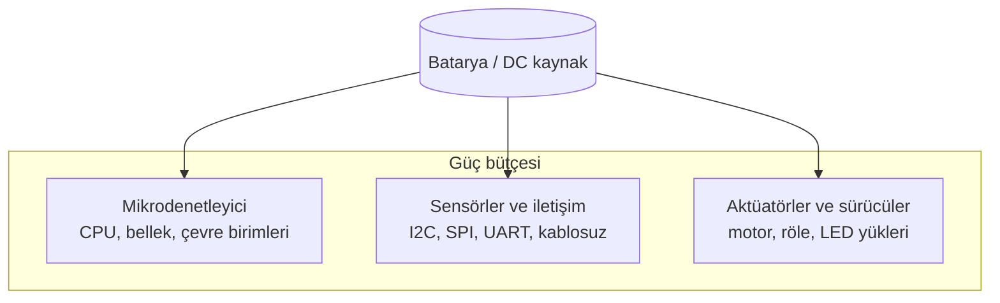
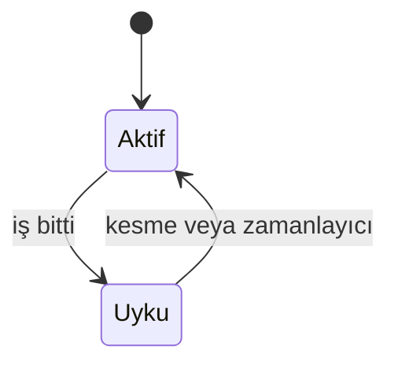

# Güç Yönetimi ve Enerji Tasarrufu: Gömülü Sistemlerde Ölçüm, Batarya ve Düşük Güç Tasarımı

**Batarya veya sınırlı bir DC besleme ile çalışan gömülü sistemlerde enerji, yalnızca “kaç volt?” sorusu değildir; akımın zaman içinde nasıl değiştiği, hangi alt devrelerin ne zaman uyanacağı ve gereksiz tüketimin nasıl kesileceği tasarımın merkezine taşınmalıdır. Bu metin, güç bütçesinin bileşenlerini, ölçüm yöntemlerini, batarya ömrü hesabını, uyku modları ve uyanma stratejilerini birlikte ele alarak sahada uygulanabilir bir çerçeve sunar.**

---

## İçerik başlıkları

- Güç tüketiminin bileşenleri: mikrodenetleyici, sensör, aktüatör
- Güç ölçümü: akım, gerilim ve ortalama güç
- Batarya kapasitesi (Ah, Wh) ve çalışma süresi tahmini
- Güç kaynağı seçimi: LDO, anahtarlamalı regülatör, doğrudan besleme
- Enerji tasarrufu: sleep modları, saat ölçekleme, çevre birimlerini kapatma
- Olay tabanlı uyanma ve zamanlayıcı ile uyanma
- Arduino (AVR) ve ESP32 için kısa uygulama notları
- Düşük güçlü sensör seçimi, periyodik ölçüm ve batarya yönetimi

---

## 1. Güç tüketiminin bileşenleri

Bir kartın toplam akımı, kabaca üç grupta toplanabilir: **işlemci / mikrodenetleyici**, **sensör ve haberleşme modülleri**, **aktüatörler ve güç sürücüleri**. Bu grupların her biri farklı çalışma rejimlerinde farklı akım çeker; bu nedenle “ortalama” ve “tepe” akımı birlikte düşünülür.



*Şekil 1: Gömülü kart üzerinde güç tüketiminin tipik üç ana kaynağa ayrılması.*

- **Mikrodenetleyici**: Boşta döngüde çalışmak ile derin uyku (deep sleep) arasında büyük fark vardır. CPU saati, flash erişimi ve açık çevre birimleri (ADC, UART, Wi-Fi gibi) akımı belirler.
- **Sensörler**: Sürekli ölçüm yapan analog ön yükseltici veya sürekli örnekleme yapan dijital sensörler, uykuya geçirilemeyen sürekli tüketime yol açabilir.
- **Aktüatörler**: Motor, röle ve parlak LED gibi yükler kısa süreli bile olsa bataryayı “tepe akımı” ile zorlar; bu tepe, bağlantı ve regülatör seçimini etkiler.

---

## 2. Güç ölçümü: akım, gerilim ve ortalama güç

**Güç** (P), bir yük üzerindeki **gerilim** (V) ile o yükten geçen **akım** (I) çarpımıdır: P = V × I. Pratikte ölçüm genelde şu yollarla yapılır:

- **Multimetre ile seri akım**: Beslemenin tek bir hattına multimetrenin ampermetre konumu seri bağlanır; kartın toplam giriş akımı okunur. Düşük akımlarda çözünürlük sınırlı olabilir; daha hassas ölçüm için **shunt direnci + diferansiyel amplifikatör** veya hazır **güç analizörü** tercih edilebilir.
- **Gerilim düşümü yöntemi**: Bilinen küçük bir şant direnci üzerindeki gerilim düşümü ölçülür; Ohm yasası ile akım türetilir. Bu yöntem, firmware geliştirirken “her modda ne kadar çekiyor?” sorusuna sayısal yanıt vermeyi kolaylaştırır.

Karşılaştırma için tipik durumlar şunlardır:

- **Aktif çalışma**: CPU yoğun, kablosuz açık, sensör sürekli örnekleniyor.
- **Uyku modu**: CPU durdurulmuş veya çok düşük saatte; gereksiz çevre birimleri kapalı.
- **Sensör okuma anı**: I2C burst, ADC dönüşümü veya sensör ısıtma (bazı gaz sensörleri gibi) kısa süreli akım sıçraması üretir.

Bu üç durum ayrı ayrı ölçülüp tabloda birleştirildiğinde, optimizasyon öncesi ve sonrası karşılaştırması netleşir.

---

## 3. Batarya kapasitesi ve çalışma süresi

Batarya etiketlerinde sık görülen birimler:

- **Ah (Amper-saat)**: Belirli bir akımda teorik olarak kaç saat sürebileceğinin bir ölçüsüdür; gerçek ömür, sıcaklık, yaşlandırma ve verim kayıpları nedeniyle daha kısadır.
- **Wh (Watt-saat)**: Nominal gerilim ile Ah çarpılarak yaklaşık enerji (Wh) ifade edilir; farklı hücre gerilimlerini karşılaştırmayı kolaylaştırır.

Kabaca süre tahmini için ortalama giriş akımı biliniyorsa, kullanılabilir kapasite (Ah) bu akıma bölünerek saat cinsinden ömür yaklaşımı çıkarılır. Burada **kullanılabilir Ah**, üreticinin verdiği nominal değerden düşük alınmalıdır; derin deşarj sınırı, regülatör kayıpları ve pil kimyasına göre güvenlik payı eklenmelidir. **Duty cycle** (örneğin her 10 saniyede bir 200 ms uyanma) varsa, ortalama akım uyku ve aktif akımların zaman ağırlıklı ortalaması olarak hesaplanır.

---

## 4. Güç kaynağı seçimi

- **LDO (düşük düşüşlü doğrusal regülatör)**: Basit, düşük gürültü; ancak giriş-çıkış farkı büyükse fazla ısıda (V_in − V_out) × I gücü “yakılır”. Hafif yükler ve düşük fark için uygundur.
- **Anahtarlamalı regülatör (buck/boost)**: Verim genelde daha yüksektir; ancak tasarım karmaşıklığı, filtreleme ve EMI (elektromanyetik parazit) yönetimi artar.
- **Doğrudan besleme**: Bazı sensör veya RF modülleri belirli bir gerilim bandında çalışır; mikrodenetleyici ile aynı rail paylaşıldığında uyku sırasındaki gerilim düşümü tüm sistemi etkileyebilir. **Güç ağacı** (hangi blok hangi railden besleniyor) net çizilmelidir.

---

## 5. Enerji tasarrufu teknikleri

### 5.1. Sleep modları

**Light sleep** ve **deep sleep** gibi ifadeler çipe göre değişir; ortak fikir, gereksiz saatleri ve çevre birimlerini durdurarak leakage ve dinamik gücü düşürmektir. **Deep sleep** genelde en düşük tüketimdir; ancak uyanış süresi ve bazı pinlerin durumu tasarım kısıtıdır.

### 5.2. Dinamik frekans ölçekleme (clock scaling)

Aynı işi daha düşük CPU saatiyle yapabiliyorsa sistem, dinamik güçten kazanç sağlar. Ağır iş yükü kısa sürüyorsa “yüksek hızda kısa süre + uzun uyku” kombinasyonu, sürekli orta hızdan daha verimli olabilir; bu trade-off uygulamaya özel ölçülür.

### 5.3. Gereksiz bileşenleri kapatma

Kullanılmayan **ADC**, **UART**, **SPI**, **I2C** veya dahili **Wi-Fi / Bluetooth** blokları firmware tarafından kapatılabiliyorsa akım düşer. Ayrıca **pull-up**’ların sürekli akım çektiği durumlar (örneğin gereksiz yüksek değerli direnç seçimi) küçük ama birikerek önemli olabilir.

### 5.4. Olay tabanlı uyanma (wake-on-event)

Sürekli yoklama yerine **dış kesme**, **RTC** (Real-Time Clock, gerçek zamanlı saat) **alarmı** veya **kapasitif / manyetik tetik** gibi olaylarla uyanmak, ortalama gücü düşürür. Ölçüm sıklığı düşük olan sahada sensör “her zaman açık” bırakılmamalıdır.



*Şekil 2: Olay veya zamanlayıcı ile döngüsel uyanan düşük güç yaşam döngüsü.*

---

## 6. Arduino (AVR) ve ESP32 için uygulama notları

### 6.1. AVR tabanlı Arduino: `avr/sleep.h`

AVR çekirdeklerinde uyku modu seçimi ve `sleep_mode()` çağrısı tipik yaklaşımdır. Uyanma için **watchdog zamanlayıcısı** veya **dış kesme (INT)** kullanılır. Kesme kaynakları pin ve karta göre yapılandırılır; uyku öncesi tüketen çevre birimleri kapatılmalıdır.

```cpp
#include <avr/sleep.h>
#include <avr/power.h>

void enterPowerDownSleep() {
  set_sleep_mode(SLEEP_MODE_PWR_DOWN);
  sleep_enable();
  sleep_mode(); // Burada işlemci durur
  sleep_disable();
}
```

### 6.2. ESP32: `deep sleep`

ESP32 ailesinde **deep sleep**, Wi-Fi ve çoğu çevre birimini kapatarak çok düşük tüketime iner. **Timer** ile veya **ext0/ext1** yapılandırmasıyla belirli pinlerden uyanma seçilebilir.

```cpp
#include "esp_sleep.h"

void setup() {
  const uint64_t sleep_us = 10ULL * 1000000ULL; // 10 saniye
  esp_sleep_enable_timer_wakeup(sleep_us);
  esp_deep_sleep_start(); // reset benzeri yeniden başlatma
}
```

**Not:** `esp_deep_sleep_start()` çağrısından sonraki satırlar çalışmaz; uyanışta program `setup()`’tan yeniden başlar. Kalıcı sayaç veya durum için **RTC hafızası** veya ESP ortamında **NVS** (non-volatile storage: flash üzerinde kalıcı anahtar-değer alanı) gibi mekanizmalar ayrıca planlanmalıdır.

---

## 7. Enerji verimli proje tasarımı

- **Sensör seçimi**: “Ölçüm başına mJ?” sorusu, sensör veri sayfasındaki aktif akım ve örnekleme süresiyle birlikte değerlendirilir. Sürekli ısıtma gerektiren sensörlerde ölçüm penceresi kısaltılıp hemen sonra güç kesilebilir.
- **Periyodik ölçüm**: Sabit periyot yerine, değişim yavaşsa **daha seyrek örnekleme** veya **eşik aşımında hızlanma** stratejisi uygulanabilir.
- **Batarya yönetimi**: Tek hücre Li-ion/LiFePO4 gibi kimyalarda **şarj**, **deşarj** ve **koruma** devreleri hem güvenlik hem ömür için kritiktir. **BMS** (Battery Management System, batarya yönetim sistemi) hücre gerilimlerini izler, dengeleme ve aşırı akım/gerilim koruması sağlayabilir. Hücre gerilimi düştükçe buck dönüştürücülerin verimi ve davranışı değişebilir; bu etki güç bütçesine dahil edilmelidir.
- **Test**: Donanım revizyonlarında uyku öncesi/sonrası akım, sıcaklık ve RF performansı birlikte doğrulanmalıdır; yalnızca “daha az mA” değil, **görevin zamanında tamamlanması** da kabul ölçütüdür.

---

## 8. Sonuç

Güç yönetimi, gömülü tasarımda ölçülebilir bir mühendislik disiplinidir: bileşen bazlı akım tablosu, uyku ve uyanma politikası ile batarya modeli bir araya getirildiğinde sistem davranışı öngörülebilir hale gelir. Sleep, saat ölçekleme ve olay tabanlı uyanma birlikte kullanıldığında, birçok sahada batarya ömrü katlarca artırılabilir; kazanç her zaman ölçümle doğrulanmalıdır.
