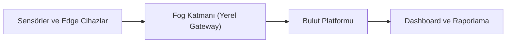

# İleri Uygulamalar ve Trendler: Gömülü Sistemlerde Yeni Dönem

Gömülü sistemler artık yalnızca tek bir sensörü okuyup tek bir çıktıyı kontrol eden yapılardan ibaret değildir. Güncel projelerde cihazlar birbirleriyle iletişim kurar, veriyi yerel ağda işler, buluta taşır ve bazı kararları cihaz üzerinde kendi başına verebilir. Bu dönüşüm, robotik ve gömülü sistem tasarımında hem teknik derinliği hem de sistem mimarisi kararlarının önemini artırır.

Bu makalede akıllı ev sistemlerinden endüstriyel IoT çözümlerine kadar güncel uygulama alanları ele alınır; ardından edge computing, fog computing, TinyML, 5G, blockchain destekli IoT ve sürdürülebilirlik odakları birlikte değerlendirilir. Son bölümde bu kavramların tek bir projede nasıl birleştirilebileceği somut bir uygulama akışıyla açıklanır.

## 1. Güncel uygulama alanları

### 1.1 Akıllı ev sistemleri (Smart Home)

Smart Home yaklaşımında sıcaklık, nem, enerji tüketimi, aydınlatma ve güvenlik gibi veriler sürekli izlenir. Amaç yalnızca uzaktan kontrol değildir; enerji verimliliği ve kullanıcı konforunu aynı anda koruyan otomatik karar mekanizmaları kurmaktır.

Tipik bir akış:

- Sensörler ortam verisini toplar
- Kontrol birimi eşik veya kural tabanlı karar üretir
- Aktüatörler (fan, röle, vana) fiziksel müdahaleyi yapar
- Arayüz katmanı durum bilgisini web veya mobil istemciye taşır

### 1.2 Endüstriyel IoT (IIoT)

IIoT, üretim hatları ve endüstriyel sahalarda çalışan makinelerin sensör verilerini anlık izleme ve analiz etme yaklaşımıdır. Burada temel hedef, arıza olduktan sonra müdahale etmek değil; arıza eğilimini erken tespit etmektir.

Örnek kullanım:

- Motor titreşim verisi izlenir
- Eşik dışına çıkan ölçümler alarm üretir
- Bakım planı arıza gerçekleşmeden güncellenir

Bu model, plansız duruş sürelerini düşürerek üretim sürekliliğini artırır.

### 1.3 Tarım teknolojileri (AgriTech)

AgriTech uygulamalarında toprak nemi, hava sıcaklığı, sulama hattı durumu ve güneşlenme gibi veriler toplanır. Sulama ve besleme kararları veri temelli verildiğinde kaynak tüketimi azalır.

Sahada öne çıkan gereksinimler:

- Düşük enerji tüketimi (uzun pil ömrü)
- Zor çevre koşullarına dayanıklılık
- Kesintili bağlantıda yerel karar verebilme

### 1.4 Sağlık teknolojileri (Wearables)

Wearable cihazlar, nabız, oksijen satürasyonu ve hareket verisi gibi biyometrik ölçümleri sürekli toplayan taşınabilir sistemlerdir. Burada enerji verimliliği, güvenli veri taşıma ve düşük gecikme kritik hale gelir.

Bu sınıfta başarılı bir tasarım için üç denge birlikte kurulur:

- Sensör doğruluğu
- Batarya ömrü
- Veri gizliliği

### 1.5 Otonom sistemler

Otonom sistemler, çevreden veri toplayıp insan müdahalesi olmadan karar alan yapılardır. Mobil robotlar, otonom taşıma araçları ve insansız platformlar bu sınıfa girer. Otonomluk arttıkça sensör füzyonu, güvenlik katmanları ve hata toleransı gereksinimi de artar.

## 2. Yeni trendler ve teknolojiler

### 2.1 Edge computing ve fog computing

Edge computing, verinin üretildiği noktaya yakın cihazlarda işlenmesidir. Böylece her ölçümün buluta gönderilmesi gerekmez; gecikme azalır ve ağ trafiği düşer.

Fog computing ise edge ile bulut arasında ara bir işlem katmanı kurar. Birden fazla edge cihazdan gelen veriler yerel ağ geçidinde birleştirilip ön analizden geçirilir, sonra buluta taşınır.

*Şekil 1: Edge-fog-bulut zincirinde verinin kaynağa yakın işlenerek gecikme ve bant genişliği yükünün azaltılması.*

### 2.2 TinyML

TinyML, makine öğrenmesi modellerinin mikrodenetleyici gibi sınırlı kaynaklı cihazlarda çalıştırılmasıdır. Bu yaklaşımda model boyutu küçük tutulur, bellek ve enerji kullanımı optimize edilir.

TinyML’nin pratik değeri:

- Basit sınıflandırma kararlarını cihaz üzerinde anlık üretir
- Sürekli bulut bağlantısı ihtiyacını azaltır
- Gecikme hassas uygulamalarda hızlı tepki sağlar

TinyML ile yapılabilecek örnekler:

1. **Titreşim tabanlı arıza erken tespiti:** Motor veya pompa titreşim verisinden "normal/anomali" sınıflandırması yaparak bakım alarmı üretme.
2. **Sesle olay algılama:** Cihaz üzerinde çalışan küçük bir modelle cam kırılması, alarm sesi veya makine sesi değişimi tespiti.
3. **Jest ve hareket tanıma:** IMU (ivmeölçer + jiroskop) verisiyle el hareketi veya cihaz sallama desenlerini sınıflandırma.
4. **Enerji tüketim profili analizi:** Akım/gerilim örüntülerine bakarak "bekleme/aktif/hata" durumlarını gerçek zamanlı ayırma.
5. **Akıllı tarımda anomali tespiti:** Toprak nemi, sıcaklık ve ortam verilerinden sulama hattı arızası veya beklenmeyen kuruma eğilimini erken fark etme.

### 2.3 5G ve gömülü sistemler

5G, yüksek veri hızı ve düşük gecikme özellikleriyle özellikle çok cihazlı sistemlerde yeni bir kapasite sunar. Endüstriyel sahalarda mobil robotlar, kameralar ve sensör kümeleri aynı anda bağlı kalabilir.

Ancak 5G kullanımı, uygulamayı otomatik olarak "daha iyi" yapmaz. Mimari tasarımda şu sorular netleşmelidir:

- Hangi veriler anlık taşınmalı?
- Hangi kararlar edge katmanda kalmalı?
- Bağlantı kesildiğinde sistemin güvenli modu ne olmalı?

Örnek senaryo: Akıllı depo içinde çalışan otonom taşıma robotlarında çarpışma önleme kararı robot üzerinde (edge) verilir; kamera akışı ve filo performans raporları 5G üzerinden merkez sisteme taşınır. Böylece bağlantı anlık zayıflasa bile robot güvenli duruma geçerek çalışmayı kontrollü sürdürür.

### 2.4 Blockchain ve IoT

Blockchain, dağıtık defter yapısıyla veri bütünlüğü ve izlenebilirlik sağlar. IoT tarafında özellikle tedarik zinciri takibi, cihaz kimliği ve işlem kayıtlarının değiştirilmeden saklanması için değerlendirilir.

Bu yaklaşımın güçlü yanı denetlenebilirliktir; zayıf yanı ise enerji ve işlem maliyetidir. Bu nedenle her IoT projesinde zorunlu bir bileşen değildir. Doğru yaklaşım, gereksinim odaklı seçim yapmaktır.

Örnek senaryo: Soğuk zincir taşımacılığında sıcaklık sensörü kayıtları her teslimat adımında zincire yazılır. Bu sayede ürünün hangi koşullarda taşındığı sonradan değiştirilemeden doğrulanabilir.

### 2.5 Sürdürülebilirlik ve yeşil teknoloji

Yeni nesil gömülü sistem tasarımında yalnızca işlev değil, kaynak verimliliği de hedeflenir. Yeşil teknoloji yaklaşımı; daha düşük güç tüketen bileşenler, akıllı uyku modları ve uzun ömürlü donanım seçimi ile uygulanır.

Pratik ilkeler:

- Gereksiz örnekleme sıklığından kaçınma
- Uyku/uyanma stratejileri ile enerji tasarrufu
- Bakımı kolay, modüler donanım mimarisi

Örnek senaryo: Tarla izleme istasyonunda sensörler her saniye yerine her 5 dakikada bir ölçüm alır, arada deep sleep moduna geçer. Bu yaklaşım pil ömrünü ciddi biçimde uzatırken bakım sıklığını düşürür.

## 3. Uygulama akışı: Akıllı evden veri görselleştirmeye

Bu bölümde, güncel trendleri bir araya getiren örnek bir uçtan uca akış ele alınır.

### 3.1 Senaryo

Sistem, sıcaklık ve nem verisini toplar; belirlenen eşik değerine göre fanı otomatik kontrol eder. Ölçümler hem yerel web arayüzünde hem de bulut tabanlı dashboard üzerinde izlenir. Kullanıcı mobil uygulama üzerinden manuel komut da gönderebilir.

### 3.2 Teknik bileşenler

- **Edge cihaz:** ESP32 tabanlı kontrol kartı
- **Sensör:** DHT sınıfı sıcaklık-nem sensörü
- **Aktüatör:** Röle üzerinden fan kontrolü
- **İletişim:** İnternet üzerinden veriler gönderilir.
- **Arayüz:** Web dashboard + mobil istemci

Bu senaryoda `ESP32` tercihinin nedeni, dahili WiFi ile ek haberleşme kartı gerektirmeden internete çıkabilmesidir. `Arduino Uno` ile benzer bir kurulum yapılabilir; ancak internete veri göndermek için ek WiFi/Ethernet modülü gerekir. Ayrıca `ESP32`, işlem gücü ve bellek kapasitesi açısından sensör okuma ile ağ iletişimini aynı anda yürütmede daha esnek bir yapı sunar.

### 3.3 Kontrol mantığı (problem -> çözüm)

- **Problem:** Sensör verisi dalgalandığında fan sık açılıp kapanabilir.
- **Çözüm:** Tek eşik yerine histerezis kullanılır.

Örnek kural:

- Sıcaklık `30°C` üstüne çıkarsa fan açılır
- Sıcaklık `27°C` altına düşerse fan kapanır

Bu yaklaşım, anahtarlama kararsızlığını azaltır ve donanım ömrünü uzatır.

### 3.4 Veri görselleştirme ve alarm üretimi

Toplanan veriler zaman serisi olarak dashboard üzerinde tutulduğunda ani değişimler daha hızlı fark edilir. Alarm katmanında yalnızca eşik aşımı değil, "normal davranıştan sapma" da izlenebilir. Bu yaklaşım, TinyML ile anomali tespiti gibi ileri seviyeye genişletilebilir.

## 4. Sonuç

Gömülü sistemlerde ileri uygulamalar, tek bir teknolojiye odaklanmaktan çok doğru katmanları birlikte tasarlamayı gerektirir. Smart Home, IIoT, AgriTech ve wearable çözümler farklı alanlar gibi görünse de ortak ihtiyaçları benzerdir: güvenilir veri toplama, düşük gecikmeli karar, güvenli iletişim ve sürdürülebilir enerji yönetimi.

Edge/fog mimarisi, TinyML, 5G ve gerektiğinde blockchain kullanımı; projeye bağlam odaklı yaklaşıldığında güçlü bir değer üretir. Bu nedenle başarılı bir mimari, "en yeni teknolojiyi ekleme" değil, problemi en az karmaşıklıkla çözen teknoloji kombinasyonunu kurma yaklaşımıyla şekillenir.
